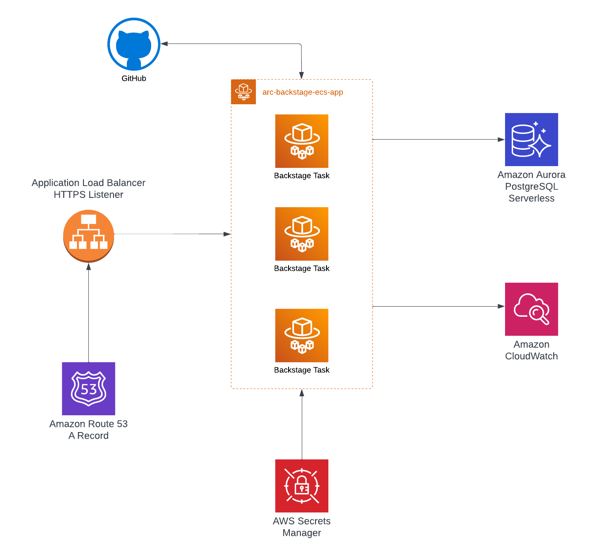

# [arc-backstage-ecs-app](https://github.com/sourcefuse/arc-backstage-ecs-app)

## Overview

Terraform Module to run Backstage as an ECS app.

Upstream dependencies:

* PostgreSQL Database and Service Account. See the [Backstage Docs](https://backstage.io/docs/getting-started/configuration/) for more info. See our [ARC DB module](https://github.com/sourcefuse/terraform-aws-ref-arch-db) for the simplest set up.
* ECS Cluster with an already configured HTTPS listener for an ALB. See our [ARC ECS module](https://github.com/sourcefuse/terraform-aws-refarch-ecs) for the simplest integration.
* Route53 Zone for an A record for Backstage
* Backstage image that can be pulled from ECR or DockerHub. Private DockerHub registries will require additional configuraiton.
* Secret in secrets manager with the following properties.
```json
{
  "ENABLE_GITHUB_SYNC": "<<To enable Github sync while bootstrap>>",
  "POSTGRES_USER": "<<Backstage PostgreSQL service account username>>",
  "POSTGRES_PASSWORD": "<<Backstage PostgreSQL account password>>",
  "GITHUB_TOKEN": "<<GitHub PAT for API access>>",
  "GITHUB_CLIENT_ID": "<<GitHub OAuth 2.0 client ID>>",
  "GITHUB_CLIENT_SECRET": "<<GitHub OAuth 2.0 client ID>>",
  "POSTGRES_HOST": "<<PostgreSQL Host>>",
  "POSTGRES_PORT": "<<PostgreSQL Port>>"
}

```

## Usage
**Note**: the example below is does not have a pinned version. Be sure to pin your version. Refer to the `example` folder for a working example version.
```hcl
module "backstage" {
 source                = "git::https://github.com/sourcefuse/arc-backstage-ecs-app"
  alb_dns_name          = module.ecs.alb_dns_name
  alb_zone_id           = module.ecs.alb_dns_zone_id
  app_host_name         = var.app_host_name
  cluster_id            = module.ecs.cluster_id
  cluster_name          = module.ecs.cluster_name
  environment           = var.environment
  route_53_records      = [var.app_host_name]
  lb_listener_arn       = module.ecs.alb_https_listener_arn
  lb_security_group_ids = [module.ecs.alb_security_group_id]
  route_53_zone_name    = var.route_53_zone_name
  subnet_ids            = data.aws_subnets.private.ids
  vpc_id                = data.aws_vpc.vpc.id
  container_image       = var.container_image
  tags                  = module.tags.tags
}
```

<!-- BEGINNING OF PRE-COMMIT-TERRAFORM DOCS HOOK -->
## Requirements

| Name | Version |
|------|---------|
| <a name="requirement_terraform"></a> [terraform](#requirement\_terraform) | ~> 1.3 |
| <a name="requirement_aws"></a> [aws](#requirement\_aws) | ~> 4.0 |

## Providers

| Name | Version |
|------|---------|
| <a name="provider_aws"></a> [aws](#provider\_aws) | 4.60.0 |

## Modules

| Name | Source | Version |
|------|--------|---------|
| <a name="module_backstage_container_definition"></a> [backstage\_container\_definition](#module\_backstage\_container\_definition) | ./ecs-container-definition | n/a |
| <a name="module_ecs_service_autoscaling"></a> [ecs\_service\_autoscaling](#module\_ecs\_service\_autoscaling) | git::https://github.com/cn-terraform/terraform-aws-ecs-service-autoscaling | 1.0.6 |

## Resources

| Name | Type |
|------|------|
| [aws_ecs_service.this](https://registry.terraform.io/providers/hashicorp/aws/latest/docs/resources/ecs_service) | resource |
| [aws_ecs_task_definition.this](https://registry.terraform.io/providers/hashicorp/aws/latest/docs/resources/ecs_task_definition) | resource |
| [aws_iam_policy.secrets_manager_read_policy](https://registry.terraform.io/providers/hashicorp/aws/latest/docs/resources/iam_policy) | resource |
| [aws_iam_role.execution](https://registry.terraform.io/providers/hashicorp/aws/latest/docs/resources/iam_role) | resource |
| [aws_iam_role_policy_attachment.execution](https://registry.terraform.io/providers/hashicorp/aws/latest/docs/resources/iam_role_policy_attachment) | resource |
| [aws_iam_role_policy_attachment.secrets_manager_read](https://registry.terraform.io/providers/hashicorp/aws/latest/docs/resources/iam_role_policy_attachment) | resource |
| [aws_lb_listener_rule.forward](https://registry.terraform.io/providers/hashicorp/aws/latest/docs/resources/lb_listener_rule) | resource |
| [aws_lb_target_group.this](https://registry.terraform.io/providers/hashicorp/aws/latest/docs/resources/lb_target_group) | resource |
| [aws_route53_record.this](https://registry.terraform.io/providers/hashicorp/aws/latest/docs/resources/route53_record) | resource |
| [aws_security_group.this](https://registry.terraform.io/providers/hashicorp/aws/latest/docs/resources/security_group) | resource |
| [aws_iam_policy_document.assume](https://registry.terraform.io/providers/hashicorp/aws/latest/docs/data-sources/iam_policy_document) | data source |
| [aws_route53_zone.this](https://registry.terraform.io/providers/hashicorp/aws/latest/docs/data-sources/route53_zone) | data source |
| [aws_secretsmanager_secret.backstage_private_key](https://registry.terraform.io/providers/hashicorp/aws/latest/docs/data-sources/secretsmanager_secret) | data source |
| [aws_secretsmanager_secret.backstage_secret](https://registry.terraform.io/providers/hashicorp/aws/latest/docs/data-sources/secretsmanager_secret) | data source |

## Inputs

| Name | Description | Type | Default | Required |
|------|-------------|------|---------|:--------:|
| <a name="input_alb_dns_name"></a> [alb\_dns\_name](#input\_alb\_dns\_name) | ALB DNS name to create A record for health check service | `string` | n/a | yes |
| <a name="input_alb_zone_id"></a> [alb\_zone\_id](#input\_alb\_zone\_id) | ALB Route53 zone ID to create A record for health check service | `string` | n/a | yes |
| <a name="input_app_host_name"></a> [app\_host\_name](#input\_app\_host\_name) | Host name to expose via Route53 | `string` | n/a | yes |
| <a name="input_app_port_number"></a> [app\_port\_number](#input\_app\_port\_number) | Port number for the container to run under | `number` | `7007` | no |
| <a name="input_backstage_environment"></a> [backstage\_environment](#input\_backstage\_environment) | Backstage environment | `string` | `"production"` | no |
| <a name="input_cluster_id"></a> [cluster\_id](#input\_cluster\_id) | ID of the ECS cluster. | `string` | n/a | yes |
| <a name="input_cluster_name"></a> [cluster\_name](#input\_cluster\_name) | Name of the ECS cluster. | `string` | n/a | yes |
| <a name="input_container_image"></a> [container\_image](#input\_container\_image) | url for image being used to setup backstage | `string` | `"spotify/backstage-cookiecutter"` | no |
| <a name="input_desired_count"></a> [desired\_count](#input\_desired\_count) | Number of ECS tasks to run for the service. | `number` | `3` | no |
| <a name="input_egress_cidr_block"></a> [egress\_cidr\_block](#input\_egress\_cidr\_block) | ECS Tasks egress CIDR block | `string` | `"0.0.0.0/0"` | no |
| <a name="input_environment"></a> [environment](#input\_environment) | ID element. Usually used for region e.g. 'uw2', 'us-west-2', OR role 'prod', 'staging', 'dev', 'UAT' | `string` | n/a | yes |
| <a name="input_environment_variables"></a> [environment\_variables](#input\_environment\_variables) | (optional) List of additional environment variables | <pre>list(object({<br>    name  = string<br>    value = string<br>  }))</pre> | `[]` | no |
| <a name="input_ephemeral_storage"></a> [ephemeral\_storage](#input\_ephemeral\_storage) | (optional) The total amount, in GiB, of ephemeral storage to set for the task. The minimum supported value is 21 GiB and the maximum supported value is 200 GiB. | `string` | `null` | no |
| <a name="input_execution_policy_attachment_arns"></a> [execution\_policy\_attachment\_arns](#input\_execution\_policy\_attachment\_arns) | The ARNs of the policies you want to apply | `list(string)` | <pre>[<br>  "arn:aws:iam::aws:policy/service-role/AmazonECSTaskExecutionRolePolicy"<br>]</pre> | no |
| <a name="input_health_check_path_pattern"></a> [health\_check\_path\_pattern](#input\_health\_check\_path\_pattern) | Path pattern to match against the request URL. | `string` | `"/"` | no |
| <a name="input_launch_type"></a> [launch\_type](#input\_launch\_type) | Launch type for the health check service. | `string` | `"FARGATE"` | no |
| <a name="input_lb_listener_arn"></a> [lb\_listener\_arn](#input\_lb\_listener\_arn) | ARN of the load balancer listener. | `string` | n/a | yes |
| <a name="input_lb_security_group_ids"></a> [lb\_security\_group\_ids](#input\_lb\_security\_group\_ids) | LB Security Group IDs for ingress access to the health check task definition. | `list(string)` | n/a | yes |
| <a name="input_max_count"></a> [max\_count](#input\_max\_count) | Maximum number of ECS tasks to run for the service. | `number` | `6` | no |
| <a name="input_min_count"></a> [min\_count](#input\_min\_count) | Minimum number of ECS tasks to run for the service. | `number` | `1` | no |
| <a name="input_private_key_secret_name"></a> [private\_key\_secret\_name](#input\_private\_key\_secret\_name) | Name of the secret in AWS Secrets Manager that contains Backstage private key for GitHub authentication. The secret should be stored as plain text in ASM. | `string` | `"arc/poc/backstage-private-key"` | no |
| <a name="input_route_53_private_zone"></a> [route\_53\_private\_zone](#input\_route\_53\_private\_zone) | Used with `name` field to get a private Hosted Zone | `bool` | `false` | no |
| <a name="input_route_53_record_type"></a> [route\_53\_record\_type](#input\_route\_53\_record\_type) | Health check Route53 record type | `string` | `"A"` | no |
| <a name="input_route_53_records"></a> [route\_53\_records](#input\_route\_53\_records) | List of A record domains to create for the health check service | `list(string)` | n/a | yes |
| <a name="input_route_53_zone_name"></a> [route\_53\_zone\_name](#input\_route\_53\_zone\_name) | Route53 zone name used for looking up and creating an `A` record for the health check service | `string` | n/a | yes |
| <a name="input_secret_list"></a> [secret\_list](#input\_secret\_list) | (optional) List of additional Secrets | <pre>list(object({<br>    name      = string<br>    valueFrom = string<br>  }))</pre> | `[]` | no |
| <a name="input_secret_name"></a> [secret\_name](#input\_secret\_name) | Name of the secret in AWS Secrets Manager that contains Backstage secrets, such as POSTGRES\_USER and POSTGRES\_PASSWORD | `string` | `"arc/poc/backstage"` | no |
| <a name="input_subnet_ids"></a> [subnet\_ids](#input\_subnet\_ids) | Subnet IDs to run health check task in | `list(string)` | n/a | yes |
| <a name="input_tags"></a> [tags](#input\_tags) | Tags to assign the resources. | `map(string)` | `{}` | no |
| <a name="input_task_definition_cpu"></a> [task\_definition\_cpu](#input\_task\_definition\_cpu) | Number of cpu units used by the task. If the requires\_compatibilities is FARGATE this field is required. | `number` | `1024` | no |
| <a name="input_task_definition_memory"></a> [task\_definition\_memory](#input\_task\_definition\_memory) | Amount (in MiB) of memory used by the task. If the requires\_compatibilities is FARGATE this field is required. | `number` | `2048` | no |
| <a name="input_vpc_id"></a> [vpc\_id](#input\_vpc\_id) | Id of the VPC where the resources will live | `string` | n/a | yes |

## Outputs

No outputs.
<!-- END OF PRE-COMMIT-TERRAFORM DOCS HOOK -->

### Git commits

while Contributing or doing git commit please specify the breaking change in your commit message whether its major,minor or patch

For Example

```sh
git commit -m "your commit message #major"
```
By specifying this , it will bump the version and if you don't specify this in your commit message then by default it will consider patch and will bump that accordingly

## Development

### Prerequisites

- [terraform](https://learn.hashicorp.com/terraform/getting-started/install#installing-terraform)
- [terraform-docs](https://github.com/segmentio/terraform-docs)
- [pre-commit](https://pre-commit.com/#install)

### Configurations

- Configure pre-commit hooks
```sh
pre-commit install
```


## Authors

This project is authored by below people

- SourceFuse ARC Team
