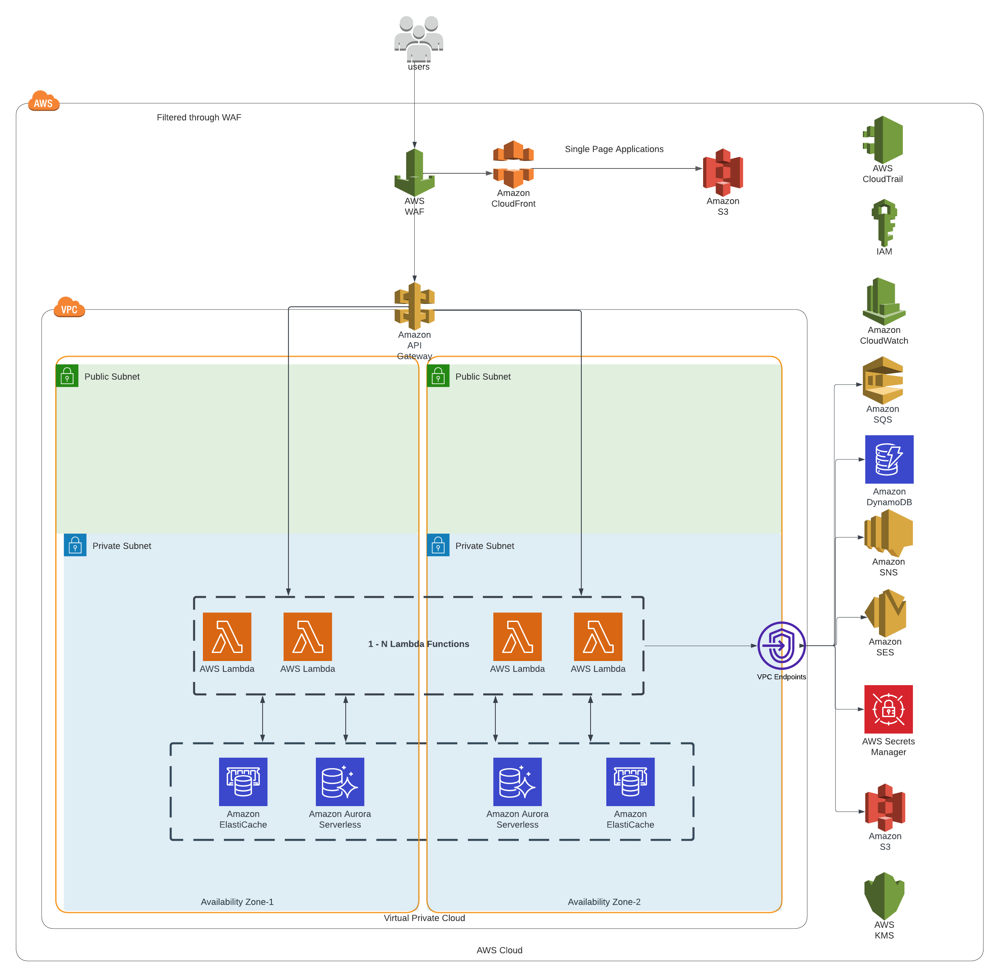

# [ARC Lambda](https://github.com/sourcefuse/arc-lambda)

This repo manages examples using [lerna-nx](https://lerna.js.org/docs/getting-started) to create ARC backend services and nodejs functions which can be deployed on AWS lambda functions using cdktf and [sourceloop-cdktf](https://www.npmjs.com/package/sourceloop-cdktf)

## <a id="prereqs"></a> Pre-Requisites

- [node.js](https://nodejs.dev/download/)
- [npm](https://docs.npmjs.com/cli/v6/commands/npm-install)
- use [VS code](https://code.visualstudio.com/) for best development experience
- [Terraform](https://www.terraform.io/)
- [cdktf-cli](https://www.npmjs.com/package/cdktf-cli)

## How to use

- Clone the [github repo](https://github.com/sourcefuse/arc-lambda)
- cd into the folder and run `npm i` to install node_modules.
- Run 'npx lerna bootstrap` to install dependencies in workspace folders
- packages/\* contains all the ARC backend services supported by cdktf in AWS lambda.
- To run any service locally , cd into the service folder and update reqd values in .env file (more info env variables in the service readme.md)
- Run `npm start` to start the development server

## How to deploy

To deploy service on AWS lambda :

- Run `npm run build` to generate the code build
- Run `npm run build:layers` to generate the node_modules as lambda layers
- Run `npm run build:migrations` to build install dependencies for migration code which will be deployed as separate lambda function
- We can choose to skip running commands mentioned in step 1-3 and directly run `npm run build:all` to build the lambda layers, code build and migrations for the service
- cd into cdk folder inside the service and update the .env file(Make sure upstream dependencies like postgres DB etc are already setup)
- Run `npm run deploy` to deploy the code on AWS using terraform constructs

Checkout out README files inside each example to know more.

## Use Lerna

To generate build for all packages

```
npx lerna run build:all
```

To deploy build single package

```
npx lerna run build:all --scope="service-name"
```

## List of supported services

- arc-audit
- arc-auth
- arc-bpmn
- arc-feature-toggle
- arc-in-mail
- arc-payment
- arc-scheduler
- arc-search
- arc-user-tenant

## How to Test

Here's how you can test the deployed lambda(s) for this project:

- Set the `LAMBDA_URL` variable in the env to the Domain name or the url of the api gateway that triggers the lambda.

- To test all the deployed services:

  - Run `lerna run test:lambda`. - Please note: If you encounter error `inotify_add_watch system call has failed due to insufficient space on the device` on your linux system. Try to increase the number of inotify watches. - To see current number of inotify watches. Run the command `cat /proc/sys/fs/inotify/max_user_watches` in your terminal. - To increase the number of inotify watches run the command `sudo sh -c 'echo fs.inotify.max_user_watches=524288 >> /etc/sysctl.conf'`
    `sudo sysctl -p`

- To test selective services:

  - Run `lerna run test:lambda --scope=package_name1 --scope=package-name2 ... --verbose`
  - To list all the packages run `lerna ls --all`

- Adding tests:

  - To add tests, add tests in ${service-name}/src/**\_\_tests\_\_**/lambda directory.
  - This project uses @loopback/testlab, supertest for writing tests. For more info please refer [loopback_testing](https://loopback.io/doc/en/lb4/Testing-your-application.html)
  - For hitting an api endpoint you might need to be authorized to complete the action. For authorization you need JWT token with required permissions as Bearer Token.
    You can generate a JWT using the following nodejs script:

  ```
    const jwt = require('jsonwebtoken');

    const testUser = {
    id: "id",
    username:"username",
    password: "password",
    permissions: [
    //Add the permissions required to hit an endpoint
    ],
    };

    const token = jwt.sign(testUser, 'jwtSecret', {
    expiresIn: 180000,
    issuer: 'sourcefuse',
    });
  ```

  For more info see [jsonwebtoken](https://www.npmjs.com/package/jsonwebtoken) documentation.

## AWS Architecture

The lambdas are designed to run in a private subnet with access to Redis and a compatible database. In the example below, we demonstrate a completely serverless and managed infrastructure AWS stack.


- The Lambdas run in a private subnet, since they need to communicate with backend services such as a database and distributed cache.
- Each Lambda that requires Redis can either provision a standalone ElastiCache Redis cluster (recommended) or reuse a shared instance.
- Resources such as the network, Aurora cluster, Route53 zone, and VPC endpoints are created upstream.

A cross-section of a ARC typical service is shown below.

