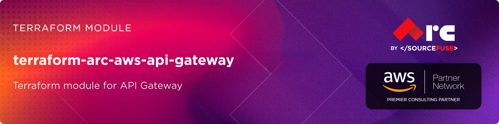

# AWS API Gateway Terraform Module

# [terraform-aws-arc-api-gateway](https://github.com/sourcefuse/terraform-aws-arc-api-gateway)

<a href="https://github.com/sourcefuse/terraform-aws-arc-api-gateway/releases/latest"></a> <a href="https://github.com/sourcefuse/terraform-aws-arc-api-gateway/commits"></a>  

[](https://sonarcloud.io/summary/new_code?id=sourcefuse_terraform-aws-arc-api-gateway)


## Overview

The API Gateway Terraform module provides an easy way to create and manage REST APIs on AWS. It supports defining resources, methods (GET, POST, etc.), and integrations with Lambda functions or other AWS services. The module also supports adding usage plans and API keys, enabling you to manage access, throttle requests, and monitor API usage. This helps ensure secure, scalable, and well-governed API deployments.

### Prerequisites
Before using this module, ensure you have the following:

- AWS credentials configured.
- Terraform installed.
- A working knowledge of Terraform.

## Getting Started

1. **Define the Module**

Initially, it's essential to define a Terraform module, which is organized as a distinct directory encompassing Terraform configuration files. Within this module directory, input variables and output values must be defined in the variables.tf and outputs.tf files, respectively. The following illustrates an example directory structure:


```plaintext
api-gateway/
|-- main.tf
|-- variables.tf
|-- outputs.tf
```


2. **Define Input Variables**

Inside the `variables.tf` or in `*.tfvars` file, you should define values for the variables that the module requires.

3. **Use the Module in Your Main Configuration**
In your main Terraform configuration file (e.g., main.tf), you can use the module. Specify the source of the module, and version, For Example

```hcl
module "api_gateway" {
  source                 = "sourcefuse/arc-api-gateway/aws"
  version                = "0.0.1"

  name          = "arc-app"
  stage_name    = "dev"
  endpoint_type = "REGIONAL"
  open_api_json = file("${path.module}/openapi.json")

  enable_cloudwatch_logs = true

  # Custom domain (optional)
  api_gateway_domain = {
    create              = true
    domain              = "arc-api.${local.domain}"
    certificate_arn     = data.aws_acm_certificate.this.arn
    route53_root_domain = local.domain
  }
}
```

4. **Output Values**

Inside the `outputs.tf` file of the module, you can define output values that can be referenced in the main configuration. For example:

```hcl
output "id" {
  description = "The ID of the API Gateway REST API"
  value       = module.api_gateway.id
}

output "arn" {
  description = "The ARN of the API Gateway REST API"
  value       = module.api_gateway.arn
}

output "execution_arn" {
  description = "The execution ARN of the API Gateway (useful for Lambda permissions)"
  value       = module.api_gateway.execution_arn
}

```

5. **.tfvars**

Inside the `.tfvars` file of the module, you can provide desired values that can be referenced in the main configuration.


## First Time Usage
***uncomment the backend block in [main.tf](./examples/endpoint//main.tf)***
```shell
terraform init -backend-config=config.dev.hcl
```
***If testing locally, `terraform init` should be fine***

Create a `dev` workspace
```shell
terraform workspace new dev
```

Plan Terraform
```shell
terraform plan -var-file dev.tfvars
```

Apply Terraform
```shell
terraform apply -var-file dev.tfvars
```

## Production Setup
```shell
terraform init -backend-config=config.prod.hcl
```

Create a `prod` workspace
```shell
terraform workspace new prod
```

Plan Terraform
```shell
terraform plan -var-file prod.tfvars
```

Apply Terraform
```shell
terraform apply -var-file prod.tfvars  
```
<!-- BEGIN_TF_DOCS -->
## Requirements

| Name | Version |
|------|---------|
| <a name="requirement_terraform"></a> [terraform](#requirement\_terraform) | >= 1.3, < 2.0.0 |
| <a name="requirement_aws"></a> [aws](#requirement\_aws) | >= 5.0, < 6.0 |

## Providers

| Name | Version |
|------|---------|
| <a name="provider_aws"></a> [aws](#provider\_aws) | 5.100.0 |
| <a name="provider_terraform"></a> [terraform](#provider\_terraform) | n/a |

## Modules

No modules.

## Resources

| Name | Type |
|------|------|
| [aws_api_gateway_account.api_gateway_account](https://registry.terraform.io/providers/hashicorp/aws/latest/docs/resources/api_gateway_account) | resource |
| [aws_api_gateway_api_key.this](https://registry.terraform.io/providers/hashicorp/aws/latest/docs/resources/api_gateway_api_key) | resource |
| [aws_api_gateway_base_path_mapping.base_path_mapping](https://registry.terraform.io/providers/hashicorp/aws/latest/docs/resources/api_gateway_base_path_mapping) | resource |
| [aws_api_gateway_deployment.this](https://registry.terraform.io/providers/hashicorp/aws/latest/docs/resources/api_gateway_deployment) | resource |
| [aws_api_gateway_domain_name.custom_domain](https://registry.terraform.io/providers/hashicorp/aws/latest/docs/resources/api_gateway_domain_name) | resource |
| [aws_api_gateway_rest_api.this](https://registry.terraform.io/providers/hashicorp/aws/latest/docs/resources/api_gateway_rest_api) | resource |
| [aws_api_gateway_stage.this](https://registry.terraform.io/providers/hashicorp/aws/latest/docs/resources/api_gateway_stage) | resource |
| [aws_api_gateway_usage_plan.this](https://registry.terraform.io/providers/hashicorp/aws/latest/docs/resources/api_gateway_usage_plan) | resource |
| [aws_api_gateway_usage_plan_key.this](https://registry.terraform.io/providers/hashicorp/aws/latest/docs/resources/api_gateway_usage_plan_key) | resource |
| [aws_iam_role.api_gateway_account_role](https://registry.terraform.io/providers/hashicorp/aws/latest/docs/resources/iam_role) | resource |
| [aws_iam_role_policy.api_gateway_cloudwatch_policy](https://registry.terraform.io/providers/hashicorp/aws/latest/docs/resources/iam_role_policy) | resource |
| [aws_route53_record.api_gateway_alias](https://registry.terraform.io/providers/hashicorp/aws/latest/docs/resources/route53_record) | resource |
| [terraform_data.replacement](https://registry.terraform.io/providers/hashicorp/terraform/latest/docs/resources/data) | resource |
| [aws_caller_identity.current](https://registry.terraform.io/providers/hashicorp/aws/latest/docs/data-sources/caller_identity) | data source |
| [aws_region.current](https://registry.terraform.io/providers/hashicorp/aws/latest/docs/data-sources/region) | data source |
| [aws_route53_zone.this](https://registry.terraform.io/providers/hashicorp/aws/latest/docs/data-sources/route53_zone) | data source |

## Inputs

| Name | Description | Type | Default | Required |
|------|-------------|------|---------|:--------:|
| <a name="input_access_log_format"></a> [access\_log\_format](#input\_access\_log\_format) | Acess log format for API Gateway | `string` | `null` | no |
| <a name="input_api_gateway_domain"></a> [api\_gateway\_domain](#input\_api\_gateway\_domain) | Configuration for API Gateway custom domain and Route53 record | <pre>object({<br/>    create              = optional(bool, false)<br/>    domain              = string # eg. "api.example.com"<br/>    route53_root_domain = string # eg. "example.com"<br/>    certificate_arn     = string # ACM cert ARN<br/>  })</pre> | n/a | yes |
| <a name="input_api_key_map"></a> [api\_key\_map](#input\_api\_key\_map) | Configuration for API Gateway API keys.<br/>Each API key entry represents a client or application that requires access<br/>to the API, and can be associated with one or more usage plans.<br/><br/>Fields:<br/>- name        : The name of the API key (must be unique).<br/>- description : Optional description of the API key (e.g., which client it belongs to).<br/>- usage\_plan  : List of usage plan names (from var.usage\_plan) this key should be associated with. This should match the names defined in var.usage\_plan | <pre>map(object({<br/>    name        = string<br/>    description = string<br/>    usage_plan  = string // This should match the names defined in var.usage_plan<br/>  }))</pre> | `{}` | no |
| <a name="input_enable_cloudwatch_logs"></a> [enable\_cloudwatch\_logs](#input\_enable\_cloudwatch\_logs) | Whether to enable CloudWatch logs for API Gateway | `bool` | `true` | no |
| <a name="input_endpoint_type"></a> [endpoint\_type](#input\_endpoint\_type) | API Gateway endpoint type. Valid values are 'EDGE', 'REGIONAL', or 'PRIVATE'. If not specified, defaults to 'REGIONAL'. | `string` | `"REGIONAL"` | no |
| <a name="input_name"></a> [name](#input\_name) | Name of the API Gateway REST endpoint | `string` | n/a | yes |
| <a name="input_open_api_json"></a> [open\_api\_json](#input\_open\_api\_json) | Open API JSON file | `string` | `null` | no |
| <a name="input_security_policy"></a> [security\_policy](#input\_security\_policy) | The Transport Layer Security version for the custom domain. Valid values: TLS\_1\_0 or TLS\_1\_2 | `string` | `"TLS_1_2"` | no |
| <a name="input_stage_name"></a> [stage\_name](#input\_stage\_name) | API Gateway stage name | `string` | n/a | yes |
| <a name="input_tags"></a> [tags](#input\_tags) | Tags for the resources | `map(string)` | `{}` | no |
| <a name="input_usage_plan"></a> [usage\_plan](#input\_usage\_plan) | Configuration for API Gateway usage plan | <pre>list(object({<br/>    name        = string<br/>    description = optional(string, "API usage plan")<br/>    quota_settings = object({<br/>      limit  = number<br/>      offset = number<br/>      period = string<br/>    })<br/>    throttle_settings = object({<br/>      burst_limit = number<br/>      rate_limit  = number<br/>    })<br/>  }))</pre> | `[]` | no |
| <a name="input_xray_tracing_enabled"></a> [xray\_tracing\_enabled](#input\_xray\_tracing\_enabled) | Enable X-Ray tracing for Lambda | `bool` | `true` | no |

## Outputs

| Name | Description |
|------|-------------|
| <a name="output_api_keys"></a> [api\_keys](#output\_api\_keys) | Map of API keys created (name => value) |
| <a name="output_arn"></a> [arn](#output\_arn) | The ARN of the API Gateway REST API |
| <a name="output_custom_domain"></a> [custom\_domain](#output\_custom\_domain) | The custom domain name for API Gateway (if created) |
| <a name="output_custom_domain_regional_domain_name"></a> [custom\_domain\_regional\_domain\_name](#output\_custom\_domain\_regional\_domain\_name) | The regional domain name for the custom domain (if created) |
| <a name="output_custom_domain_regional_zone_id"></a> [custom\_domain\_regional\_zone\_id](#output\_custom\_domain\_regional\_zone\_id) | The Route53 hosted zone ID for the custom domain |
| <a name="output_deployment_id"></a> [deployment\_id](#output\_deployment\_id) | The ID of the current API Gateway deployment |
| <a name="output_execution_arn"></a> [execution\_arn](#output\_execution\_arn) | The execution ARN of the API Gateway (useful for Lambda permissions) |
| <a name="output_id"></a> [id](#output\_id) | The ID of the API Gateway REST API |
| <a name="output_invoke_url"></a> [invoke\_url](#output\_invoke\_url) | Base invoke URL for the API Gateway stage |
| <a name="output_stage_name"></a> [stage\_name](#output\_stage\_name) | The name of the API Gateway stage |
| <a name="output_usage_plans"></a> [usage\_plans](#output\_usage\_plans) | Map of usage plans created |
<!-- END_TF_DOCS -->


## Versioning  
This project uses a `.version` file at the root of the repo which the pipeline reads from and does a git tag.  

When you intend to commit to `main`, you will need to increment this version. Once the project is merged,
the pipeline will kick off and tag the latest git commit.  

## Development

### Prerequisites

- [terraform](https://learn.hashicorp.com/terraform/getting-started/install#installing-terraform)
- [terraform-docs](https://github.com/segmentio/terraform-docs)
- [pre-commit](https://pre-commit.com/#install)
- [golang](https://golang.org/doc/install#install)
- [golint](https://github.com/golang/lint#installation)

### Configurations

- Configure pre-commit hooks
  ```sh
  pre-commit install
  ```

### Versioning

while Contributing or doing git commit please specify the breaking change in your commit message whether its major,minor or patch

For Example

```sh
git commit -m "your commit message #major"
```
By specifying this , it will bump the version and if you don't specify this in your commit message then by default it will consider patch and will bump that accordingly

### Tests
- Tests are available in `test` directory
- Configure the dependencies
  ```sh
  cd test/
  go mod init github.com/sourcefuse/terraform-aws-refarch-<module_name>
  go get github.com/gruntwork-io/terratest/modules/terraform
  ```
- Now execute the test  
  ```sh
  go test -timeout  30m
  ```

## Authors

This project is authored by:
- SourceFuse ARC Team
