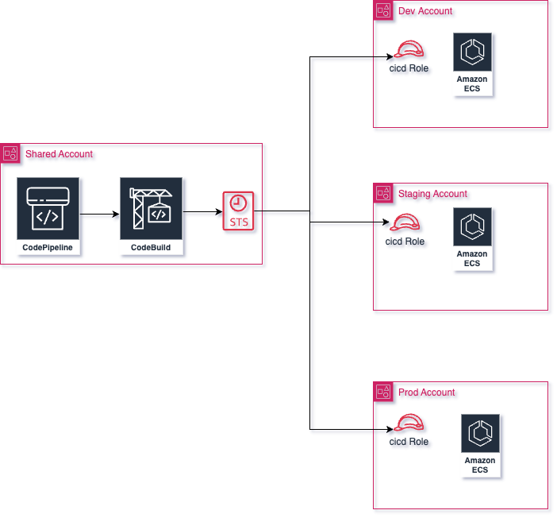

# Terraform AWS ARC CICD Module Usage Guide

## Introduction

### Purpose of the Document

This document provides guidelines and instructions for users looking to create CI/CD pipelines using CodePipeline and CodeBuild projects. It helps achieve multi-account pipelines.

### Module Overview

The [terraform-aws-arc-cicd](https://github.com/sourcefuse/terraform-aws-arc-cicd) module can be used to create CICI pipelines using Codepipeline.
### Prerequisites

Before using this module, ensure you have the following:
- AWS credentials configured.
- Terraform installed.
- A working knowledge of AWS cicd

## Getting Started

### Module Source

To use the module in your Terraform configuration, include the following source block:

```hcl
module "cloud_cicd" {
  source  = "sourcefuse/arc-cicd/aws"
  version = "0.0.1"
  # insert the required variables here
}
```
Refer to the [Terraform Registry](https://registry.terraform.io/modules/sourcefuse/arc-cicd/aws/latest) for the latest version.

### Integration with Existing Terraform Configurations

Integrate the module with your existing Terraform mono repo configuration, follow the steps below:

1. Create a new folder in `terraform/` named `cicd`.
2. Create the required files, see the [examples](https://github.com/sourcefuse/terraform-aws-arc-cicd/tree/main/examples/terraform) to base off of.
3. Configure with your backend
  - Create the environment backend configuration file: `config.<environment>.hcl`
    - **region**: Where the backend resides
    - **key**: `<working_directory>/terraform.tfstate`
    - **bucket**: Bucket name where the terraform state will reside
    - **dynamodb_table**: Lock table so there are not duplicate tfplans in the mix
    - **encrypt**: Encrypt all traffic to and from the backend

### Multi account Pipeline
  - Refer [example](https://github.com/sourcefuse/terraform-aws-arc-cicd/tree/main/examples/multi-account-ui-deployment) for creating multi account pipelines.


  


### Required AWS Permissions

- Ensure that the AWS credentials used to execute Terraform have the necessary permissions to set up a cloud cicd infrastructure on AWS.
- Incase of multi account setup, create the IAM roles in Workload accounts and add trust policy for Codebuild project roles.


## Module Configuration

### Input Variables

For a list of input variables, see the README [Inputs](https://github.com/sourcefuse/terraform-aws-arc-cicd?tab=readme-ov-file#inputs) section.

### Output Values

For a list of outputs, see the README [Outputs](https://github.com/sourcefuse/terraform-aws-arc-cicd?tab=readme-ov-file#outputs) section.

## Module Usage

### Basic Usage

For basic usage, see the [example](https://github.com/sourcefuse/terraform-aws-arc-cicd/tree/main/examples/terraform) folder.

This example will create:

IAM Role : IAM role for Codebuild project and Codepipelines

Codebuild project : Reusable codebuild project

Codepipeline : Codepipelines using codebuild projects


### Tips and Recommendations

The module focuses on setting up setting up a CICD pipelines on AWS. Adjust the configuration parameters as needed for your specific use case.

## Troubleshooting

### Reporting Issues

If you encounter a bug or issue, please report it on the [GitHub repository](https://github.com/sourcefuse/terraform-aws-arc-cicd/issues).

## cicd Considerations

### Best Practices for AWS Cloud cicd

Follow best practices to ensure best cicd configurations.
[Cloud cicd on AWS](https://docs.aws.amazon.com/whitepapers/latest/aws-overview/cicd-and-compliance.html)

## Contributing and Community Support

### Contributing Guidelines

Contribute to the module by following the guidelines outlined in the [CONTRIBUTING.md](https://github.com/sourcefuse/terraform-aws-arc-cicd/blob/main/CONTRIBUTING.md) file.

### Reporting Bugs and Issues

If you find a bug or issue, report it on the [GitHub repository](https://github.com/sourcefuse/terraform-aws-arc-cicd/issues).

## License

### License Information

This module is licensed under the Apache 2.0 license. Refer to the [LICENSE](https://github.com/sourcefuse/terraform-aws-arc-cicd/blob/main/LICENSE) file for more details.

### Open Source Contribution

Contribute to open source by using and enhancing this module. Your contributions are welcome!
