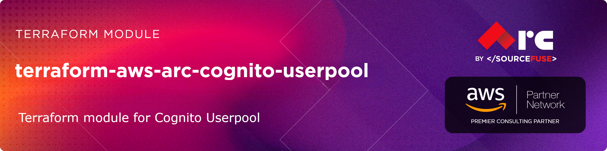

## [terraform-aws-arc-cognito-userpool](https://github.com/sourcefuse/terraform-aws-arc-cognito-userpool)


[](https://sonarcloud.io/summary/new_code?id=sourcefuse_terraform-aws-arc-cognito-userpool)


## Overview
SourceFuse AWS Reference Architecture (ARC) Terraform module for managing the cognito userpool module.
## Features
- **Complete Cognito User Pool Management**: Create and configure user pools with all available settings.
- **Security Best Practices**: Built-in security configurations following AWS recommendations.
- **Flexible Client Configuration**: Support for multiple app clients with different configurations.
- **Identity Provider Integration**: Support for SAML, OIDC, and social identity providers.
- **Advanced Security Features**: MFA, advanced security mode, adaptive authentication.
- **Lambda Triggers**: Support for all Cognito Lambda triggers.
- **Custom Domains**: Support for custom domains with SSL certificates.
- **User Pool Groups**: Role-based access control with user groups.
- **Resource Servers**: OAuth 2.0 resource server configuration.

 ## Usage
 To see a full example, check out the [main.tf](https://github.com/sourcefuse/terraform-aws-arc-cognito-userpool/blob/main/examples/basic-user-pool/main.tf) file in the example folder.

```hcl
module "arc-cognito-userpool" {
  source  = "sourcefuse/arc-cognito-userpool/aws"
  version = "1.0.0"

  environment      = "dev"
  project          = "arc"
  name             = "auth"
  region           = "us-east-1"

  # Example basic config
  cognito_user_pool_name = "arc-demo-user-pool"
  # Add further required variables
}
```
<!-- BEGIN_TF_DOCS -->
## Requirements

| Name | Version |
|------|---------|
| <a name="requirement_terraform"></a> [terraform](#requirement\_terraform) | >= 1.6.0 |
| <a name="requirement_aws"></a> [aws](#requirement\_aws) | >= 5.0, < 7.0 |

## Providers

| Name | Version |
|------|---------|
| <a name="provider_aws"></a> [aws](#provider\_aws) | 6.12.0 |

## Modules

| Name | Source | Version |
|------|--------|---------|
| <a name="module_s3"></a> [s3](#module\_s3) | sourcefuse/arc-s3/aws | 0.0.5 |

## Resources

| Name | Type |
|------|------|
| [aws_cloudwatch_log_group.this](https://registry.terraform.io/providers/hashicorp/aws/latest/docs/resources/cloudwatch_log_group) | resource |
| [aws_cloudwatch_log_resource_policy.cognito](https://registry.terraform.io/providers/hashicorp/aws/latest/docs/resources/cloudwatch_log_resource_policy) | resource |
| [aws_cognito_identity_provider.this](https://registry.terraform.io/providers/hashicorp/aws/latest/docs/resources/cognito_identity_provider) | resource |
| [aws_cognito_log_delivery_configuration.this](https://registry.terraform.io/providers/hashicorp/aws/latest/docs/resources/cognito_log_delivery_configuration) | resource |
| [aws_cognito_resource_server.this](https://registry.terraform.io/providers/hashicorp/aws/latest/docs/resources/cognito_resource_server) | resource |
| [aws_cognito_risk_configuration.this](https://registry.terraform.io/providers/hashicorp/aws/latest/docs/resources/cognito_risk_configuration) | resource |
| [aws_cognito_user.users](https://registry.terraform.io/providers/hashicorp/aws/latest/docs/resources/cognito_user) | resource |
| [aws_cognito_user_group.this](https://registry.terraform.io/providers/hashicorp/aws/latest/docs/resources/cognito_user_group) | resource |
| [aws_cognito_user_in_group.this](https://registry.terraform.io/providers/hashicorp/aws/latest/docs/resources/cognito_user_in_group) | resource |
| [aws_cognito_user_pool.this](https://registry.terraform.io/providers/hashicorp/aws/latest/docs/resources/cognito_user_pool) | resource |
| [aws_cognito_user_pool_client.hosted_ui](https://registry.terraform.io/providers/hashicorp/aws/latest/docs/resources/cognito_user_pool_client) | resource |
| [aws_cognito_user_pool_client.this](https://registry.terraform.io/providers/hashicorp/aws/latest/docs/resources/cognito_user_pool_client) | resource |
| [aws_cognito_user_pool_domain.hosted_ui](https://registry.terraform.io/providers/hashicorp/aws/latest/docs/resources/cognito_user_pool_domain) | resource |
| [aws_cognito_user_pool_domain.this](https://registry.terraform.io/providers/hashicorp/aws/latest/docs/resources/cognito_user_pool_domain) | resource |
| [aws_cognito_user_pool_ui_customization.hosted_ui](https://registry.terraform.io/providers/hashicorp/aws/latest/docs/resources/cognito_user_pool_ui_customization) | resource |
| [aws_wafv2_web_acl_association.cognito_waf](https://registry.terraform.io/providers/hashicorp/aws/latest/docs/resources/wafv2_web_acl_association) | resource |
| [aws_region.current](https://registry.terraform.io/providers/hashicorp/aws/latest/docs/data-sources/region) | data source |

## Inputs

| Name | Description | Type | Default | Required |
|------|-------------|------|---------|:--------:|
| <a name="input_account_recovery_mechanisms"></a> [account\_recovery\_mechanisms](#input\_account\_recovery\_mechanisms) | List of account recovery mechanisms | <pre>list(object({<br/>    name     = string<br/>    priority = number<br/>  }))</pre> | <pre>[<br/>  {<br/>    "name": "verified_email",<br/>    "priority": 1<br/>  }<br/>]</pre> | no |
| <a name="input_account_takeover_risk_configuration"></a> [account\_takeover\_risk\_configuration](#input\_account\_takeover\_risk\_configuration) | n/a | <pre>object({<br/>    notify_configuration = object({<br/>      from       = optional(string)<br/>      reply_to   = optional(string)<br/>      source_arn = string<br/>      block_email = optional(object({<br/>        html_body = string<br/>        text_body = string<br/>        subject   = string<br/>      }))<br/>      mfa_email = optional(object({<br/>        html_body = string<br/>        text_body = string<br/>        subject   = string<br/>      }))<br/>      no_action_email = optional(object({<br/>        html_body = string<br/>        text_body = string<br/>        subject   = string<br/>      }))<br/>    })<br/>    actions = object({<br/>      high_action = object({<br/>        event_action = string<br/>        notify       = bool<br/>      })<br/>      medium_action = object({<br/>        event_action = string<br/>        notify       = bool<br/>      })<br/>      low_action = object({<br/>        event_action = string<br/>        notify       = bool<br/>      })<br/>    })<br/>  })</pre> | `null` | no |
| <a name="input_admin_create_user_config"></a> [admin\_create\_user\_config](#input\_admin\_create\_user\_config) | Configuration for creating a new user profile | <pre>object({<br/>    allow_admin_create_user_only = optional(bool, false)<br/>    invite_message_template = optional(object({<br/>      email_message = optional(string)<br/>      email_subject = optional(string)<br/>      sms_message   = optional(string)<br/>    }), {})<br/>  })</pre> | `{}` | no |
| <a name="input_alias_attributes"></a> [alias\_attributes](#input\_alias\_attributes) | Attributes supported as an alias for this user pool. Valid values: phone\_number, email, or preferred\_username | `list(string)` | `[]` | no |
| <a name="input_auto_verified_attributes"></a> [auto\_verified\_attributes](#input\_auto\_verified\_attributes) | Attributes to be auto-verified. Valid values: email, phone\_number | `list(string)` | `[]` | no |
| <a name="input_cognito_log_delivery_config"></a> [cognito\_log\_delivery\_config](#input\_cognito\_log\_delivery\_config) | ============================================================================== VARIABLES - LOG STREAMING ============================================================================== | <pre>object({<br/>    event_source         = string # e.g. "userAuthEvents" or "userNotification"<br/>    log_level            = string # "ERROR" or "INFO"<br/>    log_destination_type = string # "cloudwatch", "s3", "firehose"<br/><br/>    # Optional overrides<br/>    log_group_name      = optional(string) # for CW logs<br/>    s3_bucket_name      = optional(string) # for S3<br/>    firehose_stream_arn = optional(string) # for Firehose<br/>  })</pre> | `null` | no |
| <a name="input_compromised_credentials_risk_configuration"></a> [compromised\_credentials\_risk\_configuration](#input\_compromised\_credentials\_risk\_configuration) | n/a | <pre>object({<br/>    event_filter = optional(list(string))<br/>    actions = object({<br/>      event_action = string<br/>    })<br/>  })</pre> | `null` | no |
| <a name="input_create_resource_servers"></a> [create\_resource\_servers](#input\_create\_resource\_servers) | Whether to create resource servers | `bool` | `false` | no |
| <a name="input_create_user_pool_clients"></a> [create\_user\_pool\_clients](#input\_create\_user\_pool\_clients) | Whether to create user pool clients | `bool` | `true` | no |
| <a name="input_create_user_pool_domain"></a> [create\_user\_pool\_domain](#input\_create\_user\_pool\_domain) | Whether to create user pool domain | `bool` | `false` | no |
| <a name="input_create_user_pool_groups"></a> [create\_user\_pool\_groups](#input\_create\_user\_pool\_groups) | Whether to create user pool groups | `bool` | `false` | no |
| <a name="input_create_user_pool_users"></a> [create\_user\_pool\_users](#input\_create\_user\_pool\_users) | Whether to create user pool users | `bool` | `false` | no |
| <a name="input_deletion_protection"></a> [deletion\_protection](#input\_deletion\_protection) | When active, DeletionProtection prevents accidental deletion of your user pool | `string` | `"INACTIVE"` | no |
| <a name="input_device_configuration"></a> [device\_configuration](#input\_device\_configuration) | Configuration for the user pool's device tracking | <pre>object({<br/>    challenge_required_on_new_device      = optional(bool, false)<br/>    device_only_remembered_on_user_prompt = optional(bool, false)<br/>  })</pre> | `null` | no |
| <a name="input_email_configuration"></a> [email\_configuration](#input\_email\_configuration) | Configuration for email settings | <pre>object({<br/>    configuration_set      = optional(string)<br/>    email_sending_account  = optional(string, "COGNITO_DEFAULT")<br/>    from_email_address     = optional(string)<br/>    reply_to_email_address = optional(string)<br/>    source_arn             = optional(string)<br/>  })</pre> | `{}` | no |
| <a name="input_email_verification_message"></a> [email\_verification\_message](#input\_email\_verification\_message) | String representing the email verification message | `string` | `null` | no |
| <a name="input_email_verification_subject"></a> [email\_verification\_subject](#input\_email\_verification\_subject) | String representing the email verification subject | `string` | `null` | no |
| <a name="input_hosted_ui_config"></a> [hosted\_ui\_config](#input\_hosted\_ui\_config) | Cognito Hosted UI configuration | <pre>object({<br/>    name                                 = string<br/>    domain                               = string<br/>    certificate_arn                      = optional(string)<br/>    callback_urls                        = list(string)<br/>    logout_urls                          = list(string)<br/>    default_redirect_uri                 = optional(string)<br/>    allowed_oauth_flows                  = list(string)<br/>    allowed_oauth_flows_user_pool_client = optional(bool, true)<br/>    allowed_oauth_scopes                 = list(string)<br/>    supported_identity_providers         = list(string)<br/>    generate_secret                      = optional(bool, false)<br/>    css_file                             = optional(string)<br/>    image_file                           = optional(string)<br/>  })</pre> | `null` | no |
| <a name="input_identity_providers_config"></a> [identity\_providers\_config](#input\_identity\_providers\_config) | Configuration for optional identity providers | <pre>object({<br/>    google = optional(object({<br/>      enabled                       = optional(bool, false)<br/>      client_id                     = optional(string)<br/>      client_secret                 = optional(string)<br/>      scopes                        = optional(list(string), ["openid", "email", "profile"])<br/>      attribute_mapping             = optional(map(string), {})<br/>      authorize_url                 = optional(string, "https://accounts.google.com/o/oauth2/v2/auth")<br/>      token_url                     = optional(string, "https://www.googleapis.com/oauth2/v4/token")<br/>      attributes_url                = optional(string, "https://people.googleapis.com/v1/people/me?personFields=")<br/>      attributes_url_add_attributes = optional(string, "true")<br/>      oidc_issuer                   = optional(string, "https://accounts.google.com")<br/>      token_request_method          = optional(string, "POST")<br/>    }), {})<br/><br/>    facebook = optional(object({<br/>      enabled                       = optional(bool, false)<br/>      app_id                        = optional(string)<br/>      app_secret                    = optional(string)<br/>      scopes                        = optional(list(string), ["public_profile", "email"])<br/>      attribute_mapping             = optional(map(string), {})<br/>      authorize_url                 = optional(string, "https://www.facebook.com/v17.0/dialog/oauth")<br/>      token_url                     = optional(string, "https://graph.facebook.com/v17.0/oauth/access_token")<br/>      attributes_url                = optional(string, "https://graph.facebook.com/v17.0/me?fields=")<br/>      attributes_url_add_attributes = optional(string, "true")<br/>      token_request_method          = optional(string, "GET")<br/>    }), {})<br/><br/>    apple = optional(object({<br/>      enabled           = optional(bool, false)<br/>      services_id       = optional(string)<br/>      team_id           = optional(string)<br/>      key_id            = optional(string)<br/>      private_key       = optional(string)<br/>      scopes            = optional(list(string), ["name", "email"])<br/>      attribute_mapping = optional(map(string), {})<br/>    }), {})<br/><br/>    amazon = optional(object({<br/>      enabled           = optional(bool, false)<br/>      client_id         = optional(string)<br/>      client_secret     = optional(string)<br/>      scopes            = optional(list(string), ["profile"])<br/>      attribute_mapping = optional(map(string), {})<br/>    }), {})<br/><br/>    saml = optional(object({<br/>      enabled           = optional(bool, false)<br/>      provider_name     = optional(string)<br/>      metadata_url      = optional(string)<br/>      attribute_mapping = optional(map(string), {})<br/>      idp_identifiers   = optional(list(string), [])<br/>    }), {})<br/><br/>    oidc = optional(object({<br/>      enabled           = optional(bool, false)<br/>      provider_name     = optional(string)<br/>      client_id         = optional(string)<br/>      client_secret     = optional(string)<br/>      issuer_url        = optional(string)<br/>      scopes            = optional(list(string), ["openid", "email", "profile"])<br/>      attribute_mapping = optional(map(string), {})<br/>    }), {})<br/>  })</pre> | `{}` | no |
| <a name="input_lambda_config"></a> [lambda\_config](#input\_lambda\_config) | Configuration for AWS Lambda triggers associated with the user pool | <pre>object({<br/>    create_auth_challenge          = optional(string)<br/>    custom_message                 = optional(string)<br/>    define_auth_challenge          = optional(string)<br/>    post_authentication            = optional(string)<br/>    post_confirmation              = optional(string)<br/>    pre_authentication             = optional(string)<br/>    pre_sign_up                    = optional(string)<br/>    pre_token_generation           = optional(string)<br/>    user_migration                 = optional(string)<br/>    verify_auth_challenge_response = optional(string)<br/>    kms_key_id                     = optional(string)<br/>    custom_email_sender = optional(object({<br/>      lambda_arn     = string<br/>      lambda_version = string<br/>    }))<br/>    custom_sms_sender = optional(object({<br/>      lambda_arn     = string<br/>      lambda_version = string<br/>    }))<br/>    pre_token_generation_config = optional(object({<br/>      lambda_arn     = string<br/>      lambda_version = string<br/>    }))<br/>  })</pre> | `null` | no |
| <a name="input_mfa_configuration"></a> [mfa\_configuration](#input\_mfa\_configuration) | Multi-Factor Authentication (MFA) configuration for the User Pool. Set to null to omit. | `string` | `null` | no |
| <a name="input_name"></a> [name](#input\_name) | Name of the Cognito User Pool | `string` | n/a | yes |
| <a name="input_password_policy"></a> [password\_policy](#input\_password\_policy) | Configuration for the user pool password policy | <pre>object({<br/>    minimum_length                   = optional(number, 8)<br/>    require_lowercase                = optional(bool, true)<br/>    require_numbers                  = optional(bool, true)<br/>    require_symbols                  = optional(bool, true)<br/>    require_uppercase                = optional(bool, true)<br/>    temporary_password_validity_days = optional(number, 7)<br/>    password_history_size            = optional(number, 0)<br/>  })</pre> | `{}` | no |
| <a name="input_resource_servers"></a> [resource\_servers](#input\_resource\_servers) | List of resource servers to create | <pre>list(object({<br/>    identifier = string<br/>    name       = string<br/>    scope = optional(list(object({<br/>      scope_name        = string<br/>      scope_description = string<br/>    })), [])<br/>  }))</pre> | `[]` | no |
| <a name="input_risk_exception_configuration"></a> [risk\_exception\_configuration](#input\_risk\_exception\_configuration) | n/a | <pre>object({<br/>    blocked_ip_range_list = optional(list(string))<br/>    skipped_ip_range_list = optional(list(string))<br/>  })</pre> | `null` | no |
| <a name="input_schema"></a> [schema](#input\_schema) | Configuration for the schema attributes of a user pool | <pre>list(object({<br/>    attribute_data_type      = string<br/>    developer_only_attribute = optional(bool, false)<br/>    mutable                  = optional(bool, true)<br/>    name                     = string<br/>    required                 = optional(bool, false)<br/>    number_attribute_constraints = optional(object({<br/>      max_value = optional(string)<br/>      min_value = optional(string)<br/>    }))<br/>    string_attribute_constraints = optional(object({<br/>      max_length = optional(string)<br/>      min_length = optional(string)<br/>    }))<br/>  }))</pre> | `[]` | no |
| <a name="input_sms_authentication_message"></a> [sms\_authentication\_message](#input\_sms\_authentication\_message) | String representing the SMS authentication message | `string` | `null` | no |
| <a name="input_sms_configuration"></a> [sms\_configuration](#input\_sms\_configuration) | Configuration for SMS settings | <pre>object({<br/>    external_id    = string<br/>    sns_caller_arn = string<br/>    sns_region     = optional(string)<br/>  })</pre> | `null` | no |
| <a name="input_sms_verification_message"></a> [sms\_verification\_message](#input\_sms\_verification\_message) | String representing the SMS verification message | `string` | `null` | no |
| <a name="input_software_token_mfa_configuration"></a> [software\_token\_mfa\_configuration](#input\_software\_token\_mfa\_configuration) | Configuration for software token Multi-Factor Authentication (MFA) settings. Set to null to omit. | <pre>object({<br/>    enabled = bool<br/>  })</pre> | `null` | no |
| <a name="input_tags"></a> [tags](#input\_tags) | A map of tags to assign to the resources | `map(string)` | `{}` | no |
| <a name="input_user_attribute_update_settings"></a> [user\_attribute\_update\_settings](#input\_user\_attribute\_update\_settings) | Configuration for user attribute update settings | <pre>object({<br/>    attributes_require_verification_before_update = list(string)<br/>  })</pre> | `null` | no |
| <a name="input_user_group_memberships"></a> [user\_group\_memberships](#input\_user\_group\_memberships) | List of user-to-group memberships | <pre>list(object({<br/>    user  = string<br/>    group = string<br/>  }))</pre> | `[]` | no |
| <a name="input_user_pool_add_ons"></a> [user\_pool\_add\_ons](#input\_user\_pool\_add\_ons) | Advanced security configuration for Cognito User Pool.<br/>- advanced\_security\_mode: OFF \| AUDIT \| ENFORCED<br/>- advanced\_security\_additional\_flows: (optional) block for custom flows<br/>    - custom\_auth\_mode: e.g. "AUDIT" or "ENFORCED" | <pre>object({<br/>    advanced_security_mode = string<br/>    advanced_security_additional_flows = optional(object({<br/>      custom_auth_mode = string<br/>    }))<br/>  })</pre> | `null` | no |
| <a name="input_user_pool_clients"></a> [user\_pool\_clients](#input\_user\_pool\_clients) | List of user pool clients to create | <pre>list(object({<br/>    name                   = string<br/>    access_token_validity  = optional(number, 60)<br/>    id_token_validity      = optional(number, 60)<br/>    refresh_token_validity = optional(number, 30)<br/>    token_validity_units = optional(object({<br/>      access_token  = optional(string, "minutes")<br/>      id_token      = optional(string, "minutes")<br/>      refresh_token = optional(string, "days")<br/>    }), {})<br/>    allowed_oauth_flows                           = optional(list(string), [])<br/>    allowed_oauth_flows_user_pool_client          = optional(bool, false)<br/>    allowed_oauth_scopes                          = optional(list(string), [])<br/>    callback_urls                                 = optional(list(string), [])<br/>    default_redirect_uri                          = optional(string)<br/>    explicit_auth_flows                           = optional(list(string), ["ALLOW_USER_SRP_AUTH", "ALLOW_REFRESH_TOKEN_AUTH"])<br/>    generate_secret                               = optional(bool, false)<br/>    logout_urls                                   = optional(list(string), [])<br/>    prevent_user_existence_errors                 = optional(string, "ENABLED")<br/>    read_attributes                               = optional(list(string), [])<br/>    supported_identity_providers                  = optional(list(string), ["GOOGLE"])<br/>    write_attributes                              = optional(list(string), [])<br/>    enable_token_revocation                       = optional(bool, true)<br/>    enable_propagate_additional_user_context_data = optional(bool, false)<br/>    auth_session_validity                         = optional(number, 3)<br/>  }))</pre> | `[]` | no |
| <a name="input_user_pool_domain"></a> [user\_pool\_domain](#input\_user\_pool\_domain) | Configuration for user pool domain | <pre>object({<br/>    domain          = string<br/>    certificate_arn = optional(string)<br/>  })</pre> | `null` | no |
| <a name="input_user_pool_groups"></a> [user\_pool\_groups](#input\_user\_pool\_groups) | List of user pool groups to create | <pre>list(object({<br/>    name        = string<br/>    description = optional(string)<br/>    precedence  = optional(number)<br/>    role_arn    = optional(string)<br/>  }))</pre> | `[]` | no |
| <a name="input_user_pool_tier"></a> [user\_pool\_tier](#input\_user\_pool\_tier) | The user pool feature plan, or tier | `string` | `"ESSENTIALS"` | no |
| <a name="input_user_pool_users"></a> [user\_pool\_users](#input\_user\_pool\_users) | List of Cognito users to create | <pre>list(object({<br/>    username = string<br/>    email    = string<br/>    password = string<br/>  }))</pre> | `[]` | no |
| <a name="input_username_attributes"></a> [username\_attributes](#input\_username\_attributes) | Whether email addresses or phone numbers can be specified as usernames when a user signs up | `list(string)` | `[]` | no |
| <a name="input_username_configuration"></a> [username\_configuration](#input\_username\_configuration) | Configuration for username settings | <pre>object({<br/>    case_sensitive = optional(bool, false)<br/>  })</pre> | `{}` | no |
| <a name="input_verification_message_template"></a> [verification\_message\_template](#input\_verification\_message\_template) | Configuration for verification message templates | <pre>object({<br/>    default_email_option  = optional(string, "CONFIRM_WITH_CODE")<br/>    email_message         = optional(string)<br/>    email_message_by_link = optional(string)<br/>    email_subject         = optional(string)<br/>    email_subject_by_link = optional(string)<br/>    sms_message           = optional(string)<br/>  })</pre> | `null` | no |
| <a name="input_web_acl_arn"></a> [web\_acl\_arn](#input\_web\_acl\_arn) | Optional WAF Web ACL ARN to associate with Cognito User Pool. Null = inactive | `string` | `null` | no |
| <a name="input_web_authn_configuration"></a> [web\_authn\_configuration](#input\_web\_authn\_configuration) | Configuration for web authn (passkey) settings | <pre>object({<br/>    relying_party_id  = optional(string)<br/>    user_verification = optional(string, "preferred")<br/>  })</pre> | `null` | no |

## Outputs

| Name | Description |
|------|-------------|
| <a name="output_identity_provider_names"></a> [identity\_provider\_names](#output\_identity\_provider\_names) | The names of the Cognito Identity Providers |
| <a name="output_identity_providers"></a> [identity\_providers](#output\_identity\_providers) | Map of identity provider details |
| <a name="output_resource_server_identifiers"></a> [resource\_server\_identifiers](#output\_resource\_server\_identifiers) | The identifiers of the Cognito Resource Servers |
| <a name="output_resource_server_names"></a> [resource\_server\_names](#output\_resource\_server\_names) | The names of the Cognito Resource Servers |
| <a name="output_resource_servers"></a> [resource\_servers](#output\_resource\_servers) | Map of resource server details |
| <a name="output_summary"></a> [summary](#output\_summary) | Summary of all created resources |
| <a name="output_user_pool_arn"></a> [user\_pool\_arn](#output\_user\_pool\_arn) | The ARN of the Cognito User Pool |
| <a name="output_user_pool_client_ids"></a> [user\_pool\_client\_ids](#output\_user\_pool\_client\_ids) | The IDs of the Cognito User Pool Clients |
| <a name="output_user_pool_client_names"></a> [user\_pool\_client\_names](#output\_user\_pool\_client\_names) | The names of the Cognito User Pool Clients |
| <a name="output_user_pool_client_secrets"></a> [user\_pool\_client\_secrets](#output\_user\_pool\_client\_secrets) | The client secrets of the Cognito User Pool Clients (sensitive) |
| <a name="output_user_pool_clients"></a> [user\_pool\_clients](#output\_user\_pool\_clients) | Map of user pool client details |
| <a name="output_user_pool_creation_date"></a> [user\_pool\_creation\_date](#output\_user\_pool\_creation\_date) | The date the Cognito User Pool was created |
| <a name="output_user_pool_custom_domain"></a> [user\_pool\_custom\_domain](#output\_user\_pool\_custom\_domain) | The custom domain name for the user pool |
| <a name="output_user_pool_domain"></a> [user\_pool\_domain](#output\_user\_pool\_domain) | The domain prefix if the user pool has a domain associated with it |
| <a name="output_user_pool_domain_aws_account_id"></a> [user\_pool\_domain\_aws\_account\_id](#output\_user\_pool\_domain\_aws\_account\_id) | The AWS account ID for the user pool domain |
| <a name="output_user_pool_domain_cloudfront_distribution_arn"></a> [user\_pool\_domain\_cloudfront\_distribution\_arn](#output\_user\_pool\_domain\_cloudfront\_distribution\_arn) | The ARN of the CloudFront distribution for the domain |
| <a name="output_user_pool_domain_name"></a> [user\_pool\_domain\_name](#output\_user\_pool\_domain\_name) | The domain name of the Cognito User Pool Domain |
| <a name="output_user_pool_domain_s3_bucket"></a> [user\_pool\_domain\_s3\_bucket](#output\_user\_pool\_domain\_s3\_bucket) | The S3 bucket where the static files for this domain are stored |
| <a name="output_user_pool_domain_version"></a> [user\_pool\_domain\_version](#output\_user\_pool\_domain\_version) | The app version for the domain |
| <a name="output_user_pool_endpoint"></a> [user\_pool\_endpoint](#output\_user\_pool\_endpoint) | The endpoint name of the Cognito User Pool |
| <a name="output_user_pool_estimated_number_of_users"></a> [user\_pool\_estimated\_number\_of\_users](#output\_user\_pool\_estimated\_number\_of\_users) | A number estimating the size of the user pool |
| <a name="output_user_pool_group_names"></a> [user\_pool\_group\_names](#output\_user\_pool\_group\_names) | The names of the Cognito User Pool Groups |
| <a name="output_user_pool_groups"></a> [user\_pool\_groups](#output\_user\_pool\_groups) | Map of user pool group details |
| <a name="output_user_pool_hosted_ui_url"></a> [user\_pool\_hosted\_ui\_url](#output\_user\_pool\_hosted\_ui\_url) | The URL of the hosted UI for the user pool (if domain is configured) |
| <a name="output_user_pool_id"></a> [user\_pool\_id](#output\_user\_pool\_id) | The ID of the Cognito User Pool |
| <a name="output_user_pool_issuer"></a> [user\_pool\_issuer](#output\_user\_pool\_issuer) | The issuer URL for the user pool |
| <a name="output_user_pool_jwks_uri"></a> [user\_pool\_jwks\_uri](#output\_user\_pool\_jwks\_uri) | The JSON Web Key Set (JWKS) URI for the user pool |
| <a name="output_user_pool_last_modified_date"></a> [user\_pool\_last\_modified\_date](#output\_user\_pool\_last\_modified\_date) | The date the Cognito User Pool was last modified |
| <a name="output_user_pool_name"></a> [user\_pool\_name](#output\_user\_pool\_name) | The name of the Cognito User Pool |
<!-- END_TF_DOCS -->

## Development

### Prerequisites

- [terraform](https://learn.hashicorp.com/terraform/getting-started/install#installing-terraform)
- [terraform-docs](https://github.com/segmentio/terraform-docs)
- [pre-commit](https://pre-commit.com/#install)
- [golang](https://golang.org/doc/install#install)
- [golint](https://github.com/golang/lint#installation)

### Configurations

- Configure pre-commit hooks
  ```sh
  pre-commit install
  ```

### Versioning

while Contributing or doing git commit please specify the breaking change in your commit message whether its major,minor or patch

For Example

```sh
git commit -m "your commit message #major"
```
By specifying this , it will bump the version and if you don't specify this in your commit message then by default it will consider patch and will bump that accordingly

## Authors

This project is authored by:
- SourceFuse ARC Team
