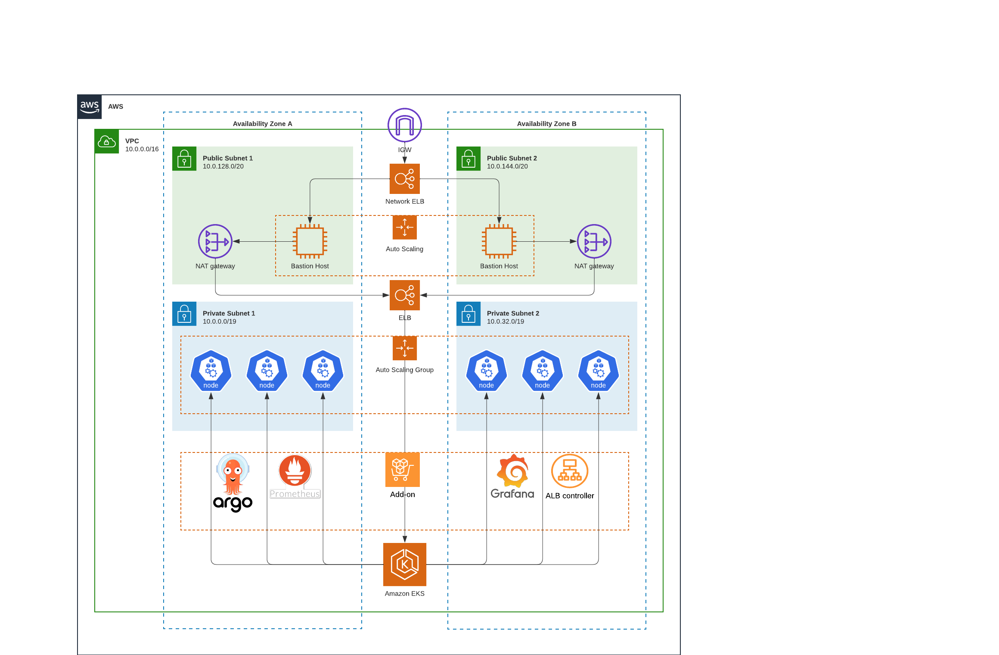

# [terraform-aws-arc-eks-addon](https://github.com/sourcefuse/terraform-aws-arc-eks-addon)

[](https://github.com/sourcefuse/terraform-aws-arc-eks-addon/actions/workflows/snyk.yaml)

## Overview

EKS Blueprints helps you compose complete EKS clusters that are fully bootstrapped with the operational software that is needed to deploy and operate workloads. With EKS Blueprints, you describe the configuration for the desired state of your EKS environment, such as the control plane, worker nodes, and Kubernetes add-ons, as an IaC blueprint. Once a blueprint is configured, you can use it to stamp out consistent environments across multiple AWS accounts and Regions using continuous deployment automation.

You can use EKS Blueprints to easily bootstrap an EKS cluster with Amazon EKS add-ons as well as a wide range of popular open-source add-ons, including Prometheus, Karpenter, Nginx, Traefik, AWS Load Balancer Controller, Fluent Bit, Keda, ArgoCD, and more. EKS Blueprints also helps you implement relevant security controls needed to operate workloads from multiple teams in the same cluster.


## Architecture



The module assumes that upstream dependencies, namely networking dependencies, are created upstream and the values are passed into this module via mechanisms such as Terraform data source queries. Similarly bations and related load balancers are shown as per best practices and has to be deployed separately from upstream module. The shown addons are example addons and may and may not be a fit for your architecture please enable them accordingly.

## Usage

**Note**: the example below is does not have a pinned version. Be sure to pin your version. Refer to the `example` folder for a working example version.

To checkout the Full example Please visit [example](https://github.com/sourcefuse/terraform-aws-arc-eks-addon/blob/main/examples/complete/main.tf)

```hcl
module "eks" {
  source                             = "git::https://github.com/sourcefuse/terraform-aws-arc-eks-addon?ref=v1.0.0"
  tags                               = module.tags.tags
  vpc_id                             = data.aws_vpc.vpc.id
  private_subnet_ids                 = data.aws_subnets.private.ids
  public_subnet_ids                  = data.aws_subnets.public.ids
  control_plane_subnet_ids           = concat(data.aws_subnets.private.ids, data.aws_subnets.public.ids)
  create_eks                         = var.create_eks
  cluster_timeouts                   = var.cluster_timeouts
  cluster_name                       = var.cluster_name
  cluster_version                    = var.cluster_version
  create_cluster_security_group      = var.create_cluster_security_group
  cluster_security_group_name        = var.cluster_security_group_name
  cluster_kms_key_arn                = var.cluster_kms_key_arn

  .............................................................
}
```
<!-- BEGINNING OF PRE-COMMIT-TERRAFORM DOCS HOOK -->
## Requirements

| Name | Version |
|------|---------|
| <a name="requirement_terraform"></a> [terraform](#requirement\_terraform) | >= 1.0 |
| <a name="requirement_aws"></a> [aws](#requirement\_aws) | >= 4.47 |
| <a name="requirement_bcrypt"></a> [bcrypt](#requirement\_bcrypt) | >= 0.1.2 |
| <a name="requirement_helm"></a> [helm](#requirement\_helm) | >= 2.8 |
| <a name="requirement_kubernetes"></a> [kubernetes](#requirement\_kubernetes) | >= 2.17 |
| <a name="requirement_random"></a> [random](#requirement\_random) | 3.3.2 |

## Providers

| Name | Version |
|------|---------|
| <a name="provider_aws"></a> [aws](#provider\_aws) | 5.4.0 |

## Modules

| Name | Source | Version |
|------|--------|---------|
| <a name="module_eks"></a> [eks](#module\_eks) | ./modules/eks | n/a |
| <a name="module_eks_blueprints_addons"></a> [eks\_blueprints\_addons](#module\_eks\_blueprints\_addons) | ./modules/eks-addons | n/a |

## Resources

| Name | Type |
|------|------|
| [aws_eks_cluster.cluster](https://registry.terraform.io/providers/hashicorp/aws/latest/docs/data-sources/eks_cluster) | data source |
| [aws_eks_cluster_auth.cluster](https://registry.terraform.io/providers/hashicorp/aws/latest/docs/data-sources/eks_cluster_auth) | data source |

## Inputs

| Name | Description | Type | Default | Required |
|------|-------------|------|---------|:--------:|
| <a name="input_argo_rollouts"></a> [argo\_rollouts](#input\_argo\_rollouts) | Argo Rollouts addon configuration values | `any` | `{}` | no |
| <a name="input_argo_workflows"></a> [argo\_workflows](#input\_argo\_workflows) | Argo Workflows addon configuration values | `any` | `{}` | no |
| <a name="input_argocd"></a> [argocd](#input\_argocd) | ArgoCD addon configuration values | `any` | `{}` | no |
| <a name="input_aws_cloudwatch_metrics"></a> [aws\_cloudwatch\_metrics](#input\_aws\_cloudwatch\_metrics) | Cloudwatch Metrics addon configuration values | `any` | `{}` | no |
| <a name="input_aws_efs_csi_driver"></a> [aws\_efs\_csi\_driver](#input\_aws\_efs\_csi\_driver) | EFS CSI Driver addon configuration values | `any` | `{}` | no |
| <a name="input_aws_for_fluentbit"></a> [aws\_for\_fluentbit](#input\_aws\_for\_fluentbit) | AWS Fluentbit add-on configurations | `any` | `{}` | no |
| <a name="input_aws_for_fluentbit_cw_log_group"></a> [aws\_for\_fluentbit\_cw\_log\_group](#input\_aws\_for\_fluentbit\_cw\_log\_group) | AWS Fluentbit CloudWatch Log Group configurations | `any` | `{}` | no |
| <a name="input_aws_fsx_csi_driver"></a> [aws\_fsx\_csi\_driver](#input\_aws\_fsx\_csi\_driver) | FSX CSI Driver addon configuration values | `any` | `{}` | no |
| <a name="input_aws_load_balancer_controller"></a> [aws\_load\_balancer\_controller](#input\_aws\_load\_balancer\_controller) | AWS Load Balancer Controller addon configuration values | `any` | `{}` | no |
| <a name="input_aws_node_termination_handler"></a> [aws\_node\_termination\_handler](#input\_aws\_node\_termination\_handler) | AWS Node Termination Handler addon configuration values | `any` | `{}` | no |
| <a name="input_aws_node_termination_handler_asg_arns"></a> [aws\_node\_termination\_handler\_asg\_arns](#input\_aws\_node\_termination\_handler\_asg\_arns) | List of Auto Scaling group ARNs that AWS Node Termination Handler will monitor for EC2 events | `list(string)` | `[]` | no |
| <a name="input_aws_node_termination_handler_sqs"></a> [aws\_node\_termination\_handler\_sqs](#input\_aws\_node\_termination\_handler\_sqs) | AWS Node Termination Handler SQS queue configuration values | `any` | `{}` | no |
| <a name="input_aws_privateca_issuer"></a> [aws\_privateca\_issuer](#input\_aws\_privateca\_issuer) | AWS PCA Issuer add-on configurations | `any` | `{}` | no |
| <a name="input_cert_manager"></a> [cert\_manager](#input\_cert\_manager) | cert-manager addon configuration values | `any` | `{}` | no |
| <a name="input_cert_manager_route53_hosted_zone_arns"></a> [cert\_manager\_route53\_hosted\_zone\_arns](#input\_cert\_manager\_route53\_hosted\_zone\_arns) | List of Route53 Hosted Zone ARNs that are used by cert-manager to create DNS records | `list(string)` | <pre>[<br>  "arn:aws:route53:::hostedzone/*"<br>]</pre> | no |
| <a name="input_cloudwatch_log_group_kms_key_id"></a> [cloudwatch\_log\_group\_kms\_key\_id](#input\_cloudwatch\_log\_group\_kms\_key\_id) | If a KMS Key ARN is set, this key will be used to encrypt the corresponding log group. Please be sure that the KMS Key has an appropriate key policy (https://docs.aws.amazon.com/AmazonCloudWatch/latest/logs/encrypt-log-data-kms.html) | `string` | `null` | no |
| <a name="input_cloudwatch_log_group_retention_in_days"></a> [cloudwatch\_log\_group\_retention\_in\_days](#input\_cloudwatch\_log\_group\_retention\_in\_days) | Number of days to retain log events. Default retention - 90 days | `number` | `90` | no |
| <a name="input_cluster_additional_security_group_ids"></a> [cluster\_additional\_security\_group\_ids](#input\_cluster\_additional\_security\_group\_ids) | List of additional, externally created security group IDs to attach to the cluster control plane | `list(string)` | `[]` | no |
| <a name="input_cluster_autoscaler"></a> [cluster\_autoscaler](#input\_cluster\_autoscaler) | Cluster Autoscaler addon configuration values | `any` | `{}` | no |
| <a name="input_cluster_enabled_log_types"></a> [cluster\_enabled\_log\_types](#input\_cluster\_enabled\_log\_types) | A list of the desired control plane logging to enable | `list(string)` | <pre>[<br>  "api",<br>  "audit",<br>  "authenticator",<br>  "controllerManager",<br>  "scheduler"<br>]</pre> | no |
| <a name="input_cluster_encryption_config"></a> [cluster\_encryption\_config](#input\_cluster\_encryption\_config) | Configuration block with encryption configuration for the cluster | <pre>list(object({<br>    provider_key_arn = string<br>    resources        = list(string)<br>  }))</pre> | `[]` | no |
| <a name="input_cluster_endpoint_private_access"></a> [cluster\_endpoint\_private\_access](#input\_cluster\_endpoint\_private\_access) | Indicates whether or not the EKS private API server endpoint is enabled. Default to EKS resource and it is false | `bool` | `false` | no |
| <a name="input_cluster_endpoint_public_access"></a> [cluster\_endpoint\_public\_access](#input\_cluster\_endpoint\_public\_access) | Indicates whether or not the EKS public API server endpoint is enabled. Default to EKS resource and it is true | `bool` | `true` | no |
| <a name="input_cluster_endpoint_public_access_cidrs"></a> [cluster\_endpoint\_public\_access\_cidrs](#input\_cluster\_endpoint\_public\_access\_cidrs) | List of CIDR blocks which can access the Amazon EKS public API server endpoint | `list(string)` | <pre>[<br>  "0.0.0.0/0"<br>]</pre> | no |
| <a name="input_cluster_identity_providers"></a> [cluster\_identity\_providers](#input\_cluster\_identity\_providers) | Map of cluster identity provider configurations to enable for the cluster. Note - this is different/separate from IRSA | `any` | `{}` | no |
| <a name="input_cluster_ip_family"></a> [cluster\_ip\_family](#input\_cluster\_ip\_family) | The IP family used to assign Kubernetes pod and service addresses. Valid values are `ipv4` (default) and `ipv6`. You can only specify an IP family when you create a cluster, changing this value will force a new cluster to be created | `string` | `"ipv4"` | no |
| <a name="input_cluster_name"></a> [cluster\_name](#input\_cluster\_name) | EKS Cluster Name | `string` | `""` | no |
| <a name="input_cluster_proportional_autoscaler"></a> [cluster\_proportional\_autoscaler](#input\_cluster\_proportional\_autoscaler) | Cluster Proportional Autoscaler add-on configurations | `any` | `{}` | no |
| <a name="input_cluster_security_group_additional_rules"></a> [cluster\_security\_group\_additional\_rules](#input\_cluster\_security\_group\_additional\_rules) | List of additional security group rules to add to the cluster security group created. Set `source_node_security_group = true` inside rules to set the `node_security_group` as source | `any` | `{}` | no |
| <a name="input_cluster_security_group_description"></a> [cluster\_security\_group\_description](#input\_cluster\_security\_group\_description) | Description of the cluster security group created | `string` | `"EKS cluster security group"` | no |
| <a name="input_cluster_security_group_id"></a> [cluster\_security\_group\_id](#input\_cluster\_security\_group\_id) | Security group to be used if creation of cluster security group is turned off | `string` | `""` | no |
| <a name="input_cluster_security_group_name"></a> [cluster\_security\_group\_name](#input\_cluster\_security\_group\_name) | Name to use on cluster security group created | `string` | `null` | no |
| <a name="input_cluster_security_group_tags"></a> [cluster\_security\_group\_tags](#input\_cluster\_security\_group\_tags) | A map of additional tags to add to the cluster security group created | `map(string)` | `{}` | no |
| <a name="input_cluster_security_group_use_name_prefix"></a> [cluster\_security\_group\_use\_name\_prefix](#input\_cluster\_security\_group\_use\_name\_prefix) | Determines whether cluster security group name (`cluster_security_group_name`) is used as a prefix | `bool` | `true` | no |
| <a name="input_cluster_service_ipv4_cidr"></a> [cluster\_service\_ipv4\_cidr](#input\_cluster\_service\_ipv4\_cidr) | The CIDR block to assign Kubernetes service IP addresses from. If you don't specify a block, Kubernetes assigns addresses from either the 10.100.0.0/16 or 172.20.0.0/16 CIDR blocks | `string` | `null` | no |
| <a name="input_cluster_timeouts"></a> [cluster\_timeouts](#input\_cluster\_timeouts) | Create, update, and delete timeout configurations for the cluster | `map(string)` | `{}` | no |
| <a name="input_cluster_version"></a> [cluster\_version](#input\_cluster\_version) | Kubernetes `<major>.<minor>` version to use for the EKS cluster (i.e.: `1.24`) | `string` | `"1.24"` | no |
| <a name="input_control_plane_subnet_ids"></a> [control\_plane\_subnet\_ids](#input\_control\_plane\_subnet\_ids) | A list of subnet IDs where the EKS cluster control plane (ENIs) will be provisioned. Used for expanding the pool of subnets used by nodes/node groups without replacing the EKS control plane | `list(string)` | `[]` | no |
| <a name="input_create_cloudwatch_log_group"></a> [create\_cloudwatch\_log\_group](#input\_create\_cloudwatch\_log\_group) | Determines whether a log group is created by this module for the cluster logs. If not, AWS will automatically create one if logging is enabled | `bool` | `false` | no |
| <a name="input_create_cluster_primary_security_group_tags"></a> [create\_cluster\_primary\_security\_group\_tags](#input\_create\_cluster\_primary\_security\_group\_tags) | Indicates whether or not to tag the cluster's primary security group. This security group is created by the EKS service, not the module, and therefore tagging is handled after cluster creation | `bool` | `true` | no |
| <a name="input_create_cluster_security_group"></a> [create\_cluster\_security\_group](#input\_create\_cluster\_security\_group) | Toggle to create or assign cluster security group | `bool` | `true` | no |
| <a name="input_create_eks"></a> [create\_eks](#input\_create\_eks) | Create EKS cluster | `bool` | `true` | no |
| <a name="input_create_iam_role"></a> [create\_iam\_role](#input\_create\_iam\_role) | Determines whether a an IAM role is created or to use an existing IAM role | `bool` | `true` | no |
| <a name="input_create_node_security_group"></a> [create\_node\_security\_group](#input\_create\_node\_security\_group) | Determines whether to create a security group for the node groups or use the existing `node_security_group_id` | `bool` | `true` | no |
| <a name="input_custom_oidc_thumbprints"></a> [custom\_oidc\_thumbprints](#input\_custom\_oidc\_thumbprints) | Additional list of server certificate thumbprints for the OpenID Connect (OIDC) identity provider's server certificate(s) | `list(string)` | `[]` | no |
| <a name="input_eks_addons_timeouts"></a> [eks\_addons\_timeouts](#input\_eks\_addons\_timeouts) | Create, update, and delete timeout configurations for the EKS addons | `map(string)` | `{}` | no |
| <a name="input_enable_argo_rollouts"></a> [enable\_argo\_rollouts](#input\_enable\_argo\_rollouts) | Enable Argo Rollouts add-on | `bool` | `false` | no |
| <a name="input_enable_argo_workflows"></a> [enable\_argo\_workflows](#input\_enable\_argo\_workflows) | Enable Argo workflows add-on | `bool` | `false` | no |
| <a name="input_enable_argocd"></a> [enable\_argocd](#input\_enable\_argocd) | Enable Argo CD Kubernetes add-on | `bool` | `false` | no |
| <a name="input_enable_aws_cloudwatch_metrics"></a> [enable\_aws\_cloudwatch\_metrics](#input\_enable\_aws\_cloudwatch\_metrics) | Enable AWS Cloudwatch Metrics add-on for Container Insights | `bool` | `false` | no |
| <a name="input_enable_aws_efs_csi_driver"></a> [enable\_aws\_efs\_csi\_driver](#input\_enable\_aws\_efs\_csi\_driver) | Enable AWS EFS CSI Driver add-on | `bool` | `false` | no |
| <a name="input_enable_aws_for_fluentbit"></a> [enable\_aws\_for\_fluentbit](#input\_enable\_aws\_for\_fluentbit) | Enable AWS for FluentBit add-on | `bool` | `false` | no |
| <a name="input_enable_aws_fsx_csi_driver"></a> [enable\_aws\_fsx\_csi\_driver](#input\_enable\_aws\_fsx\_csi\_driver) | Enable AWS FSX CSI Driver add-on | `bool` | `false` | no |
| <a name="input_enable_aws_load_balancer_controller"></a> [enable\_aws\_load\_balancer\_controller](#input\_enable\_aws\_load\_balancer\_controller) | Enable AWS Load Balancer Controller add-on | `bool` | `false` | no |
| <a name="input_enable_aws_node_termination_handler"></a> [enable\_aws\_node\_termination\_handler](#input\_enable\_aws\_node\_termination\_handler) | Enable AWS Node Termination Handler add-on | `bool` | `false` | no |
| <a name="input_enable_aws_privateca_issuer"></a> [enable\_aws\_privateca\_issuer](#input\_enable\_aws\_privateca\_issuer) | Enable AWS PCA Issuer | `bool` | `false` | no |
| <a name="input_enable_cert_manager"></a> [enable\_cert\_manager](#input\_enable\_cert\_manager) | Enable cert-manager add-on | `bool` | `false` | no |
| <a name="input_enable_cluster_autoscaler"></a> [enable\_cluster\_autoscaler](#input\_enable\_cluster\_autoscaler) | Enable Cluster autoscaler add-on | `bool` | `false` | no |
| <a name="input_enable_cluster_encryption"></a> [enable\_cluster\_encryption](#input\_enable\_cluster\_encryption) | Determines whether cluster encryption is enabled | `bool` | `true` | no |
| <a name="input_enable_cluster_proportional_autoscaler"></a> [enable\_cluster\_proportional\_autoscaler](#input\_enable\_cluster\_proportional\_autoscaler) | Enable Cluster Proportional Autoscaler | `bool` | `false` | no |
| <a name="input_enable_external_dns"></a> [enable\_external\_dns](#input\_enable\_external\_dns) | Enable external-dns operator add-on | `bool` | `false` | no |
| <a name="input_enable_external_secrets"></a> [enable\_external\_secrets](#input\_enable\_external\_secrets) | Enable External Secrets operator add-on | `bool` | `false` | no |
| <a name="input_enable_fargate_fluentbit"></a> [enable\_fargate\_fluentbit](#input\_enable\_fargate\_fluentbit) | Enable Fargate FluentBit add-on | `bool` | `false` | no |
| <a name="input_enable_gatekeeper"></a> [enable\_gatekeeper](#input\_enable\_gatekeeper) | Enable Gatekeeper add-on | `bool` | `false` | no |
| <a name="input_enable_ingress_nginx"></a> [enable\_ingress\_nginx](#input\_enable\_ingress\_nginx) | Enable Ingress Nginx | `bool` | `false` | no |
| <a name="input_enable_irsa"></a> [enable\_irsa](#input\_enable\_irsa) | Determines whether to create an OpenID Connect Provider for EKS to enable IRSA | `bool` | `true` | no |
| <a name="input_enable_karpenter"></a> [enable\_karpenter](#input\_enable\_karpenter) | Enable Karpenter controller add-on | `bool` | `false` | no |
| <a name="input_enable_kube_prometheus_stack"></a> [enable\_kube\_prometheus\_stack](#input\_enable\_kube\_prometheus\_stack) | Enable Kube Prometheus Stack | `bool` | `false` | no |
| <a name="input_enable_metrics_server"></a> [enable\_metrics\_server](#input\_enable\_metrics\_server) | Enable metrics server add-on | `bool` | `false` | no |
| <a name="input_enable_secrets_store_csi_driver"></a> [enable\_secrets\_store\_csi\_driver](#input\_enable\_secrets\_store\_csi\_driver) | Enable CSI Secrets Store Provider | `bool` | `false` | no |
| <a name="input_enable_secrets_store_csi_driver_provider_aws"></a> [enable\_secrets\_store\_csi\_driver\_provider\_aws](#input\_enable\_secrets\_store\_csi\_driver\_provider\_aws) | Enable AWS CSI Secrets Store Provider | `bool` | `false` | no |
| <a name="input_enable_velero"></a> [enable\_velero](#input\_enable\_velero) | Enable Kubernetes Dashboard add-on | `bool` | `false` | no |
| <a name="input_enable_vpa"></a> [enable\_vpa](#input\_enable\_vpa) | Enable Vertical Pod Autoscaler add-on | `bool` | `false` | no |
| <a name="input_external_dns"></a> [external\_dns](#input\_external\_dns) | external-dns addon configuration values | `any` | `{}` | no |
| <a name="input_external_dns_route53_zone_arns"></a> [external\_dns\_route53\_zone\_arns](#input\_external\_dns\_route53\_zone\_arns) | List of Route53 zones ARNs which external-dns will have access to create/manage records (if using Route53) | `list(string)` | `[]` | no |
| <a name="input_external_secrets"></a> [external\_secrets](#input\_external\_secrets) | External Secrets addon configuration values | `any` | `{}` | no |
| <a name="input_external_secrets_kms_key_arns"></a> [external\_secrets\_kms\_key\_arns](#input\_external\_secrets\_kms\_key\_arns) | List of KMS Key ARNs that are used by Secrets Manager that contain secrets to mount using External Secrets | `list(string)` | <pre>[<br>  "arn:aws:kms:*:*:key/*"<br>]</pre> | no |
| <a name="input_external_secrets_secrets_manager_arns"></a> [external\_secrets\_secrets\_manager\_arns](#input\_external\_secrets\_secrets\_manager\_arns) | List of Secrets Manager ARNs that contain secrets to mount using External Secrets | `list(string)` | <pre>[<br>  "arn:aws:secretsmanager:*:*:secret:*"<br>]</pre> | no |
| <a name="input_external_secrets_ssm_parameter_arns"></a> [external\_secrets\_ssm\_parameter\_arns](#input\_external\_secrets\_ssm\_parameter\_arns) | List of Systems Manager Parameter ARNs that contain secrets to mount using External Secrets | `list(string)` | <pre>[<br>  "arn:aws:ssm:*:*:parameter/*"<br>]</pre> | no |
| <a name="input_fargate_fluentbit"></a> [fargate\_fluentbit](#input\_fargate\_fluentbit) | Fargate fluentbit add-on config | `any` | `{}` | no |
| <a name="input_fargate_fluentbit_cw_log_group"></a> [fargate\_fluentbit\_cw\_log\_group](#input\_fargate\_fluentbit\_cw\_log\_group) | AWS Fargate Fluentbit CloudWatch Log Group configurations | `any` | `{}` | no |
| <a name="input_fargate_profiles"></a> [fargate\_profiles](#input\_fargate\_profiles) | Fargate profile configuration | `any` | `{}` | no |
| <a name="input_gatekeeper"></a> [gatekeeper](#input\_gatekeeper) | Gatekeeper add-on configuration | `any` | `{}` | no |
| <a name="input_iam_role_additional_policies"></a> [iam\_role\_additional\_policies](#input\_iam\_role\_additional\_policies) | Additional policies to be added to the IAM role | `list(string)` | `[]` | no |
| <a name="input_iam_role_arn"></a> [iam\_role\_arn](#input\_iam\_role\_arn) | Existing IAM role ARN for the cluster. Required if `create_iam_role` is set to `false` | `string` | `null` | no |
| <a name="input_iam_role_description"></a> [iam\_role\_description](#input\_iam\_role\_description) | Description of the role | `string` | `null` | no |
| <a name="input_iam_role_name"></a> [iam\_role\_name](#input\_iam\_role\_name) | Name to use on IAM role created | `string` | `null` | no |
| <a name="input_iam_role_path"></a> [iam\_role\_path](#input\_iam\_role\_path) | Cluster IAM role path | `string` | `null` | no |
| <a name="input_iam_role_permissions_boundary"></a> [iam\_role\_permissions\_boundary](#input\_iam\_role\_permissions\_boundary) | ARN of the policy that is used to set the permissions boundary for the IAM role | `string` | `null` | no |
| <a name="input_ingress_nginx"></a> [ingress\_nginx](#input\_ingress\_nginx) | Ingress Nginx add-on configurations | `any` | `{}` | no |
| <a name="input_karpenter"></a> [karpenter](#input\_karpenter) | Karpenter addon configuration values | `any` | `{}` | no |
| <a name="input_karpenter_enable_spot_termination"></a> [karpenter\_enable\_spot\_termination](#input\_karpenter\_enable\_spot\_termination) | Determines whether to enable native node termination handling | `bool` | `true` | no |
| <a name="input_karpenter_node"></a> [karpenter\_node](#input\_karpenter\_node) | Karpenter IAM role and IAM instance profile configuration values | `any` | `{}` | no |
| <a name="input_karpenter_sqs"></a> [karpenter\_sqs](#input\_karpenter\_sqs) | Karpenter SQS queue for native node termination handling configuration values | `any` | `{}` | no |
| <a name="input_kube_prometheus_stack"></a> [kube\_prometheus\_stack](#input\_kube\_prometheus\_stack) | Kube Prometheus Stack add-on configurations | `any` | `{}` | no |
| <a name="input_managed_node_groups"></a> [managed\_node\_groups](#input\_managed\_node\_groups) | Managed node groups configuration | `any` | `{}` | no |
| <a name="input_metrics_server"></a> [metrics\_server](#input\_metrics\_server) | Metrics Server add-on configurations | `any` | `{}` | no |
| <a name="input_node_security_group_additional_rules"></a> [node\_security\_group\_additional\_rules](#input\_node\_security\_group\_additional\_rules) | List of additional security group rules to add to the node security group created. Set `source_cluster_security_group = true` inside rules to set the `cluster_security_group` as source | `any` | `{}` | no |
| <a name="input_node_security_group_description"></a> [node\_security\_group\_description](#input\_node\_security\_group\_description) | Description of the node security group created | `string` | `"EKS node shared security group"` | no |
| <a name="input_node_security_group_name"></a> [node\_security\_group\_name](#input\_node\_security\_group\_name) | Name to use on node security group created | `string` | `null` | no |
| <a name="input_node_security_group_tags"></a> [node\_security\_group\_tags](#input\_node\_security\_group\_tags) | A map of additional tags to add to the node security group created | `map(string)` | `{}` | no |
| <a name="input_node_security_group_use_name_prefix"></a> [node\_security\_group\_use\_name\_prefix](#input\_node\_security\_group\_use\_name\_prefix) | Determines whether node security group name (`node_security_group_name`) is used as a prefix | `bool` | `true` | no |
| <a name="input_openid_connect_audiences"></a> [openid\_connect\_audiences](#input\_openid\_connect\_audiences) | List of OpenID Connect audience client IDs to add to the IRSA provider | `list(string)` | `[]` | no |
| <a name="input_private_subnet_ids"></a> [private\_subnet\_ids](#input\_private\_subnet\_ids) | List of private subnets Ids for the cluster and worker nodes | `list(string)` | `[]` | no |
| <a name="input_secrets_store_csi_driver"></a> [secrets\_store\_csi\_driver](#input\_secrets\_store\_csi\_driver) | CSI Secrets Store Provider add-on configurations | `any` | `{}` | no |
| <a name="input_secrets_store_csi_driver_provider_aws"></a> [secrets\_store\_csi\_driver\_provider\_aws](#input\_secrets\_store\_csi\_driver\_provider\_aws) | CSI Secrets Store Provider add-on configurations | `any` | `{}` | no |
| <a name="input_self_managed_node_groups"></a> [self\_managed\_node\_groups](#input\_self\_managed\_node\_groups) | Self-managed node groups configuration | `any` | `{}` | no |
| <a name="input_tags"></a> [tags](#input\_tags) | Additional tags (e.g. `map('BusinessUnit`,`XYZ`) | `map(string)` | `{}` | no |
| <a name="input_velero"></a> [velero](#input\_velero) | Velero addon configuration values | `any` | `{}` | no |
| <a name="input_vpa"></a> [vpa](#input\_vpa) | Vertical Pod Autoscaler addon configuration values | `any` | `{}` | no |
| <a name="input_vpc_id"></a> [vpc\_id](#input\_vpc\_id) | VPC Id | `string` | n/a | yes |

## Outputs

| Name | Description |
|------|-------------|
| <a name="output_cluster_endpoint"></a> [cluster\_endpoint](#output\_cluster\_endpoint) | The endpoint of the EKS cluster |
| <a name="output_cluster_id"></a> [cluster\_id](#output\_cluster\_id) | The name/id of the EKS cluster |
| <a name="output_cluster_version"></a> [cluster\_version](#output\_cluster\_version) | The version of the EKS cluster |
| <a name="output_oidc_provider_arn"></a> [oidc\_provider\_arn](#output\_oidc\_provider\_arn) | The oidc arn the EKS cluster |
<!-- END OF PRE-COMMIT-TERRAFORM DOCS HOOK -->

## Versioning

This project uses a `.version` file at the root of the repo which the pipeline reads from and does a git tag.

When you intend to commit to `main`, you will need to increment this version. Once the project is merged,
the pipeline will kick off and tag the latest git commit.

## Development

### Prerequisites

- [terraform](https://learn.hashicorp.com/terraform/getting-started/install#installing-terraform)
- [terraform-docs](https://github.com/segmentio/terraform-docs)
- [pre-commit](https://pre-commit.com/#install)

### Configurations

- Configure pre-commit hooks
```sh
pre-commit install
```

## Authors

This project is authored by below people

- SourceFuse ARC Team
