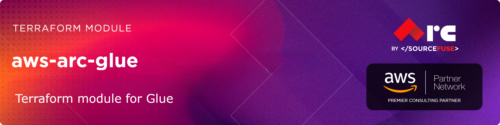

# [terraform-aws-arc-glue](https://github.com/sourcefuse/terraform-aws-arc-glue)

<a href="https://github.com/sourcefuse/terraform-aws-arc-glue/releases/latest"></a> <a href="https://github.com/sourcefuse/terraform-aws-arc-glue/commits"></a>  

[](https://sonarcloud.io/summary/new_code?id=sourcefuse_terraform-aws-arc-glue2)

---
## Overview

SourceFuse AWS Reference Architecture (ARC) Terraform module for managing AWS Glue resources, providing a comprehensive, production-ready solution for deploying data catalog, ETL jobs, crawlers, workflows, and related components with enterprise-grade security and operational best practices.

## Module Features

This module provides a complete AWS Glue infrastructure including:

- **Data Catalog Management**: Automated database and table creation with cross-account access policies
- **ETL Job Orchestration**: Support for Spark, Python Shell, and Ray jobs with configurable worker types
- **Data Discovery**: Multi-source crawlers (S3, JDBC, MongoDB, Delta Lake) with scheduling
- **Workflow Automation**: Complex workflow orchestration with triggers and dependencies
- **Security & Compliance**: KMS encryption, IAM role management, VPC integration, and secret management
- **Enterprise Integration**: JDBC connections for RDS/Redshift, MongoDB, and other data sources
- **Monitoring & Logging**: CloudWatch integration, job bookmarks, and execution tracking

## Usage

To see a full example, check out the [complete example](./example/complete/main.tf) or [simple example](./example/simple/main.tf) files in the example folder.

```hcl
module "glue" {
  source = "sourcefuse/arc-glue/aws"

  namespace   = "mycompany"
  environment = "prod"
  name        = "data-lake"
  region      = "us-east-1"

  glue_config = {
    database = {
      create = true
      name   = "enterprise_database"
    }

    crawlers = {
      "s3-data-lake" = {
        database_name = "enterprise_database"
        role_arn      = aws_iam_role.glue.arn
        targets = {
          s3_targets = [{
            path = "s3://my-data-bucket/raw/"
          }]
        }
        schedule = "cron(0 2 * * ? *)"  # Daily at 2 AM
      }
    }

    jobs = {
      "transform-job" = {
        role_arn     = aws_iam_role.glue.arn
        glue_version = "4.0"
        command = {
          name    = "glueetl"
          script  = "s3://my-scripts/transform.py"
        }
        worker_type    = "G.2X"
        number_of_workers = 10
      }
    }
  }

  tags = {
    Project     = "Data Lake"
    CostCenter  = "Analytics"
    Compliance  = "HIPAA"
  }
}
```
<!-- BEGINNING OF PRE-COMMIT-TERRAFORM DOCS HOOK -->
## Requirements

| Name | Version |
|------|---------|
| <a name="requirement_terraform"></a> [terraform](#requirement\_terraform) | >= 1.5.0 |
| <a name="requirement_aws"></a> [aws](#requirement\_aws) | >= 5.0, < 7.0 |

## Providers

| Name | Version |
|------|---------|
| <a name="provider_aws"></a> [aws](#provider\_aws) | 6.40.0 |

## Modules

No modules.

## Resources

| Name | Type |
|------|------|
| [aws_glue_catalog_database.main](https://registry.terraform.io/providers/hashicorp/aws/latest/docs/resources/glue_catalog_database) | resource |
| [aws_glue_classifier.csv](https://registry.terraform.io/providers/hashicorp/aws/latest/docs/resources/glue_classifier) | resource |
| [aws_glue_classifier.grok](https://registry.terraform.io/providers/hashicorp/aws/latest/docs/resources/glue_classifier) | resource |
| [aws_glue_classifier.json](https://registry.terraform.io/providers/hashicorp/aws/latest/docs/resources/glue_classifier) | resource |
| [aws_glue_classifier.xml](https://registry.terraform.io/providers/hashicorp/aws/latest/docs/resources/glue_classifier) | resource |
| [aws_glue_connection.main](https://registry.terraform.io/providers/hashicorp/aws/latest/docs/resources/glue_connection) | resource |
| [aws_glue_crawler.main](https://registry.terraform.io/providers/hashicorp/aws/latest/docs/resources/glue_crawler) | resource |
| [aws_glue_job.main](https://registry.terraform.io/providers/hashicorp/aws/latest/docs/resources/glue_job) | resource |
| [aws_glue_security_configuration.main](https://registry.terraform.io/providers/hashicorp/aws/latest/docs/resources/glue_security_configuration) | resource |
| [aws_glue_trigger.main](https://registry.terraform.io/providers/hashicorp/aws/latest/docs/resources/glue_trigger) | resource |
| [aws_glue_workflow.main](https://registry.terraform.io/providers/hashicorp/aws/latest/docs/resources/glue_workflow) | resource |
| [aws_iam_role.glue](https://registry.terraform.io/providers/hashicorp/aws/latest/docs/resources/iam_role) | resource |
| [aws_iam_role_policy_attachment.glue_basic](https://registry.terraform.io/providers/hashicorp/aws/latest/docs/resources/iam_role_policy_attachment) | resource |
| [aws_iam_role_policy_attachment.glue_custom](https://registry.terraform.io/providers/hashicorp/aws/latest/docs/resources/iam_role_policy_attachment) | resource |
| [aws_iam_role_policy_attachment.glue_s3](https://registry.terraform.io/providers/hashicorp/aws/latest/docs/resources/iam_role_policy_attachment) | resource |
| [aws_secretsmanager_secret.main](https://registry.terraform.io/providers/hashicorp/aws/latest/docs/resources/secretsmanager_secret) | resource |
| [aws_secretsmanager_secret_version.main](https://registry.terraform.io/providers/hashicorp/aws/latest/docs/resources/secretsmanager_secret_version) | resource |
| [aws_caller_identity.current](https://registry.terraform.io/providers/hashicorp/aws/latest/docs/data-sources/caller_identity) | data source |
| [aws_iam_policy_document.assume_role](https://registry.terraform.io/providers/hashicorp/aws/latest/docs/data-sources/iam_policy_document) | data source |

## Inputs

| Name | Description | Type | Default | Required |
|------|-------------|------|---------|:--------:|
| <a name="input_environment"></a> [environment](#input\_environment) | Environment identifier (e.g., dev, staging, prod) | `string` | n/a | yes |
| <a name="input_glue_config"></a> [glue\_config](#input\_glue\_config) | AWS Glue configuration | <pre>object({<br/>    create = optional(bool, true)<br/><br/>    # Glue Catalog Database<br/>    database = optional(object({<br/>      create      = optional(bool, true)<br/>      name        = optional(string, "default_database")<br/>      description = optional(string, "Default Glue database")<br/>      create_table_default_permission = optional(object({<br/>        create = optional(bool, false)<br/>        permissions = optional(list(object({<br/>          principal   = map(string)<br/>          permissions = list(string)<br/>        })), [])<br/>      }), {})<br/>    }), {})<br/><br/>    # Glue Workflows<br/>    workflows = optional(map(object({<br/>      description         = optional(string, "")<br/>      max_concurrent_runs = optional(number, null)<br/>    })), {})<br/><br/>    # Glue Triggers<br/>    triggers = optional(map(object({<br/>      description   = optional(string, "")<br/>      workflow_name = optional(string, null)<br/>      type          = string # SCHEDULED, CONDITIONAL, EVENT_DATA, ON_DEMAND<br/>      schedule      = optional(string, null)<br/>      predicate = optional(object({<br/>        logical = optional(string, "AND")<br/>        conditions = list(object({<br/>          job_name     = optional(string, null)<br/>          crawler_name = optional(string, null)<br/>          state        = optional(string, null)<br/>          crawl_state  = optional(string, null)<br/>        }))<br/>      }), null)<br/>      actions = list(object({<br/>        job_name     = optional(string, null)<br/>        arguments    = optional(map(string), null)<br/>        timeout      = optional(number, null)<br/>        crawler_name = optional(string, null)<br/>      }))<br/>      event_batching_condition = optional(object({<br/>        batch_window = optional(number, null)<br/>        batch_size   = optional(number, null)<br/>      }), null)<br/>    })), {})<br/><br/>    # Glue Classifiers<br/>    classifiers = optional(map(object({<br/>      grok_classifier = optional(object({<br/>        name            = string<br/>        classification  = string<br/>        grok_pattern    = string<br/>        custom_patterns = optional(map(string), {})<br/>      }), null)<br/>      json_classifier = optional(object({<br/>        name      = string<br/>        json_path = string<br/>      }), null)<br/>      xml_classifier = optional(object({<br/>        name           = string<br/>        classification = string<br/>        row_tag        = string<br/>      }), null)<br/>      csv_classifier = optional(object({<br/>        name                   = string<br/>        delimiter              = optional(string, ",")<br/>        quote_char             = optional(string, "\"")<br/>        contains_header        = optional(string, "UNKNOWN") # PRESENT, ABSENT, UNKNOWN<br/>        header                 = optional(list(string), [])<br/>        disable_value_trimming = optional(bool, false)<br/>        allow_single_quotes    = optional(bool, false)<br/>      }), null)<br/>    })), {})<br/><br/>    # Glue Dev Endpoints<br/>    dev_endpoints = optional(map(object({<br/>      description               = optional(string, "")<br/>      role_arn                  = optional(string, null)<br/>      public_key                = string<br/>      number_of_nodes           = optional(number, 5)<br/>      worker_type               = optional(string, "G.1X") # Standard, G.1X, G.2X<br/>      glue_version              = optional(string, "2.0")<br/>      number_of_workers         = optional(number, 2)<br/>      extra_python_libs_s3_path = optional(string, null)<br/>      extra_jars_s3_path        = optional(string, null)<br/>      security_configuration    = optional(string, null)<br/>    })), {})<br/><br/>    # Glue Security Configurations<br/>    security_configurations = optional(map(object({<br/>      encryption_configuration = object({<br/>        s3_encryption = optional(object({<br/>          s3_encryption_mode = optional(string, "SSE-KMS") # SSE-KMS, SSE-S3, DISABLED<br/>          kms_key_arn        = optional(string, null)<br/>        }), {})<br/>        cloudwatch_encryption = optional(object({<br/>          cloudwatch_encryption_mode = optional(string, "SSE-KMS") # SSE-KMS, DISABLED<br/>          kms_key_arn                = optional(string, null)<br/>        }), {})<br/>        job_bookmarks_encryption = optional(object({<br/>          job_bookmarks_encryption_mode = optional(string, "CSE-KMS") # CSE-KMS, DISABLED<br/>          kms_key_arn                   = optional(string, null)<br/>        }), {})<br/>      })<br/>    })), {})<br/><br/>    # Data Catalog Encryption Settings<br/>    catalog_encryption_settings = optional(object({<br/>      create                         = optional(bool, false)<br/>      connection_password_encryption = optional(bool, true)<br/>      at_rest_encryption = optional(object({<br/>        catalog_encryption_mode = optional(string, "SSE-KMS") # SSE-KMS, SSE-KMS-DIRECT-QUERY, DISABLED<br/>        kms_key_arn             = optional(string, null)<br/>      }), {})<br/>      s3_encryption = optional(object({<br/>        s3_encryption_mode = optional(string, "SSE-KMS") # SSE-KMS, SSE-S3, DISABLED<br/>        kms_key_arn        = optional(string, null)<br/>      }), {})<br/>    }), {})<br/><br/>    # Data Catalog Resource Policy<br/>    catalog_resource_policy = optional(object({<br/>      create      = optional(bool, false)<br/>      policy      = optional(string, "")<br/>      description = optional(string, "Glue Data Catalog Resource Policy")<br/>    }), {})<br/><br/>    # Glue Partition Index<br/>    partition_indexes = optional(map(object({<br/>      database_name = string<br/>      table_name    = string<br/>      index_name    = string<br/>      keys          = list(string)<br/>    })), {})<br/>  })</pre> | `{}` | no |
| <a name="input_glue_connections"></a> [glue\_connections](#input\_glue\_connections) | Glue connections to create. Kept separate from glue\_config to avoid for\_each unknown value issues when connection\_properties contain apply-time values. | <pre>map(object({<br/>    connection_type       = string<br/>    description           = optional(string, "")<br/>    connection_properties = map(string)<br/>    physical_connection_requirements = optional(object({<br/>      availability_zone      = optional(string, null)<br/>      subnet_id              = optional(string, null)<br/>      security_group_id_list = optional(list(string), [])<br/>    }), null)<br/>  }))</pre> | `{}` | no |
| <a name="input_glue_crawlers"></a> [glue\_crawlers](#input\_glue\_crawlers) | Glue crawlers. Kept separate from glue\_config to avoid for\_each unknown-value issues when targets contain apply-time values. | <pre>map(object({<br/>    database_name = string<br/>    description   = optional(string, "")<br/>    role_arn      = optional(string, null)<br/>    schedule      = optional(string, null)<br/>    classifiers   = optional(list(string), [])<br/>    configuration = optional(string, null)<br/>    table_prefix  = optional(string, "")<br/>    schema_change_policy = optional(object({<br/>      delete_behavior = optional(string, "LOG")<br/>      update_behavior = optional(string, "UPDATE_IN_DATABASE")<br/>    }), {})<br/>    recrawl_policy = optional(object({<br/>      recrawl_behavior = optional(string, "CRAWL_NEW_FOLDERS_ONLY")<br/>    }), {})<br/>    lineage_configuration = optional(object({<br/>      crawler_lineage_settings = optional(string, "ENABLE")<br/>    }), {})<br/>    targets = object({<br/>      s3_targets = optional(list(object({<br/>        path                = string<br/>        exclusions          = optional(list(string), [])<br/>        connection_name     = optional(string, null)<br/>        sample_size         = optional(number, null)<br/>        event_queue_arn     = optional(string, null)<br/>        dlq_event_queue_arn = optional(string, null)<br/>      })), [])<br/>      jdbc_targets = optional(list(object({<br/>        connection_name = string<br/>        path            = optional(string, null)<br/>        exclusions      = optional(list(string), [])<br/>      })), [])<br/>      mongo_db_targets = optional(list(object({<br/>        connection_name = string<br/>        path            = optional(string, null)<br/>        scan_all        = optional(bool, null)<br/>      })), [])<br/>      delta_targets = optional(list(object({<br/>        connection_name = optional(string, null)<br/>        delta_tables    = optional(list(string), [])<br/>        write_manifest  = optional(bool, null)<br/>      })), [])<br/>      catalog_targets = optional(list(object({<br/>        database_name       = string<br/>        tables              = list(string)<br/>        event_queue_arn     = optional(string, null)<br/>        dlq_event_queue_arn = optional(string, null)<br/>      })), [])<br/>    })<br/>  }))</pre> | `{}` | no |
| <a name="input_glue_jobs"></a> [glue\_jobs](#input\_glue\_jobs) | Glue jobs. Kept separate from glue\_config to avoid for\_each unknown-value issues when script\_location contains apply-time values. | <pre>map(object({<br/>    description = optional(string, "")<br/>    role_arn    = optional(string, null)<br/>    command = object({<br/>      name            = string<br/>      script_location = string<br/>      python_version  = optional(string, "3")<br/>      runtime         = optional(string, null)<br/>    })<br/>    default_arguments         = optional(map(string), {})<br/>    non_overridable_arguments = optional(map(string), {})<br/>    execution_property = optional(object({<br/>      max_concurrent_runs = optional(number, 1)<br/>    }), {})<br/>    max_retries       = optional(number, 0)<br/>    timeout           = optional(number, null)<br/>    max_capacity      = optional(number, null)<br/>    number_of_workers = optional(number, null)<br/>    worker_type       = optional(string, null)<br/>    glue_version      = optional(string, "4.0")<br/>    execution_class   = optional(string, null)<br/>  }))</pre> | `{}` | no |
| <a name="input_iam_config"></a> [iam\_config](#input\_iam\_config) | IAM configuration for Glue resources | <pre>object({<br/>    create_role            = optional(bool, true)<br/>    role_name              = optional(string, null)<br/>    role_description       = optional(string, "AWS Glue IAM Role")<br/>    role_policies          = optional(map(string), {}) # Map of policy names to policy ARNs<br/>    create_custom_policy   = optional(bool, false)<br/>    custom_policy_name     = optional(string, null)<br/>    custom_policy_document = optional(string, null)<br/>    permissions_boundary   = optional(string, null)<br/>    trusted_role_arns      = optional(list(string), [])<br/>  })</pre> | `{}` | no |
| <a name="input_kms_key_arn"></a> [kms\_key\_arn](#input\_kms\_key\_arn) | Optional KMS key ARN to use for Glue encryption. If not provided, module will create its own KMS key but won't use it for security configurations to avoid circular dependencies. | `string` | `null` | no |
| <a name="input_name"></a> [name](#input\_name) | Name prefix for AWS Glue resources | `string` | n/a | yes |
| <a name="input_namespace"></a> [namespace](#input\_namespace) | Namespace (organization) identifier for resources | `string` | n/a | yes |
| <a name="input_region"></a> [region](#input\_region) | AWS region where resources will be created | `string` | `"us-east-1"` | no |
| <a name="input_secrets_config"></a> [secrets\_config](#input\_secrets\_config) | Secrets Manager configuration for storing credentials | <pre>object({<br/>    secrets = optional(map(object({<br/>      name          = optional(string, null)<br/>      description   = optional(string, "")<br/>      secret_string = optional(string, null)<br/>    })), {})<br/>  })</pre> | `{}` | no |
| <a name="input_tags"></a> [tags](#input\_tags) | Default tags to apply to all resources | `map(string)` | `{}` | no |

## Outputs

| Name | Description |
|------|-------------|
| <a name="output_aws_account_id"></a> [aws\_account\_id](#output\_aws\_account\_id) | The AWS account ID where resources are created |
| <a name="output_glue_connection_names"></a> [glue\_connection\_names](#output\_glue\_connection\_names) | Map of connection key to name |
| <a name="output_glue_crawler_arns"></a> [glue\_crawler\_arns](#output\_glue\_crawler\_arns) | Map of crawler name to ARN |
| <a name="output_glue_crawler_names"></a> [glue\_crawler\_names](#output\_glue\_crawler\_names) | Map of crawler key to name |
| <a name="output_glue_database_arn"></a> [glue\_database\_arn](#output\_glue\_database\_arn) | The ARN of the Glue catalog database |
| <a name="output_glue_database_id"></a> [glue\_database\_id](#output\_glue\_database\_id) | The ID of the Glue catalog database |
| <a name="output_glue_database_name"></a> [glue\_database\_name](#output\_glue\_database\_name) | The name of the Glue catalog database |
| <a name="output_glue_iam_role_arn"></a> [glue\_iam\_role\_arn](#output\_glue\_iam\_role\_arn) | The ARN of the Glue IAM role |
| <a name="output_glue_iam_role_id"></a> [glue\_iam\_role\_id](#output\_glue\_iam\_role\_id) | The ID of the Glue IAM role |
| <a name="output_glue_iam_role_name"></a> [glue\_iam\_role\_name](#output\_glue\_iam\_role\_name) | The name of the Glue IAM role |
| <a name="output_glue_job_arns"></a> [glue\_job\_arns](#output\_glue\_job\_arns) | Map of job key to ARN |
| <a name="output_glue_job_names"></a> [glue\_job\_names](#output\_glue\_job\_names) | Map of job key to name |
| <a name="output_glue_secret_arns"></a> [glue\_secret\_arns](#output\_glue\_secret\_arns) | Map of secret key to ARN |
| <a name="output_glue_security_configurations"></a> [glue\_security\_configurations](#output\_glue\_security\_configurations) | Map of security configuration key to name |
| <a name="output_glue_workflows"></a> [glue\_workflows](#output\_glue\_workflows) | Map of workflow key to workflow object |
| <a name="output_module_version"></a> [module\_version](#output\_module\_version) | The version of this module |
| <a name="output_resource_prefix"></a> [resource\_prefix](#output\_resource\_prefix) | The resource prefix used for naming |
<!-- END OF PRE-COMMIT-TERRAFORM DOCS HOOK -->

## Examples

### Simple Example
Basic configuration with database and S3 crawler:
```hcl
module "glue_simple" {
  source = "git::https://github.com/sourcefuse/terraform-aws-arc-glue.git"

  namespace   = "mycompany"
  environment = "dev"
  name        = "simple-glue"
  region      = "us-east-1"

  glue_config = {
    database = {
      create = true
      name   = "simple_database"
    }
  }

  glue_crawlers = {
    "s3-crawler" = {
      database_name = "simple_database"
      role_arn      = aws_iam_role.glue.arn
      targets = {
        s3_targets = [{
          path = "s3://my-data-bucket/"
        }]
      }
    }
  }
}
```

### Complete Example
Enterprise configuration with jobs, workflows, and connections:
```hcl
module "glue_complete" {
  source = "git::https://github.com/sourcefuse/terraform-aws-arc-glue.git"

  namespace   = "mycompany"
  environment = "prod"
  name        = "enterprise-glue"
  region      = "us-east-1"

  iam_config = {
    create_role = true
    role_policies = {
      "AmazonS3FullAccess" = "arn:aws:iam::aws:policy/AmazonS3FullAccess"
      "AmazonAthenaFullAccess" = "arn:aws:iam::aws:policy/AmazonAthenaFullAccess"
    }
  }

  glue_config = {
    database = {
      create = true
      name   = "enterprise_database"
    }

    security_configuration = {
      create = true
      name   = "enterprise_security_config"
    }
  }

  glue_jobs = {
    "etl-job" = {
      role_arn     = aws_iam_role.glue.arn
      glue_version = "4.0"
      command = {
        name   = "glueetl"
        script = "s3://my-scripts/etl.py"
      }
      worker_type       = "G.2X"
      number_of_workers = 20
      max_capacity      = null
    }
  }

  glue_crawlers = {
    "s3-raw-data" = {
      database_name = "enterprise_database"
      role_arn      = aws_iam_role.glue.arn
      targets = {
        s3_targets = [{
          path = "s3://raw-data-bucket/"
        }]
      }
      schedule = "cron(0 1 * * ? *)"
    }

    "jdbc-source" = {
      database_name = "enterprise_database"
      role_arn      = aws_iam_role.glue.arn
      targets = {
        jdbc_targets = [{
          connection_name = "rds-connection"
          path            = "testdb/%"
        }]
      }
    }
  }

  glue_connections = {
    "rds-connection" = {
      connection_type = "JDBC"
      connection_properties = {
        JDBC_CONNECTION_URL = "jdbc:postgresql://${aws_rds_cluster.main.endpoint}:5432/testdb"
        USERNAME            = "admin"
        PASSWORD            = aws_secretsmanager_secret_version.rds_password.secret_string
      }
      security_groups = [aws_security_group.glue.id]
    }
  }
}
```

## Module Configuration Details

### IAM Configuration
The module can create and manage IAM roles with appropriate permissions:

```hcl
iam_config = {
  create_role = true
  role_name   = "custom-glue-role"
  role_description = "Custom Glue execution role"

  # Add custom policies
  role_policies = {
    "CustomS3Access" = "arn:aws:iam::aws:policy/AmazonS3ReadOnlyAccess"
  }

  # Add permissions boundary for security
  permissions_boundary = "arn:aws:iam::123456789012:policy/GluePermissionsBoundary"

  # Enable cross-account access
  trusted_role_arns = [
    "arn:aws:iam::123456789012:root"
  ]
}
```

### VPC Configuration
For private Glue jobs and connections:

```hcl
vpc_config = {
  vpc_id             = "vpc-12345678"
  security_group_name = "glue-security-group"

  # Optional subnet configuration
  subnet_ids = ["subnet-12345", "subnet-67890"]

  # Security group rules
  ingress_rules = [{
    from_port   = 0
    to_port     = 0
    protocol    = "-1"
    cidr_blocks = ["10.0.0.0/8"]
  }]
}
```

### Glue Job Types
The module supports multiple Glue job types:

**Spark ETL Jobs:**
```hcl
spark_job = {
  role_arn     = aws_iam_role.glue.arn
  glue_version = "4.0"
  command = {
    name   = "glueetl"
    script = "s3://scripts/transform.py"
  }
  worker_type       = "G.2X"  # Standard, G.1X, G.2X, Z.2X
  number_of_workers = 10
}
```

**Python Shell Jobs:**
```hcl
python_job = {
  role_arn     = aws_iam_role.glue.arn
  glue_version = "1.0"
  command = {
    name    = "pythonshell"
    script  = "s3://scripts/process.py"
  }
  max_capacity = 0.0625  # DPU for Python shell
}
```

### Workflow Orchestration
Complex workflow orchestration with triggers:

```hcl
glue_config = {
  workflows = {
    "data-pipeline" = {
      description = "End-to-end data processing pipeline"
      max_concurrent_runs = 1
    }
  }

  triggers = {
    "start-crawler" = {
      workflow_name = "data-pipeline"
      type          = "SCHEDULED"
      schedule      = "cron(0 2 * * ? *)"
      actions       = ["s3-raw-data"]
    }

    "start-etl" = {
      workflow_name = "data-pipeline"
      type          = "CONDITIONAL"
      predicate {
        conditions {
          job_name = "s3-raw-data"
          state    = "SUCCEEDED"
        }
      }
      actions = ["etl-job"]
    }
  }
}
```

## Security Considerations

### Encryption
The module supports comprehensive encryption:

```hcl
# Use custom KMS key
kms_key_arn = "arn:aws:kms:us-east-1:123456789012:key/12345678-1234-1234-1234-123456789012"

# Configure security configuration
glue_config = {
  security_configuration = {
    create = true
    s3_encryption = {
      s3_encryption_mode = "SSE-KMS"
      kms_key_arn        = "arn:aws:kms:us-east-1:123456789012:key/12345678"
    }
    cloudwatch_encryption = {
      cloudwatch_encryption_mode = "SSE-KMS"
      kms_key_arn               = "arn:aws:kms:us-east-1:123456789012:key/12345678"
    }
  }
}
```

### Network Security
- **VPC Integration**: Deploy Glue resources in private VPC subnets
- **Security Groups**: Control inbound/outbound traffic
- **Endpoints**: Use VPC endpoints for private connectivity
- **IAM Policies**: Implement least-privilege access

## Troubleshooting

### Common Issues

**1. Crawler Timeout**
```hcl
glue_crawlers = {
  "my-crawler" = {
    # Increase timeout for large datasets
    timeouts = {
      create = "60m"
      update = "60m"
    }
  }
}
```

**2. Job Failures**
- Check CloudWatch Logs: `/aws-glue/jobs/output`
- Verify IAM permissions: S3, CloudWatch, Glue
- Validate script locations in S3
- Review security group rules for network access

**3. Connection Issues**
- Verify VPC endpoints for JDBC connections
- Check security group ingress/egress rules
- Validate credentials in Secrets Manager
- Test connectivity from Glue to data source

## Cost Optimization

### Worker Type Selection
- **Standard**: Cost-effective for simple transformations
- **G.1X**: Memory-intensive workloads
- **G.2X**: Balanced compute/memory
- **Z.2X**: Compute-intensive with lower memory

### Job Configuration
```hcl
glue_jobs = {
  "cost-optimized-job" = {
    # Use execution class for cost savings
    execution_class = "FLEX"  # STANDARD or FLEX

    # Configure timeouts to prevent runaway costs
    timeout = 60  # minutes

    # Enable job bookmarks for incremental processing
    command = {
      name    = "glueetl"
      script  = "s3://scripts/incremental.py"
    }

    # Reduce workers for testing
    number_of_workers = 2
  }
}
```

## Best Practices

1. **Resource Naming**: Use consistent, descriptive resource names
2. **Tagging Strategy**: Implement comprehensive tagging for cost management
3. **Incremental Processing**: Use job bookmarks for efficiency
4. **Testing**: Test jobs in development environment before production
5. **Monitoring**: Set up CloudWatch alarms and metrics
6. **Security**: Regularly audit IAM permissions and security groups
7. **Version Control**: Store Glue scripts in version control
8. **Documentation**: Document job logic and data transformations

## Development

### Prerequisites

- [terraform](https://learn.hashicorp.com/terraform/getting-started/install#installing-terraform)
- [terraform-docs](https://github.com/segmentio/terraform-docs)
- [pre-commit](https://pre-commit.com/#install)
- [golang](https://golang.org/doc/install#install)
- [golint](https://github.com/golang/lint#installation)

### Configurations

- Configure pre-commit hooks
  ```sh
  pre-commit install
  ```

### Versioning

while Contributing or doing git commit please specify the breaking change in your commit message whether its major,minor or patch

For Example

```sh
git commit -m "your commit message #major"
```
By specifying this , it will bump the version and if you don't specify this in your commit message then by default it will consider patch and will bump that accordingly

### Tests
- Tests are available in `test` directory
- Configure the dependencies
  ```sh
  cd test/
  go mod init github.com/sourcefuse/terraform-aws-refarch-<module_name>
  go get github.com/gruntwork-io/terratest/modules/terraform
  ```
- Now execute the test  
  ```sh
  go test -timeout  30m
  ```

## Authors

This project is authored by:
- SourceFuse ARC Team
