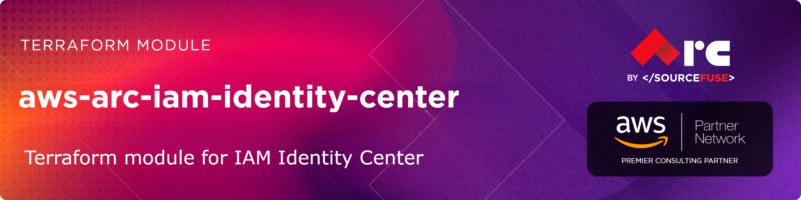

# [terraform-aws-arc-iam-identity-center](https://github.com/sourcefuse/terraform-aws-arc-iam-identity-center)

> **Module:** `sourcefuse/arc-iam-identity-center/aws`

> **Registry:** [https://registry.terraform.io/modules/sourcefuse/arc-iam-identity-center/aws](https://registry.terraform.io/modules/sourcefuse/arc-iam-identity-center/aws)

> **Category:** Security / Identity

> **Source:** [https://github.com/sourcefuse/terraform-aws-arc-iam-identity-center](https://github.com/sourcefuse/terraform-aws-arc-iam-identity-center)

[](https://github.com/sourcefuse/terraform-aws-arc-iam-identity-center/releases)
[](https://github.com/sourcefuse/terraform-aws-arc-iam-identity-center/commits)


[](https://sonarcloud.io/summary/new_code?id=sourcefuse_terraform-aws-arc-iam-identity-center)

> [!TIP]
> 🤖 **New:** Use this module with AI assistants via the [ARC IaC MCP Server](https://github.com/sourcefuse/arc-iac-mcp) — search, scaffold, and security-scan ARC modules from natural language. [Quick setup ↓](#ai-assistant-integration-arc-iac-mcp)

## Overview

Manages AWS IAM Identity Center (SSO) — permission sets, account assignments, and user/group provisioning — for centralized multi-account access.

## What It Does

- Permission sets with AWS managed and inline policies
- Account assignments for users and groups
- Auto-discovery of Identity Center instance
- Session duration configuration
- Support for multiple accounts and organizational units

For more information about this repository and its usage, please see [Terraform AWS IAM IDENTITY CENTER Usage Guide](https://github.com/sourcefuse/terraform-aws-arc-iam-identity-center/blob/main/docs/module-usage-guide/README.md).

## Quickstart

```hcl
provider "aws" {
  region = var.region
}

variable "region" {
  description = "AWS region"
  type        = string
  default     = "us-east-1"
}

module "aws_sso" {
  source = "sourcefuse/arc-iam-identity-center/aws"

  # Identity Center Configuration (optional - auto-discovers if not provided)
  identity_center_instance_arn = "arn:aws:sso:::instance/ssoins-1234567890abcdef"

  # Permission Sets
  permission_sets = {
    "AdminAccess" = {
      description      = "Full administrative access"
      session_duration = "PT8H"
      aws_managed_policies = [
        "arn:aws:iam::aws:policy/AdministratorAccess"
      ]
    }
    "ReadOnlyAccess" = {
      description      = "Read-only access across AWS services"
      session_duration = "PT4H"
      aws_managed_policies = [
        "arn:aws:iam::aws:policy/ReadOnlyAccess"
      ]
    }
  }

  # Create Groups
  identity_store_groups = {
    "Admins" = {
      display_name = "Administrators"
      description  = "System administrators"
    }
    "Developers" = {
      display_name = "Developers"
      description  = "Development team"
    }
  }

  # Account Assignments
  account_assignments = {
    "admins-full-access" = {
      permission_set_name = "AdminAccess"
      principal_type      = "GROUP"
      principal_id        = "Admins"
      target_type         = "AWS_ACCOUNT"
      target_id          = "123456789012"
    }
    "devs-readonly" = {
      permission_set_name = "ReadOnlyAccess"
      principal_type      = "GROUP"
      principal_id        = "Developers"
      target_type         = "AWS_ACCOUNT"
      target_id          = "123456789012"
    }
  }

  tags = {
    Environment = "production"
    Project     = "identity-management"
    Owner       = "platform-team"
  }
}
```
###  Complete User, Group Management Setup (Recommended)

```hcl
provider "aws" {
  region = var.region
}

variable "region" {
  description = "AWS region"
  type        = string
  default     = "us-east-1"
}

module "aws_sso" {
  source = "sourcefuse/arc-iam-identity-center/aws"

  identity_center_instance_arn = "arn:aws:sso:::instance/ssoins-1234567890abcdef"

  # Permission Sets with clear descriptions
  permission_sets = {
    "FullAdmin" = {
      description      = "FULL ADMIN - Complete AWS access (use with caution)"
      session_duration = "PT2H"
      aws_managed_policies = ["arn:aws:iam::aws:policy/AdministratorAccess"]
    }
    "Developer" = {
      description      = "DEVELOPER - Can create/modify most resources except IAM"
      session_duration = "PT8H"
      aws_managed_policies = ["arn:aws:iam::aws:policy/PowerUserAccess"]
    }
    "ReadOnly" = {
      description      = "READ ONLY - Can view all resources but cannot modify"
      session_duration = "PT12H"
      aws_managed_policies = ["arn:aws:iam::aws:policy/ReadOnlyAccess"]
    }
  }

  # Users with groups and direct assignments in one place
  identity_store_users = {
    "john.manager" = {
      user_name    = "john.manager"
      display_name = "John Manager"
      given_name   = "John"
      family_name  = "Manager"
      email        = "john.manager@company.com"
      title        = "Engineering Manager"

      # Groups this user belongs to
      groups = ["Managers"]

      # Direct assignments (optional)
      direct_assignments = []
    }

    "alice.developer" = {
      user_name    = "alice.developer"
      display_name = "Alice Developer"
      given_name   = "Alice"
      family_name  = "Developer"
      email        = "alice.developer@company.com"
      title        = "Senior Software Engineer"

      # Groups this user belongs to
      groups = ["SeniorDevelopers"]

      # Additional direct access beyond group permissions
      direct_assignments = [
        {
          permission_set = "Developer"
          account_id     = "111111111111"  # Production account
          reason         = "Senior dev needs prod deployment access"
        }
      ]
    }
  }

  # Groups
  identity_store_groups = {
    "Managers" = {
      display_name = "Managers"
      description  = "Engineering and team managers"
    }
    "SeniorDevelopers" = {
      display_name = "Senior Developers"
      description  = "Experienced developers with advanced permissions"
    }
  }

  # Group-based account assignments
  account_assignments = {
    "managers-admin-prod" = {
      permission_set_name = "FullAdmin"
      principal_type      = "GROUP"
      principal_id        = "Managers"
      target_type         = "AWS_ACCOUNT"
      target_id          = "111111111111"
    }
    "senior-devs-dev-access" = {
      permission_set_name = "Developer"
      principal_type      = "GROUP"
      principal_id        = "SeniorDevelopers"
      target_type         = "AWS_ACCOUNT"
      target_id          = "222222222222"
    }
  }

  tags = {
    Environment = "multi-account"
    Project     = "arc"
    Owner       = "platform-team"
  }
}
```

###  Advanced Setup with Custom Policies

```hcl
provider "aws" {
  region = var.region
}

variable "region" {
  description = "AWS region"
  type        = string
  default     = "us-east-1"
}

module "aws_sso" {
  source = "sourcefuse/arc-iam-identity-center/aws"

  identity_center_instance_arn = "arn:aws:sso:::instance/ssoins-1234567890abcdef"

  # Advanced permission sets with all policy types
  permission_sets = {
    "DataScientist" = {
      description      = "Data science and analytics access"
      session_duration = "PT12H"

      # AWS Managed Policies
      aws_managed_policies = [
        "arn:aws:iam::aws:policy/AmazonS3ReadOnlyAccess",
        "arn:aws:iam::aws:policy/AmazonSageMakerReadOnly"
      ]

      # Customer Managed Policies (must exist in your account)
      customer_managed_policies = [
        {
          name = "DataLakeAccess"
          path = "/data-science/"
        }
      ]

      # Inline Policy for specific permissions
      inline_policy = jsonencode({
        Version = "2012-10-17"
        Statement = [
          {
            Effect = "Allow"
            Action = [
              "sagemaker:CreateNotebookInstance",
              "sagemaker:StartNotebookInstance"
            ]
            Resource = "*"
            Condition = {
              StringEquals = {
                "aws:RequestedRegion" = ["us-east-1", "us-west-2"]
              }
            }
          }
        ]
      })

      # Permission Boundary for security
      permissions_boundary = {
        customer_managed_policy_reference = {
          name = "DataScientistBoundary"
          path = "/boundaries/"
        }
      }
    }
  }

  # Rest of configuration...
  identity_store_groups = {
    "DataScience" = {
      display_name = "Data Science Team"
      description  = "Data scientists and ML engineers"
    }
  }

  account_assignments = {
    "datascience-prod" = {
      permission_set_name = "DataScientist"
      principal_type      = "GROUP"
      principal_id        = "DataScience"
      target_type         = "AWS_ACCOUNT"
      target_id          = "111111111111"
    }
  }

  tags = {
    Environment = "production"
    Project     = "advanced-sso"
    Owner       = "data-team"
  }
}
```

## Required Inputs

| Name | Type | Description |
|------|------|-------------|
| `permission_sets` | `map(object)` | Permission set definitions |
| `account_assignments` | `list(object)` | Account-to-principal-to-permission-set mappings |
## Key Outputs

| Name | Description |
|------|-------------|
| `permission_set_arns` | Map of permission set name to ARN |
## Full Variable & Output Reference

The complete inputs/outputs reference is auto-generated below.

## License

This project is licensed under the MIT License - see the [LICENSE](LICENSE) file for details.
<!-- BEGINNING OF PRE-COMMIT-TERRAFORM DOCS HOOK -->
## Requirements

| Name | Version |
|------|---------|
| <a name="requirement_terraform"></a> [terraform](#requirement\_terraform) | >= 1.5.0 |
| <a name="requirement_aws"></a> [aws](#requirement\_aws) | >= 5.0, < 7.0 |

## Providers

| Name | Version |
|------|---------|
| <a name="provider_aws"></a> [aws](#provider\_aws) | 4.67.0 |

## Modules

No modules.

## Resources

| Name | Type |
|------|------|
| [aws_identitystore_group.main](https://registry.terraform.io/providers/hashicorp/aws/latest/docs/resources/identitystore_group) | resource |
| [aws_identitystore_group_membership.main](https://registry.terraform.io/providers/hashicorp/aws/latest/docs/resources/identitystore_group_membership) | resource |
| [aws_identitystore_user.main](https://registry.terraform.io/providers/hashicorp/aws/latest/docs/resources/identitystore_user) | resource |
| [aws_ssoadmin_account_assignment.main](https://registry.terraform.io/providers/hashicorp/aws/latest/docs/resources/ssoadmin_account_assignment) | resource |
| [aws_ssoadmin_application.main](https://registry.terraform.io/providers/hashicorp/aws/latest/docs/resources/ssoadmin_application) | resource |
| [aws_ssoadmin_application_assignment.main](https://registry.terraform.io/providers/hashicorp/aws/latest/docs/resources/ssoadmin_application_assignment) | resource |
| [aws_ssoadmin_customer_managed_policy_attachment.customer_managed](https://registry.terraform.io/providers/hashicorp/aws/latest/docs/resources/ssoadmin_customer_managed_policy_attachment) | resource |
| [aws_ssoadmin_managed_policy_attachment.aws_managed](https://registry.terraform.io/providers/hashicorp/aws/latest/docs/resources/ssoadmin_managed_policy_attachment) | resource |
| [aws_ssoadmin_permission_set.main](https://registry.terraform.io/providers/hashicorp/aws/latest/docs/resources/ssoadmin_permission_set) | resource |
| [aws_ssoadmin_permission_set_inline_policy.inline](https://registry.terraform.io/providers/hashicorp/aws/latest/docs/resources/ssoadmin_permission_set_inline_policy) | resource |
| [aws_ssoadmin_permissions_boundary_attachment.boundary](https://registry.terraform.io/providers/hashicorp/aws/latest/docs/resources/ssoadmin_permissions_boundary_attachment) | resource |
| [aws_ssoadmin_instances.existing](https://registry.terraform.io/providers/hashicorp/aws/latest/docs/data-sources/ssoadmin_instances) | data source |

## Inputs

| Name | Description | Type | Default | Required |
|------|-------------|------|---------|:--------:|
| <a name="input_account_assignments"></a> [account\_assignments](#input\_account\_assignments) | Map of account assignments to create | <pre>map(object({<br/>    permission_set_name = string<br/>    principal_type      = string<br/>    principal_id        = string<br/>    target_type         = string<br/>    target_id           = string<br/>  }))</pre> | `{}` | no |
| <a name="input_application_assignments"></a> [application\_assignments](#input\_application\_assignments) | Map of application assignments to create | <pre>map(object({<br/>    application_name = string<br/>    principal_type   = string<br/>    principal_id     = string<br/>  }))</pre> | `{}` | no |
| <a name="input_applications"></a> [applications](#input\_applications) | Map of applications to create | <pre>map(object({<br/>    name                     = string<br/>    description              = optional(string, "")<br/>    application_provider_arn = string<br/>    portal_options = optional(object({<br/>      sign_in_options = optional(object({<br/>        origin          = string<br/>        application_url = optional(string)<br/>      }))<br/>      visibility = optional(string, "ENABLED")<br/>    }))<br/>    tags = optional(map(string), {})<br/>  }))</pre> | `{}` | no |
| <a name="input_group_memberships"></a> [group\_memberships](#input\_group\_memberships) | Map of group memberships to create | <pre>map(object({<br/>    group_name = string<br/>    user_name  = string<br/>  }))</pre> | `{}` | no |
| <a name="input_identity_center_instance_arn"></a> [identity\_center\_instance\_arn](#input\_identity\_center\_instance\_arn) | ARN of existing Identity Center instance (optional - will auto-discover if not provided) | `string` | `null` | no |
| <a name="input_identity_store_groups"></a> [identity\_store\_groups](#input\_identity\_store\_groups) | Map of Identity Store groups to create | <pre>map(object({<br/>    display_name = string<br/>    description  = optional(string, "")<br/>  }))</pre> | `{}` | no |
| <a name="input_identity_store_users"></a> [identity\_store\_users](#input\_identity\_store\_users) | Map of Identity Store users to create | <pre>map(object({<br/>    user_name    = string<br/>    display_name = optional(string)<br/>    given_name   = string<br/>    family_name  = string<br/>    email        = string<br/>    locale       = optional(string, "en-US")<br/>    nickname     = optional(string)<br/>    timezone     = optional(string, "UTC")<br/>    title        = optional(string)<br/>    groups       = optional(list(string), [])<br/>    direct_assignments = optional(list(object({<br/>      permission_set = string<br/>      account_id     = string<br/>      reason         = optional(string, "")<br/>    })), [])<br/>  }))</pre> | `{}` | no |
| <a name="input_name_prefix"></a> [name\_prefix](#input\_name\_prefix) | Prefix for resource names | `string` | `""` | no |
| <a name="input_name_suffix"></a> [name\_suffix](#input\_name\_suffix) | Suffix for resource names | `string` | `""` | no |
| <a name="input_permission_sets"></a> [permission\_sets](#input\_permission\_sets) | Map of permission sets to create | <pre>map(object({<br/>    description          = optional(string, "")<br/>    session_duration     = optional(string, "PT1H")<br/>    relay_state          = optional(string)<br/>    aws_managed_policies = optional(list(string), [])<br/>    customer_managed_policies = optional(list(object({<br/>      name = string<br/>      path = optional(string, "/")<br/>    })), [])<br/>    inline_policy = optional(string)<br/>    permissions_boundary = optional(object({<br/>      customer_managed_policy_reference = optional(object({<br/>        name = string<br/>        path = optional(string, "/")<br/>      }))<br/>      managed_policy_arn = optional(string)<br/>    }))<br/>    tags = optional(map(string), {})<br/>  }))</pre> | `{}` | no |
| <a name="input_tags"></a> [tags](#input\_tags) | A map of tags to assign to all resources | `map(string)` | `{}` | no |

## Outputs

| Name | Description |
|------|-------------|
| <a name="output_account_assignments"></a> [account\_assignments](#output\_account\_assignments) | Map of created account assignments |
| <a name="output_application_assignments"></a> [application\_assignments](#output\_application\_assignments) | Map of created application assignments |
| <a name="output_applications"></a> [applications](#output\_applications) | Map of created applications |
| <a name="output_identity_center_instance_arn"></a> [identity\_center\_instance\_arn](#output\_identity\_center\_instance\_arn) | ARN of the Identity Center instance |
| <a name="output_identity_store_groups"></a> [identity\_store\_groups](#output\_identity\_store\_groups) | Map of created Identity Store groups |
| <a name="output_identity_store_id"></a> [identity\_store\_id](#output\_identity\_store\_id) | ID of the Identity Store |
| <a name="output_identity_store_users"></a> [identity\_store\_users](#output\_identity\_store\_users) | Map of created Identity Store users |
| <a name="output_permission_sets"></a> [permission\_sets](#output\_permission\_sets) | Map of created permission sets |
<!-- END OF PRE-COMMIT-TERRAFORM DOCS HOOK -->

## Development

### Prerequisites
- [terraform](https://learn.hashicorp.com/terraform/getting-started/install#installing-terraform)
- [terraform-docs](https://github.com/segmentio/terraform-docs)
- [pre-commit](https://pre-commit.com/#install)
- [golang](https://golang.org/doc/install#install)
- [golint](https://github.com/golang/lint#installation)

### Configurations
- Configure pre-commit hooks
  ```sh
  pre-commit install
  ```
- Configure golang deps for tests
  ```sh
  go get github.com/gruntwork-io/terratest/modules/terraform
  go get github.com/stretchr/testify/assert
  ```
### Git commits

while Contributing or doing git commit please specify the breaking change in your commit message whether its major,minor or patch

For Example

```sh
git commit -m "your commit message #major"
```
By specifying this , it will bump the version and if you dont specify this in your commit message then by default it will consider patch and will bump that accordingly

## AI Assistant Integration (ARC IaC MCP)

The **[ARC IaC MCP Server](https://github.com/sourcefuse/arc-iac-mcp)** is a hosted Model Context Protocol service that lets AI assistants browse, search, scaffold, compare, and security-scan any of the SourceFuse ARC Terraform modules — directly from natural language.

**What you can do with it:**

- **Discover** — search and filter modules by keyword or AWS resource type.
- **Understand** — get inputs, outputs, and resources for any module without leaving your editor.
- **Scaffold** — generate production-ready, multi-file Terraform with cross-module wiring already done.
- **Secure** — scan generated or existing HCL for misconfigurations before it hits a PR.
- **Compare** — diff modules side-by-side to make informed architectural decisions.

### Setup (one minute)

The MCP endpoint is `https://arc-iac-mcp.sourcef.us/mcp`. Pick your client:

**Claude Code CLI:**
```bash
claude mcp add arc-iac --transport http https://arc-iac-mcp.sourcef.us/mcp
```

**Claude Desktop** — edit `~/Library/Application Support/Claude/claude_desktop_config.json`:
```json
{
  "mcpServers": {
    "arc-iac": {
      "url": "https://arc-iac-mcp.sourcef.us/mcp"
    }
  }
}
```

**Cursor / Windsurf / Kiro** — add the same block to `.cursor/mcp.json` (or the equivalent for your client).

### Example prompts to try

- *"List all ARC modules sorted by downloads"*
- *"What inputs does `arc-ecs` require?"*
- *"Scaffold a production-ready `arc-db` Aurora setup with Secrets Manager"*
- *"Compare `arc-eks` and `arc-ecs` for running 10 microservices"*
- *"Scan this Terraform before I raise a PR: `<paste HCL>`"*

See the [ARC IaC MCP repo](https://github.com/sourcefuse/arc-iac-mcp) for the full tool reference, troubleshooting tips, and local-development instructions.

## Contributing

See [CONTRIBUTING.md](./CONTRIBUTING.md) for commit conventions and development setup.

## Authors
This project is authored by:
- SourceFuse
