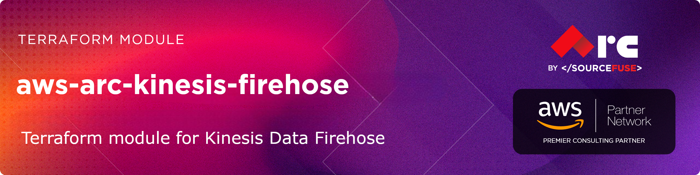

# [terraform-aws-arc-kinesis-firehose](https://github.com/sourcefuse/terraform-aws-arc-kinesis-firehose)

<a href="https://github.com/sourcefuse/terraform-aws-arc-kinesis-firehose/releases/latest"></a> <a href="https://github.com/sourcefuse/terraform-aws-arc-kinesis-firehose/commits"></a>  

[](https://sonarcloud.io/summary/new_code?id=sourcefuse_terraform-aws-arc-kinesis-firehose2)

---

## Overview

This module provisions and manages Kinesis Data Firehose delivery streams with full support for multiple destinations, IAM roles, CloudWatch logging, Lambda transformation, KMS encryption, and dynamic partitioning.

## Features

- **Multiple destinations**: `extended_s3`, `redshift`, `opensearch`, `http_endpoint`
- **Auto-created IAM role** with least-privilege policies (or bring your own)
- **CloudWatch logging** with auto-created log group and stream
- **KMS encryption** support (AWS-managed or customer-managed)
- **Lambda data transformation** via processing configuration
- **Parquet/ORC format conversion** via AWS Glue
- **Dynamic partitioning** with JQ metadata extraction
- **S3 backup** for all non-S3 destinations
- **VPC support** for OpenSearch destinations
- **Kinesis Data Stream** as source

## Usage

### Basic S3

```hcl
module "firehose" {
  source  = "sourcefuse/arc-kinesis-firehose/aws"
  version = "0.0.1"

  name        = "my-stream"
  destination = "extended_s3"

  s3_configuration = {
    bucket_arn = aws_s3_bucket.my_bucket.arn
  }

  tags = { Environment = "prod" }
}
```

### S3 with KMS Encryption

```hcl
module "firehose" {
  source  = "sourcefuse/arc-kinesis-firehose/aws"
  version = "0.0.1"

  name        = "my-encrypted-stream"
  destination = "extended_s3"

  s3_configuration = {
    bucket_arn = aws_s3_bucket.my_bucket.arn
  }

  kms_key_arn = aws_kms_key.my_key.arn

  tags = { Environment = "prod" }
}
```

### With Lambda Transformation

```hcl
module "firehose" {
  source  = "sourcefuse/arc-kinesis-firehose/aws"
  version = "0.0.1"

  name        = "my-transform-stream"
  destination = "extended_s3"

  s3_configuration = {
    bucket_arn = aws_s3_bucket.my_bucket.arn
  }

  lambda_arn = aws_lambda_function.transformer.arn

  tags = { Environment = "prod" }
}
```

### Redshift

```hcl
module "firehose" {
  source  = "sourcefuse/arc-kinesis-firehose/aws"
  version = "0.0.1"

  name        = "my-redshift-stream"
  destination = "redshift"

  s3_configuration = {
    bucket_arn = aws_s3_bucket.staging.arn
  }

  redshift_configuration = {
    cluster_jdbcurl = "jdbc:redshift://my-cluster.abc.us-east-1.redshift.amazonaws.com:5439/mydb"
    username        = "firehose_user"
    password        = var.redshift_password
    data_table_name = "events"
  }

  tags = { Environment = "prod" }
}
```

### OpenSearch

```hcl
module "firehose" {
  source  = "sourcefuse/arc-kinesis-firehose/aws"
  version = "0.0.1"

  name        = "my-opensearch-stream"
  destination = "opensearch"

  s3_configuration = {
    bucket_arn = aws_s3_bucket.backup.arn
  }

  opensearch_domain_arn    = aws_opensearch_domain.my_domain.arn
  opensearch_configuration = {
    index_name = "my-index"
  }

  tags = { Environment = "prod" }
}
```

### Dynamic Partitioning

```hcl
module "firehose" {
  source  = "sourcefuse/arc-kinesis-firehose/aws"
  version = "0.0.1"

  name        = "partitioned-stream"
  destination = "extended_s3"

  s3_configuration = {
    bucket_arn          = aws_s3_bucket.my_bucket.arn
    buffering_size      = 64
    prefix              = "data/customer_id=!{partitionKeyFromQuery:customer_id}/year=!{timestamp:yyyy}/month=!{timestamp:MM}/"
    error_output_prefix = "errors/!{firehose:error-output-type}/"
  }

  enable_dynamic_partitioning = true

  additional_processors = [{
    type = "MetadataExtraction"
    parameters = [
      { parameter_name = "JsonParsingEngine",       parameter_value = "JQ-1.6" },
      { parameter_name = "MetadataExtractionQuery", parameter_value = "{customer_id:.customer_id}" },
    ]
  }]

  tags = { Environment = "prod" }
}
```

## Examples

| Example | Description |
|---------|-------------|
| [basic-s3](./examples/basic-s3) | Simple delivery to S3 with GZIP |
| [s3-encrypted](./examples/s3-encrypted) | S3 with KMS encryption and optional Parquet |
| [redshift](./examples/redshift) | Delivery to Redshift via S3 staging |
| [lambda-transform](./examples/lambda-transform) | Lambda data transformation before S3 |
| [opensearch](./examples/opensearch) | Delivery to OpenSearch domain |
| [dynamic-partitioning](./examples/dynamic-partitioning) | S3 with JQ-based dynamic partitioning |

## License

Apache 2.0 — see [LICENSE](./LICENSE).

<!-- BEGINNING OF PRE-COMMIT-TERRAFORM DOCS HOOK -->
## Requirements

| Name | Version |
|------|---------|
| <a name="requirement_terraform"></a> [terraform](#requirement\_terraform) | >= 1.5.0 |
| <a name="requirement_aws"></a> [aws](#requirement\_aws) | >= 5.0, < 7.0 |

## Providers

| Name | Version |
|------|---------|
| <a name="provider_aws"></a> [aws](#provider\_aws) | 6.42.0 |

## Modules

No modules.

## Resources

| Name | Type |
|------|------|
| [aws_cloudwatch_log_group.firehose](https://registry.terraform.io/providers/hashicorp/aws/latest/docs/resources/cloudwatch_log_group) | resource |
| [aws_cloudwatch_log_stream.firehose](https://registry.terraform.io/providers/hashicorp/aws/latest/docs/resources/cloudwatch_log_stream) | resource |
| [aws_iam_role.firehose](https://registry.terraform.io/providers/hashicorp/aws/latest/docs/resources/iam_role) | resource |
| [aws_iam_role_policy.firehose](https://registry.terraform.io/providers/hashicorp/aws/latest/docs/resources/iam_role_policy) | resource |
| [aws_kinesis_firehose_delivery_stream.this](https://registry.terraform.io/providers/hashicorp/aws/latest/docs/resources/kinesis_firehose_delivery_stream) | resource |
| [aws_caller_identity.current](https://registry.terraform.io/providers/hashicorp/aws/latest/docs/data-sources/caller_identity) | data source |
| [aws_iam_policy_document.firehose_assume_role](https://registry.terraform.io/providers/hashicorp/aws/latest/docs/data-sources/iam_policy_document) | data source |
| [aws_iam_policy_document.firehose_policy](https://registry.terraform.io/providers/hashicorp/aws/latest/docs/data-sources/iam_policy_document) | data source |
| [aws_partition.current](https://registry.terraform.io/providers/hashicorp/aws/latest/docs/data-sources/partition) | data source |
| [aws_region.current](https://registry.terraform.io/providers/hashicorp/aws/latest/docs/data-sources/region) | data source |

## Inputs

| Name | Description | Type | Default | Required |
|------|-------------|------|---------|:--------:|
| <a name="input_additional_processors"></a> [additional\_processors](#input\_additional\_processors) | Additional processing configuration blocks (e.g., MetadataExtraction, RecordDeAggregation). | <pre>list(object({<br/>    type = string<br/>    parameters = optional(list(object({<br/>      parameter_name  = string<br/>      parameter_value = string<br/>    })), [])<br/>  }))</pre> | `[]` | no |
| <a name="input_create_iam_role"></a> [create\_iam\_role](#input\_create\_iam\_role) | Whether to create an IAM role for Firehose. Set false to provide an existing role via iam\_role\_arn. | `bool` | `true` | no |
| <a name="input_destination"></a> [destination](#input\_destination) | Destination type. Valid values: extended\_s3, redshift, opensearch, http\_endpoint. | `string` | n/a | yes |
| <a name="input_dynamic_partitioning_retry_duration"></a> [dynamic\_partitioning\_retry\_duration](#input\_dynamic\_partitioning\_retry\_duration) | Retry duration in seconds for dynamic partitioning (0–7200). | `number` | `300` | no |
| <a name="input_enable_dynamic_partitioning"></a> [enable\_dynamic\_partitioning](#input\_enable\_dynamic\_partitioning) | Enable dynamic partitioning for extended\_s3 destination. | `bool` | `false` | no |
| <a name="input_enable_format_conversion"></a> [enable\_format\_conversion](#input\_enable\_format\_conversion) | Enable data format conversion (Parquet/ORC) via AWS Glue. | `bool` | `false` | no |
| <a name="input_enable_sse"></a> [enable\_sse](#input\_enable\_sse) | Enable server-side encryption on the delivery stream. | `bool` | `true` | no |
| <a name="input_glue_database_name"></a> [glue\_database\_name](#input\_glue\_database\_name) | Glue database name for schema. Required when enable\_format\_conversion is true. | `string` | `null` | no |
| <a name="input_glue_role_arn"></a> [glue\_role\_arn](#input\_glue\_role\_arn) | IAM role ARN for Glue access. Defaults to the Firehose role. | `string` | `null` | no |
| <a name="input_glue_table_name"></a> [glue\_table\_name](#input\_glue\_table\_name) | Glue table name for schema. Required when enable\_format\_conversion is true. | `string` | `null` | no |
| <a name="input_http_endpoint_configuration"></a> [http\_endpoint\_configuration](#input\_http\_endpoint\_configuration) | Configuration block for HTTP endpoint destination. | <pre>object({<br/>    url                = string<br/>    name               = optional(string)<br/>    access_key         = optional(string)<br/>    buffering_size     = optional(number, 5)<br/>    buffering_interval = optional(number, 300)<br/>    retry_duration     = optional(number, 300)<br/>    s3_backup_mode     = optional(string, "FailedDataOnly")<br/>    content_encoding   = optional(string, "NONE")<br/>    common_attributes  = optional(list(object({ name = string, value = string })), [])<br/>  })</pre> | `null` | no |
| <a name="input_iam_role_arn"></a> [iam\_role\_arn](#input\_iam\_role\_arn) | ARN of an existing IAM role. Required when create\_iam\_role is false. | `string` | `null` | no |
| <a name="input_kinesis_data_stream"></a> [kinesis\_data\_stream](#input\_kinesis\_data\_stream) | Kinesis Data Stream source configuration. | <pre>object({<br/>    stream_arn = string<br/>    role_arn   = optional(string, null)<br/>  })</pre> | `null` | no |
| <a name="input_kms_key_arn"></a> [kms\_key\_arn](#input\_kms\_key\_arn) | ARN of a KMS key for server-side encryption. If null, AWS-managed key is used. | `string` | `null` | no |
| <a name="input_lambda_arn"></a> [lambda\_arn](#input\_lambda\_arn) | ARN of the Lambda function for data transformation. Enables transformation when set. | `string` | `null` | no |
| <a name="input_logging_config"></a> [logging\_config](#input\_logging\_config) | CloudWatch logging configuration for the delivery stream. | <pre>object({<br/>    enable          = optional(bool, true)<br/>    log_group_name  = optional(string, null)<br/>    log_stream_name = optional(string, null)<br/>  })</pre> | `{}` | no |
| <a name="input_name"></a> [name](#input\_name) | Name of the Kinesis Firehose delivery stream. | `string` | n/a | yes |
| <a name="input_opensearch_configuration"></a> [opensearch\_configuration](#input\_opensearch\_configuration) | Configuration block for OpenSearch destination. | <pre>object({<br/>    index_name            = string<br/>    index_rotation_period = optional(string, "OneDay")<br/>    buffering_interval    = optional(number, 300)<br/>    buffering_size        = optional(number, 5)<br/>    retry_duration        = optional(number, 300)<br/>    s3_backup_mode        = optional(string, "FailedDocumentsOnly")<br/>    type_name             = optional(string)<br/>    cluster_endpoint      = optional(string)<br/>  })</pre> | `null` | no |
| <a name="input_opensearch_domain_arn"></a> [opensearch\_domain\_arn](#input\_opensearch\_domain\_arn) | ARN of the OpenSearch domain. | `string` | `null` | no |
| <a name="input_output_format"></a> [output\_format](#input\_output\_format) | Output format for format conversion. Valid values: PARQUET, ORC. | `string` | `"PARQUET"` | no |
| <a name="input_redshift_configuration"></a> [redshift\_configuration](#input\_redshift\_configuration) | Configuration block for Redshift destination. | <pre>object({<br/>    cluster_jdbcurl    = string<br/>    username           = optional(string)<br/>    password           = optional(string)<br/>    data_table_name    = string<br/>    copy_options       = optional(string)<br/>    data_table_columns = optional(string)<br/>    retry_duration     = optional(number, 3600)<br/>    s3_backup_mode     = optional(string, "Disabled")<br/>  })</pre> | `null` | no |
| <a name="input_s3_backup_configuration"></a> [s3\_backup\_configuration](#input\_s3\_backup\_configuration) | S3 backup configuration for extended\_s3 destination. | <pre>object({<br/>    mode       = optional(string, "Disabled")<br/>    bucket_arn = optional(string, null)<br/>  })</pre> | `{}` | no |
| <a name="input_s3_configuration"></a> [s3\_configuration](#input\_s3\_configuration) | S3 delivery/staging configuration. | <pre>object({<br/>    bucket_arn          = optional(string, null)<br/>    prefix              = optional(string, null)<br/>    error_output_prefix = optional(string, null)<br/>    buffering_size      = optional(number, 5)<br/>    buffering_interval  = optional(number, 300)<br/>    compression_format  = optional(string, "UNCOMPRESSED")<br/>  })</pre> | `{}` | no |
| <a name="input_tags"></a> [tags](#input\_tags) | Map of tags to assign to all resources. | `map(string)` | `{}` | no |
| <a name="input_vpc_config"></a> [vpc\_config](#input\_vpc\_config) | VPC configuration for OpenSearch destination. | <pre>object({<br/>    subnet_ids         = list(string)<br/>    security_group_ids = list(string)<br/>    role_arn           = optional(string)<br/>  })</pre> | `null` | no |

## Outputs

| Name | Description |
|------|-------------|
| <a name="output_iam_role_arn"></a> [iam\_role\_arn](#output\_iam\_role\_arn) | ARN of the IAM role used by Firehose. |
| <a name="output_iam_role_name"></a> [iam\_role\_name](#output\_iam\_role\_name) | Name of the IAM role created for Firehose (null if externally provided). |
| <a name="output_log_group_name"></a> [log\_group\_name](#output\_log\_group\_name) | CloudWatch log group name. |
| <a name="output_log_stream_name"></a> [log\_stream\_name](#output\_log\_stream\_name) | CloudWatch log stream name. |
| <a name="output_stream_arn"></a> [stream\_arn](#output\_stream\_arn) | ARN of the Kinesis Firehose delivery stream. |
| <a name="output_stream_name"></a> [stream\_name](#output\_stream\_name) | Name of the Kinesis Firehose delivery stream. |
<!-- END OF PRE-COMMIT-TERRAFORM DOCS HOOK -->

## Versioning  
This project uses a `.version` file at the root of the repo which the pipeline reads from and does a git tag.  

When you intend to commit to `main`, you will need to increment this version. Once the project is merged,
the pipeline will kick off and tag the latest git commit.  

## Development

### Prerequisites

- [terraform](https://learn.hashicorp.com/terraform/getting-started/install#installing-terraform)
- [terraform-docs](https://github.com/segmentio/terraform-docs)
- [pre-commit](https://pre-commit.com/#install)
- [golang](https://golang.org/doc/install#install)
- [golint](https://github.com/golang/lint#installation)

### Configurations

- Configure pre-commit hooks
  ```sh
  pre-commit install
  ```

### Versioning

while Contributing or doing git commit please specify the breaking change in your commit message whether its major,minor or patch

For Example

```sh
git commit -m "your commit message #major"
```
By specifying this , it will bump the version and if you don't specify this in your commit message then by default it will consider patch and will bump that accordingly

### Tests
- Tests are available in `test` directory
- Configure the dependencies
  ```sh
  cd test/
  go mod init github.com/sourcefuse/terraform-aws-refarch-<module_name>
  go get github.com/gruntwork-io/terratest/modules/terraform
  ```
- Now execute the test  
  ```sh
  go test -timeout  30m
  ```

## Authors

This project is authored by:
- SourceFuse ARC Team
