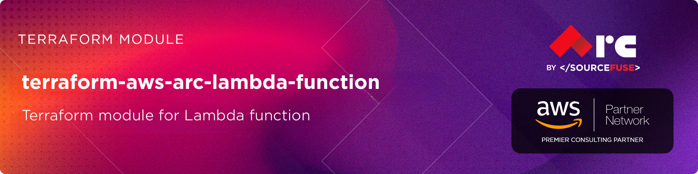

# AWS Lambda Function Terraform Module

# [terraform-aws-arc-lambda-function](https://github.com/sourcefuse/terraform-aws-arc-lambda-function)

<a href="https://github.com/sourcefuse/terraform-aws-arc-lambda-function/releases/latest"></a> <a href="https://github.com/sourcefuse/terraform-aws-arc-lambda-function/commits"></a>  

[](https://sonarcloud.io/summary/new_code?id=sourcefuse_terraform-aws-arc-lambda-function)


## Overview

The ARC Terraform module provides a comprehensive and unified solution for deploying AWS Lambda functions on AWS. This versatile module supports multiple deployment methods including local source code, S3-based deployments, and container images, allowing you to choose the deployment approach that best fits your application requirements and operational needs.

### Prerequisites
Before using this module, ensure you have the following:

- AWS credentials configured.
- Terraform installed.
- A working knowledge of Terraform.

## Getting Started

1. **Define the Module**

Initially, it's essential to define a Terraform module, which is organized as a distinct directory encompassing Terraform configuration files. Within this module directory, input variables and output values must be defined in the variables.tf and outputs.tf files, respectively. The following illustrates an example directory structure:


```plaintext
lambda-function/
|-- main.tf
|-- variables.tf
|-- outputs.tf
```


2. **Define Input Variables**

Inside the `variables.tf` or in `*.tfvars` file, you should define values for the variables that the module requires.

3. **Use the Module in Your Main Configuration**
In your main Terraform configuration file (e.g., main.tf), you can use the module. Specify the source of the module, and version, For Example

```hcl
module "lambda-function" {
  source                 = "sourcefuse/arc-lambda-function/aws"
  version                = "0.0.1"

  # Basic configuration
  function_name = var.function_name
  description   = "Basic Lambda function example"
  runtime       = "python3.11"
  handler       = "lambda_function.lambda_handler"
  memory_size   = 128
  timeout       = 10

  # Deployment package
  filename         = data.archive_file.lambda_zip.output_path
  source_code_hash = data.archive_file.lambda_zip.output_base64sha256

  # Environment variables
  environment_variables = {
    ENVIRONMENT = var.environment
    LOG_LEVEL   = var.log_level
  }

  # CloudWatch Logs
  create_log_group      = true
  log_retention_in_days = 7

 tags = module.tags.tags
}
```

4. **Output Values**

Inside the `outputs.tf` file of the module, you can define output values that can be referenced in the main configuration. For example:

```hcl
output "arn" {
  description = "ARN of the Lambda function"
  value       = module.basic_lambda.lambda_function_arn
}

output "name" {
  description = "Name of the Lambda function"
  value       = module.basic_lambda.lambda_function_name
}

output "invoke_arn" {
  description = "Invoke ARN of the Lambda function"
  value       = module.basic_lambda.lambda_function_invoke_arn
}

output "role_arn" {
  description = "ARN of the Lambda execution role"
  value       = module.basic_lambda.lambda_role_arn
}

output "cloudwatch_log_group_name" {
  description = "Name of the CloudWatch log group"
  value       = module.basic_lambda.lambda_cloudwatch_log_group_name
}

```

5. **.tfvars**

Inside the `.tfvars` file of the module, you can provide desired values that can be referenced in the main configuration.


## First Time Usage
***uncomment the backend block in [main.tf](./examples/endpoint//main.tf)***
```shell
terraform init -backend-config=config.dev.hcl
```
***If testing locally, `terraform init` should be fine***

Create a `dev` workspace
```shell
terraform workspace new dev
```

Plan Terraform
```shell
terraform plan -var-file dev.tfvars
```

Apply Terraform
```shell
terraform apply -var-file dev.tfvars
```

## Production Setup
```shell
terraform init -backend-config=config.prod.hcl
```

Create a `prod` workspace
```shell
terraform workspace new prod
```

Plan Terraform
```shell
terraform plan -var-file prod.tfvars
```

Apply Terraform
```shell
terraform apply -var-file prod.tfvars  
```
<!-- BEGIN_TF_DOCS -->
## Requirements

| Name | Version |
|------|---------|
| <a name="requirement_terraform"></a> [terraform](#requirement\_terraform) | >= 1.3.0 |
| <a name="requirement_archive"></a> [archive](#requirement\_archive) | >= 2.0 |
| <a name="requirement_aws"></a> [aws](#requirement\_aws) | >= 5.0 |
| <a name="requirement_null"></a> [null](#requirement\_null) | ~> 3.2 |

## Providers

| Name | Version |
|------|---------|
| <a name="provider_aws"></a> [aws](#provider\_aws) | 6.8.0 |
| <a name="provider_null"></a> [null](#provider\_null) | 3.2.4 |

## Modules

No modules.

## Resources

| Name | Type |
|------|------|
| [aws_cloudwatch_log_group.lambda](https://registry.terraform.io/providers/hashicorp/aws/latest/docs/resources/cloudwatch_log_group) | resource |
| [aws_iam_role.lambda](https://registry.terraform.io/providers/hashicorp/aws/latest/docs/resources/iam_role) | resource |
| [aws_iam_role_policy.lambda_execution](https://registry.terraform.io/providers/hashicorp/aws/latest/docs/resources/iam_role_policy) | resource |
| [aws_lambda_alias.this](https://registry.terraform.io/providers/hashicorp/aws/latest/docs/resources/lambda_alias) | resource |
| [aws_lambda_function.this](https://registry.terraform.io/providers/hashicorp/aws/latest/docs/resources/lambda_function) | resource |
| [aws_lambda_function_url.this](https://registry.terraform.io/providers/hashicorp/aws/latest/docs/resources/lambda_function_url) | resource |
| [aws_lambda_permission.this](https://registry.terraform.io/providers/hashicorp/aws/latest/docs/resources/lambda_permission) | resource |
| [aws_lambda_provisioned_concurrency_config.this](https://registry.terraform.io/providers/hashicorp/aws/latest/docs/resources/lambda_provisioned_concurrency_config) | resource |
| [aws_sqs_queue.dlq](https://registry.terraform.io/providers/hashicorp/aws/latest/docs/resources/sqs_queue) | resource |
| [null_resource.validate_deployment_package](https://registry.terraform.io/providers/hashicorp/null/latest/docs/resources/resource) | resource |
| [null_resource.validate_package_compatibility](https://registry.terraform.io/providers/hashicorp/null/latest/docs/resources/resource) | resource |
| [aws_caller_identity.current](https://registry.terraform.io/providers/hashicorp/aws/latest/docs/data-sources/caller_identity) | data source |
| [aws_iam_policy_document.lambda_assume_role](https://registry.terraform.io/providers/hashicorp/aws/latest/docs/data-sources/iam_policy_document) | data source |
| [aws_iam_policy_document.lambda_execution](https://registry.terraform.io/providers/hashicorp/aws/latest/docs/data-sources/iam_policy_document) | data source |
| [aws_region.current](https://registry.terraform.io/providers/hashicorp/aws/latest/docs/data-sources/region) | data source |

## Inputs

| Name | Description | Type | Default | Required |
|------|-------------|------|---------|:--------:|
| <a name="input_alias_description"></a> [alias\_description](#input\_alias\_description) | Description of the alias | `string` | `"Lambda function alias"` | no |
| <a name="input_alias_function_version"></a> [alias\_function\_version](#input\_alias\_function\_version) | Lambda function version for which you are creating the alias | `string` | `null` | no |
| <a name="input_alias_name"></a> [alias\_name](#input\_alias\_name) | Name for the alias | `string` | `"live"` | no |
| <a name="input_alias_routing_config"></a> [alias\_routing\_config](#input\_alias\_routing\_config) | The Lambda alias routing configuration | <pre>object({<br/>    additional_version_weights = map(number)<br/>  })</pre> | `null` | no |
| <a name="input_architectures"></a> [architectures](#input\_architectures) | Instruction set architecture for your Lambda function | `list(string)` | <pre>[<br/>  "x86_64"<br/>]</pre> | no |
| <a name="input_attach_policy_statements"></a> [attach\_policy\_statements](#input\_attach\_policy\_statements) | Whether to attach additional policy statements to the Lambda role | `bool` | `false` | no |
| <a name="input_code_signing_config_arn"></a> [code\_signing\_config\_arn](#input\_code\_signing\_config\_arn) | ARN of code signing config | `string` | `null` | no |
| <a name="input_create_alias"></a> [create\_alias](#input\_create\_alias) | Whether to create an alias for the Lambda function | `bool` | `false` | no |
| <a name="input_create_dlq"></a> [create\_dlq](#input\_create\_dlq) | Whether to create a dead letter queue (SQS) for the Lambda function | `bool` | `false` | no |
| <a name="input_create_function_url"></a> [create\_function\_url](#input\_create\_function\_url) | Whether to create a Lambda function URL | `bool` | `false` | no |
| <a name="input_create_log_group"></a> [create\_log\_group](#input\_create\_log\_group) | Whether to create a CloudWatch log group for the Lambda function | `bool` | `true` | no |
| <a name="input_create_role"></a> [create\_role](#input\_create\_role) | Whether to create an IAM role for the Lambda function | `bool` | `true` | no |
| <a name="input_dead_letter_config"></a> [dead\_letter\_config](#input\_dead\_letter\_config) | Dead letter queue configuration | <pre>object({<br/>    target_arn = string<br/>  })</pre> | `null` | no |
| <a name="input_description"></a> [description](#input\_description) | Description of what your Lambda Function does | `string` | `"Lambda function created by Terraform"` | no |
| <a name="input_dlq_message_retention_seconds"></a> [dlq\_message\_retention\_seconds](#input\_dlq\_message\_retention\_seconds) | The number of seconds Amazon SQS retains a message in the DLQ | `number` | `1209600` | no |
| <a name="input_dlq_name"></a> [dlq\_name](#input\_dlq\_name) | Name of the dead letter queue (if create\_dlq is true) | `string` | `null` | no |
| <a name="input_environment_variables"></a> [environment\_variables](#input\_environment\_variables) | Map of environment variables that are accessible from the function code during execution | `map(string)` | `{}` | no |
| <a name="input_ephemeral_storage"></a> [ephemeral\_storage](#input\_ephemeral\_storage) | Ephemeral storage size in MB (512-10240) | `number` | `512` | no |
| <a name="input_file_system_config"></a> [file\_system\_config](#input\_file\_system\_config) | File system configuration for the Lambda function | <pre>object({<br/>    arn              = string<br/>    local_mount_path = string<br/>  })</pre> | `null` | no |
| <a name="input_filename"></a> [filename](#input\_filename) | Path to the function's deployment package within the local filesystem | `string` | `null` | no |
| <a name="input_function_name"></a> [function\_name](#input\_function\_name) | Name of the Lambda function | `string` | n/a | yes |
| <a name="input_function_tags"></a> [function\_tags](#input\_function\_tags) | A map of tags to assign specifically to the Lambda function | `map(string)` | `{}` | no |
| <a name="input_function_url_config"></a> [function\_url\_config](#input\_function\_url\_config) | Lambda function URL configuration | <pre>object({<br/>    authorization_type = string<br/>    cors = optional(object({<br/>      allow_credentials = optional(bool, false)<br/>      allow_headers     = optional(list(string), [])<br/>      allow_methods     = optional(list(string), [])<br/>      allow_origins     = optional(list(string), [])<br/>      expose_headers    = optional(list(string), [])<br/>      max_age           = optional(number, 0)<br/>    }))<br/>    invoke_mode = optional(string, "BUFFERED")<br/>  })</pre> | <pre>{<br/>  "authorization_type": "AWS_IAM"<br/>}</pre> | no |
| <a name="input_handler"></a> [handler](#input\_handler) | Function entrypoint in your code | `string` | `"index.handler"` | no |
| <a name="input_image_config"></a> [image\_config](#input\_image\_config) | Configuration for Lambda when using container images | <pre>object({<br/>    command           = list(string)<br/>    entry_point       = list(string)<br/>    working_directory = string<br/>  })</pre> | `null` | no |
| <a name="input_image_uri"></a> [image\_uri](#input\_image\_uri) | ECR image URI containing the function's deployment package | `string` | `null` | no |
| <a name="input_kms_key_arn"></a> [kms\_key\_arn](#input\_kms\_key\_arn) | Amazon Resource Name (ARN) of the AWS Key Management Service (KMS) key that's used to encrypt your function's environment variables | `string` | `null` | no |
| <a name="input_lambda_insights_enabled"></a> [lambda\_insights\_enabled](#input\_lambda\_insights\_enabled) | Whether to enable Lambda Insights for the function | `bool` | `false` | no |
| <a name="input_lambda_insights_version"></a> [lambda\_insights\_version](#input\_lambda\_insights\_version) | Version of the Lambda Insights layer | `string` | `"1"` | no |
| <a name="input_lambda_permissions"></a> [lambda\_permissions](#input\_lambda\_permissions) | Map of Lambda permissions to create | <pre>map(object({<br/>    action                 = string<br/>    principal              = string<br/>    source_arn             = optional(string)<br/>    source_account         = optional(string)<br/>    statement_id           = optional(string)<br/>    qualifier              = optional(string)<br/>    function_url_auth_type = optional(string)<br/>    principal_org_id       = optional(string)<br/>  }))</pre> | `{}` | no |
| <a name="input_log_group_kms_key_id"></a> [log\_group\_kms\_key\_id](#input\_log\_group\_kms\_key\_id) | The ARN of the KMS Key to use when encrypting log data | `string` | `null` | no |
| <a name="input_log_group_name"></a> [log\_group\_name](#input\_log\_group\_name) | Name of the CloudWatch log group | `string` | `null` | no |
| <a name="input_log_retention_in_days"></a> [log\_retention\_in\_days](#input\_log\_retention\_in\_days) | Specifies the number of days you want to retain log events in the specified log group | `number` | `14` | no |
| <a name="input_logging_config"></a> [logging\_config](#input\_logging\_config) | Logging configuration for Lambda function | <pre>object({<br/>    log_format = string # e.g., "JSON" or "Text"<br/>    log_group  = string # e.g., "/aws/lambda/my-function"<br/>  })</pre> | `null` | no |
| <a name="input_memory_size"></a> [memory\_size](#input\_memory\_size) | Amount of memory in MB your Lambda Function can use at runtime | `number` | `128` | no |
| <a name="input_package_type"></a> [package\_type](#input\_package\_type) | Lambda deployment package type (Zip or Image) | `string` | `"Zip"` | no |
| <a name="input_policy_statements"></a> [policy\_statements](#input\_policy\_statements) | Map of policy statements to attach to the Lambda role | <pre>map(object({<br/>    effect    = string<br/>    actions   = list(string)<br/>    resources = list(string)<br/>    conditions = optional(map(object({<br/>      test     = string<br/>      variable = string<br/>      values   = list(string)<br/>    })), {})<br/>  }))</pre> | `{}` | no |
| <a name="input_provisioned_concurrency_config"></a> [provisioned\_concurrency\_config](#input\_provisioned\_concurrency\_config) | Provisioned concurrency configuration | <pre>object({<br/>    provisioned_concurrent_executions = number<br/>    qualifier                         = string<br/>  })</pre> | `null` | no |
| <a name="input_publish"></a> [publish](#input\_publish) | Whether to publish creation/change as new Lambda Function Version | `bool` | `false` | no |
| <a name="input_replace_security_groups_on_destroy"></a> [replace\_security\_groups\_on\_destroy](#input\_replace\_security\_groups\_on\_destroy) | Whether to force replacement of security groups on destroy | `bool` | `false` | no |
| <a name="input_replacement_security_group_ids"></a> [replacement\_security\_group\_ids](#input\_replacement\_security\_group\_ids) | List of replacement security group IDs to use | `list(string)` | `[]` | no |
| <a name="input_reserved_concurrent_executions"></a> [reserved\_concurrent\_executions](#input\_reserved\_concurrent\_executions) | Amount of reserved concurrent executions for this lambda function | `number` | `-1` | no |
| <a name="input_role"></a> [role](#input\_role) | IAM role ARN attached to the Lambda Function. If not provided, a role will be created | `string` | `null` | no |
| <a name="input_role_name"></a> [role\_name](#input\_role\_name) | Name of the IAM role to create (if create\_role is true) | `string` | `null` | no |
| <a name="input_role_path"></a> [role\_path](#input\_role\_path) | Path of the IAM role | `string` | `"/"` | no |
| <a name="input_role_permissions_boundary"></a> [role\_permissions\_boundary](#input\_role\_permissions\_boundary) | The ARN of the policy that is used to set the permissions boundary for the role | `string` | `null` | no |
| <a name="input_runtime"></a> [runtime](#input\_runtime) | Runtime for the Lambda function (e.g., python3.9, nodejs18.x, java11, etc.) | `string` | `"python3.9"` | no |
| <a name="input_s3_bucket"></a> [s3\_bucket](#input\_s3\_bucket) | S3 bucket location containing the function's deployment package | `string` | `null` | no |
| <a name="input_s3_key"></a> [s3\_key](#input\_s3\_key) | S3 key of an object containing the function's deployment package | `string` | `null` | no |
| <a name="input_s3_object_version"></a> [s3\_object\_version](#input\_s3\_object\_version) | Object version containing the function's deployment package | `string` | `null` | no |
| <a name="input_snap_start"></a> [snap\_start](#input\_snap\_start) | SnapStart configuration for Lambda function | <pre>object({<br/>    apply_on = string # e.g., "PublishedVersions"<br/>  })</pre> | `null` | no |
| <a name="input_source_code_hash"></a> [source\_code\_hash](#input\_source\_code\_hash) | Used to trigger updates. Must be set to a base64-encoded SHA256 hash of the package file specified with either filename or s3\_key | `string` | `null` | no |
| <a name="input_tags"></a> [tags](#input\_tags) | A map of tags to assign to the resource | `map(string)` | `{}` | no |
| <a name="input_timeout"></a> [timeout](#input\_timeout) | Amount of time your Lambda Function has to run in seconds | `number` | `3` | no |
| <a name="input_tracing_config"></a> [tracing\_config](#input\_tracing\_config) | Tracing configuration for Lambda function | <pre>object({<br/>    mode = string # e.g., "Active" or "PassThrough"<br/>  })</pre> | `null` | no |
| <a name="input_vpc_config"></a> [vpc\_config](#input\_vpc\_config) | VPC configuration for the Lambda function | <pre>object({<br/>    subnet_ids         = list(string)<br/>    security_group_ids = list(string)<br/>  })</pre> | `null` | no |

## Outputs

| Name | Description |
|------|-------------|
| <a name="output_lambda_alias_arn"></a> [lambda\_alias\_arn](#output\_lambda\_alias\_arn) | The Amazon Resource Name (ARN) identifying the Lambda function alias |
| <a name="output_lambda_alias_description"></a> [lambda\_alias\_description](#output\_lambda\_alias\_description) | Description of the Lambda function alias |
| <a name="output_lambda_alias_function_version"></a> [lambda\_alias\_function\_version](#output\_lambda\_alias\_function\_version) | Lambda function version which the alias uses |
| <a name="output_lambda_alias_invoke_arn"></a> [lambda\_alias\_invoke\_arn](#output\_lambda\_alias\_invoke\_arn) | The ARN to be used for invoking Lambda Function alias from API Gateway |
| <a name="output_lambda_alias_name"></a> [lambda\_alias\_name](#output\_lambda\_alias\_name) | The name of the Lambda function alias |
| <a name="output_lambda_cloudwatch_log_group_arn"></a> [lambda\_cloudwatch\_log\_group\_arn](#output\_lambda\_cloudwatch\_log\_group\_arn) | The Amazon Resource Name (ARN) specifying the log group |
| <a name="output_lambda_cloudwatch_log_group_name"></a> [lambda\_cloudwatch\_log\_group\_name](#output\_lambda\_cloudwatch\_log\_group\_name) | The name of the CloudWatch Log Group |
| <a name="output_lambda_dead_letter_queue_arn"></a> [lambda\_dead\_letter\_queue\_arn](#output\_lambda\_dead\_letter\_queue\_arn) | The ARN of the SQS queue used as dead letter queue |
| <a name="output_lambda_dead_letter_queue_name"></a> [lambda\_dead\_letter\_queue\_name](#output\_lambda\_dead\_letter\_queue\_name) | The name of the SQS queue used as dead letter queue |
| <a name="output_lambda_dead_letter_queue_url"></a> [lambda\_dead\_letter\_queue\_url](#output\_lambda\_dead\_letter\_queue\_url) | The URL of the SQS queue used as dead letter queue |
| <a name="output_lambda_function_arn"></a> [lambda\_function\_arn](#output\_lambda\_function\_arn) | The Amazon Resource Name (ARN) identifying your Lambda Function |
| <a name="output_lambda_function_environment_variables"></a> [lambda\_function\_environment\_variables](#output\_lambda\_function\_environment\_variables) | The Lambda function environment variables |
| <a name="output_lambda_function_invoke_arn"></a> [lambda\_function\_invoke\_arn](#output\_lambda\_function\_invoke\_arn) | The ARN to be used for invoking Lambda Function from API Gateway |
| <a name="output_lambda_function_kms_key_arn"></a> [lambda\_function\_kms\_key\_arn](#output\_lambda\_function\_kms\_key\_arn) | The ARN of the KMS Key used to encrypt your Lambda Function's environment variables |
| <a name="output_lambda_function_last_modified"></a> [lambda\_function\_last\_modified](#output\_lambda\_function\_last\_modified) | The date this resource was last modified |
| <a name="output_lambda_function_name"></a> [lambda\_function\_name](#output\_lambda\_function\_name) | The name of the Lambda Function |
| <a name="output_lambda_function_qualified_arn"></a> [lambda\_function\_qualified\_arn](#output\_lambda\_function\_qualified\_arn) | The Amazon Resource Name (ARN) identifying your Lambda Function Version |
| <a name="output_lambda_function_signing_job_arn"></a> [lambda\_function\_signing\_job\_arn](#output\_lambda\_function\_signing\_job\_arn) | ARN of the signing job |
| <a name="output_lambda_function_signing_profile_version_arn"></a> [lambda\_function\_signing\_profile\_version\_arn](#output\_lambda\_function\_signing\_profile\_version\_arn) | ARN of the signing profile version |
| <a name="output_lambda_function_source_code_hash"></a> [lambda\_function\_source\_code\_hash](#output\_lambda\_function\_source\_code\_hash) | Base64-encoded representation of raw SHA-256 sum of the zip file |
| <a name="output_lambda_function_source_code_size"></a> [lambda\_function\_source\_code\_size](#output\_lambda\_function\_source\_code\_size) | The size in bytes of the function .zip file |
| <a name="output_lambda_function_tags"></a> [lambda\_function\_tags](#output\_lambda\_function\_tags) | The Lambda function tags |
| <a name="output_lambda_function_url"></a> [lambda\_function\_url](#output\_lambda\_function\_url) | The HTTP URL endpoint for the Lambda function |
| <a name="output_lambda_function_url_id"></a> [lambda\_function\_url\_id](#output\_lambda\_function\_url\_id) | The generated ID for the endpoint |
| <a name="output_lambda_function_version"></a> [lambda\_function\_version](#output\_lambda\_function\_version) | Latest published version of your Lambda Function |
| <a name="output_lambda_function_vpc_config"></a> [lambda\_function\_vpc\_config](#output\_lambda\_function\_vpc\_config) | The Lambda function VPC configuration |
| <a name="output_lambda_provisioned_concurrency_config_id"></a> [lambda\_provisioned\_concurrency\_config\_id](#output\_lambda\_provisioned\_concurrency\_config\_id) | The ID of the provisioned concurrency configuration |
| <a name="output_lambda_role_arn"></a> [lambda\_role\_arn](#output\_lambda\_role\_arn) | The Amazon Resource Name (ARN) specifying the Lambda IAM role |
| <a name="output_lambda_role_name"></a> [lambda\_role\_name](#output\_lambda\_role\_name) | The name of the Lambda IAM role |
| <a name="output_lambda_role_unique_id"></a> [lambda\_role\_unique\_id](#output\_lambda\_role\_unique\_id) | The stable and unique string identifying the Lambda IAM role |
<!-- END_TF_DOCS -->

## Versioning  
This project uses a `.version` file at the root of the repo which the pipeline reads from and does a git tag.  

When you intend to commit to `main`, you will need to increment this version. Once the project is merged,
the pipeline will kick off and tag the latest git commit.  

## Development

### Prerequisites

- [terraform](https://learn.hashicorp.com/terraform/getting-started/install#installing-terraform)
- [terraform-docs](https://github.com/segmentio/terraform-docs)
- [pre-commit](https://pre-commit.com/#install)
- [golang](https://golang.org/doc/install#install)
- [golint](https://github.com/golang/lint#installation)

### Configurations

- Configure pre-commit hooks
  ```sh
  pre-commit install
  ```

### Versioning

while Contributing or doing git commit please specify the breaking change in your commit message whether its major,minor or patch

For Example

```sh
git commit -m "your commit message #major"
```
By specifying this , it will bump the version and if you don't specify this in your commit message then by default it will consider patch and will bump that accordingly

### Tests
- Tests are available in `test` directory
- Configure the dependencies
  ```sh
  cd test/
  go mod init github.com/sourcefuse/terraform-aws-refarch-<module_name>
  go get github.com/gruntwork-io/terratest/modules/terraform
  ```
- Now execute the test  
  ```sh
  go test -timeout  30m
  ```

## Authors

This project is authored by:
- SourceFuse ARC Team
