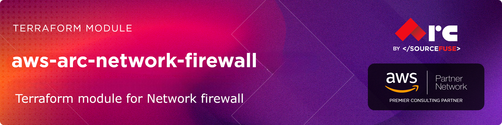

# [terraform-aws-arc-network-firewall](https://github.com/sourcefuse/terraform-aws-arc-network-firewall)

> **Module:** `sourcefuse/arc-network-firewall/aws`

> **Registry:** [https://registry.terraform.io/modules/sourcefuse/arc-network-firewall/aws](https://registry.terraform.io/modules/sourcefuse/arc-network-firewall/aws)

> **Category:** Networking / Security

> **Source:** [https://github.com/sourcefuse/terraform-aws-arc-network-firewall](https://github.com/sourcefuse/terraform-aws-arc-network-firewall)

[](https://github.com/sourcefuse/terraform-aws-arc-network-firewall/releases/latest)
[](https://github.com/sourcefuse/terraform-aws-arc-network-firewall/commits)


[](https://sonarcloud.io/summary/new_code?id=sourcefuse_terraform-aws-arc-network-firewall)

> [!TIP]
> 🤖 **New:** Use this module with AI assistants via the [ARC IaC MCP Server](https://github.com/sourcefuse/arc-iac-mcp) — search, scaffold, and security-scan ARC modules from natural language. [Quick setup ↓](#ai-assistant-integration-arc-iac-mcp)

## Overview

Creates AWS Network Firewall with stateless and stateful rule groups, firewall policies, and logging configuration.

## What It Does

- Network Firewall with configurable VPC and subnets
- Stateless rule groups for fast packet filtering
- Stateful rule groups (Suricata-compatible rules)
- Firewall policy with default actions
- CloudWatch and S3 logging for flow and alert logs
- Domain-based filtering with stateful rules

For more information about this repository and its usage, please see [Terraform AWS NETWORK FIREWALL Usage Guide](https://github.com/sourcefuse/terraform-aws-arc-network-firewall/blob/main/docs/module-usage-guide/README.md).

## Quickstart

```hcl
module "network_firewall" {
  source = "sourcefuse/arc-network-firewall/aws"

  name        = "my-network-firewall"
  description = "Basic Network Firewall"

  create_firewall = true
  vpc_id          = "vpc-12345678"
  subnet_ids      = ["subnet-12345678", "subnet-87654321"]

  firewall_policy_config = {
    create                             = true
    name                               = "my-firewall-policy"
    stateless_default_actions          = ["aws:forward_to_sfe"]
    stateless_fragment_default_actions = ["aws:forward_to_sfe"]
  }

  tags = {
    Environment = "production"
    Project     = "security"
  }
}
```

### Transit Gateway-Attached Firewall

```hcl
module "network_firewall" {
  source = "sourcefuse/arc-network-firewall/aws"

  name               = "tgw-firewall"
  availability_zones = ["use1-az1", "use1-az2"]

  create_firewall = true
  firewall_config = {
    transit_gateway_id = "tgw-12345678"
  }

  firewall_policy_config = {
    create                             = true
    name                               = "tgw-policy"
    stateless_default_actions          = ["aws:forward_to_sfe"]
    stateless_fragment_default_actions = ["aws:forward_to_sfe"]
  }

  tags = {
    Environment = "production"
    Project     = "security"
  }
}
```

### Firewall with Resource Policy

```hcl
module "network_firewall" {
  source = "sourcefuse/arc-network-firewall/aws"

  name        = "firewall-with-policy"
  description = "Network Firewall with resource policy"

  create_firewall = true
  vpc_id          = "vpc-12345678"
  subnet_ids      = ["subnet-12345678", "subnet-87654321"]

  firewall_policy_config = {
    create                             = true
    name                               = "shared-policy"
    stateless_default_actions          = ["aws:forward_to_sfe"]
    stateless_fragment_default_actions = ["aws:forward_to_sfe"]
  }

  create_firewall_policy_resource_policy = true
  firewall_policy_resource_policy = {
    statements = [
      {
        actions = [
          "network-firewall:ListFirewallPolicies",
          "network-firewall:CreateFirewall",
          "network-firewall:UpdateFirewall",
          "network-firewall:AssociateFirewallPolicy"
        ]
        effect = "Allow"
        principals = {
          aws = ["arn:aws:iam::123456789012:root"]
        }
      }
    ]
  }

  tags = {
    Environment = "production"
    Project     = "security"
  }
}
```

## Required Inputs

| Name | Type | Description |
|------|------|-------------|
| `name` | `string` | Firewall name |
| `vpc_id` | `string` | VPC ID |
| `subnet_ids` | `list(string)` | Subnet IDs for firewall endpoints |
| `firewall_policy_config` | `object` | Firewall policy configuration |
## Key Outputs

| Name | Description |
|------|-------------|
| `firewall_arn` | Network Firewall ARN |
| `firewall_status` | Firewall sync states per AZ |
## Full Variable & Output Reference

The complete inputs/outputs reference is auto-generated below.

<!-- BEGINNING OF PRE-COMMIT-TERRAFORM DOCS HOOK -->
## Requirements

| Name | Version |
|------|---------|
| <a name="requirement_terraform"></a> [terraform](#requirement\_terraform) | >= 1.3 |
| <a name="requirement_aws"></a> [aws](#requirement\_aws) | >= 5.0, < 7.0 |

## Providers

| Name | Version |
|------|---------|
| <a name="provider_aws"></a> [aws](#provider\_aws) | 6.16.0 |

## Modules

| Name | Source | Version |
|------|--------|---------|
| <a name="module_s3_firewall_logs"></a> [s3\_firewall\_logs](#module\_s3\_firewall\_logs) | sourcefuse/arc-s3/aws | 0.0.5 |

## Resources

| Name | Type |
|------|------|
| [aws_cloudwatch_log_group.firewall_logs](https://registry.terraform.io/providers/hashicorp/aws/latest/docs/resources/cloudwatch_log_group) | resource |
| [aws_networkfirewall_firewall.this](https://registry.terraform.io/providers/hashicorp/aws/latest/docs/resources/networkfirewall_firewall) | resource |
| [aws_networkfirewall_firewall_policy.this](https://registry.terraform.io/providers/hashicorp/aws/latest/docs/resources/networkfirewall_firewall_policy) | resource |
| [aws_networkfirewall_logging_configuration.this](https://registry.terraform.io/providers/hashicorp/aws/latest/docs/resources/networkfirewall_logging_configuration) | resource |
| [aws_networkfirewall_resource_policy.example](https://registry.terraform.io/providers/hashicorp/aws/latest/docs/resources/networkfirewall_resource_policy) | resource |
| [aws_networkfirewall_resource_policy.firewall_policy](https://registry.terraform.io/providers/hashicorp/aws/latest/docs/resources/networkfirewall_resource_policy) | resource |
| [aws_networkfirewall_rule_group.this](https://registry.terraform.io/providers/hashicorp/aws/latest/docs/resources/networkfirewall_rule_group) | resource |
| [aws_networkfirewall_tls_inspection_configuration.this](https://registry.terraform.io/providers/hashicorp/aws/latest/docs/resources/networkfirewall_tls_inspection_configuration) | resource |
| [aws_networkfirewall_vpc_endpoint_association.this](https://registry.terraform.io/providers/hashicorp/aws/latest/docs/resources/networkfirewall_vpc_endpoint_association) | resource |

## Inputs

| Name | Description | Type | Default | Required |
|------|-------------|------|---------|:--------:|
| <a name="input_availability_zones"></a> [availability\_zones](#input\_availability\_zones) | List of availability zone IDs for transit gateway-attached firewall | `list(string)` | `[]` | no |
| <a name="input_create_firewall"></a> [create\_firewall](#input\_create\_firewall) | Controls whether the Network Firewall should be created | `bool` | `true` | no |
| <a name="input_create_firewall_policy_resource_policy"></a> [create\_firewall\_policy\_resource\_policy](#input\_create\_firewall\_policy\_resource\_policy) | Whether to create a resource policy for the firewall policy | `bool` | `false` | no |
| <a name="input_create_rule_group_resource_policy"></a> [create\_rule\_group\_resource\_policy](#input\_create\_rule\_group\_resource\_policy) | Whether to attach a resource policy to the Rule Group | `bool` | `false` | no |
| <a name="input_description"></a> [description](#input\_description) | Description of the Network Firewall | `string` | `null` | no |
| <a name="input_firewall_config"></a> [firewall\_config](#input\_firewall\_config) | Combined firewall settings | <pre>object({<br/>    transit_gateway_id                  = optional(string)<br/>    delete_protection                   = optional(bool, false)<br/>    subnet_change_protection            = optional(bool, false)<br/>    firewall_policy_change_protection   = optional(bool, false)<br/>    availability_zone_change_protection = optional(bool, false)<br/>    enabled_analysis_types              = optional(list(string), [])<br/>    encryption_configuration = optional(object({<br/>      type   = string<br/>      key_id = optional(string)<br/>    }))<br/>    timeouts = optional(object({<br/>      create = optional(string)<br/>      update = optional(string)<br/>      delete = optional(string)<br/>    }))<br/>  })</pre> | `{}` | no |
| <a name="input_firewall_policy_config"></a> [firewall\_policy\_config](#input\_firewall\_policy\_config) | # Firewall Policy Configuration | <pre>object({<br/>    create      = optional(bool, false)<br/>    arn         = optional(string)<br/>    name        = optional(string)<br/>    description = optional(string)<br/>    encryption_configuration = optional(object({<br/>      type   = string<br/>      key_id = optional(string)<br/>    }))<br/>    stateless_default_actions          = optional(list(string), ["aws:forward_to_sfe"])<br/>    stateless_fragment_default_actions = optional(list(string), ["aws:forward_to_sfe"])<br/>    stateful_default_actions           = optional(list(string))<br/>    stateful_engine_options = optional(object({<br/>      rule_order              = optional(string, "DEFAULT_ACTION_ORDER")<br/>      stream_exception_policy = optional(string, "DROP")<br/>      flow_timeouts = optional(object({<br/>        tcp_idle_timeout_seconds = optional(number, 350)<br/>      }))<br/>    }))<br/>    policy_variables = optional(object({<br/>      rule_variables = optional(map(object({<br/>        definition = list(string)<br/>      })), {})<br/>    }), {})<br/>    stateless_rule_groups = optional(list(object({<br/>      resource_arn = string<br/>      priority     = number<br/>    })), [])<br/>    stateful_rule_groups = optional(list(object({<br/>      resource_arn           = string<br/>      priority               = number<br/>      deep_threat_inspection = optional(bool)<br/>      override = optional(object({<br/>        action = string<br/>      }))<br/>    })), [])<br/>    stateless_custom_actions = optional(list(object({<br/>      action_name = string<br/>      action_definition = object({<br/>        publish_metric_action = object({<br/>          dimensions = list(object({<br/>            value = string<br/>          }))<br/>        })<br/>      })<br/>    })), [])<br/>    tls_inspection_configuration_arn    = optional(string)<br/>    create_tls_inspection_configuration = optional(bool, false)<br/>  })</pre> | `{}` | no |
| <a name="input_firewall_policy_resource_policy"></a> [firewall\_policy\_resource\_policy](#input\_firewall\_policy\_resource\_policy) | Resource policy configuration for the firewall policy | <pre>object({<br/>    statements = list(object({<br/>      actions = list(string)<br/>      effect  = string<br/>      principals = object({<br/>        aws = list(string)<br/>      })<br/>    }))<br/>  })</pre> | <pre>{<br/>  "statements": []<br/>}</pre> | no |
| <a name="input_logging_config"></a> [logging\_config](#input\_logging\_config) | List of logging destinations to configure.<br/>Example:<br/>[<br/>  {<br/>    log\_type            = "FLOW"<br/>    log\_destination\_type = "S3"<br/>    log\_destination\_name = "firewall-logs-bucket"<br/>  },<br/>  {<br/>    log\_type            = "ALERT"<br/>    log\_destination\_type = "CloudWatchLogs"<br/>    log\_destination\_name = "firewall-alerts-loggroup"<br/>  }<br/>] | <pre>object({<br/>    enable             = optional(bool, true)<br/>    log_retention_days = optional(number, 7)<br/>    destinations = optional(list(object({<br/>      log_type             = string<br/>      log_destination_type = string # S3 | CloudWatchLogs | KinesisDataFirehose<br/>      log_destination_name = string # bucket name or log group name<br/>    })), [])<br/>  })</pre> | `{}` | no |
| <a name="input_name"></a> [name](#input\_name) | Name of the Network Firewall | `string` | n/a | yes |
| <a name="input_rule_group_config"></a> [rule\_group\_config](#input\_rule\_group\_config) | Complete rule group configuration in one object | <pre>object({<br/>    create      = optional(bool, false)<br/>    description = optional(string)<br/>    capacity    = optional(number)<br/>    type        = optional(string)<br/>    encryption_configuration = optional(object({<br/>      type   = string<br/>      key_id = optional(string)<br/>    }))<br/>    rules = optional(string)<br/>    rule_variables = optional(object({<br/>      ip_sets = optional(list(object({<br/>        key        = string<br/>        definition = list(string)<br/>      })))<br/>      port_sets = optional(list(object({<br/>        key        = string<br/>        definition = list(string)<br/>      })))<br/>    }))<br/>    rules_source = optional(object({<br/>      rules_source_list = optional(list(object({<br/>        generated_rules_type = string<br/>        target_types         = list(string)<br/>        targets              = list(string)<br/>      })))<br/>      rules_string = optional(string)<br/>      stateful_rules = optional(list(object({<br/>        action = string<br/>        header = object({<br/>          destination      = string<br/>          destination_port = string<br/>          direction        = string<br/>          protocol         = string<br/>          source           = string<br/>          source_port      = string<br/>        })<br/>        rule_options = optional(list(object({<br/>          keyword  = string<br/>          settings = optional(list(string))<br/>        })))<br/>      })))<br/>      stateless = optional(list(object({<br/>        custom_actions = optional(list(object({<br/>          action_name = string<br/>          dimension   = string<br/>        })))<br/>        rules = list(object({<br/>          priority = number<br/>          actions  = list(string)<br/>          match = object({<br/>            destination = string<br/>            destination_port = object({<br/>              from = number<br/>              to   = number<br/>            })<br/>            source = string<br/>            source_port = object({<br/>              from = number<br/>              to   = number<br/>            })<br/>            protocols = optional(list(number))<br/>          })<br/>        }))<br/>      })))<br/>    }))<br/>    stateful_rule_options = optional(object({<br/>      rule_order = string<br/>    }))<br/>    reference_sets = optional(list(object({<br/>      key = string<br/>      arn = string<br/>    })))<br/>  })</pre> | `{}` | no |
| <a name="input_rule_group_resource_policy"></a> [rule\_group\_resource\_policy](#input\_rule\_group\_resource\_policy) | IAM-style resource policy for Network Firewall Rule Group | <pre>object({<br/>    statements = list(object({<br/>      actions = list(string)<br/>      effect  = string<br/>      principals = object({<br/>        aws = list(string)<br/>      })<br/>    }))<br/>  })</pre> | <pre>{<br/>  "statements": []<br/>}</pre> | no |
| <a name="input_subnet_ids"></a> [subnet\_ids](#input\_subnet\_ids) | List of subnet IDs for firewall endpoints | `list(string)` | `[]` | no |
| <a name="input_tags"></a> [tags](#input\_tags) | Tags to apply to all resources | `map(string)` | `{}` | no |
| <a name="input_tls_inspection_configuration"></a> [tls\_inspection\_configuration](#input\_tls\_inspection\_configuration) | TLS inspection configuration | <pre>object({<br/>    create      = optional(bool, false)<br/>    name        = optional(string)<br/>    description = optional(string)<br/>    encryption_configuration = optional(object({<br/>      key_id = optional(string)<br/>      type   = optional(string, "AWS_OWNED_KMS_KEY")<br/>    }))<br/>    server_certificate_configurations = optional(list(object({<br/>      certificate_authority_arn = optional(string)<br/>      check_certificate_revocation_status = optional(object({<br/>        revoked_status_action = optional(string, "REJECT")<br/>        unknown_status_action = optional(string, "PASS")<br/>      }))<br/>      server_certificates = optional(list(object({<br/>        resource_arn = string<br/>      })), [])<br/>      scopes = list(object({<br/>        protocols = optional(list(number), [6])<br/>        destinations = list(object({<br/>          address_definition = string<br/>        }))<br/>        destination_ports = optional(list(object({<br/>          from_port = number<br/>          to_port   = optional(number)<br/>        })), [])<br/>        sources = optional(list(object({<br/>          address_definition = string<br/>        })), [])<br/>        source_ports = optional(list(object({<br/>          from_port = number<br/>          to_port   = optional(number)<br/>        })), [])<br/>      }))<br/>    })), [])<br/>    timeouts = optional(object({<br/>      create = optional(string)<br/>      update = optional(string)<br/>      delete = optional(string)<br/>    }))<br/>  })</pre> | `{}` | no |
| <a name="input_vpc_endpoint_association"></a> [vpc\_endpoint\_association](#input\_vpc\_endpoint\_association) | Configuration for VPC Endpoint Association | <pre>object({<br/>    create      = optional(bool, false)<br/>    description = optional(string)<br/>    subnet_mappings = optional(list(object({<br/>      subnet_id       = string<br/>      ip_address_type = optional(string) # IPV4 or DUALSTACK<br/>    })), [])<br/>  })</pre> | `{}` | no |
| <a name="input_vpc_id"></a> [vpc\_id](#input\_vpc\_id) | VPC ID where the firewall will be deployed | `string` | `null` | no |

## Outputs

| Name | Description |
|------|-------------|
| <a name="output_arn"></a> [arn](#output\_arn) | ARN of the rule group |
| <a name="output_availability_zones"></a> [availability\_zones](#output\_availability\_zones) | Availability zones where firewall endpoints are created |
| <a name="output_firewall_arn"></a> [firewall\_arn](#output\_firewall\_arn) | The firewall ARN |
| <a name="output_firewall_endpoint_ids"></a> [firewall\_endpoint\_ids](#output\_firewall\_endpoint\_ids) | Map of endpoint IDs per AZ |
| <a name="output_firewall_id"></a> [firewall\_id](#output\_firewall\_id) | The firewall ID |
| <a name="output_firewall_name"></a> [firewall\_name](#output\_firewall\_name) | Firewall name |
| <a name="output_firewall_policy_arn"></a> [firewall\_policy\_arn](#output\_firewall\_policy\_arn) | The Amazon Resource Name (ARN) that identifies the firewall policy |
| <a name="output_firewall_policy_id"></a> [firewall\_policy\_id](#output\_firewall\_policy\_id) | The Amazon Resource Name (ARN) that identifies the firewall policy |
| <a name="output_firewall_policy_name"></a> [firewall\_policy\_name](#output\_firewall\_policy\_name) | The name of the firewall policy |
| <a name="output_firewall_policy_resource_policy_id"></a> [firewall\_policy\_resource\_policy\_id](#output\_firewall\_policy\_resource\_policy\_id) | ID of the firewall policy resource policy |
| <a name="output_firewall_policy_update_token"></a> [firewall\_policy\_update\_token](#output\_firewall\_policy\_update\_token) | A string token used when updating the firewall policy |
| <a name="output_firewall_status"></a> [firewall\_status](#output\_firewall\_status) | Firewall status |
| <a name="output_id"></a> [id](#output\_id) | ID of the rule group |
| <a name="output_logging_configuration_id"></a> [logging\_configuration\_id](#output\_logging\_configuration\_id) | The Amazon Resource Name (ARN) of the associated firewall for logging |
| <a name="output_resource_policy_ids"></a> [resource\_policy\_ids](#output\_resource\_policy\_ids) | List of resource policy IDs |
| <a name="output_subnet_ids"></a> [subnet\_ids](#output\_subnet\_ids) | List of subnet IDs where firewall endpoints are created |
| <a name="output_tags_all"></a> [tags\_all](#output\_tags\_all) | All tags for the firewall |
| <a name="output_tls_inspection_configuration_arn"></a> [tls\_inspection\_configuration\_arn](#output\_tls\_inspection\_configuration\_arn) | ARN of the TLS inspection configuration |
| <a name="output_tls_inspection_configuration_certificate_authority"></a> [tls\_inspection\_configuration\_certificate\_authority](#output\_tls\_inspection\_configuration\_certificate\_authority) | Certificate authority information |
| <a name="output_tls_inspection_configuration_certificates"></a> [tls\_inspection\_configuration\_certificates](#output\_tls\_inspection\_configuration\_certificates) | Certificates information |
| <a name="output_tls_inspection_configuration_id"></a> [tls\_inspection\_configuration\_id](#output\_tls\_inspection\_configuration\_id) | ID of the TLS inspection configuration |
| <a name="output_tls_inspection_configuration_update_token"></a> [tls\_inspection\_configuration\_update\_token](#output\_tls\_inspection\_configuration\_update\_token) | Update token of the TLS inspection configuration |
| <a name="output_transit_gateway_id"></a> [transit\_gateway\_id](#output\_transit\_gateway\_id) | The Transit Gateway ID for transit gateway-attached firewall |
| <a name="output_update_token"></a> [update\_token](#output\_update\_token) | Update token of the rule group |
| <a name="output_vpc_id"></a> [vpc\_id](#output\_vpc\_id) | The VPC ID where the firewall is deployed |
<!-- END OF PRE-COMMIT-TERRAFORM DOCS HOOK -->


## AI Assistant Integration (ARC IaC MCP)

The **[ARC IaC MCP Server](https://github.com/sourcefuse/arc-iac-mcp)** is a hosted Model Context Protocol service that lets AI assistants browse, search, scaffold, compare, and security-scan any of the SourceFuse ARC Terraform modules — directly from natural language.

**What you can do with it:**

- **Discover** — search and filter modules by keyword or AWS resource type.
- **Understand** — get inputs, outputs, and resources for any module without leaving your editor.
- **Scaffold** — generate production-ready, multi-file Terraform with cross-module wiring already done.
- **Secure** — scan generated or existing HCL for misconfigurations before it hits a PR.
- **Compare** — diff modules side-by-side to make informed architectural decisions.

### Setup (one minute)

The MCP endpoint is `https://arc-iac-mcp.sourcef.us/mcp`. Pick your client:

**Claude Code CLI:**
```bash
claude mcp add arc-iac --transport http https://arc-iac-mcp.sourcef.us/mcp
```

**Claude Desktop** — edit `~/Library/Application Support/Claude/claude_desktop_config.json`:
```json
{
  "mcpServers": {
    "arc-iac": {
      "url": "https://arc-iac-mcp.sourcef.us/mcp"
    }
  }
}
```

**Cursor / Windsurf / Kiro** — add the same block to `.cursor/mcp.json` (or the equivalent for your client).

### Example prompts to try

- *"List all ARC modules sorted by downloads"*
- *"What inputs does `arc-ecs` require?"*
- *"Scaffold a production-ready `arc-db` Aurora setup with Secrets Manager"*
- *"Compare `arc-eks` and `arc-ecs` for running 10 microservices"*
- *"Scan this Terraform before I raise a PR: `<paste HCL>`"*

See the [ARC IaC MCP repo](https://github.com/sourcefuse/arc-iac-mcp) for the full tool reference, troubleshooting tips, and local-development instructions.

## Contributing
See [CONTRIBUTING.md](./CONTRIBUTING.md) for commit conventions and development setup.

## Authors
This project is authored by:
- SourceFuse
