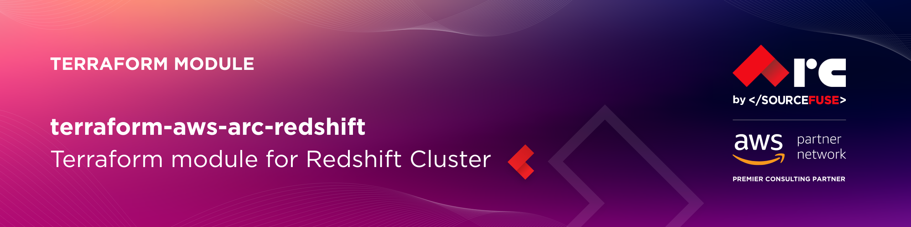

# AWS Redshift Terraform Module

# [terraform-aws-arc-redshift](https://github.com/sourcefuse/terraform-aws-arc-redshift)

<a href="https://github.com/sourcefuse/terraform-aws-arc-redshift/releases/latest"></a> <a href="https://github.com/sourcefuse/terraform-aws-arc-redshift/commits"></a>  

[](https://sonarcloud.io/summary/new_code?id=sourcefuse_terraform-aws-arc-redshift)


## Overview

The ARC Terraform-aws-arc-redshift module provides a comprehensive and unified solution for deploying Amazon Redshift data warehousing infrastructure on AWS. This versatile module supports both traditional Amazon Redshift provisioned clusters and the newer Redshift Serverless workgroups, allowing you to choose the
deployment model that best fits your workload requirements and cost optimization needs.

### Prerequisites
Before using this module, ensure you have the following:

- AWS credentials configured.
- Terraform installed.
- A working knowledge of Terraform.

## Getting Started

1. **Define the Module**

Initially, it's essential to define a Terraform module, which is organized as a distinct directory encompassing Terraform configuration files. Within this module directory, input variables and output values must be defined in the variables.tf and outputs.tf files, respectively. The following illustrates an example directory structure:


```plaintext
redshift/
|-- main.tf
|-- variables.tf
|-- outputs.tf
```


2. **Define Input Variables**

Inside the `variables.tf` or in `*.tfvars` file, you should define values for the variables that the module requires.

3. **Use the Module in Your Main Configuration**
In your main Terraform configuration file (e.g., main.tf), you can use the module. Specify the source of the module, and version, For Example

```hcl
module "redshift" {
  source                 = "sourcefuse/arc-redshift/aws"
  version                = "0.0.1"

  namespace   = var.namespace
  environment = var.environment
  name        = var.name

  # Network configuration - using the subnets we created
  vpc_id     = data.aws_vpc.vpc.id
  subnet_ids = data.aws_subnets.private.ids

  # Cluster configuration
  database_name        = var.database_name
  master_username      = var.master_username
  manage_user_password = var.manage_user_password
  security_group_data    = var.security_group_data
  security_group_name           = var.security_group_name
  node_type            = var.node_type
  number_of_nodes      = var.node_count
  cluster_type         = var.node_count > 1 ? "multi-node" : "single-node"

  # Other configuration
  skip_final_snapshot = true
  publicly_accessible = false
  encrypted           = true

  tags = module.tags.tags
}
```

4. **Output Values**

Inside the `outputs.tf` file of the module, you can define output values that can be referenced in the main configuration. For example:

```hcl
output "redshift_cluster_id" {
  description = "The ID of the Redshift cluster"
  value       = module.redshift.redshift_cluster_id
}

output "redshift_cluster_endpoint" {
  description = "The connection endpoint for the Redshift cluster"
  value       = module.redshift.redshift_cluster_endpoint
}

output "redshift_endpoint" {
  description = "The endpoint of the Redshift deployment (either cluster or serverless)"
  value       = module.redshift.redshift_endpoint
}

```

5. **.tfvars**

Inside the `.tfvars` file of the module, you can provide desired values that can be referenced in the main configuration.


## First Time Usage
***uncomment the backend block in [main.tf](./examples/endpoint//main.tf)***
```shell
terraform init -backend-config=config.dev.hcl
```
***If testing locally, `terraform init` should be fine***

Create a `dev` workspace
```shell
terraform workspace new dev
```

Plan Terraform
```shell
terraform plan -var-file dev.tfvars
```

Apply Terraform
```shell
terraform apply -var-file dev.tfvars
```

## Production Setup
```shell
terraform init -backend-config=config.prod.hcl
```

Create a `prod` workspace
```shell
terraform workspace new prod
```

Plan Terraform
```shell
terraform plan -var-file prod.tfvars
```

Apply Terraform
```shell
terraform apply -var-file prod.tfvars  
```


<!-- BEGIN_TF_DOCS -->
## Requirements

| Name | Version |
|------|---------|
| <a name="requirement_terraform"></a> [terraform](#requirement\_terraform) | >= 1.5.0 |
| <a name="requirement_terraform"></a> [terraform](#requirement\_terraform) | >= 1.5.0 |
| <a name="requirement_aws"></a> [aws](#requirement\_aws) | ~> 5.0 |
| <a name="requirement_random"></a> [random](#requirement\_random) | ~> 3.1 |

## Providers

| Name | Version |
|------|---------|
| <a name="provider_aws"></a> [aws](#provider\_aws) | 4.67.0 |

## Modules

| Name | Source | Version |
|------|--------|---------|
| <a name="module_redshift_cluster"></a> [redshift\_cluster](#module\_redshift\_cluster) | ./modules/redshift-cluster | n/a |
| <a name="module_redshift_serverless"></a> [redshift\_serverless](#module\_redshift\_serverless) | ./modules/redshift-serverless | n/a |

## Resources

| Name | Type |
|------|------|
| [aws_caller_identity.current](https://registry.terraform.io/providers/hashicorp/aws/latest/docs/data-sources/caller_identity) | data source |

## Inputs

| Name | Description | Type | Default | Required |
|------|-------------|------|---------|:--------:|
| <a name="input_additional_security_group_ids"></a> [additional\_security\_group\_ids](#input\_additional\_security\_group\_ids) | Additional security group IDs to be added to the Redshift Serverless workgroup. | `list(string)` | `[]` | no |
| <a name="input_admin_password"></a> [admin\_password](#input\_admin\_password) | n/a | `string` | `null` | no |
| <a name="input_admin_username"></a> [admin\_username](#input\_admin\_username) | Admin username for the Redshift Serverless namespace. | `string` | `"admin"` | no |
| <a name="input_allow_version_upgrade"></a> [allow\_version\_upgrade](#input\_allow\_version\_upgrade) | If true, major version upgrades can be applied during maintenance windows | `bool` | `true` | no |
| <a name="input_automated_snapshot_retention_period"></a> [automated\_snapshot\_retention\_period](#input\_automated\_snapshot\_retention\_period) | The number of days that automated snapshots are retained | `number` | `7` | no |
| <a name="input_base_capacity"></a> [base\_capacity](#input\_base\_capacity) | The base data warehouse capacity in Redshift Processing Units (RPUs) | `number` | `32` | no |
| <a name="input_cluster_identifier"></a> [cluster\_identifier](#input\_cluster\_identifier) | The Cluster Identifier | `string` | `null` | no |
| <a name="input_cluster_parameter_group_name"></a> [cluster\_parameter\_group\_name](#input\_cluster\_parameter\_group\_name) | The name of the parameter group to be associated with this cluster | `string` | `null` | no |
| <a name="input_cluster_subnet_group_name"></a> [cluster\_subnet\_group\_name](#input\_cluster\_subnet\_group\_name) | The name of a cluster subnet group to be associated with this cluster. If not specified, a new subnet group will be created | `string` | `null` | no |
| <a name="input_cluster_type"></a> [cluster\_type](#input\_cluster\_type) | The cluster type to use. Either 'single-node' or 'multi-node' | `string` | `"single-node"` | no |
| <a name="input_config_parameters"></a> [config\_parameters](#input\_config\_parameters) | A list of configuration parameters to apply to the Redshift Serverless namespace. | <pre>list(object({<br/>    parameter_key   = string<br/>    parameter_value = string<br/>  }))</pre> | `[]` | no |
| <a name="input_create_random_password"></a> [create\_random\_password](#input\_create\_random\_password) | Determines whether to create random password for cluster `master_password` | `bool` | `true` | no |
| <a name="input_create_security_groups"></a> [create\_security\_groups](#input\_create\_security\_groups) | Whether to create security groups for Redshift Serverless resources | `bool` | `true` | no |
| <a name="input_database_name"></a> [database\_name](#input\_database\_name) | The name of the database to create | `string` | n/a | yes |
| <a name="input_egress_rules"></a> [egress\_rules](#input\_egress\_rules) | A list of egress rules for the security group. | <pre>list(object({<br/>    from_port   = number<br/>    to_port     = number<br/>    protocol    = string<br/>    cidr_blocks = list(string)<br/>  }))</pre> | `[]` | no |
| <a name="input_enable_serverless"></a> [enable\_serverless](#input\_enable\_serverless) | Enable Redshift Serverless. If true, creates the serverless module; if false, creates the standard cluster module. | `bool` | `false` | no |
| <a name="input_encrypted"></a> [encrypted](#input\_encrypted) | If true, the data in the cluster is encrypted at rest | `bool` | `true` | no |
| <a name="input_enhanced_vpc_routing"></a> [enhanced\_vpc\_routing](#input\_enhanced\_vpc\_routing) | If true, enhanced VPC routing is enabled | `bool` | `false` | no |
| <a name="input_environment"></a> [environment](#input\_environment) | Name of the environment, i.e. dev, stage, prod | `string` | n/a | yes |
| <a name="input_final_snapshot_identifier"></a> [final\_snapshot\_identifier](#input\_final\_snapshot\_identifier) | The identifier of the final snapshot that is to be created immediately before deleting the cluster | `string` | `null` | no |
| <a name="input_ingress_rules"></a> [ingress\_rules](#input\_ingress\_rules) | A list of ingress rules for the security group. | <pre>list(object({<br/>    from_port   = number<br/>    to_port     = number<br/>    protocol    = string<br/>    cidr_blocks = list(string)<br/>  }))</pre> | `[]` | no |
| <a name="input_kms_key_id"></a> [kms\_key\_id](#input\_kms\_key\_id) | The ARN for the KMS encryption key | `string` | `null` | no |
| <a name="input_manage_admin_password"></a> [manage\_admin\_password](#input\_manage\_admin\_password) | If true, Redshift will manage the admin password | `bool` | `false` | no |
| <a name="input_manage_user_password"></a> [manage\_user\_password](#input\_manage\_user\_password) | Set to true to allow RDS to manage the master user password in Secrets Manager | `bool` | `null` | no |
| <a name="input_master_password"></a> [master\_password](#input\_master\_password) | Password for the master DB user. If null, a random password will be generated | `string` | `null` | no |
| <a name="input_master_username"></a> [master\_username](#input\_master\_username) | Username for the master DB user | `string` | n/a | yes |
| <a name="input_max_capacity"></a> [max\_capacity](#input\_max\_capacity) | The maximum data warehouse capacity in Redshift Processing Units (RPUs) | `number` | `512` | no |
| <a name="input_name"></a> [name](#input\_name) | Name for the Redshift resources | `string` | n/a | yes |
| <a name="input_namespace"></a> [namespace](#input\_namespace) | Namespace of the project, i.e. arc | `string` | n/a | yes |
| <a name="input_namespace_name"></a> [namespace\_name](#input\_namespace\_name) | The name of the Redshift Serverless namespace | `string` | `null` | no |
| <a name="input_node_type"></a> [node\_type](#input\_node\_type) | The node type to be provisioned for the cluster | `string` | `"dc2.large"` | no |
| <a name="input_number_of_nodes"></a> [number\_of\_nodes](#input\_number\_of\_nodes) | Number of nodes in the cluster | `number` | `1` | no |
| <a name="input_port"></a> [port](#input\_port) | The port number on which the cluster accepts incoming connections | `number` | `5439` | no |
| <a name="input_publicly_accessible"></a> [publicly\_accessible](#input\_publicly\_accessible) | If true, the cluster can be accessed from a public network | `bool` | `false` | no |
| <a name="input_security_group_data"></a> [security\_group\_data](#input\_security\_group\_data) | (optional) Security Group data | <pre>object({<br/>    security_group_ids_to_attach = optional(list(string), [])<br/>    create                       = optional(bool, true)<br/>    description                  = optional(string, null)<br/>    ingress_rules = optional(list(object({<br/>      description              = optional(string, null)<br/>      cidr_block               = optional(string, null)<br/>      source_security_group_id = optional(string, null)<br/>      from_port                = number<br/>      ip_protocol              = string<br/>      to_port                  = string<br/>      self                     = optional(bool, false)<br/>    })), [])<br/>    egress_rules = optional(list(object({<br/>      description                   = optional(string, null)<br/>      cidr_block                    = optional(string, null)<br/>      destination_security_group_id = optional(string, null)<br/>      from_port                     = number<br/>      ip_protocol                   = string<br/>      to_port                       = string<br/>      prefix_list_id                = optional(string, null)<br/>    })), [])<br/>  })</pre> | <pre>{<br/>  "create": false<br/>}</pre> | no |
| <a name="input_security_group_name"></a> [security\_group\_name](#input\_security\_group\_name) | Redshift Serverless resourcesr security group name | `string` | `"Redshift-Serverless-sg"` | no |
| <a name="input_skip_final_snapshot"></a> [skip\_final\_snapshot](#input\_skip\_final\_snapshot) | Determines whether a final snapshot of the cluster is created before Redshift deletes it | `bool` | `false` | no |
| <a name="input_snapshot_identifier"></a> [snapshot\_identifier](#input\_snapshot\_identifier) | The name of the snapshot from which to create the new cluster | `string` | `null` | no |
| <a name="input_subnet_ids"></a> [subnet\_ids](#input\_subnet\_ids) | List of subnet IDs for the Redshift subnet group | `list(string)` | `[]` | no |
| <a name="input_tags"></a> [tags](#input\_tags) | Tags to apply to resources | `map(string)` | `{}` | no |
| <a name="input_track_name"></a> [track\_name](#input\_track\_name) | Optional track name for Redshift Serverless (used for versioning or preview tracks). | `string` | `null` | no |
| <a name="input_vpc_id"></a> [vpc\_id](#input\_vpc\_id) | ID of the VPC for Redshift | `string` | `null` | no |
| <a name="input_vpc_security_group_ids"></a> [vpc\_security\_group\_ids](#input\_vpc\_security\_group\_ids) | A list of Virtual Private Cloud (VPC) security groups to be associated with the cluster | `list(string)` | `[]` | no |
| <a name="input_workgroup_name"></a> [workgroup\_name](#input\_workgroup\_name) | The name of the Redshift Serverless workgroup | `string` | `null` | no |

## Outputs

| Name | Description |
|------|-------------|
| <a name="output_redshift_cluster_arn"></a> [redshift\_cluster\_arn](#output\_redshift\_cluster\_arn) | The ARN of the Redshift cluster |
| <a name="output_redshift_cluster_database_name"></a> [redshift\_cluster\_database\_name](#output\_redshift\_cluster\_database\_name) | The name of the default database in the Redshift cluster |
| <a name="output_redshift_cluster_endpoint"></a> [redshift\_cluster\_endpoint](#output\_redshift\_cluster\_endpoint) | The connection endpoint for the Redshift cluster |
| <a name="output_redshift_cluster_hostname"></a> [redshift\_cluster\_hostname](#output\_redshift\_cluster\_hostname) | The hostname of the Redshift cluster |
| <a name="output_redshift_cluster_id"></a> [redshift\_cluster\_id](#output\_redshift\_cluster\_id) | The ID of the Redshift cluster |
| <a name="output_redshift_cluster_namespace_arn"></a> [redshift\_cluster\_namespace\_arn](#output\_redshift\_cluster\_namespace\_arn) | The ARN of the Redshift cluster |
| <a name="output_redshift_cluster_port"></a> [redshift\_cluster\_port](#output\_redshift\_cluster\_port) | The port of the Redshift cluster |
| <a name="output_redshift_cluster_security_group_id"></a> [redshift\_cluster\_security\_group\_id](#output\_redshift\_cluster\_security\_group\_id) | The ID of the security group associated with the Redshift cluster |
| <a name="output_redshift_database_name"></a> [redshift\_database\_name](#output\_redshift\_database\_name) | The name of the database in the Redshift deployment |
| <a name="output_redshift_endpoint"></a> [redshift\_endpoint](#output\_redshift\_endpoint) | The endpoint of the Redshift deployment (either cluster or serverless) |
| <a name="output_redshift_serverless_endpoint"></a> [redshift\_serverless\_endpoint](#output\_redshift\_serverless\_endpoint) | The endpoint URL for the Redshift Serverless workgroup |
| <a name="output_redshift_serverless_namespace_arn"></a> [redshift\_serverless\_namespace\_arn](#output\_redshift\_serverless\_namespace\_arn) | The ARN of the Redshift Serverless namespace |
| <a name="output_redshift_serverless_namespace_id"></a> [redshift\_serverless\_namespace\_id](#output\_redshift\_serverless\_namespace\_id) | The ID of the Redshift Serverless namespace |
| <a name="output_redshift_serverless_workgroup_arn"></a> [redshift\_serverless\_workgroup\_arn](#output\_redshift\_serverless\_workgroup\_arn) | The ARN of the Redshift Serverless workgroup |
| <a name="output_redshift_serverless_workgroup_id"></a> [redshift\_serverless\_workgroup\_id](#output\_redshift\_serverless\_workgroup\_id) | The ID of the Redshift Serverless workgroup |
| <a name="output_redshift_subnet_group_id"></a> [redshift\_subnet\_group\_id](#output\_redshift\_subnet\_group\_id) | The ID of the Redshift subnet group |
<!-- END_TF_DOCS -->

## Versioning  
This project uses a `.version` file at the root of the repo which the pipeline reads from and does a git tag.  

When you intend to commit to `main`, you will need to increment this version. Once the project is merged,
the pipeline will kick off and tag the latest git commit.  

## Development

### Prerequisites

- [terraform](https://learn.hashicorp.com/terraform/getting-started/install#installing-terraform)
- [terraform-docs](https://github.com/segmentio/terraform-docs)
- [pre-commit](https://pre-commit.com/#install)
- [golang](https://golang.org/doc/install#install)
- [golint](https://github.com/golang/lint#installation)

### Configurations

- Configure pre-commit hooks
  ```sh
  pre-commit install
  ```

### Versioning

while Contributing or doing git commit please specify the breaking change in your commit message whether its major,minor or patch

For Example

```sh
git commit -m "your commit message #major"
```
By specifying this , it will bump the version and if you don't specify this in your commit message then by default it will consider patch and will bump that accordingly

### Tests
- Tests are available in `test` directory
- Configure the dependencies
  ```sh
  cd test/
  go mod init github.com/sourcefuse/terraform-aws-refarch-<module_name>
  go get github.com/gruntwork-io/terratest/modules/terraform
  ```
- Now execute the test  
  ```sh
  go test -timeout  30m
  ```

## Authors

This project is authored by:
- SourceFuse ARC Team
