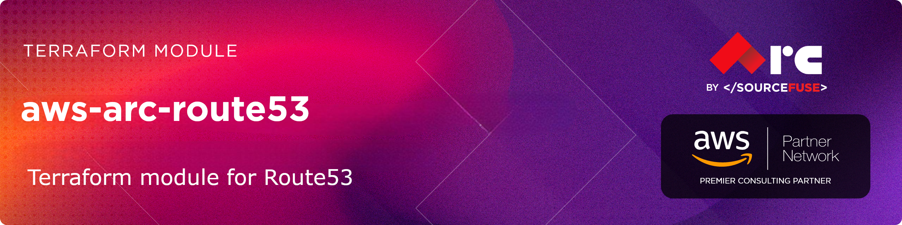

# [terraform-aws-arc-route53](https://github.com/sourcefuse/terraform-aws-arc-route53)

> **Module:** `sourcefuse/arc-route53/aws`

> **Registry:** [https://registry.terraform.io/modules/sourcefuse/arc-route53/aws](https://registry.terraform.io/modules/sourcefuse/arc-route53/aws)

> **Category:** Networking / DNS

> **Source:** [https://github.com/sourcefuse/terraform-aws-arc-route53](https://github.com/sourcefuse/terraform-aws-arc-route53)

[](https://github.com/sourcefuse/terraform-aws-arc-route53/releases/latest)
[](https://github.com/sourcefuse/terraform-aws-arc-route53/commits)


[](https://sonarcloud.io/summary/new_code?id=sourcefuse_terraform-aws-arc-route532)

> [!TIP]
> 🤖 **New:** Use this module with AI assistants via the [ARC IaC MCP Server](https://github.com/sourcefuse/arc-iac-mcp) — search, scaffold, and security-scan ARC modules from natural language. [Quick setup ↓](#ai-assistant-integration-arc-iac-mcp)

## Overview

Manages Route53 hosted zones and DNS records (A, CNAME, MX, TXT, alias) with health check associations.

## What It Does

- Public and private hosted zone creation
- A, AAAA, CNAME, MX, TXT, NS, and alias records
- Health check association for failover routing
- Weighted, latency, and geolocation routing policies
- Route53 Resolver rules and endpoints

## Quickstart

```hcl
module "tags" {
  source  = "sourcefuse/arc-tags/aws"
  version = "1.2.6"

  environment = "production"
  project     = "terraform-aws-arc-route53"
}

module "route53" {
  source = "path/to/module"

  name    = "example.com"
  comment = "Production DNS zone"

  records = {
    "example.com" = {
      type    = "A"
      ttl     = 300
      records = ["192.0.2.1"]
    }
    "www.example.com" = {
      type    = "CNAME"
      ttl     = 300
      records = ["example.com"]
    }
  }

  tags = module.tags.tags
}
```
### Private Hosted Zone

```hcl
module "route53_private" {
  source = "path/to/module"

  name      = "internal.example.com"
  zone_type = "private"
  vpc_id    = "vpc-12345678"

  records = {
    "db.internal.example.com" = {
      type    = "A"
      ttl     = 300
      records = ["10.0.1.100"]
    }
  }
}
```

### Alias Record (ALB)

```hcl
module "route53_alias" {
  source = "path/to/module"

  name = "example.com"

  records = {
    "app.example.com" = {
      type = "A"
      alias = {
        name                   = aws_lb.main.dns_name
        zone_id                = aws_lb.main.zone_id
        evaluate_target_health = true
      }
    }
  }
}
```

### Failover Routing with Health Checks

```hcl
module "route53_failover" {
  source = "path/to/module"

  name = "example.com"

  health_checks = {
    "primary" = {
      type              = "HTTPS"
      fqdn              = "primary.example.com"
      port              = 443
      resource_path     = "/health"
      failure_threshold = 3
      request_interval  = 30
    }
  }

  records = {
    "api.example.com" = {
      type            = "A"
      ttl             = 60
      records         = ["192.0.2.1"]
      set_identifier  = "primary"
      health_check_id = module.route53_failover.health_check_ids["primary"]
      failover_routing_policy = {
        type = "PRIMARY"
      }
    }
  }
}
```
## Examples

- [Basic Public Zone](examples/basic/) - Simple public hosted zone with A and CNAME records
- [Private Zone](examples/private_zone/) - Private hosted zone with VPC association
- [Alias Records](examples/alias_record/) - ALB and CloudFront alias records
- [Advanced Routing](examples/advanced_routing/) - Weighted, failover, latency, and geolocation routing

## Usage

To see a full example, check out the [main.tf](./example/main.tf) file in the example folder.  

```hcl
module "this" {
  source = "git::https://github.com/sourcefuse/terraform-aws-arc-route53"
}
```

## Required Inputs

| Name | Type | Description |
|------|------|-------------|
| `name` | `string` | Hosted zone domain name |
## Key Outputs

| Name | Description |
|------|-------------|
| `zone_id` | Route53 hosted zone ID |
| `zone_arn` | Route53 hosted zone ARN |
| `name_servers` | List of name servers |
## Full Variable & Output Reference

The complete inputs/outputs reference is auto-generated below.

<!-- BEGINNING OF PRE-COMMIT-TERRAFORM DOCS HOOK -->
## Requirements

| Name | Version |
|------|---------|
| <a name="requirement_terraform"></a> [terraform](#requirement\_terraform) | >= 1.5.0 |
| <a name="requirement_aws"></a> [aws](#requirement\_aws) | >= 5.0, < 7.0 |

## Providers

| Name | Version |
|------|---------|
| <a name="provider_aws"></a> [aws](#provider\_aws) | 6.35.1 |

## Modules

No modules.

## Resources

| Name | Type |
|------|------|
| [aws_route53_health_check.calculated](https://registry.terraform.io/providers/hashicorp/aws/latest/docs/resources/route53_health_check) | resource |
| [aws_route53_health_check.cloudwatch](https://registry.terraform.io/providers/hashicorp/aws/latest/docs/resources/route53_health_check) | resource |
| [aws_route53_health_check.endpoint](https://registry.terraform.io/providers/hashicorp/aws/latest/docs/resources/route53_health_check) | resource |
| [aws_route53_hosted_zone_dnssec.this](https://registry.terraform.io/providers/hashicorp/aws/latest/docs/resources/route53_hosted_zone_dnssec) | resource |
| [aws_route53_key_signing_key.this](https://registry.terraform.io/providers/hashicorp/aws/latest/docs/resources/route53_key_signing_key) | resource |
| [aws_route53_record.alias](https://registry.terraform.io/providers/hashicorp/aws/latest/docs/resources/route53_record) | resource |
| [aws_route53_record.this](https://registry.terraform.io/providers/hashicorp/aws/latest/docs/resources/route53_record) | resource |
| [aws_route53_vpc_association_authorization.this](https://registry.terraform.io/providers/hashicorp/aws/latest/docs/resources/route53_vpc_association_authorization) | resource |
| [aws_route53_zone.this](https://registry.terraform.io/providers/hashicorp/aws/latest/docs/resources/route53_zone) | resource |
| [aws_route53_zone_association.secondary](https://registry.terraform.io/providers/hashicorp/aws/latest/docs/resources/route53_zone_association) | resource |
| [aws_region.current](https://registry.terraform.io/providers/hashicorp/aws/latest/docs/data-sources/region) | data source |
| [aws_route53_zone.existing](https://registry.terraform.io/providers/hashicorp/aws/latest/docs/data-sources/route53_zone) | data source |

## Inputs

| Name | Description | Type | Default | Required |
|------|-------------|------|---------|:--------:|
| <a name="input_comment"></a> [comment](#input\_comment) | Comment for the hosted zone | `string` | `"Managed by Terraform"` | no |
| <a name="input_create_zone"></a> [create\_zone](#input\_create\_zone) | Whether to create the Route 53 hosted zone | `bool` | `true` | no |
| <a name="input_delegation_set_id"></a> [delegation\_set\_id](#input\_delegation\_set\_id) | ID of the reusable delegation set to associate with the zone | `string` | `null` | no |
| <a name="input_dnssec_kms_key_arn"></a> [dnssec\_kms\_key\_arn](#input\_dnssec\_kms\_key\_arn) | ARN of KMS key for DNSSEC signing (must be in us-east-1) | `string` | `null` | no |
| <a name="input_dnssec_signing_key_name"></a> [dnssec\_signing\_key\_name](#input\_dnssec\_signing\_key\_name) | Name for the DNSSEC key signing key | `string` | `null` | no |
| <a name="input_enable_accelerated_recovery"></a> [enable\_accelerated\_recovery](#input\_enable\_accelerated\_recovery) | Enable Route 53 Accelerated Recovery (60-minute RTO for public zones) | `bool` | `null` | no |
| <a name="input_enable_dnssec"></a> [enable\_dnssec](#input\_enable\_dnssec) | Enable DNSSEC signing for the hosted zone | `bool` | `false` | no |
| <a name="input_force_destroy"></a> [force\_destroy](#input\_force\_destroy) | Whether to force destroy all records in the zone when deleting | `bool` | `false` | no |
| <a name="input_health_checks"></a> [health\_checks](#input\_health\_checks) | Map of health checks to create | <pre>map(object({<br/>    type                            = string # HTTP, HTTPS, TCP, CALCULATED, HTTP_STR_MATCH, HTTPS_STR_MATCH, CLOUDWATCH_METRIC<br/>    resource_path                   = optional(string)<br/>    fqdn                            = optional(string)<br/>    ip_address                      = optional(string)<br/>    port                            = optional(number)<br/>    protocol                        = optional(string)<br/>    failure_threshold               = optional(number, 3)<br/>    request_interval                = optional(number, 30)<br/>    measure_latency                 = optional(bool, false)<br/>    enable_sni                      = optional(bool, true)<br/>    search_string                   = optional(string)<br/>    cloudwatch_alarm_name           = optional(string)<br/>    cloudwatch_alarm_region         = optional(string)<br/>    insufficient_data_health_status = optional(string, "Healthy")<br/>    child_health_checks             = optional(list(string))<br/>    child_healthcheck_threshold     = optional(number)<br/>    disabled                        = optional(bool, false)<br/>    invert_healthcheck              = optional(bool, false)<br/>    routing_control_arn             = optional(string)<br/>  }))</pre> | `{}` | no |
| <a name="input_name"></a> [name](#input\_name) | Name of the Route 53 hosted zone | `string` | n/a | yes |
| <a name="input_records"></a> [records](#input\_records) | Map of DNS records to create | <pre>map(object({<br/>    type    = string<br/>    ttl     = optional(number)<br/>    records = optional(list(string))<br/><br/>    # Alias configuration<br/>    alias = optional(object({<br/>      name                   = string<br/>      zone_id                = string<br/>      evaluate_target_health = optional(bool, false)<br/>    }))<br/><br/>    # Routing policies<br/>    set_identifier = optional(string)<br/><br/>    # Weighted routing<br/>    weighted_routing_policy = optional(object({<br/>      weight = number<br/>    }))<br/><br/>    # Latency routing<br/>    latency_routing_policy = optional(object({<br/>      region = string<br/>    }))<br/><br/>    # Failover routing<br/>    failover_routing_policy = optional(object({<br/>      type = string # PRIMARY or SECONDARY<br/>    }))<br/><br/>    # Geolocation routing<br/>    geolocation_routing_policy = optional(object({<br/>      continent   = optional(string)<br/>      country     = optional(string)<br/>      subdivision = optional(string)<br/>    }))<br/><br/>    # Geoproximity routing<br/>    geoproximity_routing_policy = optional(object({<br/>      aws_region = optional(string)<br/>      bias       = optional(number)<br/>      coordinates = optional(list(object({<br/>        latitude  = number<br/>        longitude = number<br/>      })))<br/>      local_zone_group = optional(string)<br/>    }))<br/><br/>    # CIDR routing<br/>    cidr_routing_policy = optional(object({<br/>      collection_id = string<br/>      location_name = string<br/>    }))<br/><br/>    # Multivalue answer routing<br/>    multivalue_answer_routing_policy = optional(bool)<br/><br/>    # Health check<br/>    health_check_id = optional(string)<br/><br/>    # Allow overwrite<br/>    allow_overwrite = optional(bool, false)<br/><br/>    # Timeouts<br/>    record_timeouts = optional(object({<br/>      create = optional(string)<br/>      update = optional(string)<br/>      delete = optional(string)<br/>    }))<br/>  }))</pre> | `{}` | no |
| <a name="input_secondary_vpcs"></a> [secondary\_vpcs](#input\_secondary\_vpcs) | List of secondary VPCs to associate with the hosted zone | <pre>list(object({<br/>    vpc_id     = string<br/>    vpc_region = optional(string)<br/>  }))</pre> | `[]` | no |
| <a name="input_tags"></a> [tags](#input\_tags) | A map of tags to assign to resources | `map(string)` | `{}` | no |
| <a name="input_vpc_association_authorizations"></a> [vpc\_association\_authorizations](#input\_vpc\_association\_authorizations) | VPC association authorizations for cross-account VPC associations | <pre>map(object({<br/>    vpc_id     = string<br/>    vpc_region = optional(string)<br/>  }))</pre> | `{}` | no |
| <a name="input_vpc_id"></a> [vpc\_id](#input\_vpc\_id) | VPC ID to associate with private hosted zone | `string` | `null` | no |
| <a name="input_vpc_region"></a> [vpc\_region](#input\_vpc\_region) | VPC region (defaults to current region if not specified) | `string` | `null` | no |
| <a name="input_zone_tags"></a> [zone\_tags](#input\_zone\_tags) | Additional tags specific to the hosted zone | `map(string)` | `{}` | no |
| <a name="input_zone_timeouts"></a> [zone\_timeouts](#input\_zone\_timeouts) | Timeouts for zone operations | <pre>object({<br/>    create = optional(string)<br/>    update = optional(string)<br/>    delete = optional(string)<br/>  })</pre> | `null` | no |
| <a name="input_zone_type"></a> [zone\_type](#input\_zone\_type) | Type of hosted zone (public or private) | `string` | `"public"` | no |

## Outputs

| Name | Description |
|------|-------------|
| <a name="output_dnssec_key_signing_key_id"></a> [dnssec\_key\_signing\_key\_id](#output\_dnssec\_key\_signing\_key\_id) | The ID of the DNSSEC key signing key |
| <a name="output_dnssec_key_signing_key_status"></a> [dnssec\_key\_signing\_key\_status](#output\_dnssec\_key\_signing\_key\_status) | The status of the DNSSEC key signing key |
| <a name="output_dnssec_status"></a> [dnssec\_status](#output\_dnssec\_status) | The status of DNSSEC for the hosted zone |
| <a name="output_health_check_arns"></a> [health\_check\_arns](#output\_health\_check\_arns) | Map of health check names to their ARNs |
| <a name="output_health_check_ids"></a> [health\_check\_ids](#output\_health\_check\_ids) | Map of health check names to their IDs |
| <a name="output_name_servers"></a> [name\_servers](#output\_name\_servers) | List of name servers for the hosted zone |
| <a name="output_record_ids"></a> [record\_ids](#output\_record\_ids) | Map of record names to their IDs |
| <a name="output_record_names"></a> [record\_names](#output\_record\_names) | Map of record names to their FQDNs |
| <a name="output_zone_arn"></a> [zone\_arn](#output\_zone\_arn) | The ARN of the hosted zone |
| <a name="output_zone_id"></a> [zone\_id](#output\_zone\_id) | The hosted zone ID |
| <a name="output_zone_name"></a> [zone\_name](#output\_zone\_name) | The name of the hosted zone |
<!-- END OF PRE-COMMIT-TERRAFORM DOCS HOOK -->

## Versioning  
This project uses a `.version` file at the root of the repo which the pipeline reads from and does a git tag.  

When you intend to commit to `main`, you will need to increment this version. Once the project is merged,
the pipeline will kick off and tag the latest git commit.  

## Development

### Prerequisites

- [terraform](https://learn.hashicorp.com/terraform/getting-started/install#installing-terraform)
- [terraform-docs](https://github.com/segmentio/terraform-docs)
- [pre-commit](https://pre-commit.com/#install)
- [golang](https://golang.org/doc/install#install)
- [golint](https://github.com/golang/lint#installation)

### Configurations

- Configure pre-commit hooks
  ```sh
  pre-commit install
  ```

### Versioning

while Contributing or doing git commit please specify the breaking change in your commit message whether its major,minor or patch

For Example

```sh
git commit -m "your commit message #major"
```
By specifying this , it will bump the version and if you don't specify this in your commit message then by default it will consider patch and will bump that accordingly

### Tests
- Tests are available in `test` directory
- Configure the dependencies
  ```sh
  cd test/
  go mod init github.com/sourcefuse/terraform-aws-refarch-<module_name>
  go get github.com/gruntwork-io/terratest/modules/terraform
  ```
- Now execute the test  
  ```sh
  go test -timeout  30m
  ```

## AI Assistant Integration (ARC IaC MCP)

The **[ARC IaC MCP Server](https://github.com/sourcefuse/arc-iac-mcp)** is a hosted Model Context Protocol service that lets AI assistants browse, search, scaffold, compare, and security-scan any of the SourceFuse ARC Terraform modules — directly from natural language.

**What you can do with it:**

- **Discover** — search and filter modules by keyword or AWS resource type.
- **Understand** — get inputs, outputs, and resources for any module without leaving your editor.
- **Scaffold** — generate production-ready, multi-file Terraform with cross-module wiring already done.
- **Secure** — scan generated or existing HCL for misconfigurations before it hits a PR.
- **Compare** — diff modules side-by-side to make informed architectural decisions.

### Setup (one minute)

The MCP endpoint is `https://arc-iac-mcp.sourcef.us/mcp`. Pick your client:

**Claude Code CLI:**
```bash
claude mcp add arc-iac --transport http https://arc-iac-mcp.sourcef.us/mcp
```

**Claude Desktop** — edit `~/Library/Application Support/Claude/claude_desktop_config.json`:
```json
{
  "mcpServers": {
    "arc-iac": {
      "url": "https://arc-iac-mcp.sourcef.us/mcp"
    }
  }
}
```

**Cursor / Windsurf / Kiro** — add the same block to `.cursor/mcp.json` (or the equivalent for your client).

### Example prompts to try

- *"List all ARC modules sorted by downloads"*
- *"What inputs does `arc-ecs` require?"*
- *"Scaffold a production-ready `arc-db` Aurora setup with Secrets Manager"*
- *"Compare `arc-eks` and `arc-ecs` for running 10 microservices"*
- *"Scan this Terraform before I raise a PR: `<paste HCL>`"*

See the [ARC IaC MCP repo](https://github.com/sourcefuse/arc-iac-mcp) for the full tool reference, troubleshooting tips, and local-development instructions.

## Contributing

See [CONTRIBUTING.md](./CONTRIBUTING.md) for commit conventions and development setup.

## Authors

This project is authored by:
- SourceFuse ARC Team
