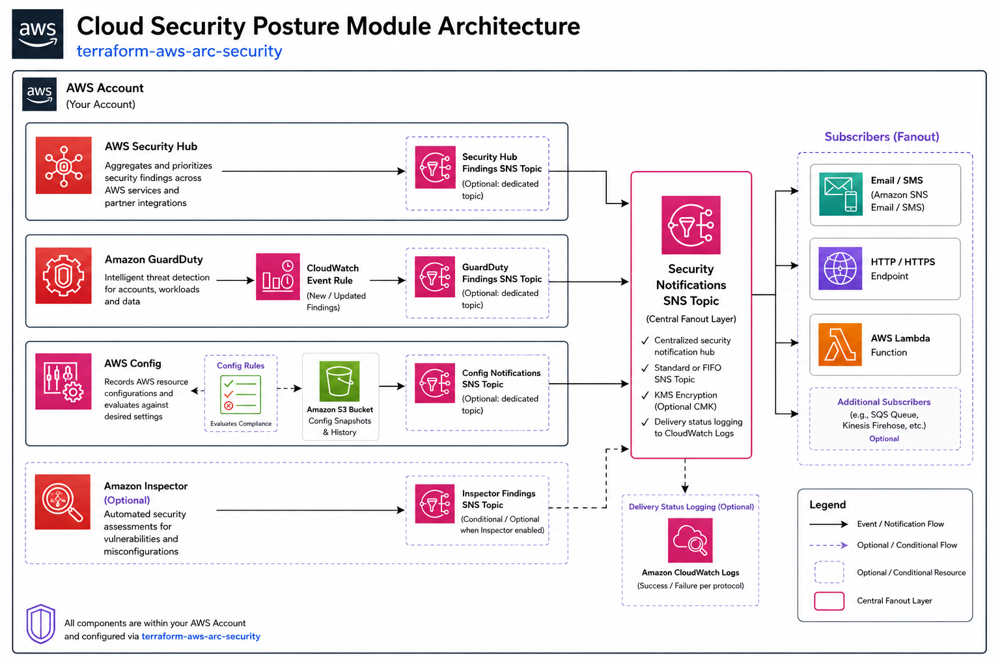

# [terraform-aws-arc-security](https://github.com/sourcefuse/terraform-aws-arc-security)

> **Module:** `sourcefuse/arc-security/aws`

> **Registry:** [https://registry.terraform.io/modules/sourcefuse/arc-security/aws](https://registry.terraform.io/modules/sourcefuse/arc-security/aws)

> **Category:** Security / Compliance

> **Source:** [https://github.com/sourcefuse/terraform-aws-arc-security](https://github.com/sourcefuse/terraform-aws-arc-security)

[](https://github.com/sourcefuse/terraform-aws-arc-security/releases/latest)
[](https://github.com/sourcefuse/terraform-aws-arc-security/commits)


[](https://sonarcloud.io/summary/new_code?id=sourcefuse_terraform-aws-arc-security)

> [!TIP]
> 🤖 **New:** Use this module with AI assistants via the [ARC IaC MCP Server](https://github.com/sourcefuse/arc-iac-mcp) — search, scaffold, and security-scan ARC modules from natural language. [Quick setup ↓](#ai-assistant-integration-arc-iac-mcp)

## Overview

Enables and configures AWS security services — GuardDuty, Security Hub, AWS Config, and Inspector — with SNS notifications.

## Architecture



## What It Does

- GuardDuty threat detection with SNS alerts
- Security Hub with configurable compliance standards
- AWS Config rules and conformance packs
- Amazon Inspector for vulnerability scanning
- SNS topics for security findings notifications
- IAM roles for Config recorder

For more information about this repository and its usage, please see [Terraform AWS Cloud Security Module Usage Guide](https://github.com/sourcefuse/terraform-aws-arc-security/blob/main/docs/module-usage-guide/README.md).

## Quickstart

```hcl
module "cloud_security" {
  source      = "sourcefuse/arc-security/aws"
  version     = "1.0.2"
  region      = var.region
  environment = var.environment
  namespace   = var.namespace

  enable_inspector    = true
  enable_aws_config   = true
  enable_guard_duty   = true
  enable_security_hub = false

  create_config_iam_role = true

  aws_config_sns_subscribers   = local.aws_config_sns_subscribers
  guard_duty_sns_subscribers   = local.guard_duty_sns_subscribers
  security_hub_sns_subscribers = local.security_hub_sns_subscribers

  aws_config_managed_rules       = var.aws_config_managed_rules
  enabled_security_hub_standards = local.security_hub_standards

  create_inspector_iam_role               = var.create_inspector_iam_role
  inspector_enabled_rules                 = var.inspector_enabled_rules
  inspector_schedule_expression           = var.inspector_schedule_expression
  inspector_assessment_event_subscription = var.inspector_assessment_event_subscription

  tags = module.tags.tags
}
```

## Required Inputs

| Name | Type | Description |
|------|------|-------------|
| `namespace` | `string` | Namespace prefix |
| `environment` | `string` | Deployment environment |
| `region` | `string` | AWS region |
## Key Outputs

| Name | Description |
|------|-------------|
| `guardduty_detector_id` | GuardDuty detector ID |
| `security_hub_arn` | Security Hub ARN |
| `config_recorder_id` | AWS Config recorder ID |
## Full Variable & Output Reference

The complete inputs/outputs reference is auto-generated below.

<!-- BEGINNING OF PRE-COMMIT-TERRAFORM DOCS HOOK -->
## Requirements

| Name | Version |
|------|---------|
| <a name="requirement_terraform"></a> [terraform](#requirement\_terraform) | >= 1.5.0 |
| <a name="requirement_aws"></a> [aws](#requirement\_aws) | >= 5.0, < 6.0 |

## Providers

| Name | Version |
|------|---------|
| <a name="provider_aws"></a> [aws](#provider\_aws) | 5.99.1 |

## Modules

| Name | Source | Version |
|------|--------|---------|
| <a name="module_aws_config_storage"></a> [aws\_config\_storage](#module\_aws\_config\_storage) | cloudposse/config-storage/aws | 1.0.2 |
| <a name="module_config"></a> [config](#module\_config) | cloudposse/config/aws | 1.5.2 |
| <a name="module_guard_duty"></a> [guard\_duty](#module\_guard\_duty) | cloudposse/guardduty/aws | 0.6.0 |
| <a name="module_guard_duty_sns_topic"></a> [guard\_duty\_sns\_topic](#module\_guard\_duty\_sns\_topic) | cloudposse/sns-topic/aws | 0.20.1 |
| <a name="module_inspector"></a> [inspector](#module\_inspector) | ./modules/inspector | n/a |
| <a name="module_security_hub"></a> [security\_hub](#module\_security\_hub) | cloudposse/security-hub/aws | 0.12.2 |
| <a name="module_securityhub_sns_kms_key"></a> [securityhub\_sns\_kms\_key](#module\_securityhub\_sns\_kms\_key) | cloudposse/kms-key/aws | 0.12.2 |
| <a name="module_securityhub_sns_topic"></a> [securityhub\_sns\_topic](#module\_securityhub\_sns\_topic) | cloudposse/sns-topic/aws | 0.21.0 |
| <a name="module_sns_guard_duty"></a> [sns\_guard\_duty](#module\_sns\_guard\_duty) | cloudposse/sns-topic/aws | 0.21.0 |

## Resources

| Name | Type |
|------|------|
| [aws_cloudwatch_event_rule.guard_duty_findings](https://registry.terraform.io/providers/hashicorp/aws/latest/docs/resources/cloudwatch_event_rule) | resource |
| [aws_cloudwatch_event_rule.imported_findings](https://registry.terraform.io/providers/hashicorp/aws/latest/docs/resources/cloudwatch_event_rule) | resource |
| [aws_cloudwatch_event_target.guard_duty_imported_findings](https://registry.terraform.io/providers/hashicorp/aws/latest/docs/resources/cloudwatch_event_target) | resource |
| [aws_cloudwatch_event_target.security_hub_imported_findings](https://registry.terraform.io/providers/hashicorp/aws/latest/docs/resources/cloudwatch_event_target) | resource |
| [aws_kms_alias.this](https://registry.terraform.io/providers/hashicorp/aws/latest/docs/resources/kms_alias) | resource |
| [aws_kms_key.this](https://registry.terraform.io/providers/hashicorp/aws/latest/docs/resources/kms_key) | resource |
| [aws_sns_topic_policy.sns_topic_guard_duty](https://registry.terraform.io/providers/hashicorp/aws/latest/docs/resources/sns_topic_policy) | resource |
| [aws_caller_identity.current](https://registry.terraform.io/providers/hashicorp/aws/latest/docs/data-sources/caller_identity) | data source |
| [aws_iam_policy_document.guard_duty_sns_topic_policy](https://registry.terraform.io/providers/hashicorp/aws/latest/docs/data-sources/iam_policy_document) | data source |
| [aws_iam_policy_document.securityhub_sns_kms_key_policy](https://registry.terraform.io/providers/hashicorp/aws/latest/docs/data-sources/iam_policy_document) | data source |
| [aws_iam_session_context.current](https://registry.terraform.io/providers/hashicorp/aws/latest/docs/data-sources/iam_session_context) | data source |
| [aws_partition.current](https://registry.terraform.io/providers/hashicorp/aws/latest/docs/data-sources/partition) | data source |
| [aws_region.current](https://registry.terraform.io/providers/hashicorp/aws/latest/docs/data-sources/region) | data source |

## Inputs

| Name | Description | Type | Default | Required |
|------|-------------|------|---------|:--------:|
| <a name="input_add_inspector_member_accounts"></a> [add\_inspector\_member\_accounts](#input\_add\_inspector\_member\_accounts) | Whether to associate as a member account with your Amazon Inspector delegated administrator account. | `bool` | `false` | no |
| <a name="input_aws_config_managed_rules"></a> [aws\_config\_managed\_rules](#input\_aws\_config\_managed\_rules) | A list of AWS Managed Rules that should be enabled on the account.<br><br>See the following for a list of possible rules to enable:<br>https://docs.aws.amazon.com/config/latest/developerguide/managed-rules-by-aws-config.html | <pre>map(object({<br>    description      = string<br>    identifier       = string<br>    input_parameters = any<br>    tags             = map(string)<br>    enabled          = bool<br>  }))</pre> | `{}` | no |
| <a name="input_aws_config_sns_subscribers"></a> [aws\_config\_sns\_subscribers](#input\_aws\_config\_sns\_subscribers) | A map of subscription configurations for SNS topics<br><br>For more information, see:<br>https://registry.terraform.io/providers/hashicorp/aws/latest/docs/resources/sns_topic_subscription#argument-reference<br><br>protocol:<br>  The protocol to use. The possible values for this are: sqs, sms, lambda, application. (http or https are partially<br>  supported, see link) (email is an option but is unsupported in terraform, see link).<br>endpoint:<br>  The endpoint to send data to, the contents will vary with the protocol. (see link for more information)<br>endpoint\_auto\_confirms:<br>  Boolean indicating whether the end point is capable of auto confirming subscription e.g., PagerDuty. Default is<br>  false<br>raw\_message\_delivery:<br>  Boolean indicating whether or not to enable raw message delivery (the original message is directly passed, not wrapped in JSON with the original message in the message property).<br>  Default is false | <pre>map(object({<br>    protocol               = string<br>    endpoint               = string<br>    endpoint_auto_confirms = bool<br>    raw_message_delivery   = bool<br>  }))</pre> | n/a | yes |
| <a name="input_create_config_iam_role"></a> [create\_config\_iam\_role](#input\_create\_config\_iam\_role) | Flag to indicate whether an iam role should be created for aws config. | `bool` | `false` | no |
| <a name="input_enable_aws_config"></a> [enable\_aws\_config](#input\_enable\_aws\_config) | Whether to enable AWS Config | `bool` | `true` | no |
| <a name="input_enable_guard_duty"></a> [enable\_guard\_duty](#input\_enable\_guard\_duty) | Whether to enable Guard Duty | `bool` | `true` | no |
| <a name="input_enable_inspector"></a> [enable\_inspector](#input\_enable\_inspector) | Whether to enable Inspector | `bool` | `true` | no |
| <a name="input_enable_inspector_at_orgnanization"></a> [enable\_inspector\_at\_orgnanization](#input\_enable\_inspector\_at\_orgnanization) | Whether to enable Inspecter at Org level, if false account\_list should be provided | `bool` | `false` | no |
| <a name="input_enable_security_hub"></a> [enable\_security\_hub](#input\_enable\_security\_hub) | Whether to enable Security Hub | `bool` | `true` | no |
| <a name="input_enabled_security_hub_standards"></a> [enabled\_security\_hub\_standards](#input\_enabled\_security\_hub\_standards) | A list of standards/rulesets to enable<br><br>See https://registry.terraform.io/providers/hashicorp/aws/latest/docs/resources/securityhub_standards_subscription#argument-reference<br><br>The possible values are:<br><br>  - standards/aws-foundational-security-best-practices/v/1.0.0<br>  - ruleset/cis-aws-foundations-benchmark/v/1.2.0<br>  - standards/pci-dss/v/3.2.1 | `list(any)` | n/a | yes |
| <a name="input_environment"></a> [environment](#input\_environment) | ID element. Usually used for region e.g. 'uw2', 'us-west-2', OR role 'prod', 'staging', 'dev', 'UAT' | `string` | n/a | yes |
| <a name="input_force_destroy"></a> [force\_destroy](#input\_force\_destroy) | (Optional, Default:false ) A boolean that indicates all objects should be deleted from the bucket so that the bucket can be destroyed without error. These objects are not recoverable | `bool` | `false` | no |
| <a name="input_guard_duty_s3_protection_enabled"></a> [guard\_duty\_s3\_protection\_enabled](#input\_guard\_duty\_s3\_protection\_enabled) | Flag to indicate whether S3 protection will be turned on in GuardDuty. | `bool` | `false` | no |
| <a name="input_guard_duty_sns_subscribers"></a> [guard\_duty\_sns\_subscribers](#input\_guard\_duty\_sns\_subscribers) | A map of subscription configurations for SNS topics<br><br>For more information, see:<br>https://registry.terraform.io/providers/hashicorp/aws/latest/docs/resources/sns_topic_subscription#argument-reference<br><br>protocol:<br>  The protocol to use. The possible values for this are: sqs, sms, lambda, application. (http or https are partially<br>  supported, see link) (email is an option but is unsupported in terraform, see link).<br>endpoint:<br>  The endpoint to send data to, the contents will vary with the protocol. (see link for more information)<br>endpoint\_auto\_confirms:<br>  Boolean indicating whether the end point is capable of auto confirming subscription e.g., PagerDuty. Default is<br>  false<br>raw\_message\_delivery:<br>  Boolean indicating whether or not to enable raw message delivery (the original message is directly passed, not wrapped in JSON with the original message in the message property).<br>  Default is false | <pre>map(object({<br>    protocol               = string<br>    endpoint               = string<br>    endpoint_auto_confirms = bool<br>    raw_message_delivery   = bool<br>  }))</pre> | `null` | no |
| <a name="input_inspector_account_list"></a> [inspector\_account\_list](#input\_inspector\_account\_list) | List of Account for which inspector has to be enabled | `list(string)` | n/a | yes |
| <a name="input_inspector_resource_types"></a> [inspector\_resource\_types](#input\_inspector\_resource\_types) | Type of resources to scan. Valid values are EC2, ECR, LAMBDA and LAMBDA\_CODE. At least one item is required. | `list(string)` | <pre>[<br>  "EC2",<br>  "ECR"<br>]</pre> | no |
| <a name="input_inspector_schedule_expression"></a> [inspector\_schedule\_expression](#input\_inspector\_schedule\_expression) | AWS Schedule Expression to indicate how often the inspector scheduled event shoud run | `string` | `"rate(7 days)"` | no |
| <a name="input_inspector_sns_subscribers"></a> [inspector\_sns\_subscribers](#input\_inspector\_sns\_subscribers) | A map of subscription configurations for SNS topics<br><br>For more information, see:<br>https://registry.terraform.io/providers/hashicorp/aws/latest/docs/resources/sns_topic_subscription#argument-reference<br><br>protocol:<br>  The protocol to use. The possible values for this are: sqs, sms, lambda, application. (http or https are partially<br>  supported, see link) (email is an option but is unsupported in terraform, see link).<br>endpoint:<br>  The endpoint to send data to, the contents will vary with the protocol. (see link for more information)<br>endpoint\_auto\_confirms:<br>  Boolean indicating whether the end point is capable of auto confirming subscription e.g., PagerDuty. Default is<br>  false<br>raw\_message\_delivery:<br>  Boolean indicating whether or not to enable raw message delivery (the original message is directly passed, not wrapped in JSON with the original message in the message property).<br>  Default is false | <pre>map(object({<br>    protocol               = string<br>    endpoint               = string<br>    endpoint_auto_confirms = bool<br>    raw_message_delivery   = bool<br>  }))</pre> | `null` | no |
| <a name="input_namespace"></a> [namespace](#input\_namespace) | Namespace for the resources. | `string` | n/a | yes |
| <a name="input_region"></a> [region](#input\_region) | AWS region | `string` | `"us-east-1"` | no |
| <a name="input_security_hub_sns_subscribers"></a> [security\_hub\_sns\_subscribers](#input\_security\_hub\_sns\_subscribers) | A map of subscription configurations for SNS topics<br><br>For more information, see:<br>https://registry.terraform.io/providers/hashicorp/aws/latest/docs/resources/sns_topic_subscription#argument-reference<br><br>protocol:<br>  The protocol to use. The possible values for this are: sqs, sms, lambda, application. (http or https are partially<br>  supported, see link) (email is an option but is unsupported in terraform, see link).<br>endpoint:<br>  The endpoint to send data to, the contents will vary with the protocol. (see link for more information)<br>endpoint\_auto\_confirms:<br>  Boolean indicating whether the end point is capable of auto confirming subscription e.g., PagerDuty. Default is<br>  false<br>raw\_message\_delivery:<br>  Boolean indicating whether or not to enable raw message delivery (the original message is directly passed, not wrapped in JSON with the original message in the message property).<br>  Default is false | <pre>map(object({<br>    protocol               = string<br>    endpoint               = string<br>    endpoint_auto_confirms = bool<br>    raw_message_delivery   = bool<br>  }))</pre> | `null` | no |
| <a name="input_tags"></a> [tags](#input\_tags) | Tags for AWS resources | `map(string)` | n/a | yes |

## Outputs

| Name | Description |
|------|-------------|
| <a name="output_aws_config_configuration_recorder_id"></a> [aws\_config\_configuration\_recorder\_id](#output\_aws\_config\_configuration\_recorder\_id) | The ID of the AWS Config Recorder |
| <a name="output_aws_config_iam_role"></a> [aws\_config\_iam\_role](#output\_aws\_config\_iam\_role) | IAM Role used to make read or write requests to the delivery channel and to describe the AWS resources associated with<br>the account. |
| <a name="output_aws_config_sns_topic"></a> [aws\_config\_sns\_topic](#output\_aws\_config\_sns\_topic) | SNS topic |
| <a name="output_aws_config_sns_topic_subscriptions"></a> [aws\_config\_sns\_topic\_subscriptions](#output\_aws\_config\_sns\_topic\_subscriptions) | SNS topic subscriptions |
| <a name="output_guard_duty_detector"></a> [guard\_duty\_detector](#output\_guard\_duty\_detector) | GuardDuty detector |
| <a name="output_guard_duty_sns_topic"></a> [guard\_duty\_sns\_topic](#output\_guard\_duty\_sns\_topic) | SNS topic |
| <a name="output_guard_duty_sns_topic_subscriptions"></a> [guard\_duty\_sns\_topic\_subscriptions](#output\_guard\_duty\_sns\_topic\_subscriptions) | SNS topic subscriptions |
| <a name="output_inspector_aws_cloudwatch_event_rule"></a> [inspector\_aws\_cloudwatch\_event\_rule](#output\_inspector\_aws\_cloudwatch\_event\_rule) | The AWS Inspector event rule |
| <a name="output_inspector_aws_cloudwatch_event_target"></a> [inspector\_aws\_cloudwatch\_event\_target](#output\_inspector\_aws\_cloudwatch\_event\_target) | The AWS Inspector event target |
| <a name="output_security_hub_enabled_subscriptions"></a> [security\_hub\_enabled\_subscriptions](#output\_security\_hub\_enabled\_subscriptions) | A list of subscriptions that have been enabled |
| <a name="output_security_hub_sns_topic"></a> [security\_hub\_sns\_topic](#output\_security\_hub\_sns\_topic) | The SNS topic that was created |
| <a name="output_security_hub_sns_topic_subscriptions"></a> [security\_hub\_sns\_topic\_subscriptions](#output\_security\_hub\_sns\_topic\_subscriptions) | The SNS topic that was created |
<!-- END OF PRE-COMMIT-TERRAFORM DOCS HOOK -->

### Git commits

while Contributing or doing git commit please specify the breaking change in your commit message whether its major,minor or patch

For Example

```sh
git commit -m "your commit message #major"
```
By specifying this , it will bump the version and if you dont specify this in your commit message then by default it will consider patch and will bump that accordingly


## Development

### Prerequisites

- [terraform](https://learn.hashicorp.com/terraform/getting-started/install#installing-terraform)
- [terraform-docs](https://github.com/segmentio/terraform-docs)
- [pre-commit](https://pre-commit.com/#install)
- [golang](https://golang.org/doc/install#install)
- [golint](https://github.com/golang/lint#installation)

### Configurations

- Configure pre-commit hooks
  ```sh
  pre-commit install
  ```

### Tests
- Tests are available in `test` directory
- Configure the dependencies
  ```sh
  cd test/
  go mod init github.com/sourcefuse/terraform-aws-refarch-<module_name>
  go get github.com/gruntwork-io/terratest/modules/terraform
  ```
- Now execute the test  
  ```sh
  go test -timeout  30m
  ```
## AI Assistant Integration (ARC IaC MCP)

The **[ARC IaC MCP Server](https://github.com/sourcefuse/arc-iac-mcp)** is a hosted Model Context Protocol service that lets AI assistants browse, search, scaffold, compare, and security-scan any of the SourceFuse ARC Terraform modules — directly from natural language.

**What you can do with it:**

- **Discover** — search and filter modules by keyword or AWS resource type.
- **Understand** — get inputs, outputs, and resources for any module without leaving your editor.
- **Scaffold** — generate production-ready, multi-file Terraform with cross-module wiring already done.
- **Secure** — scan generated or existing HCL for misconfigurations before it hits a PR.
- **Compare** — diff modules side-by-side to make informed architectural decisions.

### Setup (one minute)

The MCP endpoint is `https://arc-iac-mcp.sourcef.us/mcp`. Pick your client:

**Claude Code CLI:**
```bash
claude mcp add arc-iac --transport http https://arc-iac-mcp.sourcef.us/mcp
```

**Claude Desktop** — edit `~/Library/Application Support/Claude/claude_desktop_config.json`:
```json
{
  "mcpServers": {
    "arc-iac": {
      "url": "https://arc-iac-mcp.sourcef.us/mcp"
    }
  }
}
```

**Cursor / Windsurf / Kiro** — add the same block to `.cursor/mcp.json` (or the equivalent for your client).

### Example prompts to try

- *"List all ARC modules sorted by downloads"*
- *"What inputs does `arc-ecs` require?"*
- *"Scaffold a production-ready `arc-db` Aurora setup with Secrets Manager"*
- *"Compare `arc-eks` and `arc-ecs` for running 10 microservices"*
- *"Scan this Terraform before I raise a PR: `<paste HCL>`"*

See the [ARC IaC MCP repo](https://github.com/sourcefuse/arc-iac-mcp) for the full tool reference, troubleshooting tips, and local-development instructions.

## Contributing

See [CONTRIBUTING.md](./CONTRIBUTING.md) for commit conventions and development setup.

## Authors

This project is authored by:
- SourceFuse

