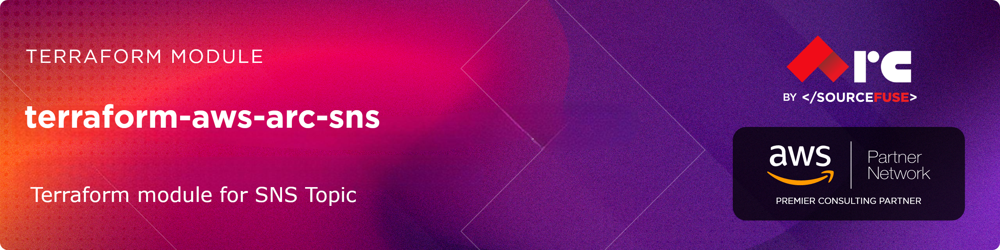

# AWS SNS Terraform Module

# [terraform-aws-arc-sns](https://github.com/sourcefuse/terraform-aws-arc-sns)

<a href="https://github.com/sourcefuse/terraform-aws-arc-sns/releases/latest"></a> <a href="https://github.com/sourcefuse/terraform-aws-arc-sns/commits"></a>  

[](https://sonarcloud.io/summary/new_code?id=sourcefuse_terraform-aws-arc-sns)


## Overview

The ARC Terraform module provides an easy and consistent way to create and manage Amazon SNS topics on AWS. This module supports defining topics, subscriptions, and policies, making it simple to connect services like S3, Lambda, and SQS. By using this module, you can quickly set up reliable messaging and notification workflows while following AWS best practices.

### Prerequisites
Before using this module, ensure you have the following:

- AWS credentials configured.
- Terraform installed.
- A working knowledge of Terraform.

## Getting Started

1. **Define the Module**

Initially, it's essential to define a Terraform module, which is organized as a distinct directory encompassing Terraform configuration files. Within this module directory, input variables and output values must be defined in the variables.tf and outputs.tf files, respectively. The following illustrates an example directory structure:


```plaintext
sns/
|-- main.tf
|-- variables.tf
|-- outputs.tf
```


2. **Define Input Variables**

Inside the `variables.tf` or in `*.tfvars` file, you should define values for the variables that the module requires.

3. **Use the Module in Your Main Configuration**
In your main Terraform configuration file (e.g., main.tf), you can use the module. Specify the source of the module, and version, For Example

```hcl
module "sns" {
  source               = "sourcefuse/arc-sns/aws"
  version              = "0.0.1"

  name                 = var.topic_name
  display_name         = var.display_name

  tags = module.tags.tags
}
```

4. **Output Values**

Inside the `outputs.tf` file of the module, you can define output values that can be referenced in the main configuration. For example:

```hcl
output "topic_arn" {
  description = "ARN of the created SNS topic"
  value       = module.basic_sns_topic.topic_arn
}

output "topic_name" {
  description = "Name of the created SNS topic"
  value       = module.basic_sns_topic.topic_name
}

```

5. **.tfvars**

Inside the `.tfvars` file of the module, you can provide desired values that can be referenced in the main configuration.


## First Time Usage
***uncomment the backend block in [main.tf](./examples/endpoint//main.tf)***
```shell
terraform init -backend-config=config.dev.hcl
```
***If testing locally, `terraform init` should be fine***

Create a `dev` workspace
```shell
terraform workspace new dev
```

Plan Terraform
```shell
terraform plan -var-file dev.tfvars
```

Apply Terraform
```shell
terraform apply -var-file dev.tfvars
```

## Production Setup
```shell
terraform init -backend-config=config.prod.hcl
```

Create a `prod` workspace
```shell
terraform workspace new prod
```

Plan Terraform
```shell
terraform plan -var-file prod.tfvars
```

Apply Terraform
```shell
terraform apply -var-file prod.tfvars  
```

<!-- BEGIN_TF_DOCS -->
## Requirements

| Name | Version |
|------|---------|
| <a name="requirement_terraform"></a> [terraform](#requirement\_terraform) | >= 1.5.0 |
| <a name="requirement_aws"></a> [aws](#requirement\_aws) | ~> 5.0 |

## Providers

| Name | Version |
|------|---------|
| <a name="provider_aws"></a> [aws](#provider\_aws) | 4.67.0 |

## Modules

No modules.

## Resources

| Name | Type |
|------|------|
| [aws_lambda_permission.external_lambda](https://registry.terraform.io/providers/hashicorp/aws/latest/docs/resources/lambda_permission) | resource |
| [aws_lambda_permission.sns_invoke](https://registry.terraform.io/providers/hashicorp/aws/latest/docs/resources/lambda_permission) | resource |
| [aws_sns_topic.this](https://registry.terraform.io/providers/hashicorp/aws/latest/docs/resources/sns_topic) | resource |
| [aws_sns_topic_subscription.this](https://registry.terraform.io/providers/hashicorp/aws/latest/docs/resources/sns_topic_subscription) | resource |

## Inputs

| Name | Description | Type | Default | Required |
|------|-------------|------|---------|:--------:|
| <a name="input_application_feedback"></a> [application\_feedback](#input\_application\_feedback) | Map of IAM role ARNs and sample rate for success and failure feedback | <pre>object({<br/>    failure_role_arn    = optional(string)<br/>    success_role_arn    = optional(string)<br/>    success_sample_rate = optional(number)<br/>  })</pre> | `{}` | no |
| <a name="input_archive_policy"></a> [archive\_policy](#input\_archive\_policy) | The message archive policy for FIFO topics | `string` | `null` | no |
| <a name="input_content_based_deduplication"></a> [content\_based\_deduplication](#input\_content\_based\_deduplication) | Enables content-based deduplication for FIFO topics | `bool` | `false` | no |
| <a name="input_create_subscription"></a> [create\_subscription](#input\_create\_subscription) | Whether to create SNS subscriptions | `bool` | `true` | no |
| <a name="input_create_topic"></a> [create\_topic](#input\_create\_topic) | Whether to create the SNS topic | `bool` | `true` | no |
| <a name="input_delivery_policy"></a> [delivery\_policy](#input\_delivery\_policy) | The SNS delivery policy | `string` | `null` | no |
| <a name="input_display_name"></a> [display\_name](#input\_display\_name) | Display name for the SNS topic | `string` | `null` | no |
| <a name="input_fifo_throughput_scope"></a> [fifo\_throughput\_scope](#input\_fifo\_throughput\_scope) | Enables higher throughput for FIFO topics by adjusting the scope of deduplication. Valid values: Topic, MessageGroup | `string` | `null` | no |
| <a name="input_fifo_topic"></a> [fifo\_topic](#input\_fifo\_topic) | Boolean indicating whether or not to create a FIFO (first-in-first-out) topic | `bool` | `false` | no |
| <a name="input_firehose_feedback"></a> [firehose\_feedback](#input\_firehose\_feedback) | Map of IAM role ARNs and sample rate for success and failure feedback | <pre>object({<br/>    failure_role_arn    = optional(string)<br/>    success_role_arn    = optional(string)<br/>    success_sample_rate = optional(number)<br/>  })</pre> | `{}` | no |
| <a name="input_http_feedback"></a> [http\_feedback](#input\_http\_feedback) | Map of IAM role ARNs and sample rate for success and failure feedback | <pre>object({<br/>    failure_role_arn    = optional(string)<br/>    success_role_arn    = optional(string)<br/>    success_sample_rate = optional(number)<br/>  })</pre> | `{}` | no |
| <a name="input_kms_master_key_id"></a> [kms\_master\_key\_id](#input\_kms\_master\_key\_id) | The ID of an AWS-managed customer master key (CMK) for Amazon SNS or a custom CMK | `string` | `null` | no |
| <a name="input_lambda_feedback"></a> [lambda\_feedback](#input\_lambda\_feedback) | Map of IAM role ARNs and sample rate for success and failure feedback | <pre>object({<br/>    failure_role_arn    = optional(string)<br/>    success_role_arn    = optional(string)<br/>    success_sample_rate = optional(number)<br/>  })</pre> | `{}` | no |
| <a name="input_lambda_permissions"></a> [lambda\_permissions](#input\_lambda\_permissions) | Map of Lambda function ARNs that should be granted permission to be invoked by this SNS topic | `map(string)` | `{}` | no |
| <a name="input_name"></a> [name](#input\_name) | Name of the SNS topic | `string` | n/a | yes |
| <a name="input_policy"></a> [policy](#input\_policy) | The fully-formed AWS policy as JSON | `string` | `null` | no |
| <a name="input_signature_version"></a> [signature\_version](#input\_signature\_version) | The signature version corresponds to the hashing algorithm used while creating the signature of the notifications | `number` | `null` | no |
| <a name="input_sqs_feedback"></a> [sqs\_feedback](#input\_sqs\_feedback) | Map of IAM role ARNs and sample rate for success and failure feedback | <pre>object({<br/>    failure_role_arn    = optional(string)<br/>    success_role_arn    = optional(string)<br/>    success_sample_rate = optional(number)<br/>  })</pre> | `{}` | no |
| <a name="input_subscriptions"></a> [subscriptions](#input\_subscriptions) | A map of subscription configurations | <pre>map(object({<br/>    protocol                        = string<br/>    endpoint                        = string<br/>    confirmation_timeout_in_minutes = optional(number, 1)<br/>    endpoint_auto_confirms          = optional(bool, false)<br/>    raw_message_delivery            = optional(bool, false)<br/>    filter_policy                   = optional(string)<br/>    filter_policy_scope             = optional(string)<br/>    delivery_policy                 = optional(string)<br/>    redrive_policy                  = optional(string)<br/>  }))</pre> | `{}` | no |
| <a name="input_tags"></a> [tags](#input\_tags) | A map of tags to assign to the resource | `map(string)` | `{}` | no |
| <a name="input_tracing_config"></a> [tracing\_config](#input\_tracing\_config) | Tracing mode of an Amazon SNS topic | `string` | `null` | no |
| <a name="input_use_name_prefix"></a> [use\_name\_prefix](#input\_use\_name\_prefix) | Determines whether name is used as a prefix | `bool` | `false` | no |

## Outputs

| Name | Description |
|------|-------------|
| <a name="output_subscriptions"></a> [subscriptions](#output\_subscriptions) | Map of subscriptions created and their attributes |
| <a name="output_topic_arn"></a> [topic\_arn](#output\_topic\_arn) | The ARN of the SNS topic |
| <a name="output_topic_display_name"></a> [topic\_display\_name](#output\_topic\_display\_name) | The display name of the SNS topic |
| <a name="output_topic_id"></a> [topic\_id](#output\_topic\_id) | The ID of the SNS topic |
| <a name="output_topic_name"></a> [topic\_name](#output\_topic\_name) | The name of the SNS topic |
| <a name="output_topic_owner"></a> [topic\_owner](#output\_topic\_owner) | The AWS Account ID of the SNS topic owner |
<!-- END_TF_DOCS -->

## Versioning  
This project uses a `.version` file at the root of the repo which the pipeline reads from and does a git tag.  

When you intend to commit to `main`, you will need to increment this version. Once the project is merged,
the pipeline will kick off and tag the latest git commit.  

## Development

### Prerequisites

- [terraform](https://learn.hashicorp.com/terraform/getting-started/install#installing-terraform)
- [terraform-docs](https://github.com/segmentio/terraform-docs)
- [pre-commit](https://pre-commit.com/#install)
- [golang](https://golang.org/doc/install#install)
- [golint](https://github.com/golang/lint#installation)

### Configurations

- Configure pre-commit hooks
  ```sh
  pre-commit install
  ```

### Versioning

while Contributing or doing git commit please specify the breaking change in your commit message whether its major,minor or patch

For Example

```sh
git commit -m "your commit message #major"
```
By specifying this , it will bump the version and if you don't specify this in your commit message then by default it will consider patch and will bump that accordingly

### Tests
- Tests are available in `test` directory
- Configure the dependencies
  ```sh
  cd test/
  go mod init github.com/sourcefuse/terraform-aws-refarch-<module_name>
  go get github.com/gruntwork-io/terratest/modules/terraform
  ```
- Now execute the test  
  ```sh
  go test -timeout  30m
  ```

## Authors

This project is authored by:
- SourceFuse ARC Team
