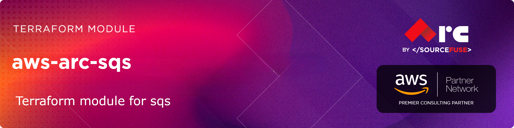

# [terraform-aws-arc-sqs](https://github.com/sourcefuse/terraform-aws-arc-sqs)

<a href="https://github.com/sourcefuse/terraform-aws-arc-sqs/releases/latest"></a> <a href="https://github.com/sourcefuse/terraform-aws-arc-sqs/commits"></a>  

[](https://sonarcloud.io/summary/new_code?id=sourcefuse_terraform-aws-arc-sqs)

## Overview

SourceFuse AWS Reference Architecture (ARC) Terraform module for managing Amazon SQS queues with enterprise-grade features and security best practices.

## Features

- **Multiple Queue Types**: Support for both Standard and FIFO queues with comprehensive configuration options
- **Dead Letter Queue Support**: Automatic DLQ provisioning with configurable retry policies for reliable message handling
- **Flexible Encryption**: Choice between SQS-managed SSE or customer-managed KMS encryption with automatic key rotation
- **Message Configuration**: Fine-grained control over retention, visibility timeouts, delays, and long polling
- **Queue Policies**: Integrated IAM policy management with support for cross-account and service access patterns
- **High Throughput FIFO**: Advanced FIFO configurations with per-message-group throughput and deduplication scopes
- **Modular Design**: Integrates seamlessly with other SourceFuse ARC modules (SNS, KMS, Tags)

## Usage

See the [examples](./examples/) directory for full examples.

```hcl
module "sqs" {
  source  = "sourcefuse/arc-sqs/aws"
  version = "0.0.1"

  name = "my-application-queue"

  # Enable Dead Letter Queue for reliability
  dlq_config = {
    enabled           = true
    max_receive_count = 5
  }

  # Configure long polling for cost optimization
  message_config = {
    receive_wait_time_seconds = 20
    visibility_timeout        = 300
    retention_seconds         = 345600  # 4 days
  }

  tags = module.tags.tags

}
```

## Examples

- [basic-standard-queue](./examples/basic-standard-queue/) - Simple SQS queue with minimal configuration
- [standard-queue-with-dlq](./examples/standard-queue-with-dlq/) - Queue with Dead Letter Queue for message failure handling
- [fifo-queue](./examples/fifo-queue/) - FIFO queue with message ordering and deduplication
- [encrypted-queue](./examples/encrypted-queue/) - Queue with customer-managed KMS encryption
- [sns-fanout-queue](./examples/sns-fanout-queue/) - SQS queue configured for SNS topic subscriptions

For detailed usage instructions, see the [Module Usage Guide](./docs/module-usage-guide/README.md).

## Versioning

This project uses a `.version` file at the root. Increment this version before committing to `main`. The pipeline will automatically tag the commit.

## Development

### Prerequisites

- [terraform](https://learn.hashicorp.com/terraform/getting-started/install#installing-terraform)
- [terraform-docs](https://github.com/segmentio/terraform-docs)
- [pre-commit](https://pre-commit.com/#install)
- [golang](https://golang.org/doc/install#install)
- [golint](https://github.com/golang/lint#installation)

### Configurations

- Configure pre-commit hooks
  ```sh
  pre-commit install
  ```

### Versioning

Specify the version bump in commit messages using `#major`, `#minor`, or `#patch`.

Example:

```sh
git commit -m "your commit message #major"
```

Default: `#patch`

### Tests
- Tests are available in `test` directory
- Configure the dependencies
  ```sh
  cd test/
  go mod init github.com/sourcefuse/terraform-aws-arc-sqs
  go get github.com/gruntwork-io/terratest/modules/terraform
  ```
- Now execute the test
  ```sh
  go test -timeout  30m
  ```

## Authors

This project is authored by:
- SourceFuse ARC Team

<!-- BEGINNING OF PRE-COMMIT-TERRAFORM DOCS HOOK -->
## Requirements

| Name | Version |
|------|---------|
| <a name="requirement_terraform"></a> [terraform](#requirement\_terraform) | ~> 1.3, < 2.0.0 |
| <a name="requirement_aws"></a> [aws](#requirement\_aws) | >= 5.0, < 7.0 |

## Providers

| Name | Version |
|------|---------|
| <a name="provider_aws"></a> [aws](#provider\_aws) | 6.16.0 |

## Modules

| Name | Source | Version |
|------|--------|---------|
| <a name="module_kms"></a> [kms](#module\_kms) | sourcefuse/arc-kms/aws | 1.0.11 |

## Resources

| Name | Type |
|------|------|
| [aws_sqs_queue.dlq](https://registry.terraform.io/providers/hashicorp/aws/latest/docs/resources/sqs_queue) | resource |
| [aws_sqs_queue.this](https://registry.terraform.io/providers/hashicorp/aws/latest/docs/resources/sqs_queue) | resource |
| [aws_sqs_queue_policy.this](https://registry.terraform.io/providers/hashicorp/aws/latest/docs/resources/sqs_queue_policy) | resource |
| [aws_caller_identity.current](https://registry.terraform.io/providers/hashicorp/aws/latest/docs/data-sources/caller_identity) | data source |
| [aws_iam_policy_document.this](https://registry.terraform.io/providers/hashicorp/aws/latest/docs/data-sources/iam_policy_document) | data source |

## Inputs

| Name | Description | Type | Default | Required |
|------|-------------|------|---------|:--------:|
| <a name="input_custom_redrive_policy"></a> [custom\_redrive\_policy](#input\_custom\_redrive\_policy) | JSON policy to specify an external dead-letter queue (instead of using dlq\_config) | `string` | `null` | no |
| <a name="input_dlq_config"></a> [dlq\_config](#input\_dlq\_config) | Dead Letter Queue configuration. Set enabled=true to create DLQ | <pre>object({<br/>    enabled                     = optional(bool, false)<br/>    name                        = optional(string, null)<br/>    max_receive_count           = optional(number, 3)<br/>    message_retention_seconds   = optional(number, 1209600)<br/>    delay_seconds               = optional(number, 0)<br/>    max_message_size            = optional(number, 262144)<br/>    receive_wait_time_seconds   = optional(number, 0)<br/>    visibility_timeout          = optional(number, 30)<br/>    content_based_deduplication = optional(bool, false)<br/>    deduplication_scope         = optional(string, null)<br/>    throughput_limit            = optional(string, null)<br/>    redrive_allow_policy        = optional(string, null)<br/>  })</pre> | <pre>{<br/>  "enabled": false<br/>}</pre> | no |
| <a name="input_fifo_config"></a> [fifo\_config](#input\_fifo\_config) | FIFO queue configuration. Set enabled=true for FIFO queue. deduplication\_scope valid values: messageGroup, queue. throughput\_limit valid values: perQueue, perMessageGroupId | <pre>object({<br/>    enabled                     = optional(bool, false)<br/>    content_based_deduplication = optional(bool, false)<br/>    deduplication_scope         = optional(string, null)<br/>    throughput_limit            = optional(string, null)<br/>  })</pre> | <pre>{<br/>  "enabled": false<br/>}</pre> | no |
| <a name="input_kms_config"></a> [kms\_config](#input\_kms\_config) | KMS encryption configuration. If null, uses AWS managed SSE-SQS encryption | <pre>object({<br/>    key_arn               = optional(string, null)<br/>    create_key            = optional(bool, false)<br/>    data_key_reuse_period = optional(number, 300)<br/>    deletion_window_days  = optional(number, 7)<br/>    rotation_enabled      = optional(bool, true)<br/>    alias                 = optional(string, null)<br/>    policy                = optional(string, null)<br/>  })</pre> | `null` | no |
| <a name="input_message_config"></a> [message\_config](#input\_message\_config) | Message handling configuration | <pre>object({<br/>    delay_seconds             = optional(number, 0)<br/>    max_message_size          = optional(number, 262144)<br/>    retention_seconds         = optional(number, 345600)<br/>    receive_wait_time_seconds = optional(number, 0)<br/>    visibility_timeout        = optional(number, 30)<br/>  })</pre> | `{}` | no |
| <a name="input_name"></a> [name](#input\_name) | Name of the SQS queue. If fifo\_queue is set to true, the name must end with .fifo | `string` | n/a | yes |
| <a name="input_policy_config"></a> [policy\_config](#input\_policy\_config) | Queue policy configuration | <pre>object({<br/>    create                    = optional(bool, false)<br/>    policy_json               = optional(string, null)<br/>    source_policy_documents   = optional(list(string), [])<br/>    override_policy_documents = optional(list(string), [])<br/>  })</pre> | <pre>{<br/>  "create": false<br/>}</pre> | no |
| <a name="input_redrive_allow_policy"></a> [redrive\_allow\_policy](#input\_redrive\_allow\_policy) | JSON policy to control which source queues can specify this queue as their dead-letter queue | `string` | `null` | no |
| <a name="input_tags"></a> [tags](#input\_tags) | A map of tags to assign to all resources | `map(string)` | `{}` | no |

## Outputs

| Name | Description |
|------|-------------|
| <a name="output_dlq_arn"></a> [dlq\_arn](#output\_dlq\_arn) | The ARN of the SQS dead letter queue |
| <a name="output_dlq_id"></a> [dlq\_id](#output\_dlq\_id) | The URL for the created Amazon SQS dead letter queue |
| <a name="output_dlq_name"></a> [dlq\_name](#output\_dlq\_name) | The name of the SQS dead letter queue |
| <a name="output_dlq_url"></a> [dlq\_url](#output\_dlq\_url) | Same as `dlq_id`: The URL for the created Amazon SQS dead letter queue |
| <a name="output_kms_alias_arn"></a> [kms\_alias\_arn](#output\_kms\_alias\_arn) | The Amazon Resource Name (ARN) of the KMS alias |
| <a name="output_kms_alias_name"></a> [kms\_alias\_name](#output\_kms\_alias\_name) | The display name of the KMS alias |
| <a name="output_kms_key_arn"></a> [kms\_key\_arn](#output\_kms\_key\_arn) | The Amazon Resource Name (ARN) of the KMS key used for encryption |
| <a name="output_kms_key_id"></a> [kms\_key\_id](#output\_kms\_key\_id) | The globally unique identifier for the KMS key |
| <a name="output_queue_arn"></a> [queue\_arn](#output\_queue\_arn) | The ARN of the SQS queue |
| <a name="output_queue_id"></a> [queue\_id](#output\_queue\_id) | The URL for the created Amazon SQS queue |
| <a name="output_queue_name"></a> [queue\_name](#output\_queue\_name) | The name of the SQS queue |
| <a name="output_queue_policy"></a> [queue\_policy](#output\_queue\_policy) | The JSON policy of the SQS queue |
| <a name="output_queue_url"></a> [queue\_url](#output\_queue\_url) | Same as `queue_id`: The URL for the created Amazon SQS queue |
<!-- END OF PRE-COMMIT-TERRAFORM DOCS HOOK -->
