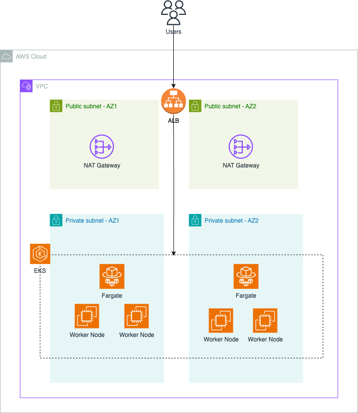

# [terraform-aws-arc-eks](https://github.com/sourcefuse/terraform-aws-arc-eks)
<!-- ALL-CONTRIBUTORS-BADGE:START - Do not remove or modify this section -->
[](#contributors-)
<!-- ALL-CONTRIBUTORS-BADGE:END -->

<a href="https://github.com/sourcefuse/terraform-aws-arc-eks/releases/latest"></a> <a href="https://github.com/sourcefuse/terraform-aws-arc-eks/commits"></a>  

[](https://sonarcloud.io/summary/new_code?id=sourcefuse_terraform-aws-arc-eks)

[](https://github.com/sourcefuse/terraform-aws-ref-arch-eks/actions/workflows/snyk.yaml)

## Overview

SourceFuse AWS Reference Architecture (ARC) Terraform module for managing EKS clusters on AWS.

For more information about this repository and its usage, please see [Terraform AWS ARC EKS Module Usage Guide](docs/module-usage-guide/README.md).



Create the following AWS resources in a single region

* eks cluster with essential network, security and logging configuration
* eks fargate profile
* eks node group

Bootstrap the eks cluster with the following components (WIP, currently unavailable)

* cluster autoscaler
* metrics server
* kubernetes dashboard
* AWS secrets store CSI driver

## Usage
See `example` for complete example
```hcl
module "eks_cluster" {
  source               = "sourcefuse/arc-eks/aws"
  environment          = var.environment
  name                 = var.name
  namespace            = var.namespace
  desired_size         = var.desired_size
  instance_types       = var.instance_types
  kubernetes_namespace = var.kubernetes_namespace
  create_node_group    = true
  max_size             = var.max_size
  min_size             = var.min_size
  subnet_ids           = data.aws_subnets.private.ids
  region               = var.region
  //  route_53_zone                             = var.route_53_zone
  vpc_id                    = data.aws_vpc.vpc.id
  enabled                   = true
  kubernetes_version        = var.kubernetes_version
  apply_config_map_aws_auth = true
  kube_data_auth_enabled    = true
  kube_exec_auth_enabled    = true
  csi_driver_enabled        = var.csi_driver_enabled
  map_additional_iam_roles  = var.map_additional_iam_roles
  allowed_security_groups   = concat(data.aws_security_groups.eks_sg.ids, data.aws_security_groups.db_sg.ids)
}
```

Note: This module creates aws-auth configmap and initialize it with the roles passed via
the variable `map_additional_iam_roles` . It also creates a role `{cluster-name}-eks-admin`
which can be assumed to get admin access to the cluster. Beyond that, it does not
update that config or track any changes made to it.
Hence the state of that configuration has to be independently managed.

<!-- BEGINNING OF PRE-COMMIT-TERRAFORM DOCS HOOK -->
## Requirements

| Name | Version |
|------|---------|
| <a name="requirement_terraform"></a> [terraform](#requirement\_terraform) | >= 1.6.0 |
| <a name="requirement_aws"></a> [aws](#requirement\_aws) | >= 5.0.0 |
| <a name="requirement_helm"></a> [helm](#requirement\_helm) | 2.12.1 |
| <a name="requirement_kubernetes"></a> [kubernetes](#requirement\_kubernetes) | = 2.24.0 |
| <a name="requirement_null"></a> [null](#requirement\_null) | >= 2.0 |
| <a name="requirement_tls"></a> [tls](#requirement\_tls) | >= 3.1.0, != 4.0.0 |

## Providers

| Name | Version |
|------|---------|
| <a name="provider_aws"></a> [aws](#provider\_aws) | 5.34.0 |
| <a name="provider_helm"></a> [helm](#provider\_helm) | 2.12.1 |
| <a name="provider_kubernetes"></a> [kubernetes](#provider\_kubernetes) | 2.24.0 |

## Modules

| Name | Source | Version |
|------|--------|---------|
| <a name="module_eks_cluster"></a> [eks\_cluster](#module\_eks\_cluster) | cloudposse/eks-cluster/aws | 3.0.0 |
| <a name="module_eks_fargate_profile"></a> [eks\_fargate\_profile](#module\_eks\_fargate\_profile) | cloudposse/eks-fargate-profile/aws | 1.3.0 |
| <a name="module_eks_node_group"></a> [eks\_node\_group](#module\_eks\_node\_group) | cloudposse/eks-node-group/aws | 2.12.0 |
| <a name="module_this"></a> [this](#module\_this) | cloudposse/label/null | 0.25.0 |

## Resources

| Name | Type |
|------|------|
| [aws_iam_role.eks_admin](https://registry.terraform.io/providers/hashicorp/aws/latest/docs/resources/iam_role) | resource |
| [helm_release.csi_driver](https://registry.terraform.io/providers/hashicorp/helm/2.12.1/docs/resources/release) | resource |
| [kubernetes_namespace.default_namespace](https://registry.terraform.io/providers/hashicorp/kubernetes/2.24.0/docs/resources/namespace) | resource |
| [aws_caller_identity.source](https://registry.terraform.io/providers/hashicorp/aws/latest/docs/data-sources/caller_identity) | data source |
| [aws_iam_policy_document.eks_admin](https://registry.terraform.io/providers/hashicorp/aws/latest/docs/data-sources/iam_policy_document) | data source |
| [aws_iam_policy_document.eks_admin_assume_role](https://registry.terraform.io/providers/hashicorp/aws/latest/docs/data-sources/iam_policy_document) | data source |

## Inputs

| Name | Description | Type | Default | Required |
|------|-------------|------|---------|:--------:|
| <a name="input_additional_tag_map"></a> [additional\_tag\_map](#input\_additional\_tag\_map) | Additional key-value pairs to add to each map in `tags_as_list_of_maps`. Not added to `tags` or `id`.<br>This is for some rare cases where resources want additional configuration of tags<br>and therefore take a list of maps with tag key, value, and additional configuration. | `map(string)` | `{}` | no |
| <a name="input_addons"></a> [addons](#input\_addons) | Manages [`aws_eks_addon`](https://registry.terraform.io/providers/hashicorp/aws/latest/docs/resources/eks_addon) resources | <pre>list(object({<br>    addon_name                  = string<br>    addon_version               = optional(string, null)<br>    configuration_values        = optional(string, null)<br>    resolve_conflicts_on_create = optional(string, null)<br>    resolve_conflicts_on_update = optional(string, null)<br>    service_account_role_arn    = optional(string, null)<br>    create_timeout              = optional(string, null)<br>    update_timeout              = optional(string, null)<br>    delete_timeout              = optional(string, null)<br>  }))</pre> | `[]` | no |
| <a name="input_admin_principal"></a> [admin\_principal](#input\_admin\_principal) | list of arns of IAM users/roles to be allowed to assume the eks-admin role. Default behaviour it to allow all users in the same AWS account as the caller | `list(string)` | `null` | no |
| <a name="input_allowed_cidr_blocks"></a> [allowed\_cidr\_blocks](#input\_allowed\_cidr\_blocks) | A list of IPv4 CIDRs to allow access to the cluster.<br>The length of this list must be known at "plan" time. | `list(string)` | `[]` | no |
| <a name="input_allowed_security_groups"></a> [allowed\_security\_groups](#input\_allowed\_security\_groups) | List of Security Group IDs to be allowed to connect to the EKS cluster | `list(string)` | `[]` | no |
| <a name="input_ami_image_id"></a> [ami\_image\_id](#input\_ami\_image\_id) | AMI to use. Ignored if `launch_template_id` is supplied. | `list(string)` | `[]` | no |
| <a name="input_ami_release_version"></a> [ami\_release\_version](#input\_ami\_release\_version) | EKS AMI version to use, e.g. For AL2 "1.16.13-20200821" or for bottlerocket "1.2.0-ccf1b754" (no "v") or  for Windows "2023.02.14". For AL2, bottlerocket and Windows, it defaults to latest version for Kubernetes version. | `list(string)` | `[]` | no |
| <a name="input_ami_type"></a> [ami\_type](#input\_ami\_type) | Type of Amazon Machine Image (AMI) associated with the EKS Node Group.<br>Defaults to `AL2_x86_64`. Valid values: `AL2_x86_64, AL2_x86_64_GPU, AL2_ARM_64, CUSTOM, BOTTLEROCKET_ARM_64, BOTTLEROCKET_x86_64, BOTTLEROCKET_ARM_64_NVIDIA, BOTTLEROCKET_x86_64_NVIDIA, WINDOWS_CORE_2019_x86_64, WINDOWS_FULL_2019_x86_64, WINDOWS_CORE_2022_x86_64, WINDOWS_FULL_2022_x86_64`. | `string` | `"AL2_x86_64"` | no |
| <a name="input_apply_config_map_aws_auth"></a> [apply\_config\_map\_aws\_auth](#input\_apply\_config\_map\_aws\_auth) | Whether to apply the ConfigMap to allow worker nodes to join the EKS cluster and allow additional users, accounts and roles to acces the cluster | `bool` | `true` | no |
| <a name="input_attributes"></a> [attributes](#input\_attributes) | ID element. Additional attributes (e.g. `workers` or `cluster`) to add to `id`,<br>in the order they appear in the list. New attributes are appended to the<br>end of the list. The elements of the list are joined by the `delimiter`<br>and treated as a single ID element. | `list(string)` | `[]` | no |
| <a name="input_capacity_type"></a> [capacity\_type](#input\_capacity\_type) | Type of capacity associated with the EKS Node Group. Valid values: "ON\_DEMAND", "SPOT", or `null`.<br>Terraform will only perform drift detection if a configuration value is provided. | `string` | `null` | no |
| <a name="input_cluster_encryption_config_enabled"></a> [cluster\_encryption\_config\_enabled](#input\_cluster\_encryption\_config\_enabled) | Set to `true` to enable Cluster Encryption Configuration | `bool` | `true` | no |
| <a name="input_cluster_encryption_config_kms_key_deletion_window_in_days"></a> [cluster\_encryption\_config\_kms\_key\_deletion\_window\_in\_days](#input\_cluster\_encryption\_config\_kms\_key\_deletion\_window\_in\_days) | Cluster Encryption Config KMS Key Resource argument - key deletion windows in days post destruction | `number` | `10` | no |
| <a name="input_cluster_encryption_config_kms_key_enable_key_rotation"></a> [cluster\_encryption\_config\_kms\_key\_enable\_key\_rotation](#input\_cluster\_encryption\_config\_kms\_key\_enable\_key\_rotation) | Cluster Encryption Config KMS Key Resource argument - enable kms key rotation | `bool` | `true` | no |
| <a name="input_cluster_encryption_config_kms_key_id"></a> [cluster\_encryption\_config\_kms\_key\_id](#input\_cluster\_encryption\_config\_kms\_key\_id) | KMS Key ID to use for cluster encryption config | `string` | `""` | no |
| <a name="input_cluster_encryption_config_kms_key_policy"></a> [cluster\_encryption\_config\_kms\_key\_policy](#input\_cluster\_encryption\_config\_kms\_key\_policy) | Cluster Encryption Config KMS Key Resource argument - key policy | `string` | `null` | no |
| <a name="input_cluster_encryption_config_resources"></a> [cluster\_encryption\_config\_resources](#input\_cluster\_encryption\_config\_resources) | Cluster Encryption Config Resources to encrypt, e.g. ['secrets'] | `list(any)` | <pre>[<br>  "secrets"<br>]</pre> | no |
| <a name="input_cluster_log_retention_period"></a> [cluster\_log\_retention\_period](#input\_cluster\_log\_retention\_period) | Number of days to retain cluster logs. Requires `enabled_cluster_log_types` to be set. See https://docs.aws.amazon.com/en_us/eks/latest/userguide/control-plane-logs.html. | `number` | `0` | no |
| <a name="input_context"></a> [context](#input\_context) | Single object for setting entire context at once.<br>See description of individual variables for details.<br>Leave string and numeric variables as `null` to use default value.<br>Individual variable settings (non-null) override settings in context object,<br>except for attributes, tags, and additional\_tag\_map, which are merged. | `any` | <pre>{<br>  "additional_tag_map": {},<br>  "attributes": [],<br>  "delimiter": null,<br>  "descriptor_formats": {},<br>  "enabled": true,<br>  "environment": null,<br>  "id_length_limit": null,<br>  "label_key_case": null,<br>  "label_order": [],<br>  "label_value_case": null,<br>  "labels_as_tags": [<br>    "unset"<br>  ],<br>  "name": null,<br>  "namespace": null,<br>  "regex_replace_chars": null,<br>  "stage": null,<br>  "tags": {},<br>  "tenant": null<br>}</pre> | no |
| <a name="input_create_fargate_profile"></a> [create\_fargate\_profile](#input\_create\_fargate\_profile) | Whether to create EKS Fargate profile | `bool` | `false` | no |
| <a name="input_create_node_group"></a> [create\_node\_group](#input\_create\_node\_group) | Whether to create EKS Node Group | `bool` | `false` | no |
| <a name="input_csi_driver_enabled"></a> [csi\_driver\_enabled](#input\_csi\_driver\_enabled) | The Secrets Store CSI Driver secrets-store.csi.k8s.io allows Kubernetes to mount multiple secrets, keys, and certs stored in enterprise-grade external secrets stores into their pods as a volume. | `bool` | `false` | no |
| <a name="input_delimiter"></a> [delimiter](#input\_delimiter) | Delimiter to be used between ID elements.<br>Defaults to `-` (hyphen). Set to `""` to use no delimiter at all. | `string` | `null` | no |
| <a name="input_descriptor_formats"></a> [descriptor\_formats](#input\_descriptor\_formats) | Describe additional descriptors to be output in the `descriptors` output map.<br>Map of maps. Keys are names of descriptors. Values are maps of the form<br>`{<br>   format = string<br>   labels = list(string)<br>}`<br>(Type is `any` so the map values can later be enhanced to provide additional options.)<br>`format` is a Terraform format string to be passed to the `format()` function.<br>`labels` is a list of labels, in order, to pass to `format()` function.<br>Label values will be normalized before being passed to `format()` so they will be<br>identical to how they appear in `id`.<br>Default is `{}` (`descriptors` output will be empty). | `any` | `{}` | no |
| <a name="input_desired_size"></a> [desired\_size](#input\_desired\_size) | Desired number of worker nodes | `number` | n/a | yes |
| <a name="input_enabled"></a> [enabled](#input\_enabled) | Set to false to prevent the module from creating any resources | `bool` | `false` | no |
| <a name="input_enabled_cluster_log_types"></a> [enabled\_cluster\_log\_types](#input\_enabled\_cluster\_log\_types) | A list of the desired control plane logging to enable. For more information, see https://docs.aws.amazon.com/en_us/eks/latest/userguide/control-plane-logs.html. Possible values [`api`, `audit`, `authenticator`, `controllerManager`, `scheduler`] | `list(string)` | <pre>[<br>  "api",<br>  "audit",<br>  "authenticator",<br>  "controllerManager",<br>  "scheduler"<br>]</pre> | no |
| <a name="input_endpoint_private_access"></a> [endpoint\_private\_access](#input\_endpoint\_private\_access) | Indicates whether or not the Amazon EKS private API server endpoint is enabled. Default to AWS EKS resource and it is false | `bool` | `false` | no |
| <a name="input_endpoint_public_access"></a> [endpoint\_public\_access](#input\_endpoint\_public\_access) | Indicates whether or not the Amazon EKS public API server endpoint is enabled. Default to AWS EKS resource and it is true | `bool` | `true` | no |
| <a name="input_environment"></a> [environment](#input\_environment) | ID element. Usually used for region e.g. 'uw2', 'us-west-2', OR role 'prod', 'staging', 'dev', 'UAT' | `string` | `null` | no |
| <a name="input_id_length_limit"></a> [id\_length\_limit](#input\_id\_length\_limit) | Limit `id` to this many characters (minimum 6).<br>Set to `0` for unlimited length.<br>Set to `null` for keep the existing setting, which defaults to `0`.<br>Does not affect `id_full`. | `number` | `null` | no |
| <a name="input_instance_types"></a> [instance\_types](#input\_instance\_types) | Set of instance types associated with the EKS Node Group. Defaults to ["t3.medium"]. Terraform will only perform drift detection if a configuration value is provided | `list(string)` | n/a | yes |
| <a name="input_kube_data_auth_enabled"></a> [kube\_data\_auth\_enabled](#input\_kube\_data\_auth\_enabled) | If `true`, use an `aws_eks_cluster_auth` data source to authenticate to the EKS cluster.<br>Disabled by `kubeconfig_path_enabled` or `kube_exec_auth_enabled`. | `bool` | `true` | no |
| <a name="input_kube_exec_auth_enabled"></a> [kube\_exec\_auth\_enabled](#input\_kube\_exec\_auth\_enabled) | If `true`, use the Kubernetes provider `exec` feature to execute `aws eks get-token` to authenticate to the EKS cluster.<br>Disabled by `kubeconfig_path_enabled`, overrides `kube_data_auth_enabled`. | `bool` | `false` | no |
| <a name="input_kubernetes_labels"></a> [kubernetes\_labels](#input\_kubernetes\_labels) | Key-value mapping of Kubernetes labels. Only labels that are applied with the EKS API are managed by this argument. Other Kubernetes labels applied to the EKS Node Group will not be managed | `map(string)` | `{}` | no |
| <a name="input_kubernetes_namespace"></a> [kubernetes\_namespace](#input\_kubernetes\_namespace) | Kubernetes namespace for selection | `string` | n/a | yes |
| <a name="input_kubernetes_version"></a> [kubernetes\_version](#input\_kubernetes\_version) | Desired Kubernetes master version. If you do not specify a value, the latest available version is used | `string` | `"1.25"` | no |
| <a name="input_label_key_case"></a> [label\_key\_case](#input\_label\_key\_case) | Controls the letter case of the `tags` keys (label names) for tags generated by this module.<br>Does not affect keys of tags passed in via the `tags` input.<br>Possible values: `lower`, `title`, `upper`.<br>Default value: `title`. | `string` | `null` | no |
| <a name="input_label_order"></a> [label\_order](#input\_label\_order) | The order in which the labels (ID elements) appear in the `id`.<br>Defaults to ["namespace", "environment", "stage", "name", "attributes"].<br>You can omit any of the 6 labels ("tenant" is the 6th), but at least one must be present. | `list(string)` | `null` | no |
| <a name="input_label_value_case"></a> [label\_value\_case](#input\_label\_value\_case) | Controls the letter case of ID elements (labels) as included in `id`,<br>set as tag values, and output by this module individually.<br>Does not affect values of tags passed in via the `tags` input.<br>Possible values: `lower`, `title`, `upper` and `none` (no transformation).<br>Set this to `title` and set `delimiter` to `""` to yield Pascal Case IDs.<br>Default value: `lower`. | `string` | `null` | no |
| <a name="input_labels_as_tags"></a> [labels\_as\_tags](#input\_labels\_as\_tags) | Set of labels (ID elements) to include as tags in the `tags` output.<br>Default is to include all labels.<br>Tags with empty values will not be included in the `tags` output.<br>Set to `[]` to suppress all generated tags.<br>**Notes:**<br>  The value of the `name` tag, if included, will be the `id`, not the `name`.<br>  Unlike other `null-label` inputs, the initial setting of `labels_as_tags` cannot be<br>  changed in later chained modules. Attempts to change it will be silently ignored. | `set(string)` | <pre>[<br>  "default"<br>]</pre> | no |
| <a name="input_launch_template_id"></a> [launch\_template\_id](#input\_launch\_template\_id) | The ID (not name) of a custom launch template to use for the EKS node group. If provided, it must specify the AMI image ID. | `list(string)` | `[]` | no |
| <a name="input_launch_template_version"></a> [launch\_template\_version](#input\_launch\_template\_version) | The version of the specified launch template to use. Defaults to latest version. | `list(string)` | `[]` | no |
| <a name="input_local_exec_interpreter"></a> [local\_exec\_interpreter](#input\_local\_exec\_interpreter) | shell to use for local\_exec | `list(string)` | <pre>[<br>  "/bin/sh",<br>  "-c"<br>]</pre> | no |
| <a name="input_map_additional_iam_roles"></a> [map\_additional\_iam\_roles](#input\_map\_additional\_iam\_roles) | Additional IAM roles to add to `config-map-aws-auth` ConfigMap | <pre>list(object({<br>    rolearn  = string<br>    username = string<br>    groups   = list(string)<br>  }))</pre> | `[]` | no |
| <a name="input_map_additional_iam_users"></a> [map\_additional\_iam\_users](#input\_map\_additional\_iam\_users) | Additional IAM users to add to `config-map-aws-auth` ConfigMap | <pre>list(object({<br>    userarn  = string<br>    username = string<br>    groups   = list(string)<br>  }))</pre> | `[]` | no |
| <a name="input_max_size"></a> [max\_size](#input\_max\_size) | The maximum size of the AutoScaling Group | `number` | n/a | yes |
| <a name="input_min_size"></a> [min\_size](#input\_min\_size) | The minimum size of the AutoScaling Group | `number` | n/a | yes |
| <a name="input_name"></a> [name](#input\_name) | ID element. Usually the component or solution name, e.g. 'app' or 'jenkins'.<br>This is the only ID element not also included as a `tag`.<br>The "name" tag is set to the full `id` string. There is no tag with the value of the `name` input. | `string` | `null` | no |
| <a name="input_namespace"></a> [namespace](#input\_namespace) | ID element. Usually an abbreviation of your organization name, e.g. 'eg' or 'cp', to help ensure generated IDs are globally unique | `string` | `null` | no |
| <a name="input_oidc_provider_enabled"></a> [oidc\_provider\_enabled](#input\_oidc\_provider\_enabled) | Create an IAM OIDC identity provider for the cluster, then you can create IAM roles to associate with a service account in the cluster, instead of using `kiam` or `kube2iam`. For more information, see https://docs.aws.amazon.com/eks/latest/userguide/enable-iam-roles-for-service-accounts.html | `bool` | `true` | no |
| <a name="input_public_access_cidrs"></a> [public\_access\_cidrs](#input\_public\_access\_cidrs) | Specify the cidr blocks which will be able to access the eks public api endpoint | `list(string)` | <pre>[<br>  "0.0.0.0/0"<br>]</pre> | no |
| <a name="input_regex_replace_chars"></a> [regex\_replace\_chars](#input\_regex\_replace\_chars) | Terraform regular expression (regex) string.<br>Characters matching the regex will be removed from the ID elements.<br>If not set, `"/[^a-zA-Z0-9-]/"` is used to remove all characters other than hyphens, letters and digits. | `string` | `null` | no |
| <a name="input_region"></a> [region](#input\_region) | AWS region | `string` | n/a | yes |
| <a name="input_stage"></a> [stage](#input\_stage) | ID element. Usually used to indicate role, e.g. 'prod', 'staging', 'source', 'build', 'test', 'deploy', 'release' | `string` | `null` | no |
| <a name="input_subnet_ids"></a> [subnet\_ids](#input\_subnet\_ids) | Subnet IDs | `list(string)` | n/a | yes |
| <a name="input_tags"></a> [tags](#input\_tags) | Additional tags (e.g. `{'BusinessUnit': 'XYZ'}`).<br>Neither the tag keys nor the tag values will be modified by this module. | `map(string)` | `{}` | no |
| <a name="input_tenant"></a> [tenant](#input\_tenant) | ID element \_(Rarely used, not included by default)\_. A customer identifier, indicating who this instance of a resource is for | `string` | `null` | no |
| <a name="input_vpc_id"></a> [vpc\_id](#input\_vpc\_id) | VPC ID | `string` | n/a | yes |

## Outputs

| Name | Description |
|------|-------------|
| <a name="output_eks_cluster_arn"></a> [eks\_cluster\_arn](#output\_eks\_cluster\_arn) | The Amazon Resource Name (ARN) of the cluster |
| <a name="output_eks_cluster_ca_certificate"></a> [eks\_cluster\_ca\_certificate](#output\_eks\_cluster\_ca\_certificate) | CA certificate |
| <a name="output_eks_cluster_endpoint"></a> [eks\_cluster\_endpoint](#output\_eks\_cluster\_endpoint) | The endpoint for the Kubernetes API server |
| <a name="output_eks_cluster_id"></a> [eks\_cluster\_id](#output\_eks\_cluster\_id) | The name of the cluster |
| <a name="output_eks_cluster_identity_oidc_issuer"></a> [eks\_cluster\_identity\_oidc\_issuer](#output\_eks\_cluster\_identity\_oidc\_issuer) | The OIDC Identity issuer for the cluster |
| <a name="output_eks_cluster_managed_security_group_id"></a> [eks\_cluster\_managed\_security\_group\_id](#output\_eks\_cluster\_managed\_security\_group\_id) | Security Group ID that was created by EKS for the cluster. EKS creates a Security Group and applies it to ENI that is attached to EKS Control Plane master nodes and to any managed workloads |
| <a name="output_eks_cluster_security_group_arn"></a> [eks\_cluster\_security\_group\_arn](#output\_eks\_cluster\_security\_group\_arn) | ARN of the EKS cluster Security Group |
| <a name="output_eks_cluster_security_group_id"></a> [eks\_cluster\_security\_group\_id](#output\_eks\_cluster\_security\_group\_id) | ID of the EKS cluster Security Group |
| <a name="output_eks_cluster_security_group_name"></a> [eks\_cluster\_security\_group\_name](#output\_eks\_cluster\_security\_group\_name) | Name of the EKS cluster Security Group |
| <a name="output_eks_cluster_version"></a> [eks\_cluster\_version](#output\_eks\_cluster\_version) | The Kubernetes server version of the cluster |
| <a name="output_eks_node_group_arn"></a> [eks\_node\_group\_arn](#output\_eks\_node\_group\_arn) | Amazon Resource Name (ARN) of the EKS Node Group |
| <a name="output_eks_node_group_id"></a> [eks\_node\_group\_id](#output\_eks\_node\_group\_id) | EKS Cluster name and EKS Node Group name separated by a colon |
| <a name="output_eks_node_group_resources"></a> [eks\_node\_group\_resources](#output\_eks\_node\_group\_resources) | List of objects containing information about underlying resources of the EKS Node Group |
| <a name="output_eks_node_group_role_arn"></a> [eks\_node\_group\_role\_arn](#output\_eks\_node\_group\_role\_arn) | ARN of the worker nodes IAM role |
| <a name="output_eks_node_group_role_name"></a> [eks\_node\_group\_role\_name](#output\_eks\_node\_group\_role\_name) | Name of the worker nodes IAM role |
| <a name="output_eks_node_group_status"></a> [eks\_node\_group\_status](#output\_eks\_node\_group\_status) | Status of the EKS Node Group |
| <a name="output_eks_oidc_issuer_arn"></a> [eks\_oidc\_issuer\_arn](#output\_eks\_oidc\_issuer\_arn) | EKS Cluster OIDC issuer |
| <a name="output_iam_role_eks_admin_arn"></a> [iam\_role\_eks\_admin\_arn](#output\_iam\_role\_eks\_admin\_arn) | ARN for eks-admin iam role. Assume this to get admin access to the cluster |
<!-- END OF PRE-COMMIT-TERRAFORM DOCS HOOK -->

## Kubernetes dashboard
To view the dashboard, run the following commands:

```shell
aws eks update-kubeconfig --name refarch-dev-primary-k8s-cluster --region us-east-1
kubectl -n kube-system describe secret $(kubectl -n kube-system get secret | grep eks-dashboard-viewer | awk '{print $1}') #Copy the token from the output
kubectl proxy
```

Then navigate to:

```text
http://localhost:8001/api/v1/namespaces/kubernetes-dashboard/services/https:kubernetes-dashboard:/proxy/#/login
```

and use the copied token to login
## Development

### Prerequisites

- [terraform](https://learn.hashicorp.com/terraform/getting-started/install#installing-terraform)
- [terraform-docs](https://github.com/segmentio/terraform-docs)
- [pre-commit](https://pre-commit.com/#install)
- [golang](https://golang.org/doc/install#install)
- [golint](https://github.com/golang/lint#installation)

### Configurations

- Configure pre-commit hooks
```sh
pre-commit install
```

- Configure golang deps for tests
```sh
> go get github.com/gruntwork-io/terratest/modules/terraform
> go get github.com/stretchr/testify/assert
```
### Git commits

while Contributing or doing git commit please specify the breaking change in your commit message whether its major,minor or patch

For Example

```sh
git commit -m "your commit message #major"
```
By specifying this , it will bump the version and if you dont specify this in your commit message then by default it will consider patch and will bump that accordingly

### Tests

- Tests are available in `test` directory

- In the test directory, run the below command
```sh
go test
```

## Authors

This project is authored by below people

- SourceFuse ARC Team

## Contributors ✨

Thanks goes to these wonderful people ([emoji key](https://allcontributors.org/docs/en/emoji-key)):

<!-- ALL-CONTRIBUTORS-LIST:START - Do not remove or modify this section -->
<!-- prettier-ignore-start -->
<!-- markdownlint-disable -->
<table>
  <tbody>
    <tr>
      <td align="center" valign="top" width="14.28%"><a href="https://github.com/vijay-stephen"><br /><sub><b>vijay-stephen</b></sub></a><br /><a href="https://github.com/sourcefuse/terraform-aws-arc-eks/commits?author=vijay-stephen" title="Code">💻</a> <a href="#infra-vijay-stephen" title="Infrastructure (Hosting, Build-Tools, etc)">🚇</a> <a href="https://github.com/sourcefuse/terraform-aws-arc-eks/commits?author=vijay-stephen" title="Documentation">📖</a> <a href="#maintenance-vijay-stephen" title="Maintenance">🚧</a> <a href="#mentoring-vijay-stephen" title="Mentoring">🧑‍🏫</a></td>
      <td align="center" valign="top" width="14.28%"><a href="https://www.sourcefuse.com/"><br /><sub><b>Shubham Sinha</b></sub></a><br /><a href="https://github.com/sourcefuse/terraform-aws-arc-eks/commits?author=shubhamsinha-sf" title="Code">💻</a> <a href="#infra-shubhamsinha-sf" title="Infrastructure (Hosting, Build-Tools, etc)">🚇</a> <a href="https://github.com/sourcefuse/terraform-aws-arc-eks/commits?author=shubhamsinha-sf" title="Documentation">📖</a> <a href="#maintenance-shubhamsinha-sf" title="Maintenance">🚧</a> <a href="#mentoring-shubhamsinha-sf" title="Mentoring">🧑‍🏫</a></td>
      <td align="center" valign="top" width="14.28%"><a href="https://sourcefuse.com"><br /><sub><b>Travis Saucier</b></sub></a><br /><a href="https://github.com/sourcefuse/terraform-aws-arc-eks/commits?author=tsaucier-sf" title="Code">💻</a> <a href="#infra-tsaucier-sf" title="Infrastructure (Hosting, Build-Tools, etc)">🚇</a> <a href="https://github.com/sourcefuse/terraform-aws-arc-eks/commits?author=tsaucier-sf" title="Documentation">📖</a> <a href="#maintenance-tsaucier-sf" title="Maintenance">🚧</a> <a href="#mentoring-tsaucier-sf" title="Mentoring">🧑‍🏫</a></td>
      <td align="center" valign="top" width="14.28%"><a href="https://github.com/mayank0202"><br /><sub><b>Mayank Sharma</b></sub></a><br /><a href="https://github.com/sourcefuse/terraform-aws-arc-eks/commits?author=mayank0202" title="Code">💻</a> <a href="#infra-mayank0202" title="Infrastructure (Hosting, Build-Tools, etc)">🚇</a> <a href="https://github.com/sourcefuse/terraform-aws-arc-eks/commits?author=mayank0202" title="Documentation">📖</a> <a href="#maintenance-mayank0202" title="Maintenance">🚧</a> <a href="#mentoring-mayank0202" title="Mentoring">🧑‍🏫</a></td>
    </tr>
  </tbody>
</table>

<!-- markdownlint-restore -->
<!-- prettier-ignore-end -->

<!-- ALL-CONTRIBUTORS-LIST:END -->

This project follows the [all-contributors](https://github.com/all-contributors/all-contributors) specification. Contributions of any kind welcome!
