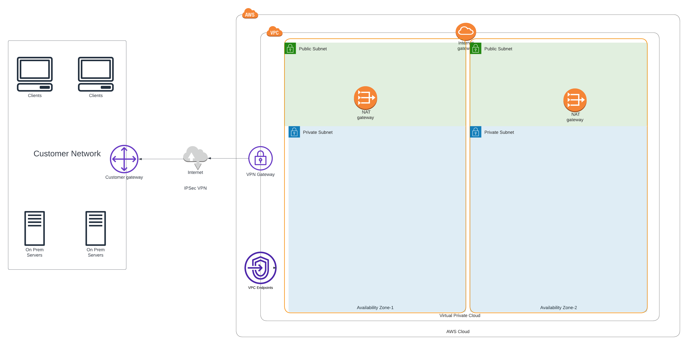

# terraform-aws-ref-arch-network

[](https://github.com/sourcefuse/terraform-aws-ref-arch-network/actions/workflows/snyk.yaml)
## Overview

AWS Terraform module for the SourceFuse Reference Architecture.



Create the following resources in a single region.

* VPC
* Multi-AZ private and public subnets
* Route tables, internet gateway, and NAT gateways
* Configurable VPN Gateway
* Configurable Client VPN Endpoint
* Configurable VPC Endpoints

## Usage
See the `example` folder for a complete example.

```shell

module "network" {
  source = "git::https://github.com/sourcefuse/terraform-aws-ref-arch-network"
}

```

## Configuring your VPN Client

Please reference the [AWS Documentation](https://docs.aws.amazon.com/vpn/latest/clientvpn-admin/cvpn-working-endpoint-export.html) on how to configure the client
once the VPN has been configured in AWS.

The pki keys and certificates can be obtained from the respective SSM parameters and can be used
to generate client certificate for mutual authentication using easy-rsa.

You shall need to copy the ca cert and ca key to:

/path/etc/pki/ca.crt

and

/path/etc/pki/private/ca.key

respectively to use the ca certificate and key generated in this module for mutual auth.

<!-- BEGINNING OF PRE-COMMIT-TERRAFORM DOCS HOOK -->
## Requirements

| Name | Version |
|------|---------|
| <a name="requirement_terraform"></a> [terraform](#requirement\_terraform) | ~> 1.3 |
| <a name="requirement_aws"></a> [aws](#requirement\_aws) | >= 3.0.0, >= 4.0.0, >= 4.9.0 |
| <a name="requirement_awsutils"></a> [awsutils](#requirement\_awsutils) | ~> 0.15 |

## Providers

| Name | Version |
|------|---------|
| <a name="provider_aws"></a> [aws](#provider\_aws) | 4.57.0 |

## Modules

| Name | Source | Version |
|------|--------|---------|
| <a name="module_client_vpn"></a> [client\_vpn](#module\_client\_vpn) | git::https://github.com/cloudposse/terraform-aws-ec2-client-vpn | 0.14.0 |
| <a name="module_private_subnets"></a> [private\_subnets](#module\_private\_subnets) | git::https://github.com/cloudposse/terraform-aws-multi-az-subnets.git | 0.15.0 |
| <a name="module_public_subnets"></a> [public\_subnets](#module\_public\_subnets) | git::https://github.com/cloudposse/terraform-aws-multi-az-subnets.git | 0.15.0 |
| <a name="module_vpc"></a> [vpc](#module\_vpc) | git::https://github.com/cloudposse/terraform-aws-vpc.git | 2.0.0 |
| <a name="module_vpc_endpoints"></a> [vpc\_endpoints](#module\_vpc\_endpoints) | git::https://github.com/cloudposse/terraform-aws-vpc.git//modules/vpc-endpoints | 2.0.0 |

## Resources

| Name | Type |
|------|------|
| [aws_dx_connection.this](https://registry.terraform.io/providers/hashicorp/aws/latest/docs/resources/dx_connection) | resource |
| [aws_vpc_endpoint.cloudwatch_endpoint](https://registry.terraform.io/providers/hashicorp/aws/latest/docs/resources/vpc_endpoint) | resource |
| [aws_vpc_endpoint.dynamodb_endpoint](https://registry.terraform.io/providers/hashicorp/aws/latest/docs/resources/vpc_endpoint) | resource |
| [aws_vpc_endpoint.ec2_endpoint](https://registry.terraform.io/providers/hashicorp/aws/latest/docs/resources/vpc_endpoint) | resource |
| [aws_vpc_endpoint.elb_endpoint](https://registry.terraform.io/providers/hashicorp/aws/latest/docs/resources/vpc_endpoint) | resource |
| [aws_vpc_endpoint.kms_endpoint](https://registry.terraform.io/providers/hashicorp/aws/latest/docs/resources/vpc_endpoint) | resource |
| [aws_vpc_endpoint.s3_endpoint](https://registry.terraform.io/providers/hashicorp/aws/latest/docs/resources/vpc_endpoint) | resource |
| [aws_vpn_gateway.this](https://registry.terraform.io/providers/hashicorp/aws/latest/docs/resources/vpn_gateway) | resource |
| [aws_iam_policy_document.dynamodb](https://registry.terraform.io/providers/hashicorp/aws/latest/docs/data-sources/iam_policy_document) | data source |
| [aws_iam_policy_document.ec2](https://registry.terraform.io/providers/hashicorp/aws/latest/docs/data-sources/iam_policy_document) | data source |

## Inputs

| Name | Description | Type | Default | Required |
|------|-------------|------|---------|:--------:|
| <a name="input_assign_generated_ipv6_cidr_block"></a> [assign\_generated\_ipv6\_cidr\_block](#input\_assign\_generated\_ipv6\_cidr\_block) | When `true`, assign AWS generated IPv6 CIDR block to the VPC.  Conflicts with `ipv6_ipam_pool_id`. | `bool` | `true` | no |
| <a name="input_auto_generate_multi_az_subnets"></a> [auto\_generate\_multi\_az\_subnets](#input\_auto\_generate\_multi\_az\_subnets) | Auto-generate subnets in defined availability zones | `bool` | `true` | no |
| <a name="input_availability_zones"></a> [availability\_zones](#input\_availability\_zones) | List of availability zones to deploy resources in. | `list(string)` | n/a | yes |
| <a name="input_aws_dx_connection_name_override"></a> [aws\_dx\_connection\_name\_override](#input\_aws\_dx\_connection\_name\_override) | AWS DX Connection. If left undefined, this will use the naming convention of<br>`namespace-environment-dx-connection`. | `string` | `null` | no |
| <a name="input_aws_region"></a> [aws\_region](#input\_aws\_region) | Specify region for VPC endpoints | `string` | `"us-east-1"` | no |
| <a name="input_client_vpn_allowed_security_group_ids"></a> [client\_vpn\_allowed\_security\_group\_ids](#input\_client\_vpn\_allowed\_security\_group\_ids) | A list of IDs of Security Groups to allow access to the security group created by this module.<br>The length of this list must be known at "plan" time. | `list(string)` | `[]` | no |
| <a name="input_client_vpn_associated_security_group_ids"></a> [client\_vpn\_associated\_security\_group\_ids](#input\_client\_vpn\_associated\_security\_group\_ids) | A list of IDs of Security Groups to associate the VPN endpoints with, in addition to the created security group.<br>These security groups will not be modified and, if `create_security_group` is `false`, must have rules providing the desired access. | `list(string)` | `[]` | no |
| <a name="input_client_vpn_authorization_rules"></a> [client\_vpn\_authorization\_rules](#input\_client\_vpn\_authorization\_rules) | List of objects describing the authorization rules for the client vpn | `list(map(any))` | n/a | yes |
| <a name="input_client_vpn_client_cidr_block"></a> [client\_vpn\_client\_cidr\_block](#input\_client\_vpn\_client\_cidr\_block) | CIDR block to be assigned tpo VPN clients | `string` | `"10.1.0.0/16"` | no |
| <a name="input_client_vpn_create_security_group"></a> [client\_vpn\_create\_security\_group](#input\_client\_vpn\_create\_security\_group) | Set `true` to create and configure a new security group. If false, `associated_security_group_ids` must be provided. | `bool` | `true` | no |
| <a name="input_client_vpn_enabled"></a> [client\_vpn\_enabled](#input\_client\_vpn\_enabled) | Enable client VPN endpoint | `bool` | `false` | no |
| <a name="input_client_vpn_logging_enabled"></a> [client\_vpn\_logging\_enabled](#input\_client\_vpn\_logging\_enabled) | Enable/disable CloudWatch logs for client VPN | `bool` | `true` | no |
| <a name="input_client_vpn_name_override"></a> [client\_vpn\_name\_override](#input\_client\_vpn\_name\_override) | Client VPN Name override. If left undefined, this will use the naming convention of<br>`namespace-environment-client-vpn`. | `string` | `null` | no |
| <a name="input_client_vpn_organization_name"></a> [client\_vpn\_organization\_name](#input\_client\_vpn\_organization\_name) | Organization name for self signed certificates | `string` | `""` | no |
| <a name="input_client_vpn_retention_in_days"></a> [client\_vpn\_retention\_in\_days](#input\_client\_vpn\_retention\_in\_days) | Number of days to retain the client VPN logs on CloudWatch | `number` | `30` | no |
| <a name="input_client_vpn_split_tunnel"></a> [client\_vpn\_split\_tunnel](#input\_client\_vpn\_split\_tunnel) | Enable/disable split tunnel | `bool` | `true` | no |
| <a name="input_cloudwatch_endpoint_name_override"></a> [cloudwatch\_endpoint\_name\_override](#input\_cloudwatch\_endpoint\_name\_override) | CloudWatch endpoint name. If left undefined, this will use the naming convention of<br>`namespace-environment-cloudwatch-endpoint`. | `string` | `null` | no |
| <a name="input_default_network_acl_deny_all"></a> [default\_network\_acl\_deny\_all](#input\_default\_network\_acl\_deny\_all) | When `true`, manage the default network acl and remove all rules, disabling all ingress and egress.<br>When `false`, do not mange the default networking acl, allowing it to be managed by another component. | `bool` | `false` | no |
| <a name="input_default_route_table_no_routes"></a> [default\_route\_table\_no\_routes](#input\_default\_route\_table\_no\_routes) | When `true`, manage the default route table and remove all routes, disabling all ingress and egress.<br>When `false`, do not mange the default route table, allowing it to be managed by another component.<br>Conflicts with Terraform resource `aws_main_route_table_association`. | `bool` | `false` | no |
| <a name="input_default_security_group_deny_all"></a> [default\_security\_group\_deny\_all](#input\_default\_security\_group\_deny\_all) | When `true`, manage the default security group and remove all rules, disabling all ingress and egress.<br>When `false`, do not manage the default security group, allowing it to be managed by another component. | `bool` | `true` | no |
| <a name="input_direct_connect_bandwidth"></a> [direct\_connect\_bandwidth](#input\_direct\_connect\_bandwidth) | The bandwidth of the connection.<br>Valid values for dedicated connections: 1Gbps, 10Gbps.<br>Valid values for hosted connections: 50Mbps, 100Mbps, 200Mbps, 300Mbps, 400Mbps, 500Mbps, 1Gbps, 2Gbps, 5Gbps, 10Gbps and 100Gbps.<br>Case sensitive. | `string` | `"10Gbps"` | no |
| <a name="input_direct_connect_enabled"></a> [direct\_connect\_enabled](#input\_direct\_connect\_enabled) | Enable direct connect. | `bool` | `false` | no |
| <a name="input_direct_connect_encryption_mode"></a> [direct\_connect\_encryption\_mode](#input\_direct\_connect\_encryption\_mode) | The connection MAC Security (MACsec) encryption mode. MAC Security (MACsec) is only available on dedicated connections. Valid values are no\_encrypt, should\_encrypt, and must\_encrypt. | `string` | `"must_encrypt"` | no |
| <a name="input_direct_connect_location"></a> [direct\_connect\_location](#input\_direct\_connect\_location) | The location of AWS Direct Connect. Use `aws directconnect describe-locations` for the list of AWS Direct Connect locations. Use locationCode for the value. | `string` | `null` | no |
| <a name="input_direct_connect_provider"></a> [direct\_connect\_provider](#input\_direct\_connect\_provider) | The name of the service provider associated with the connection. | `string` | `null` | no |
| <a name="input_direct_connect_request_macsec"></a> [direct\_connect\_request\_macsec](#input\_direct\_connect\_request\_macsec) | Boolean value indicating whether you want the connection to support MAC Security (MACsec).<br>MAC Security (MACsec) is only available on dedicated connections.<br>Changing this value will cause the resource to be destroyed and re-created.<br>See [MACsec prerequisites](https://docs.aws.amazon.com/directconnect/latest/UserGuide/direct-connect-mac-sec-getting-started.html) for more information. | `bool` | `false` | no |
| <a name="input_direct_connect_skip_destroy"></a> [direct\_connect\_skip\_destroy](#input\_direct\_connect\_skip\_destroy) | et to true if you do not wish the connection to be deleted at destroy time, and instead just removed from the Terraform state. | `bool` | `false` | no |
| <a name="input_dns_hostnames_enabled"></a> [dns\_hostnames\_enabled](#input\_dns\_hostnames\_enabled) | Set `true` to enable [DNS hostnames](https://docs.aws.amazon.com/vpc/latest/userguide/vpc-dns.html#vpc-dns-hostnames) in the VPC | `bool` | `true` | no |
| <a name="input_dns_support_enabled"></a> [dns\_support\_enabled](#input\_dns\_support\_enabled) | Set `true` to enable DNS resolution in the VPC through the Amazon provided DNS server | `bool` | `true` | no |
| <a name="input_dynamodb_endpoint_name_override"></a> [dynamodb\_endpoint\_name\_override](#input\_dynamodb\_endpoint\_name\_override) | DynamoDB endpoint name. If left undefined, this will use the naming convention of<br>`namespace-environment-dynamodb-endpoint`. | `string` | `null` | no |
| <a name="input_ec2_endpoint_name_override"></a> [ec2\_endpoint\_name\_override](#input\_ec2\_endpoint\_name\_override) | EC2 endpoint name. If left undefined, this will use the naming convention of<br>`namespace-environment-ec2-endpoint`. | `string` | `null` | no |
| <a name="input_elb_endpoint_name_override"></a> [elb\_endpoint\_name\_override](#input\_elb\_endpoint\_name\_override) | ELB endpoint name. If left undefined, this will use the naming convention of<br>`namespace-environment-elb-endpoint`. | `string` | `null` | no |
| <a name="input_environment"></a> [environment](#input\_environment) | Name of the environment, i.e. dev, stage, prod | `string` | n/a | yes |
| <a name="input_gateway_vpc_endpoints"></a> [gateway\_vpc\_endpoints](#input\_gateway\_vpc\_endpoints) | A map of Gateway VPC Endpoints to provision into the VPC. This is a map of objects with the following attributes:<br>- `name`: Short service name (either "s3" or "dynamodb")<br>- `policy` = A policy (as JSON string) to attach to the endpoint that controls access to the service. May be `null` for full access.<br>- `route_table_ids`: List of route tables to associate the gateway with. Routes to the gateway<br>  will be automatically added to these route tables. | <pre>map(object({<br>    name            = string<br>    policy          = string<br>    route_table_ids = list(string)<br>  }))</pre> | `{}` | no |
| <a name="input_interface_vpc_endpoints"></a> [interface\_vpc\_endpoints](#input\_interface\_vpc\_endpoints) | A map of Interface VPC Endpoints to provision into the VPC.<br>This is a map of objects with the following attributes:<br>- `name`: Simple name of the service, like "ec2" or "redshift"<br>- `policy`: A policy (as JSON string) to attach to the endpoint that controls access to the service. May be `null` for full access.<br>- `private_dns_enabled`: Set `true` to associate a private hosted zone with the specified VPC<br>- `security_group_ids`: The ID of one or more security groups to associate with the network interface. The first<br>  security group will replace the default association with the VPC's default security group. If you want<br>  to maintain the association with the default security group, either leave `security_group_ids` empty or<br>  include the default security group ID in the list.<br>- `subnet_ids`: List of subnet in which to install the endpoints. | <pre>map(object({<br>    name                = string<br>    policy              = string<br>    private_dns_enabled = bool<br>    security_group_ids  = list(string)<br>    subnet_ids          = list(string)<br>  }))</pre> | `{}` | no |
| <a name="input_internet_gateway_enabled"></a> [internet\_gateway\_enabled](#input\_internet\_gateway\_enabled) | Set `true` to create an Internet Gateway for the VPC | `bool` | `true` | no |
| <a name="input_ipv6_egress_only_internet_gateway_enabled"></a> [ipv6\_egress\_only\_internet\_gateway\_enabled](#input\_ipv6\_egress\_only\_internet\_gateway\_enabled) | Set `true` to create an IPv6 Egress-Only Internet Gateway for the VPC | `bool` | `false` | no |
| <a name="input_kms_endpoint_name_override"></a> [kms\_endpoint\_name\_override](#input\_kms\_endpoint\_name\_override) | KMS Endpoint name. If left undefined, this will use the naming convention of<br>`namespace-environment-kms-endpoint.<br>` | `string` | `null` | no |
| <a name="input_namespace"></a> [namespace](#input\_namespace) | Namespace of the project, i.e. refarch | `string` | n/a | yes |
| <a name="input_private_dns_enabled"></a> [private\_dns\_enabled](#input\_private\_dns\_enabled) | Whether to enable Private DNS for the endpoint(s) | `bool` | `true` | no |
| <a name="input_private_subnet_name_override"></a> [private\_subnet\_name\_override](#input\_private\_subnet\_name\_override) | Private Subnets name. If left undefined, this will use the naming convention of<br>`namespace-environment-private-subnet`. | `string` | `null` | no |
| <a name="input_public_subnet_name_override"></a> [public\_subnet\_name\_override](#input\_public\_subnet\_name\_override) | Public Subnets name. If left undefined, this will use the naming convention of<br>`namespace-environment-public-subnet`. | `string` | `null` | no |
| <a name="input_s3_endpoint_name_override"></a> [s3\_endpoint\_name\_override](#input\_s3\_endpoint\_name\_override) | S3 endpoint name. If left undefined, this will use the naming convention of<br>`namespace-environment-s3-endpoint`. | `string` | `null` | no |
| <a name="input_tags"></a> [tags](#input\_tags) | Default tags to apply to every resource | `map(string)` | n/a | yes |
| <a name="input_vpc_endpoint_config"></a> [vpc\_endpoint\_config](#input\_vpc\_endpoint\_config) | Map variable that toggles the enablement of an application | `map(bool)` | <pre>{<br>  "cloudwatch": false,<br>  "dynamodb": false,<br>  "ec2": false,<br>  "elb": false,<br>  "kms": false,<br>  "s3": false<br>}</pre> | no |
| <a name="input_vpc_endpoint_type"></a> [vpc\_endpoint\_type](#input\_vpc\_endpoint\_type) | The VPC endpoint type, Gateway, GatewayLoadBalancer, or Interface. | `string` | `"Interface"` | no |
| <a name="input_vpc_endpoints_enabled"></a> [vpc\_endpoints\_enabled](#input\_vpc\_endpoints\_enabled) | Enable VPC endpoints. | `bool` | `false` | no |
| <a name="input_vpc_ipv4_primary_cidr_block"></a> [vpc\_ipv4\_primary\_cidr\_block](#input\_vpc\_ipv4\_primary\_cidr\_block) | IPv4 CIDR block for the VPC to use. | `string` | n/a | yes |
| <a name="input_vpc_name_override"></a> [vpc\_name\_override](#input\_vpc\_name\_override) | VPC Name override. If left undefined, this will use the naming convention of<br>`namespace-environment-vpc`. | `string` | `null` | no |
| <a name="input_vpn_gateway_enabled"></a> [vpn\_gateway\_enabled](#input\_vpn\_gateway\_enabled) | Enable VPN Gateway. | `bool` | `false` | no |

## Outputs

| Name | Description |
|------|-------------|
| <a name="output_default_route_table_id"></a> [default\_route\_table\_id](#output\_default\_route\_table\_id) | The Default Route Table ID for the VPC |
| <a name="output_full_client_configuration"></a> [full\_client\_configuration](#output\_full\_client\_configuration) | Client configuration including client certificate and private key |
| <a name="output_main_route_table_id"></a> [main\_route\_table\_id](#output\_main\_route\_table\_id) | The Main Route Table ID for the VPC |
| <a name="output_private_subnet_cidrs"></a> [private\_subnet\_cidrs](#output\_private\_subnet\_cidrs) | Private subnet CIDRs |
| <a name="output_private_subnet_ids"></a> [private\_subnet\_ids](#output\_private\_subnet\_ids) | Private subnet IDs |
| <a name="output_public_subnet_cidrs"></a> [public\_subnet\_cidrs](#output\_public\_subnet\_cidrs) | Public subnet CIDRs |
| <a name="output_public_subnet_ids"></a> [public\_subnet\_ids](#output\_public\_subnet\_ids) | Public subnet IDs |
| <a name="output_vpc_cidr"></a> [vpc\_cidr](#output\_vpc\_cidr) | The VPC CIDR block |
| <a name="output_vpc_id"></a> [vpc\_id](#output\_vpc\_id) | The VPC ID |
| <a name="output_vpn_endpoint_arn"></a> [vpn\_endpoint\_arn](#output\_vpn\_endpoint\_arn) | The ARN of the Client VPN Endpoint Connection. |
| <a name="output_vpn_endpoint_dns_name"></a> [vpn\_endpoint\_dns\_name](#output\_vpn\_endpoint\_dns\_name) | The DNS Name of the Client VPN Endpoint Connection. |
| <a name="output_vpn_subnets"></a> [vpn\_subnets](#output\_vpn\_subnets) | subnets associated with the VPN |
<!-- END OF PRE-COMMIT-TERRAFORM DOCS HOOK -->

## Development

### Prerequisites
- [terraform](https://learn.hashicorp.com/terraform/getting-started/install#installing-terraform)
- [terraform-docs](https://github.com/segmentio/terraform-docs)
- [pre-commit](https://pre-commit.com/#install)
- [golang](https://golang.org/doc/install#install)
- [golint](https://github.com/golang/lint#installation)

### Configurations
- Configure pre-commit hooks
  ```sh
  pre-commit install
  ```
- Configure golang deps for tests
  ```sh
  go get github.com/gruntwork-io/terratest/modules/terraform
  go get github.com/stretchr/testify/assert
  ```

### Tests
- Tests are available in `test` directory
- In the test directory, run the below command
  ```sh
  go test -timeout 1800s
  ```

## Authors
This project is authored by:
- SourceFuse
