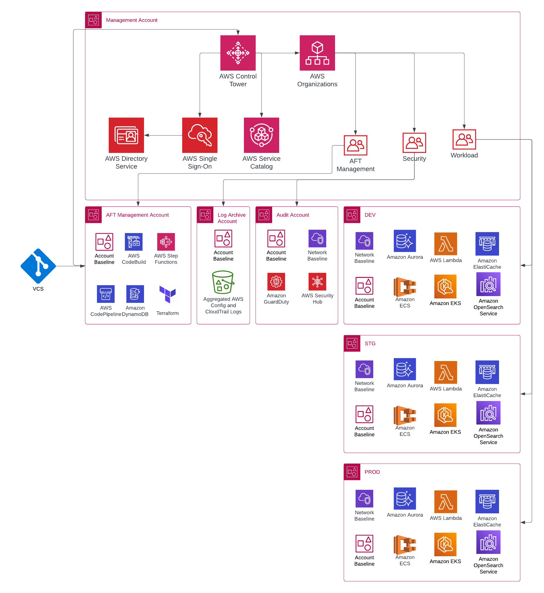

# [terraform-aws-arc-control-tower-aft](https://github.com/sourcefuse/terraform-aws-arc-control-tower-aft)

> **Module:** `sourcefuse/arc-control-tower-aft/aws`

> **Registry:** [https://registry.terraform.io/modules/sourcefuse/arc-control-tower-aft/aws](https://registry.terraform.io/modules/sourcefuse/arc-control-tower-aft/aws)

> **Category:** Governance / Landing Zone


> **Source:** [https://github.com/sourcefuse/terraform-aws-arc-control-tower-aft](https://github.com/sourcefuse/terraform-aws-arc-control-tower-aft)

[](https://github.com/sourcefuse/terraform-aws-arc-control-tower-aft/releases/latest)
[](https://github.com/sourcefuse/terraform-aws-arc-control-tower-aft/commits)


## Overview



Deploys AWS Control Tower Account Factory for Terraform (AFT) to automate account provisioning and customization across a multi-account AWS organization.

## What It Does

- AFT pipeline for automated account vending
- Account customization via Git repositories
- Global and per-account customization hooks
- CloudTrail data events and default VPC deletion
- Configurable Terraform distribution (OSS, TFC, TFE)
- Multi-region Terraform state backend

For more information about this repository and its usage, please see [Terraform AWS CONTROL TOWER Usage Guide](https://github.com/sourcefuse/terraform-aws-arc-control-tower-aft/blob/main/docs/module-usage-guide/README.md).

## Quickstart

```hcl
################################################################################
## control tower
################################################################################
module "aft" {
  source  = "sourcefuse/arc-control-tower-aft/aws"
  version = "0.3.6"

  account_ids                        = var.account_ids
  aft_vpc_cidr                       = var.aft_vpc_cidr
  control_tower_home_region          = var.control_tower_home_region
  terraform_backend_secondary_region = var.terraform_backend_secondary_region

  account_customizations_repo              = var.account_customizations_repo
  account_provisioning_customizations_repo = var.account_provisioning_customizations_repo
  account_request_repo                     = var.account_request_repo
  global_customizations_repo               = var.global_customizations_repo
}
```

## Required Inputs

| Name | Type | Description |
|------|------|-------------|
| `account_ids` | `object` | Account IDs for AFT, audit, management, and log archive |
| `aft_vpc_cidr` | `string` | CIDR block for the AFT VPC |
| `control_tower_home_region` | `string` | Region where Control Tower is deployed |
| `terraform_backend_secondary_region` | `string` | Secondary region for state replication |
## Key Outputs

| Name | Description |
|------|-------------|
| `account_ids` | Map of account IDs |
| `aft_vpc_cidr` | AFT VPC CIDR |
## Full Variable & Output Reference

The complete inputs/outputs reference is auto-generated below.

<!-- BEGINNING OF PRE-COMMIT-TERRAFORM DOCS HOOK -->
## Requirements

| Name | Version |
|------|---------|
| <a name="requirement_terraform"></a> [terraform](#requirement\_terraform) | >= 1.3 |
| <a name="requirement_aws"></a> [aws](#requirement\_aws) | ~> 4.0 |

## Providers

No providers.

## Modules

| Name | Source | Version |
|------|--------|---------|
| <a name="module_aft"></a> [aft](#module\_aft) | git::https://github.com/aws-ia/terraform-aws-control_tower_account_factory | 1.8.0 |

## Resources

No resources.

## Inputs

| Name | Description | Type | Default | Required |
|------|-------------|------|---------|:--------:|
| <a name="input_account_customizations_repo"></a> [account\_customizations\_repo](#input\_account\_customizations\_repo) | Information on the git repo for managing the account customizations. For non-CodeCommit repos, name should be in the format of org/repo. | <pre>object({<br>    name   = string<br>    branch = string<br>  })</pre> | <pre>{<br>  "branch": "main",<br>  "name": "sourcefuse/terraform-aws-refarch-aft-account-customizations"<br>}</pre> | no |
| <a name="input_account_ids"></a> [account\_ids](#input\_account\_ids) | IDs to the accounts used for deploying the respective resources into | <pre>object({<br>    aft_management           = string<br>    audit                    = string<br>    control_tower_management = string<br>    log_archive              = string<br>  })</pre> | n/a | yes |
| <a name="input_account_provisioning_customizations_repo"></a> [account\_provisioning\_customizations\_repo](#input\_account\_provisioning\_customizations\_repo) | Information on the git repo for provisioning the account customizations. For non-CodeCommit repos, name should be in the format of org/repo. | <pre>object({<br>    name   = string<br>    branch = string<br>  })</pre> | <pre>{<br>  "branch": "main",<br>  "name": "sourcefuse/terraform-aws-refarch-aft-account-provisioning-customizations"<br>}</pre> | no |
| <a name="input_account_request_repo"></a> [account\_request\_repo](#input\_account\_request\_repo) | Information on the git repo for account requests. For non-CodeCommit repos, name should be in the format of org/repo. | <pre>object({<br>    name   = string<br>    branch = string<br>  })</pre> | <pre>{<br>  "branch": "main",<br>  "name": "sourcefuse/terraform-aws-refarch-aft-account-request"<br>}</pre> | no |
| <a name="input_aft_feature_cloudtrail_data_events"></a> [aft\_feature\_cloudtrail\_data\_events](#input\_aft\_feature\_cloudtrail\_data\_events) | Feature flag toggling CloudTrail data events on/off | `bool` | `true` | no |
| <a name="input_aft_feature_delete_default_vpcs_enabled"></a> [aft\_feature\_delete\_default\_vpcs\_enabled](#input\_aft\_feature\_delete\_default\_vpcs\_enabled) | Feature flag toggling deletion of default VPCs on/off | `bool` | `true` | no |
| <a name="input_aft_feature_enterprise_support"></a> [aft\_feature\_enterprise\_support](#input\_aft\_feature\_enterprise\_support) | Feature flag toggling Enterprise Support enrollment on/off | `bool` | `false` | no |
| <a name="input_aft_max_subnets"></a> [aft\_max\_subnets](#input\_aft\_max\_subnets) | Maximum number of subnets to create based off the provided VPC CIDR | `string` | `"4"` | no |
| <a name="input_aft_metrics_reporting"></a> [aft\_metrics\_reporting](#input\_aft\_metrics\_reporting) | Flag toggling reporting of operational metrics | `bool` | `true` | no |
| <a name="input_aft_vpc_cidr"></a> [aft\_vpc\_cidr](#input\_aft\_vpc\_cidr) | CIDR Block to allocate to the AFT VPC | `string` | n/a | yes |
| <a name="input_aft_vpc_endpoints"></a> [aft\_vpc\_endpoints](#input\_aft\_vpc\_endpoints) | Flag turning VPC endpoints on/off for AFT VPC | `bool` | `true` | no |
| <a name="input_cloudwatch_log_group_retention"></a> [cloudwatch\_log\_group\_retention](#input\_cloudwatch\_log\_group\_retention) | Amount of days to keep CloudWatch Log Groups for Lambda functions. 0 = Never Expire | `string` | `"0"` | no |
| <a name="input_control_tower_home_region"></a> [control\_tower\_home\_region](#input\_control\_tower\_home\_region) | The region from which this module will be executed. This MUST be the same region as Control Tower is deployed. | `string` | n/a | yes |
| <a name="input_github_enterprise_url"></a> [github\_enterprise\_url](#input\_github\_enterprise\_url) | GitHub enterprise URL, if GitHub Enterprise is being used | `string` | `"null"` | no |
| <a name="input_global_codebuild_timeout"></a> [global\_codebuild\_timeout](#input\_global\_codebuild\_timeout) | Codebuild build timeout | `number` | `60` | no |
| <a name="input_global_customizations_repo"></a> [global\_customizations\_repo](#input\_global\_customizations\_repo) | Information on the git repo for global customizations. For non-CodeCommit repos, name should be in the format of org/repo. | <pre>object({<br>    name   = string<br>    branch = string<br>  })</pre> | <pre>{<br>  "branch": "main",<br>  "name": "sourcefuse/terraform-aws-refarch-aft-global-customizations"<br>}</pre> | no |
| <a name="input_maximum_concurrent_customizations"></a> [maximum\_concurrent\_customizations](#input\_maximum\_concurrent\_customizations) | Maximum number of customizations/pipelines to run at once | `number` | `5` | no |
| <a name="input_terraform_api_endpoint"></a> [terraform\_api\_endpoint](#input\_terraform\_api\_endpoint) | API Endpoint for Terraform. Must be in the format of https://xxx.xxx. | `string` | `"https://app.terraform.io/api/v2/"` | no |
| <a name="input_terraform_backend_secondary_region"></a> [terraform\_backend\_secondary\_region](#input\_terraform\_backend\_secondary\_region) | AFT creates a backend for state tracking for its own state as well as OSS cases. The backend's primary region is the same as the AFT region, but this defines the secondary region to replicate to. | `string` | n/a | yes |
| <a name="input_terraform_distribution"></a> [terraform\_distribution](#input\_terraform\_distribution) | Terraform distribution being used for AFT - valid values are oss, tfc, or tfe | `string` | `"oss"` | no |
| <a name="input_terraform_org_name"></a> [terraform\_org\_name](#input\_terraform\_org\_name) | Organization name for Terraform Cloud or Enterprise | `string` | `"null"` | no |
| <a name="input_terraform_token"></a> [terraform\_token](#input\_terraform\_token) | Terraform token for Cloud or Enterprise | `string` | `"null"` | no |
| <a name="input_terraform_version"></a> [terraform\_version](#input\_terraform\_version) | Terraform version being used for AFT | `string` | `"1.3.6"` | no |
| <a name="input_vcs_provider"></a> [vcs\_provider](#input\_vcs\_provider) | Customer VCS Provider - valid inputs are codecommit, bitbucket, github, or githubenterprise | `string` | `"github"` | no |

## Outputs

| Name | Description |
|------|-------------|
| <a name="output_account_customizations_repo_branch"></a> [account\_customizations\_repo\_branch](#output\_account\_customizations\_repo\_branch) | VCS Account customizations repo branch |
| <a name="output_account_customizations_repo_name"></a> [account\_customizations\_repo\_name](#output\_account\_customizations\_repo\_name) | VCS Account customizations repo name |
| <a name="output_account_ids"></a> [account\_ids](#output\_account\_ids) | Map of account IDs for each account created. |
| <a name="output_account_provisioning_customizations_repo_branch"></a> [account\_provisioning\_customizations\_repo\_branch](#output\_account\_provisioning\_customizations\_repo\_branch) | VCS Account provisioning customizations repo branch |
| <a name="output_account_provisioning_customizations_repo_name"></a> [account\_provisioning\_customizations\_repo\_name](#output\_account\_provisioning\_customizations\_repo\_name) | VCS Account provisioning customizations repo name |
| <a name="output_account_request_repo_branch"></a> [account\_request\_repo\_branch](#output\_account\_request\_repo\_branch) | VCS Account request repo branch. |
| <a name="output_account_request_repo_name"></a> [account\_request\_repo\_name](#output\_account\_request\_repo\_name) | VCS Account request repo name. |
| <a name="output_aft_feature_cloudtrail_data_events"></a> [aft\_feature\_cloudtrail\_data\_events](#output\_aft\_feature\_cloudtrail\_data\_events) | AFT feature "CloudTrail data events". |
| <a name="output_aft_feature_delete_default_vpcs_enabled"></a> [aft\_feature\_delete\_default\_vpcs\_enabled](#output\_aft\_feature\_delete\_default\_vpcs\_enabled) | AFT feature "delete default vpcs enabled". |
| <a name="output_aft_vpc_cidr"></a> [aft\_vpc\_cidr](#output\_aft\_vpc\_cidr) | AFT VPC assigned cidr. |
| <a name="output_aft_vpc_private_subnet_cidrs"></a> [aft\_vpc\_private\_subnet\_cidrs](#output\_aft\_vpc\_private\_subnet\_cidrs) | AFT VPC private subnet 01 cidr. |
| <a name="output_aft_vpc_public_subnet_cidrs"></a> [aft\_vpc\_public\_subnet\_cidrs](#output\_aft\_vpc\_public\_subnet\_cidrs) | AFT VPC private subnet 01 cidr. |
| <a name="output_global_customizations_repo_branch"></a> [global\_customizations\_repo\_branch](#output\_global\_customizations\_repo\_branch) | Global customizations repo branch. |
| <a name="output_global_customizations_repo_name"></a> [global\_customizations\_repo\_name](#output\_global\_customizations\_repo\_name) | Global customizations repo name. |
| <a name="output_terraform_version"></a> [terraform\_version](#output\_terraform\_version) | Terraform version used for this configuration. |
| <a name="output_tf_backend_secondary_region"></a> [tf\_backend\_secondary\_region](#output\_tf\_backend\_secondary\_region) | Terraform backend secondary region. |
| <a name="output_vcs_provider"></a> [vcs\_provider](#output\_vcs\_provider) | VCS Provider where the repos are configure for the different accounts. |
<!-- END OF PRE-COMMIT-TERRAFORM DOCS HOOK -->

## Versioning  
This project uses a `.version` file at the root of the repo which the pipeline reads from and does a git tag.  

When you intend to commit to `main`, you will need to increment this version. Once the project is merged,
the pipeline will kick off and tag the latest git commit.  

## Development

### Prerequisites

- [terraform](https://learn.hashicorp.com/terraform/getting-started/install#installing-terraform)
- [terraform-docs](https://github.com/segmentio/terraform-docs)
- [pre-commit](https://pre-commit.com/#install)

### Configurations

- Configure pre-commit hooks
  ```sh
  pre-commit install
  ```

## Contributing

See [CONTRIBUTING.md](./CONTRIBUTING.md) for commit conventions and development setup.

## Authors

This project is authored by:
- SourceFuse ARC Team
