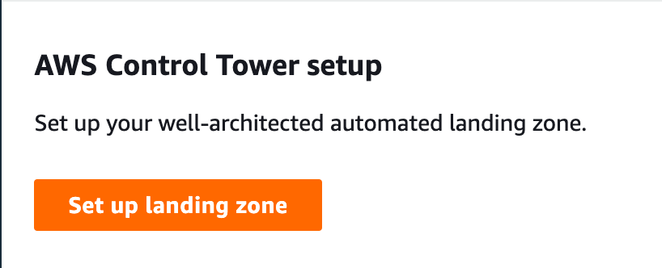
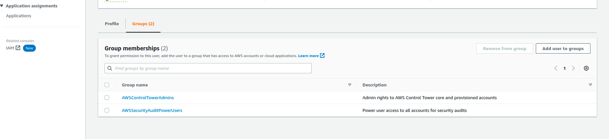
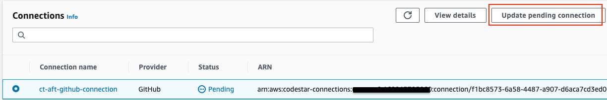
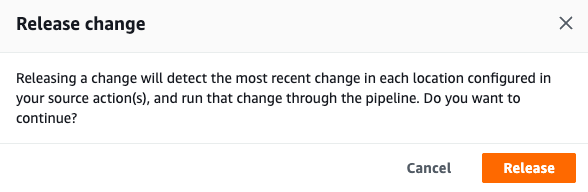
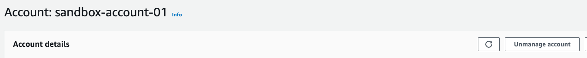

# Control Tower AFT Setup

The article below contains a step-by-step guide for setting up a Landing Zone via Control Tower and the necessary steps to deploy the Account Factory for Terraform.

Introduction
When this has completed running, it allows you to create and manage a standardized set of accounts, with consistent configurations, policies, and permissions across all accounts.

As additional accounts are created, you can define a set of common configurations and policies in code and apply them consistently across all created accounts; reducing the likelihood of errors, and making it easier to manage and maintain the accounts over time. Consistency comes from a templated configuration customized to accommodate the inputs of the user, all managed via code.

We can create external Terraform modules with dynamic inputs upstream that configure:
* Specific VPC configuration
* Standard set of IAM roles and policies
* Default security group configuration(s)
* Standard logging and monitoring setup

While LZA and AFT are similar, the benefits of using AFT over LZA it is more flexible and customizable whereas LZA is more prescriptive and opinionated.
With AFT, you can define your own configurations and policies. With LZA you are provided with a pre-built framework that may or may not fit your specific needs.

## Special Notes

* Cannot have CloudTrail already configured in the management account.
* All configuration should be done in the management account for the Organization.
* Control Tower will create a new OU with additional accounts in it for security purposes.
* You will need to be an Organization Administrator to complete this
* You will need the ability to create, at a minimum, of Three unique email distribution lists (or individual email addresses) for the additional accounts the instructions will walk through setting up. A format such as `serviceaccountemail+account_name@corpemail.com` will also work for reusing the same email address multiple times during account creation.

## Pre-Requisites

 * AWS CLI Version >= 2.7
 * Terraform Version >= 1.3
 * Administrative privileges to the Organization's Management Account

## Landing Zone Setup
For additional information on how to configure Landing Zone, see the official AWS Docs on Getting started with AWS Control Tower.

1. Log into the Management Account console with an administrator account.
2. In the search bar, type Control Tower then select the result.
   
3. Select Set up landing zone
   
4. **Home Region**: us-east-1
5. **Region deny setting**: Enable. This is helpful to avoid creating resources in regions that are not supported by your organization.
6. **Additional AWS Regions for governance**: Add additional supported regions for your organization.
7. **Foundational OU**: Name it whatever you want, I left it to the default of Security
8. **Additional OU**: Opt out if you have an OU you already want to use. Create a new OU if you don't. You will be able to import existing OU's in the future after setup is complete.
9. **Log archive account**: Create a new account or use an existing one. You will need a unique email that has not been used for this account.
10. **Audit account**: Create a new account or use an existing one. You will need a unique email that has not been used for this account.
11. **AWS CloudTrail configuration**: Enabled (unless you want to manage CloudTrail logs manually)
12. **Log configuration for Amazon S3**: I left these as the default values. They can be overridden.
13. **KMS Encryption**: Enable or disable. If enabled, provide the ARN to the KMS key or create a new one.
14. Patiently wait while Control Tower is created

### Enroll existing accounts
If you had existing accounts configured in your organization, you can enroll them into Control Tower from the Management Account.

**Notes on enrolling existing accounts**:

* The existing account first needs to be set up with a role to allow access to control tower. You need to log into the existing account and follow the steps outlined [here](https://docs.aws.amazon.com/en_us/controltower/latest/userguide/enroll-manually.html)
* You cannot be the root user while enrolling existing accounts. Must be an IAM user
* IAM user must be in the AWSControlTowerAdmins group
  * You can assign the user to this group from IAM Identity Center in the AWS console
    

**Enrollment Process**

1. Log into the Management Account with an Administrator account
2. Navigate to Services > Control Tower
3. Select Organization.
4. From the Organization Dashboard, you can select the OU or Account you want to enroll > Actions > Under Account, select Enroll:
	
	

### Configuring AWS Profile
Once you have SSO configured, you can set up the AWS CLI for SSO authentication. You will need to do this in order to run the Terraform configuration and provision the AFT and Logging Accounts.

For more information on how to configure SSO with the AWS CLI, see the official docs for [Configure the AWS CLI to use AWS IAM Identity Center](https://docs.aws.amazon.com/cli/latest/userguide/cli-configure-sso.html)

**TL;DR:**
```
$ aws configure sso
SSO start URL [None]: https://<subdomain>.awsapps.com/start
SSO region [None]: <region>
```
This will open your browser where you will enter the code presented on the terminal, then you will be able to allow access.****
When you are redirected back to the terminal, you will have different accounts to choose from. Be sure to select the account you want to configure your CLI profile for:
```
There are 2 AWS accounts available to you.
> DeveloperAccount, developer-account-admin@example.com (123456789011)
  ProductionAccount, production-account-admin@example.com (123456789022)
```

## Configuring Account Factory for Terraform (AFT)
### Configure the repos
* This is the main module - https://github.com/sourcefuse/terraform-aws-refarch-control-tower-aft
  * Applied from the Control Tower management account.
  * Responsible for deploying the AFT account configuration
  * (If applicable) Configures CodeStar to monitor changes to account configuration
  * Creates the CodeBuild pipeline for monitoring the changes in the defined VCS.

There are four repositories that need to be managed for creating the resources in the accounts:

1. [Account requests](https://github.com/sourcefuse/terraform-aws-refarch-aft-account-request) – This repository handles placing or updating account requests. [Examples available](https://github.com/aws-ia/terraform-aws-control_tower_account_factory/tree/main/sources/aft-customizations-repos/aft-account-request).
2. [AFT account provisioning customizations](https://github.com/sourcefuse/terraform-aws-refarch-aft-account-provisioning-customizations) – This repository manages customizations that are applied to all accounts created by and managed with AFT, before beginning the global customizations stage. [Examples available](https://github.com/aws-ia/terraform-aws-control_tower_account_factory/tree/main/sources/aft-customizations-repos/aft-account-provisioning-customizations).
3. [Global customizations](https://github.com/sourcefuse/terraform-aws-refarch-aft-global-customizations) – This repository manages customizations that are applied to all accounts created by and managed with AFT. [Examples available](https://github.com/aws-ia/terraform-aws-control_tower_account_factory/tree/main/sources/aft-customizations-repos/aft-global-customizations).
4. [Account customizations](https://github.com/sourcefuse/terraform-aws-refarch-aft-account-customizations) – This repository manages customizations that are applied only to specific accounts created by and managed with AFT. [Examples available](https://github.com/aws-ia/terraform-aws-control_tower_account_factory/tree/main/sources/aft-customizations-repos/aft-account-customizations).

AFT expects that each of these repositories follow a specific directory structure. The templates that are used to populate your repositories and instructions that describe how to populate the templates are available in the Account Factory for Terraform module in the [AFT GitHub repository](https://github.com/aws-ia/terraform-aws-control_tower_account_factory/tree/main/sources/aft-customizations-repos).
Supported VCS repositories for AFT are:
* CodeCommit
* GitHub
* GitHub Enterprise
* BitBucket

Azure DevOps is not natively supported, however, we can work around this by implementing a mirror. For more information on this, see [Use AWS CodeCommit to mirror an Azure DevOps repository using an Azure DevOps pipeline](https://aws.amazon.com/blogs/devops/use-aws-codecommit-to-mirror-an-azure-devops-repository-using-an-azure-devops-pipeline/).

### Deploying the infrastructure
Once the Control Tower instance has been created, you can configure AFT.
You **WILL** need AWSServiceCatalogEndUserAccess Management Console access to complete this task.
For more in-depth information, see the AWS Doc on [Deploy AWS Control Tower Account Factory for Terraform (AFT)](https://docs.aws.amazon.com/controltower/latest/userguide/aft-getting-started.html)

**From the Control Tower Management Dashboard:**

1. Select _Organization_ then _Create resources_ > _Create organizational unit_ and name it **AFT-Management**
2. Navigate to _<https://<subdomain>.awsapps.com/start>_ then log in using your control tower SSO email that was configured in [Landing Zone Setup](#landing-zone-setup)
3. Log in to the Dashboard and select _AWSServiceCatalogEndUserAccess_ Management Console
4. Follow the steps defined in this AWS Doc on [Provision Account Factory accounts with AWS Service Catalog](https://docs.aws.amazon.com/controltower/latest/userguide/provision-as-end-user.html).
	When specifying a name, use **AFT-Management**. Be sure when you select the OU, you select the one created in step 1.
5. Ensure your Terraform environment is available for deployment. Terraform version `1.3` or greater is required.
6. Create a `main.tf` and use the source of the [terraform-aws-refarch-control-tower-aft](https://github.com/sourcefuse/terraform-aws-refarch-control-tower-aft) module, then update the variables where applicable. See the `example` folder for additional configuration details.
7. You must be authenticated to your Management Account using the **AdministratorAccess** credentials.
   a. Configure the AWS profile. See [Configuring AWS Profile](#configuring-aws-profile) for information on setting this up.
8. Execute terraform while authenticated as the Administrator of the Management Account.
   :warning: If you didn’t configure a backend state bucket, be sure to save your state file somewhere safe! :warning:
	**Initialize terraform**:
	```
    terraform init
    ```
    **Plan**:
    ```
    terraform plan
    ```
    **Apply**:
    ```
    terraform apply
    ```

## Post Deploy
Once the infrastructure is in place, you will need to complete the setup.

### Service Catalog
The following will need to be configured in the Management Account (where Control Tower is located).

1. Navigate to “Service Catalog” > Select _AWS Control Tower Account Factory Portfolio_ > Select _Access_ tab  > Under “IAM Principals and Principal Names” Select _Grant access_
2. Under “Grant access to AWS Control Tower Account Factory Portfolio”, Select _Roles_ tab
3. Select the role name _AWSAFTExecution_ > _Grant access_

## Developer Tools
The following will need to be configured in the AFT-Management account

#### CodeStar Connection
1. Navigate to CodeBuild, in the left pane, expand Settings > Select Connections
2. Select the pending connection and complete the connection to your VCS provider.
	
3. This will link to the provider where you complete will select the organization to connect to.

#### CodePipeline
Once the CodeStar connection is complete, you will need to re-trigger the Pipelines that failed (they couldn’t connect to GitHub)

1. Navigate to CodePipeline > Pipelines
2. Select the failed pipeline(s) > Release change > Release
   
3. Expand Build > Select Build projects. From here, you can see the status of the different builds for managing AFT resources

### GitHub Organization Settings
From your GitHub account, you will need to allow access to the required repos:
1. Navigate to the Organization Settings
2. Select _GitHub Apps_ in the left pane
3. Configure the “AWS Connector for GitHub”
	
4. Select the repositories the connector will have access to:
	

## Creating new accounts with AFT
For more setup information, see [AWS Control Tower workshops](https://controltower.aws-management.tools/automation/aft_setup/).

1. Set up a create account request file that contains the appropriate input values for the following parameters in the Account Request git repo.
2. When you push to this repo’s `main` branch, it will trigger the `ct-aft-account-request` operation in the AWS CodePipeline in the AFT Management account.
3. Include the following list of parameters in your file:
   * The value of the `module name` must be unique per the AWS account request.
   * The value of the `module source` is the path to the account request Terraform module provided by AFT.
   * The value of `control_tower_parameters` captures the input required to create an AWS Control Tower account, as follows.
     * `AccountEmail`
     * `AccountName`
     * `ManagedOrganizationalUnit`
     * `SSOUserEmail`
     * `SSOUserFirstName`
     * `SSOUserLastName`
   * The parameter `account_tags` captures user-defined keys and values that can tag AWS accounts according to your business criteria.
     For more information about account tags, see the [Tagging AWS Organizations resources](https://docs.aws.amazon.com/organizations/latest/userguide/orgs_tagging.html) in the _AWS Organizations User Guide_.
   * The parameter `change_management_parameters` captures additional information that you may want to keep, such as the reason for the account request, and the identifier of who initiated the request.
     * `change_requested_by`
     * `change_reason`
     * The parameter `custom_fields` captures custom keys and values. The values are deployed as SSM Parameters in the vended account under the namespace: `/aft/account-request/custom-fields/`.
       If a custom field is removed from the account request, the field is removed from the SSM Parameter Store for that vended account. The `custom_fields` parameter allows you to collect additional metadata with the account request.
       This metadata can trigger additional processing, either during provisioning or when updating an account. You can refer to this metadata during account customizations to determine the proper guardrails to deploy.
       For example, an account that is subject to regulatory compliance could deploy additional AWS Config Rules.
     * The parameter `account_customizations_name` is optional. It captures the specified account template folder for account customizations. See [Account customizations](https://docs.aws.amazon.com/controltower/latest/userguide/aft-account-customization-options.html) for more information.


## Update an existing account with AFT
You will update the configuration for previously configured AFT vended accounts and then push the changes to the Account Request repo.

## Deleting an account from AFT
For more information, see the [AWS documentation](https://docs.aws.amazon.com/controltower/latest/userguide/aft-remove-account.html) on Removing an account from AFT.
> Removing an account from AFT is not the same process as removing an account from AWS Control Tower or deleting it from AWS.
> When you follow these steps, the account is not deleted, it is only removed from management by AFT. It is still managed by AWS Control Tower.

:warning: Removing an account from the AFT pipeline is irreversible! It can result in a loss of state!

1. Remove the configuration for the account created in the **aft-account-request** git repository and merge it into the monitored branch.
2. Wait for the CodeBuild project(s) to complete in the AFT-Management account.  This occurs AFTER Step 1 has been merged.
   :exclamation: This occurs AFTER Step 1 has been merged. :exclamation:
3. (If applicable) Delete the account customizations pipeline from the _AFT-Management_ account. This pipeline is prefixed with the account ID.
4. Delete the Terraform state from the S3 backend buckets in the _AFT-Management_ account. The bucket names should appear as _aft-backend-<aft_account_id>-primary-region_ and _aft-backend-<aft_account_id>-secondary-region_.
	a. Navigate to S3 and select the bucket
	b. Delete the account specific objects related to “customizations pipeline”, “global customizations,” and “account customizations”
5. Delete the account metadata (if present) from the DynamoDB table in the AFT-Management account.
	a. Navigate to DynamoDB
	b. Select the table `aft-request-metadata`

Now that the account has been removed from AFT configuration, it will need to be deleted / removed from Control Tower.

## Deleting an account from Control Tower
1. Log into the Control Tower Management account as an administrator
2. Navigate to Control tower
3. In the left pane, select Organization then expand the Organizational Unit name where the account targeted for removal is
	
4. Select the targeted account > Select Unmanage account in the upper right of the Account details
	
5. Unmanage the account from Control Tower
	
6. Navigate to _AWS Organizations_
7. Select the account targeted to close from the list of Organizational Units and Accounts
8. Select _Close_ in the upper right of the page then complete and acknowledge the prompt. Change 693529200019 to your account targeted to close.
	
9. The account will now be in a suspended state until the close process has completed
	
