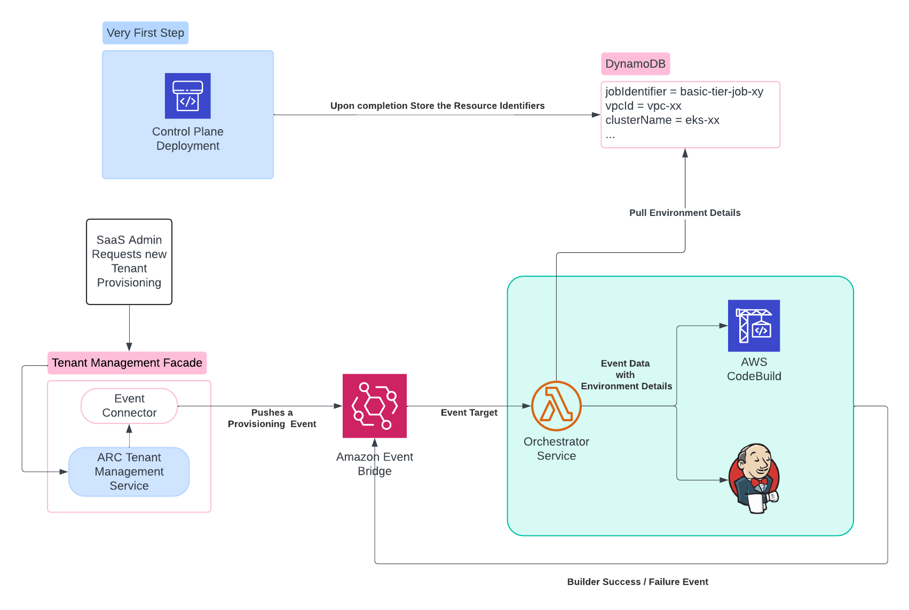
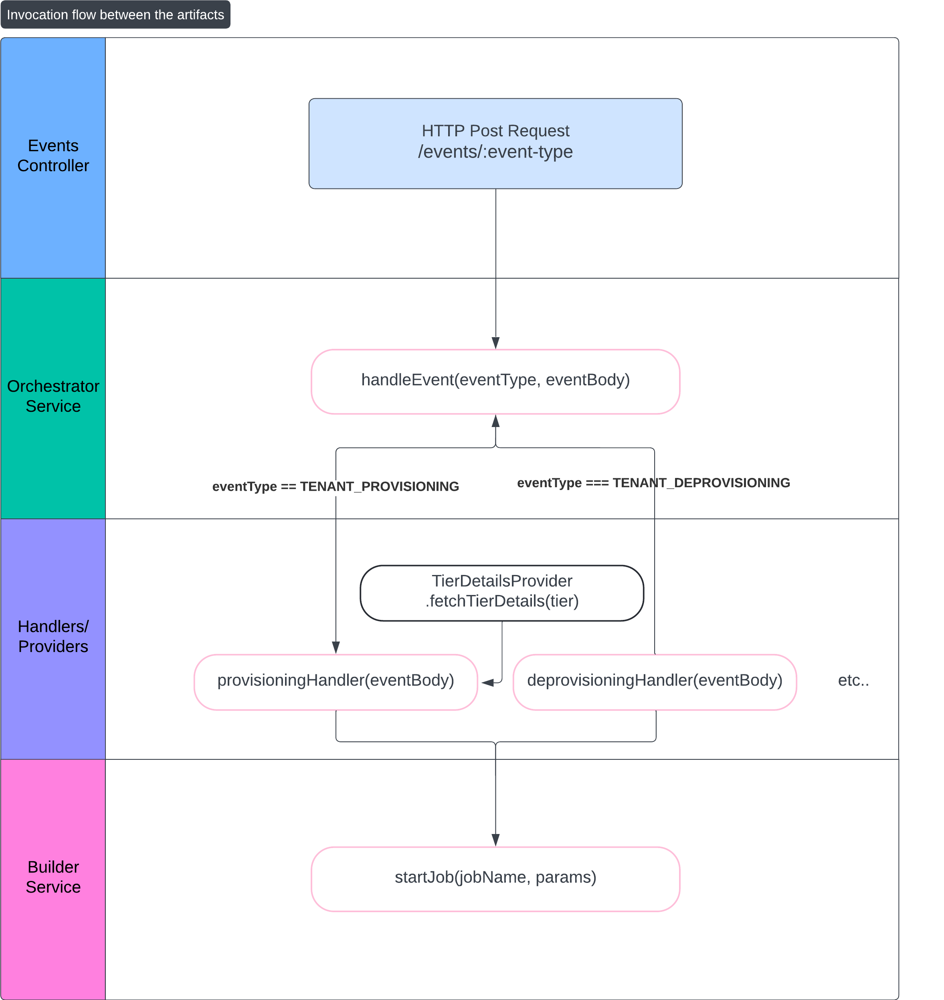

@sourceloop/ctrl-plane-orchestrator-service / [Exports](modules.md)

<a style="position: relative; top: 10px;" href="https://sourcefuse.github.io/arc-docs/arc-api-docs" target="_blank"></a>

# [@arc-saas/orchestrator-service](https://github.com/sourcefuse/arc-saas/tree/master/services/audit-service)

<p align="left">
<!-- <a href="https://www.npmjs.org/package/@arc-saas/orchestrator-service">

</a> -->
<a href="https://github.com/sourcefuse/arc-saas/graphs/contributors" target="_blank">

</a>
<!-- <a href="https://www.npmjs.com/@arc-saas/orchestrator-service" target="_blank">

</a> -->
<a href="./LICENSE">

</a>
<a href="https://loopback.io/" target="_blank">

</a>
</p>

## Overview

The `@arc-saas/orchestrator-service` is designed to provide the standard interfaces and endpoint to handle the events sent from / to a SaaS Control Plane. This acts as a orchestrator for the event targets/processors.

Consider the following example architecture that uses Amazon EventBridge at the center to pass on the events, and this Orchestrator service is used as its initial target, so that the events can then be sent to the expected candidates to process the event.



Above example is of a tenant provisioning event flow, as shown it originates from a control plane service called tenant management service and then when it's received to the Amazon EventBridge, it passes it to the orchestrator service which can run any bussiness logic before it's sent for processing (the example illustrates starting the codebuild or jenkins job conditionally based on the event). Further code examples in this README will take this same reference.

## Installation

```bash
npm i @arc-saas/orchestrator-service
```

## Getting Started

You can start using `@arc-saas/orchestrator-service` in just 4 steps:

1. [Bind Component](#bind-component)
2. [Configure the Providers and Services](#configure-the-providers-and-services)

### Bind Component

Bind the `OrchestratorServiceComponent` to your application constructor as shown below, this will load the built-in artifacts provided by the service in your application to use.

Mainly the `EventController` that provides the endpoint to receive the events.

```ts
import { OrchestratorServiceComponent } from "@arc-saas/orchestrator-service";
// ...
export class MyApplication extends BootMixin(
  ServiceMixin(RepositoryMixin(RestApplication))
) {
  constructor(options: ApplicationConfig = {}) {
    // ...
    this.component(OrchestratorServiceComponent);
  }
}
```

### Configure the Providers and Services

This microservice provides following loopback services and providers which can be configured based on your specific needs:

1. [Orchestrator Service](#1-orchestrator-service)
2. [Builder Service](#2-builder-service)
3. [Tier Details Provider](#3-tier-details-provider)
4. [Tenant Provisioning Provider](#4-tenant-provisioning-provider)
5. [Tenant Deprovisioning Provider](#5-tenant-deprovisioning-provider)
6. [Tenant Provisioning Success Handler](#6-tenant-provisioning-success-provider)
7. [Tenant Provisioning Failure Handler](#7-tenant-provisioning-failure-provider)
8. [Tenant Deployment Handler](#8-tenant-deployment-handler)

Here's the invocation flow for quick understanding on how and when above artifacts are called, more details are provided in their own sections:



#### 1. Orchestrator Service

This LB4 service is used by the event controller which invokes the `handleEvent` method and passes the type of the event along with the request body containing the event detail as the function arguments.

Following is the interface you'll need to implement in your class that is to be bound to the key `OrchestratorServiceBindings.ORCHESTRATOR_SERVICE`.

```ts
interface OrchestratorServiceInterface<
  EventType extends string = DefaultEventTypes,
  BodyType extends AnyObject = AnyObject
> {
  handleEvent(eventType: EventType, eventBody: BodyType): Promise<void>;
}

// PS: It is available to be imported from this package.
```

Here's how you can bind your custom orchestrator service:

```ts
import {
  OrchestratorServiceComponent,
  OrchestratorServiceBindings,
} from "@arc-saas/orchestrator-service";

import { YourOrchestratorService } from "./services";

export class OrchestratorApplication extends BootMixin(
  ServiceMixin(RestApplication)
) {
  constructor(options: ApplicationConfig = {}) {
    super(options);
    // ...

    this.bind(OrchestratorServiceBindings.ORCHESTRATOR_SERVICE).toClass(
      YourOrchestratorService
    );

    this.component(OrchestratorServiceComponent);
    // ...
  }
}
```

<details><summary>View example implementation of the service class:</summary>

```ts
import { injectable, BindingScope, inject } from "@loopback/core";
import { AnyObject } from "@loopback/repository";
import {
  EventTypes,
  OrchestratorServiceBindings,
  OrchestratorServiceInterface,
  TenantDeprovisioningHandler,
  TenantProvisioningFailureHandler,
  TenantProvisioningHandler,
  TenantProvisioningSuccessHandler,
  TenantDeploymentHandler,
} from "@arc-saas/orchestrator-service";

export interface AWSEventBridgeInterface {
  version: string;
  id: string;
  "detail-type": EventTypes;
  source: string;
  account: string;
  time: string;
  region: string;
  resources: never[];
  detail: Record<string, string | AnyObject | number>;
}

@injectable({ scope: BindingScope.TRANSIENT })
export class OrchestratorService implements OrchestratorServiceInterface {
  constructor(
    @inject(OrchestratorServiceBindings.TENANT_PROVISIONING_HANDLER)
    private handleTenantProvisioning: TenantProvisioningHandler,
    @inject(OrchestratorServiceBindings.TENANT_DEPROVISIONING_HANDLER)
    private handleTenantDeprovisioning: TenantDeprovisioningHandler,
    @inject(OrchestratorServiceBindings.TENANT_PROVISIONING_SUCCESS_HANDLER)
    private handleTenantProvisioningSuccess: TenantProvisioningSuccessHandler,
    @inject(OrchestratorServiceBindings.TENANT_PROVISIONING_FAILURE_HANDLER)
    private handleTenantProvisioningFailure: TenantProvisioningFailureHandler,
    @inject(OrchestratorServiceBindings.TENANT_DEPLOYMENT_HANDLER)
    private handleTenantDeployment: TenantDeploymentHandler
  ) {}

  handleEvent(
    eventType: EventTypes,
    eventBody: AWSEventBridgeInterface
  ): Promise<void> {
    switch (eventType) {
      case EventTypes.TENANT_PROVISIONING:
        return this.handleTenantProvisioning(eventBody.detail);
      case EventTypes.TENANT_DEPROVISIONING:
        return this.handleTenantDeprovisioning(eventBody.detail);
      case EventTypes.TENANT_PROVISIONING_SUCCESS:
        return this.handleTenantProvisioningSuccess(eventBody.detail);
      case EventTypes.TENANT_PROVISIONING_FAILURE:
        return this.handleTenantProvisioningFailure(eventBody.detail);
      case DefaultEventTypes.TENANT_DEPLOYMENT:
        return this.handleTenantDeployment(eventBody);
      default:
        throw new Error(`Unsupported event type: ${eventType}`);
    }
  }
}
```

</details>

#### 2. Builder Service

This LB4 service is intended to be used by any logic that requires triggering a build job. This common interface has a method called `startJob` which can take the job identifier and the params object as its arguments.

For example you can implement a triggering codebuild in this service whenever a specific event is received.

Following is the interface you'll need to implement in your class that is to be bound to the key `OrchestratorServiceBindings.BUILDER_SERVICE`.

```ts
interface BuilderServiceInterface {
  startJob(jobIdentifier: string, params: AnyObject): Promise<void>;
}

// PS: It is available to be imported from this package.
```

Here's how you can bind your builder service implementation:

```ts
import {
  OrchestratorServiceComponent,
  OrchestratorServiceBindings,
} from "@arc-saas/orchestrator-service";

import { AwsCodeBuildService } from "./services";

export class OrchestratorApplication extends BootMixin(
  ServiceMixin(RestApplication)
) {
  constructor(options: ApplicationConfig = {}) {
    super(options);
    // ...

    this.bind(OrchestratorServiceBindings.BUILDER_SERVICE).toClass(
      AwsCodeBuildService
    );

    this.component(OrchestratorServiceComponent);
    // ...
  }
}
```

<details><summary>View example implementation of the service class:</summary>

```ts
import { injectable, BindingScope } from "@loopback/core";
import { AnyObject } from "@loopback/repository";
import { BuilderServiceInterface } from "@arc-saas/orchestrator-service";
import {
  CodeBuildClient,
  StartBuildCommand,
  StartBuildCommandInput,
} from "@aws-sdk/client-codebuild";

@injectable({ scope: BindingScope.TRANSIENT })
export class AwsCodeBuildService implements BuilderServiceInterface {
  constructor() {}

  async startJob(jobName: string, params: AnyObject): Promise<void> {
    const codeBuildClient = new CodeBuildClient({ region: "us-east-1" });

    const buildParams: StartBuildCommandInput = {
      projectName: jobName,
      environmentVariablesOverride: Object.keys(params).map((key) => {
        return {
          name: key,
          value: String(params[key]),
          type: "PLAINTEXT",
        };
      }),
    };

    try {
      const command = new StartBuildCommand(buildParams);
      await codeBuildClient.send(command);
      console.log("CodeBuild triggered successfully.");
      return;
    } catch (error) {
      console.error("Error triggering CodeBuild:", error);
      throw error;
    }
  }
}
```

</details>

#### 3. Tier Details Provider

This provider is intended to be used as the handler to get the tier details. Which can be used while provisioning the tenant or anywhere when we need to retrieve the tier details.

For example you can implement a data pulling logic from Amazon DynamoDB that contains the tier details (the example implementation is given below).

Here's how you can bind your tier details provider:

```ts
import {
  OrchestratorServiceComponent,
  OrchestratorServiceBindings,
} from "@arc-saas/orchestrator-service";

import { TierDetailsProvider } from "./providers";

export class OrchestratorApplication extends BootMixin(
  ServiceMixin(RestApplication)
) {
  constructor(options: ApplicationConfig = {}) {
    super(options);
    // ...

    this.bind(OrchestratorServiceBindings.TIER_DETAILS_PROVIDER).toProvider(
      TierDetailsProvider
    );

    this.component(OrchestratorServiceComponent);
    // ...
  }
}
```

<details><summary>View example implementation of this provider:</summary>

```ts
import { injectable, BindingScope, Provider } from "@loopback/core";
import { TierDetailsFn } from "@arc-saas/orchestrator-service";
import { marshall, unmarshall } from "@aws-sdk/util-dynamodb";

import { DynamoDBClient, QueryCommand } from "@aws-sdk/client-dynamodb";

@injectable({ scope: BindingScope.TRANSIENT })
export class TierDetailsProvider implements Provider<TierDetailsFn> {
  value() {
    return async (tier: string) => {
      return this.fetchTierDetails(tier);
    };
  }
  private async fetchTierDetails(tier: string) {
    const client = new DynamoDBClient({ region: "us-east-1" });
    const params = {
      TableName: process.env.TIER_DETAILS_TABLE,
      KeyConditionExpression: "tier = :tier",
      ExpressionAttributeValues: marshall({
        ":tier": tier,
      }),
    };

    try {
      const command = new QueryCommand(params);
      const response = await client.send(command);
      if (!response.Items) {
        throw Error("Items not found.");
      }
      const items = response.Items.map((item) => unmarshall(item));
      console.log("Query results:", items);

      if (items.length === 0) {
        throw new Error(
          `Provided tier details not found in table: "${process.env.TIER_DETAILS_TABLE}".`
        );
      }

      const tierDetails = items[0];
      return { ...tierDetails };
    } catch (error) {
      console.error("Error fetching data:", error);
      throw error;
    }
  }
}
```

</details>

#### 4. Tenant Provisioning Provider

This provider is intended to be used as the handler to be invoked when the tenant provisioning event is received.

For example, In this provider you can implement the logic of invoking the [tier details provider](#3-tier-details-provider) and then triggering the provisioning job using the [builder service](#2-builder-service).

<details><summary>Check how to bind your custom implementation.</summary>

```ts
import {
  OrchestratorServiceComponent,
  OrchestratorServiceBindings,
} from "@arc-saas/orchestrator-service";

import { TenantProvisioningHandlerProvider } from "./providers";

export class OrchestratorApplication extends BootMixin(
  ServiceMixin(RestApplication)
) {
  constructor(options: ApplicationConfig = {}) {
    super(options);
    // ...

    this.bind<TenantProvisioningHandler<ProvisioningInputs>>(
      OrchestratorServiceBindings.TENANT_PROVISIONING_HANDLER
    ).toProvider(TenantProvisioningHandlerProvider);

    this.component(OrchestratorServiceComponent);
    // ...
  }
}
```

</details>

<details><summary>View example implementation of this provider:</summary>

```ts
import { injectable, BindingScope, Provider, inject } from "@loopback/core";
import { AnyObject } from "@loopback/repository";
import {
  BuilderService,
  TenantProvisioningHandler,
  TierDetailsFn,
  OrchestratorServiceBindings,
} from "@arc-saas/orchestrator-service";

export type ProvisioningInputs = {
  planConfig: AnyObject;
  builderConfig: AnyObject;
};

@injectable({ scope: BindingScope.TRANSIENT })
export class TenantProvisioningHandlerProvider
  implements Provider<TenantProvisioningHandler<ProvisioningInputs>>
{
  constructor(
    @inject(OrchestratorServiceBindings.TIER_DETAILS_PROVIDER)
    private tierDetails: TierDetailsFn,
    @inject(OrchestratorServiceBindings.BUILDER_SERVICE)
    private builderService: BuilderService
  ) {}

  value() {
    return async (body: ProvisioningInputs) => {
      // Extract plan and builder information from the body
      const planConfig = body.planConfig;
      const builder = body.builderConfig;
      const tier = planConfig.tier;

      try {
        // Fetch tier details based on the provided tier
        const { jobIdentifier, ...otherTierDetails } = await this.tierDetails(
          tier
        );
        const jobName = jobIdentifier;

        // Ensure Job name is present in the tier details
        if (!jobName) {
          throw new Error("Builder Job name not found in plan details");
        }

        // Check if the builder type is CODE_BUILD
        if (builder?.type === "CODE_BUILD") {
          // Trigger CodeBuild with the necessary environments
          const codeBuildResponse = await this.builderService.startJob(
            jobName,
            {
              ...otherTierDetails,
              ...(builder?.config?.environmentOverride ?? {}),
            }
          );

          console.log(codeBuildResponse);

          return;
        } else {
          // Throw an error if the builder config is invalid
          throw Error("Invalid builder config provided.");
        }
      } catch (error) {
        console.error("Error in tenant provisioning:", error);
        return;
      }
    };
  }
}
```

</details>

#### 5. Tenant Deprovisioning Provider

This provider is intended to be used as the handler to be invoked when the tenant deprovisioning event is received.

For example, In this provider you can implement any business logic you want to execute before triggering the deprovisioning job using the [builder service](#2-builder-service).

<details><summary>Check how to bind your custom implementation.</summary>

```ts
import {
  OrchestratorServiceComponent,
  OrchestratorServiceBindings,
} from "@arc-saas/orchestrator-service";

import { TenantDeprovisioningHandlerProvider } from "./providers";

export class OrchestratorApplication extends BootMixin(
  ServiceMixin(RestApplication)
) {
  constructor(options: ApplicationConfig = {}) {
    super(options);
    // ...

    this.bind<TenantDeprovisioningHandler>(
      OrchestratorServiceBindings.TENANT_DEPROVISIONING_HANDLER
    ).toProvider(TenantDeprovisioningHandlerProvider);

    this.component(OrchestratorServiceComponent);
    // ...
  }
}
```

</details>

#### 6. Tenant Provisioning Success Provider

This provider is intended to be used as the handler to be invoked when the tenant provisioning success event is received i.e. when the provisioning job is completed.

For example, In this provider you can implement further steps needed to onboard the tenant.

The way of binding this provider is similar to others, just the binding key is `OrchestratorServiceBindings.TENANT_PROVISIONING_SUCCESS_HANDLER`.

#### 7. Tenant Provisioning Failure Provider

This provider is intended to be used as the handler to be invoked when the tenant provisioning failed event is received i.e. when the provisioning job is failed for some reason.

For example, In this provider you can implement any cleanup or notification needed to handle the failure.

The way of binding this provider is similar to other provider, just the binding key is `OrchestratorServiceBindings.TENANT_PROVISIONING_FAILURE_HANDLER`.

#### 8. Tenant Deployment Provider

This provider is intended to be the handler of the tenant deployment, which means any work after the provisioning that is required to make the tenant's application up and running, should be implemented here.

For example, this can be adding some initial users. Populating some seed data in the application service etc.

The way of binding this provider is similar to other provider, just the binding key is `OrchestratorServiceBindings.TENANT_DEPLOYMENT_HANDLER`.

## Deployment

The @arc-saas/orchestrator-service can be deployed in various ways, including as a serverless application. Here's how you can set it up for serverless deployment, specifically for AWS Lambda.

### Serverless Deployment

To deploy this service as a serverless application on AWS Lambda, follow these steps:

1. Add a `lambda.ts` file in your `src` directory. This file will serve as the Lambda entry point:

```typescript
import { APIGatewayEvent, APIGatewayProxyEvent, Context } from "aws-lambda";
const serverlessExpress = require("@vendia/serverless-express");

export * from "./application";
let serverlessApp: (arg0: APIGatewayProxyEvent, arg1: Context) => any;

export async function setup(event: APIGatewayEvent, context: Context) {
  const { OrchestratorService } = require("./application");
  const config = {
    rest: {
      openApiSpec: {
        setServersFromRequest: true,
      },
    },
  };
  const app = new OrchestratorService(config);
  await app.boot();
  const requestHandler = app.restServer.requestHandler;
  serverlessApp = serverlessExpress({ app: requestHandler });
  return serverlessApp(event, context);
}

export const handler = async (event: APIGatewayEvent, context: Context) => {
  if (serverlessApp) {
    return serverlessApp(event, context);
  }

  return setup(event, context);
};
```

2. Create a Dockerfile in your project root:

```dockerfile
FROM public.ecr.aws/lambda/nodejs:20-x86_64 AS BUILD_IMAGE

RUN mkdir -p ${LAMBDA_TASK_ROOT}

WORKDIR ${LAMBDA_TASK_ROOT}

COPY package*.json ./

RUN npm install

COPY . .

RUN npm run build

CMD [ "./dist/lambda.handler" ]
```

3. Build your Docker image:

```bash
docker build -t orchestrator-service .
```

4. Push the Docker image to your container registry (e.g., Amazon ECR).

5. Create a Lambda function using the pushed container image.

6. Configure an API Gateway to trigger your Lambda function.

This setup allows you to run your Orchestrator Service as a serverless application, leveraging AWS Lambda's scalability and cost-efficiency.
Remember to adjust your Lambda function's configuration (memory, timeout, etc.) based on your specific needs.

### API Documentation

#### API Details

Visit the [OpenAPI spec docs](./openapi.md) for more details on the APIs provided in this service.

## License

ARC SaaS is [MIT licensed](./LICENSE).
