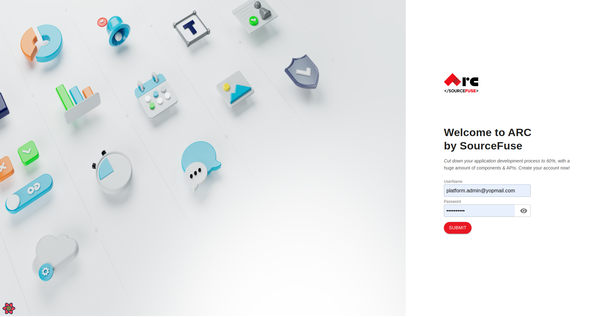
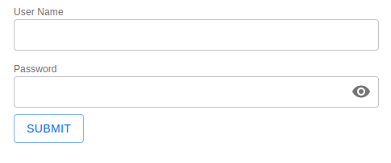

# [ARC React](https://github.com/sourcefuse/react-boilerplate-ts-ui)

[](https://github.com/sourcefuse/react-boilerplate-ts-ui/actions/workflows/snyk.yaml)

## Overview

This project aims to provide a react boilerplate with all basic configuration pre-configured. We are using [MUI](https://mui.com/material-ui/getting-started/overview/) as base library to extend the Theme module and create reuseable components.

## Directory Structure

```
src/
├── Assets
├── Components
├── Helpers
├── Hooks/
│   ├── useAuth.ts (Hook for auth related methods/properties)
│   ├── useConfig.ts (Hook for fetching runtime app config and parsing values)management
├── Layouts (Reuseable page layouts , which will provide sub route config for accessing Pages)
├── Pages
├── Providers
│   ├── theme (mui theme config)
│   ├── Provider (Redux Provider)
│   ├── ErrorBoundary.ts
│   └── NotificationProvider.ts (provider for showing notifications)
└── Routes/
    ├── Routes.ts (contains route guards)
    └── layoutRouteConfig.ts (contains top level route mapping for layouts)
```

## How to use

The react app is pre configured with mui material theme , auth guards , notification provider , error boundary , routes , page layouts , vite package bundler and many reuseable components inside the components directory .
To Use the template

- Clone the [github repo](https://github.com/sourcefuse/react-boilerplate-ts-ui)
- cd into the folder and run `npm i` to install node_modules.
- Add the [environment variables](#inputs) to connect to ARC backend service.
- Run `npm start` to run the vite development server.
  

## How to deploy

The App comes pre-configured with docker , To deploy the app on server/EC2 machine you need to install docker and docker compose and set the required env variables mentioned in docker-compose.yml and run docker compose up , the app will connect to port 80 and will be available on static ip address of EC2 machine.

## Example

Creating a simple login page using ARC form components

- Without ARC form components
  - Lot more line of code
  - state of each variable has to managed separately
  - Styling has to be managed individually
  - Separate error block for each field

```javascript
import './App.css';
import {Formik} from 'formik';
import * as Yup from 'yup';

// Creating schema
const schema = Yup.object().shape({
  email: Yup.string().required('Email is a required field').email('Invalid email format'),
  password: Yup.string().required('Password is a required field').min(8, 'Password must be at least 8 characters'),
});

function App() {
  return (
    <>
      {/* Wrapping form inside formik tag and passing our schema to validationSchema prop */}
      <Formik
        validationSchema={schema}
        initialValues={{email: '', password: ''}}
        onSubmit={(values) => {
          // Alert the input values of the form that we filled
          alert(JSON.stringify(values));
        }}
      >
        {({values, errors, touched, handleChange, handleBlur, handleSubmit}) => (
          <div className="login">
            <div className="form">
              {/* Passing handleSubmit parameter tohtml form onSubmit property */}
              <form noValidate onSubmit={handleSubmit}>
                <span>Login</span>
                {/* Our input html with passing formik parameters like handleChange, values, handleBlur to input properties */}
                <input
                  type="email"
                  name="email"
                  onChange={handleChange}
                  onBlur={handleBlur}
                  value={values.email}
                  placeholder="Enter email id / username"
                  className="form-control inp_text"
                  id="email"
                />
                {/* If validation is not passed show errors */}
                <p className="error">{errors.email && touched.email && errors.email}</p>
                {/* Our input html with passing formik parameters like handleChange, values, handleBlur to input properties */}
                <input
                  type="password"
                  name="password"
                  onChange={handleChange}
                  onBlur={handleBlur}
                  value={values.password}
                  placeholder="Enter password"
                  className="form-control"
                />
                {/* If validation is not passed show errors */}
                <p className="error">{errors.password && touched.password && errors.password}</p>
                {/* Click on submit button to submit the form */}
                <button type="submit">Login</button>
              </form>
            </div>
          </div>
        )}
      </Formik>
    </>
  );
}

export default App;
```

- With ARC form components
  - All data, errors and styles are managed internally
  - Less amount of code on the actual page

```javascript
import {Box, Stack} from '@mui/material';
import Grid from '@mui/material/Grid';
import Button from 'Components/Button/Button';
import Form from 'Components/Forms/Form';
import FormInput from 'Components/Forms/FormInput';
import FormPasswordInput from 'Components/Forms/FormPasswordInput';
import PagePaper from 'Components/PagePaper';
import * as yup from 'yup';
import {initialValues} from './utils';

type LoginForm = {userName: string, password: string};
const validationSchema = () => {
  return yup.object({
    userName: yup.string().required().label('User Name'),
    password: yup.string().required().label('Password'),
  });
};
export default function Login() {
  return (
    <Stack direction="row">
      <Box sx={{flexGrow: 1}}>
        <PagePaper title="Form">
          <Form
            initialValues={initialValues}
            validationSchema={validationSchema}
            onSubmit={(val: LoginForm) => alert(JSON.stringify(val))}
          >
            <Grid container spacing={2}>
              <Grid item xs={12}>
                <FormInput id="userName" label="User Name" />
              </Grid>
              <Grid item xs={12}>
                <FormPasswordInput id="Password" label="Password" />
              </Grid>
            </Grid>
            <Button variant="outlined" type="submit" sx={{marginTop: 1}}>
              Submit
            </Button>
          </Form>
        </PagePaper>
      </Box>
    </Stack>
  );
}
```



## <a id="prereqs"></a> Pre-Requisites

- [node.js](https://nodejs.dev/download/)
- [npm](https://docs.npmjs.com/cli/v6/commands/npm-install)
- [Sourceloop Auth service](https://github.com/sourcefuse/loopback4-microservice-catalog)
- use [VS code](https://code.visualstudio.com/) for best development experience and install the following [extensions](https://github.com/sourcefuse/react-boilerplate-ts-ui/blob/main/.vscode/extensions.json) also

## <a id="scripts"></a> Scripts

| Script           | Description                                                                                |
| ---------------- | ------------------------------------------------------------------------------------------ |
| npm start        | Runs the app in the development mode                                                       |
| npm run config   | Generates config file from .env , this file is used for runtime configuration for env vars |
| npm run build    | Builds the app for production to the `build` folder.                                       |
| npm run lint     | Checks linting error in code                                                               |
| npm run lint:fix | Fix all auto-fixable lint errors                                                           |
| npm run format   | Format all files using prettier                                                            |

## Inputs

| Name                                                                                 | Description                                                                                    | Type      | Default | Required |
| ------------------------------------------------------------------------------------ | ---------------------------------------------------------------------------------------------- | --------- | ------- | :------: |
| <a name="CLIENT_ID"></a> `CLIENT_ID`                                                 | Unique public Identifier for the app.                                                          | `string`  |         |   yes    |
| <a name="AUTH_API_BASE_URL"></a> `AUTH_API_BASE_URL`                                 | Base URL of the authentication service.                                                        | `string`  |         |   yes    |
| <a name="APP_API_BASE_URL"></a> `APP_API_BASE_URL`                                   |                                                                                                | `string`  |         |    no    |
| <a name="ENABLE_SESSION_TIMEOUT"></a> `ENABLE_SESSION_TIMEOUT`                       | Session timeout for idle timer                                                                 | `boolean` | false   |    no    |
| <a name="EXPIRY_TIME_IN_MINUTE"></a> `EXPIRY_TIME_IN_MINUTE`                         | Session expiry time                                                                            | `number`  | 15      |    no    |
| <a name="PROMPT_TIME_BEFORE_IDLE_IN_MINUTE"></a> `PROMPT_TIME_BEFORE_IDLE_IN_MINUTE` | The duration (in minutes) before the user becomes idle, when the warning dialog will be shown. | `number`  | 1       |    no    |

## Related Projects

At ARC, we are driven by a steadfast mission – to empower developers and organizations with seamless solutions for both backend and frontend application development and deployment. Our unwavering commitment to the highest security and industry standards ensures that every facet of app development contributes to a smooth and secure user experience.

In our dedication to the open-source community, we actively contribute to a diverse range of projects that reflect our values of innovation and collaboration. Some of our notable contributions include:

- **[React Boilerplate](https://arc-react-boilerplate.sfarcpoc.com/)**: Discover our meticulously crafted React Boilerplate application, designed to accelerate your development process.
  <a href="https://github.com/sourcefuse/react-boilerplate-ts-ui/"><div style="display: inline-block; border-radius: 50%; overflow: hidden; width: 20px; height: 20px;"></div> React Boilerplate </a>
- **[Telemed App](https://arc-telemed.sfarcpoc.com)**: The ARC Telemedicine App establishes seamless communication channels between medical professionals and patients through video calls and chat. This app is meticulously crafted using the ARC React Boilerplate.
  <a href="https://github.com/sourcefuse/loopback4-microservice-catalog/tree/master/sandbox/telemed-app/frontend"><div style="display: inline-block; border-radius: 50%; overflow: hidden; width: 20px; height: 20px;"></div> Telemed App UI </a>
- **[Storybook](https://arc-react-storybook.sfarcpoc.com/)**: Components within the ARC React Boilerplate through our comprehensive Storybook.
  <a href="https://github.com/sourcefuse/react-boilerplate-ts-ui/"><div style="display: inline-block; border-radius: 50%; overflow: hidden; width: 20px; height: 20px;"></div> Storybook </a>
- **[ARC API](https://github.com/sourcefuse/loopback4-microservice-catalog/)**: ARC API, is a collection of pre-built microservices designed to accelerate the development timeline for enterprise projects. These services address common challenges encountered by large enterprises during the development of cloud-native platforms for digital transformation initiatives or new product creation
- **[ARC Lambda](https://github.com/sourcefuse/arc-lambda)**: Easily deploy your services to a serverless environment on AWS.
- **[ARC IAC](https://sourcefuse.github.io/arc-docs/arc-iac-docs/)**: Explore the intricacies of Infrastructure as Code with our comprehensive documentation on ARC IAC.
