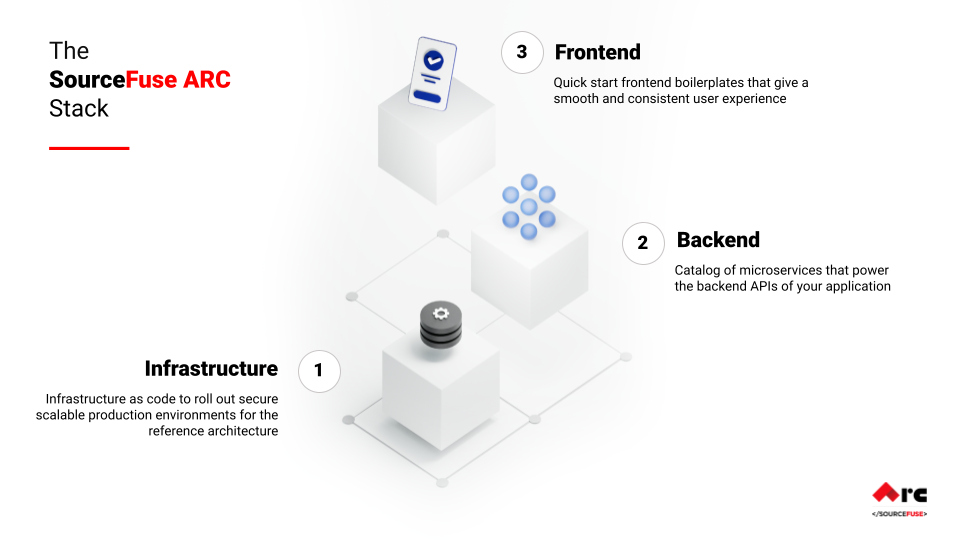

# ARC?

ARC by SourceFuse is an **open source rapid application development** framework for development of **modern cloud native** enterprise applications that leverages a catalog of prebuilt **microservices** and deployed as per **standardized reference architecture** on both private and public clouds.

